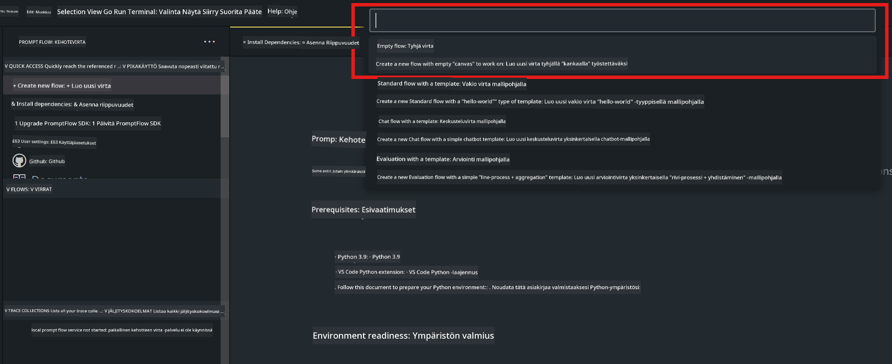
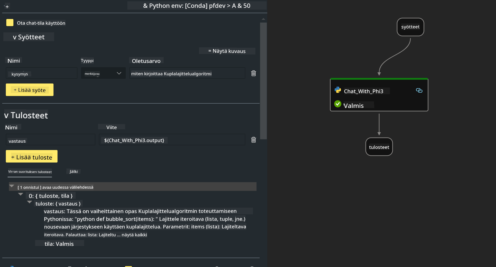

<!--
CO_OP_TRANSLATOR_METADATA:
{
  "original_hash": "bc29f7fe7fc16bed6932733eac8c81b8",
  "translation_date": "2025-07-17T03:59:23+00:00",
  "source_file": "md/02.Application/02.Code/Phi3/VSCodeExt/HOL/AIPC/02.PromptflowWithNPU.md",
  "language_code": "fi"
}
-->
# **Lab 2 - Suorita Prompt flow Phi-3-minin kanssa AIPC:ssä**

## **Mikä on Prompt flow**

Prompt flow on kehitystyökalupaketti, joka on suunniteltu sujuvoittamaan LLM-pohjaisten AI-sovellusten koko kehityssykliä ideoinnista, prototypoinnista, testauksesta ja arvioinnista tuotantoon ja valvontaan. Se tekee promptin suunnittelusta paljon helpompaa ja mahdollistaa tuotantolaatuisten LLM-sovellusten rakentamisen.

Prompt flown avulla voit:

- Luoda työnkulkuja, jotka yhdistävät LLM:t, promptit, Python-koodin ja muut työkalut suoritettavaksi kokonaisuudeksi.

- Debugata ja kehittää työnkulkuja, erityisesti LLM-yhteistyötä, vaivattomasti.

- Arvioida työnkulkuja ja laskea laatu- ja suorituskykymittareita suuremmilla aineistoilla.

- Integroi testauksen ja arvioinnin CI/CD-järjestelmääsi varmistaaksesi työnkulun laadun.

- Julkaista työnkulut valitsemallesi palvelualustalle tai integroida ne helposti sovelluksesi koodipohjaan.

- (Valinnainen, mutta suositeltava) Tee yhteistyötä tiimisi kanssa hyödyntämällä Prompt flown pilvipalvelua Azure AI:ssa.

## **Mikä on AIPC**

AI PC:ssä on CPU, GPU ja NPU, joilla kaikilla on omat tekoälyä kiihdyttävät ominaisuutensa. NPU eli neuroverkkoprosessori on erikoistunut kiihdytin, joka hoitaa tekoäly- (AI) ja koneoppimistehtäviä suoraan tietokoneellasi sen sijaan, että data lähetettäisiin pilveen käsiteltäväksi. GPU ja CPU pystyvät myös käsittelemään näitä tehtäviä, mutta NPU on erityisen tehokas vähävirtaisissa AI-laskelmissa. AI PC edustaa perustavaa muutosta tietokoneidemme toiminnassa. Se ei ole ratkaisu aiemmin olemassa olleeseen ongelmaan, vaan lupaa merkittävän parannuksen jokapäiväiseen tietokoneen käyttöön.

Miten se toimii? Verrattuna generatiiviseen AI:hin ja valtaviin julkisiin aineistoihin koulutettuihin suuriin kielimalleihin (LLM), AI, joka tapahtuu tietokoneellasi, on saavutettavissa käytännössä kaikilla tasoilla. Konsepti on helpompi ymmärtää, ja koska se on koulutettu omalla datallasi ilman pilvipalvelun tarvetta, hyödyt ovat välittömästi houkuttelevampia laajemmalle käyttäjäjoukolle.

Lähitulevaisuudessa AI PC -maailmassa henkilökohtaiset avustajat ja pienemmät AI-mallit toimivat suoraan tietokoneellasi, käyttäen dataasi tarjotakseen henkilökohtaisia, yksityisiä ja turvallisempia AI-parannuksia päivittäisiin tehtäviisi – kokousmuistioiden tekemiseen, fantasiapalloliigan järjestämiseen, valokuva- ja videonmuokkauksen automaattisiin parannuksiin tai täydellisen matkasuunnitelman laatimiseen perhetapaamista varten kaikkien saapumis- ja lähtöaikojen perusteella.

## **Generointikoodin työnkulkujen rakentaminen AIPC:ssä**

***Note*** ：Jos et ole vielä suorittanut ympäristön asennusta, käy osoitteessa [Lab 0 -Installations](./01.Installations.md)

1. Avaa Prompt flow -laajennus Visual Studio Codessa ja luo tyhjä työnkulkuprojekti



2. Lisää Inputs- ja Outputs-parametrit ja lisää Python-koodi uutena työnkulkuun



Voit käyttää tätä rakennetta (flow.dag.yaml) työnkulun rakentamiseen

```yaml

inputs:
  question:
    type: string
    default: how to write Bubble Algorithm
outputs:
  answer:
    type: string
    reference: ${Chat_With_Phi3.output}
nodes:
- name: Chat_With_Phi3
  type: python
  source:
    type: code
    path: Chat_With_Phi3.py
  inputs:
    question: ${inputs.question}


```

3. Lisää koodi tiedostoon ***Chat_With_Phi3.py***

```python


from promptflow.core import tool

# import torch
from transformers import AutoTokenizer, pipeline,TextStreamer
import intel_npu_acceleration_library as npu_lib

import warnings

import asyncio
import platform

class Phi3CodeAgent:
    
    model = None
    tokenizer = None
    text_streamer = None
    
    model_id = "microsoft/Phi-3-mini-4k-instruct"

    @staticmethod
    def init_phi3():
        
        if Phi3CodeAgent.model is None or Phi3CodeAgent.tokenizer is None or Phi3CodeAgent.text_streamer is None:
            Phi3CodeAgent.model = npu_lib.NPUModelForCausalLM.from_pretrained(
                                    Phi3CodeAgent.model_id,
                                    torch_dtype="auto",
                                    dtype=npu_lib.int4,
                                    trust_remote_code=True
                                )
            Phi3CodeAgent.tokenizer = AutoTokenizer.from_pretrained(Phi3CodeAgent.model_id)
            Phi3CodeAgent.text_streamer = TextStreamer(Phi3CodeAgent.tokenizer, skip_prompt=True)

    

    @staticmethod
    def chat_with_phi3(prompt):
        
        Phi3CodeAgent.init_phi3()

        messages = "<|system|>You are a AI Python coding assistant. Please help me to generate code in Python.The answer only genertated Python code, but any comments and instructions do not need to be generated<|end|><|user|>" + prompt +"<|end|><|assistant|>"


        generation_args = {
            "max_new_tokens": 1024,
            "return_full_text": False,
            "temperature": 0.3,
            "do_sample": False,
            "streamer": Phi3CodeAgent.text_streamer,
        }

        pipe = pipeline(
            "text-generation",
            model=Phi3CodeAgent.model,
            tokenizer=Phi3CodeAgent.tokenizer,
            # **generation_args
        )

        result = ''

        with warnings.catch_warnings():
            warnings.simplefilter("ignore")
            response = pipe(messages, **generation_args)
            result =response[0]['generated_text']
            return result


@tool
def my_python_tool(question: str) -> str:
    if platform.system() == 'Windows':
        asyncio.set_event_loop_policy(asyncio.WindowsSelectorEventLoopPolicy())
    return Phi3CodeAgent.chat_with_phi3(question)


```

4. Voit testata työnkulkua Debug- tai Run-toiminnolla tarkistaaksesi, toimiiko generointikoodi oikein


5. Suorita työnkulku kehitys-API:na terminaalissa

```

pf flow serve --source ./ --port 8080 --host localhost   

```

Voit testata sitä Postmanilla tai Thunder Clientillä

### **Note**

1. Ensimmäinen suoritus kestää kauan. Suositellaan lataamaan phi-3-malli Hugging face CLI:n kautta.

2. Ottaen huomioon Intel NPU:n rajallisen laskentatehon, suositellaan käyttämään Phi-3-mini-4k-instruct -mallia.

3. Käytämme Intel NPU Accelerationia INT4-muunnoksen kvantisointiin, mutta jos käynnistät palvelun uudelleen, sinun täytyy poistaa cache- ja nc_workshop-kansiot.

## **Resurssit**

1. Opi Promptflow [https://microsoft.github.io/promptflow/](https://microsoft.github.io/promptflow/)

2. Opi Intel NPU Acceleration [https://github.com/intel/intel-npu-acceleration-library](https://github.com/intel/intel-npu-acceleration-library)

3. Esimerkkikoodi, lataa [Local NPU Agent Sample Code](../../../../../../../../../code/07.Lab/01/AIPC)

**Vastuuvapauslauseke**:  
Tämä asiakirja on käännetty käyttämällä tekoälypohjaista käännöspalvelua [Co-op Translator](https://github.com/Azure/co-op-translator). Vaikka pyrimme tarkkuuteen, huomioithan, että automaattikäännöksissä saattaa esiintyä virheitä tai epätarkkuuksia. Alkuperäistä asiakirjaa sen alkuperäiskielellä tulee pitää virallisena lähteenä. Tärkeissä asioissa suositellaan ammattimaista ihmiskäännöstä. Emme ole vastuussa tämän käännöksen käytöstä aiheutuvista väärinymmärryksistä tai tulkinnoista.