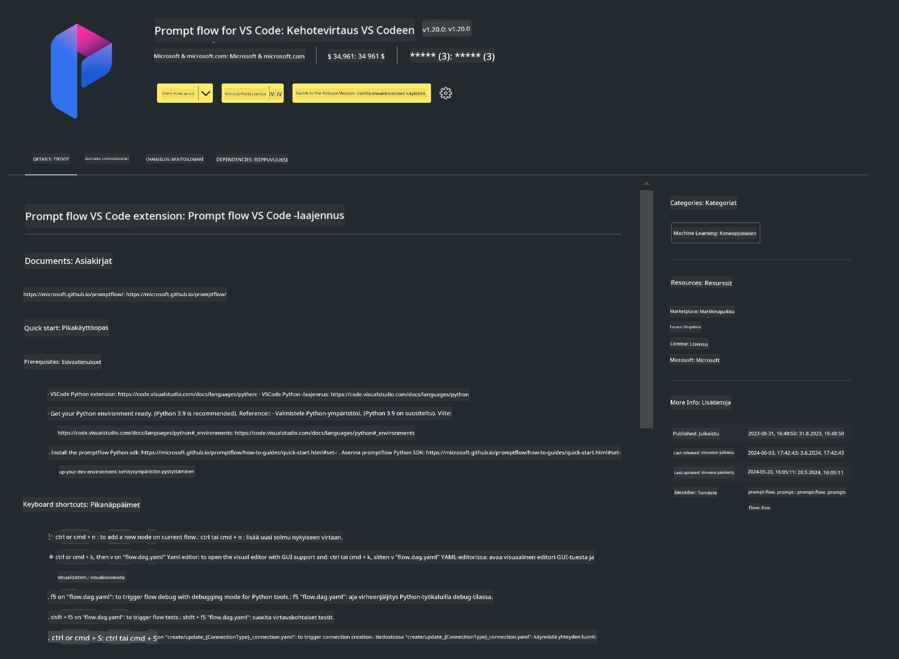

<!--
CO_OP_TRANSLATOR_METADATA:
{
  "original_hash": "4b16264917d9b93169745d92b8ce8c65",
  "translation_date": "2025-05-09T19:35:59+00:00",
  "source_file": "md/02.Application/02.Code/Phi3/VSCodeExt/HOL/Apple/01.Installations.md",
  "language_code": "fi"
}
-->
# **Lab 0 - Asennus**

Kun astumme Lab-ympäristöön, meidän täytyy konfiguroida asianmukainen ympäristö:


### **1. Python 3.11+**

On suositeltavaa käyttää miniforgea Python-ympäristön konfigurointiin.

Miniforgen konfigurointiohjeet löydät osoitteesta [https://github.com/conda-forge/miniforge](https://github.com/conda-forge/miniforge)

Miniforgen konfiguroinnin jälkeen suorita seuraava komento Power Shellissä

```bash

conda create -n pyenv python==3.11.8 -y

conda activate pyenv

```


### **2. Asenna Prompt flow SDK**

Lab 1:ssä käytämme Prompt flow'ta, joten sinun täytyy konfiguroida Prompt flow SDK.

```bash

pip install promptflow --upgrade

```

Voit tarkistaa promptflow sdk:n tällä komennolla


```bash

pf --version

```

### **3. Asenna Visual Studio Code Prompt flow -laajennus**



### **4. Applen MLX Framework**

MLX on Apple Siliconille suunniteltu taulukkoalusta koneoppimustutkimukseen, jonka on kehittänyt Apple machine learning research. Voit käyttää **Apple MLX frameworkia** nopeuttamaan LLM/SLM-suorituskykyä Apple Siliconilla. Jos haluat tietää lisää, voit lukea [https://github.com/microsoft/PhiCookBook/blob/main/md/01.Introduction/03/MLX_Inference.md](https://github.com/microsoft/PhiCookBook/blob/main/md/01.Introduction/03/MLX_Inference.md).

Asenna MLX-frameworkin kirjasto bashissa


```bash

pip install mlx-lm

```


### **5. Muut Python-kirjastot**

Luo requirements.txt tiedosto ja lisää siihen seuraava sisältö

```txt

notebook
numpy 
scipy 
scikit-learn 
matplotlib 
pandas 
pillow 
graphviz

```


### **6. Asenna NVM**

Asenna nvm Powershellissä


```bash

brew install nvm

```

Asenna nodejs versio 18.20


```bash

nvm install 18.20.0

nvm use 18.20.0

```

### **7. Asenna Visual Studio Code -kehitystuki**


```bash

npm install --global yo generator-code

```

Onneksi olkoon! Olet onnistuneesti konfiguroinut SDK:n. Jatka seuraavaksi käytännön vaiheisiin.

**Vastuuvapauslauseke**:  
Tämä asiakirja on käännetty käyttämällä tekoälypohjaista käännöspalvelua [Co-op Translator](https://github.com/Azure/co-op-translator). Vaikka pyrimme tarkkuuteen, ole hyvä ja huomioi, että automaattikäännöksissä saattaa esiintyä virheitä tai epätarkkuuksia. Alkuperäistä asiakirjaa sen alkuperäiskielellä tulee pitää auktoritatiivisena lähteenä. Tärkeissä tiedoissa suositellaan ammattimaista ihmiskäännöstä. Emme ole vastuussa tämän käännöksen käytöstä aiheutuvista väärinymmärryksistä tai virhetulkinnoista.