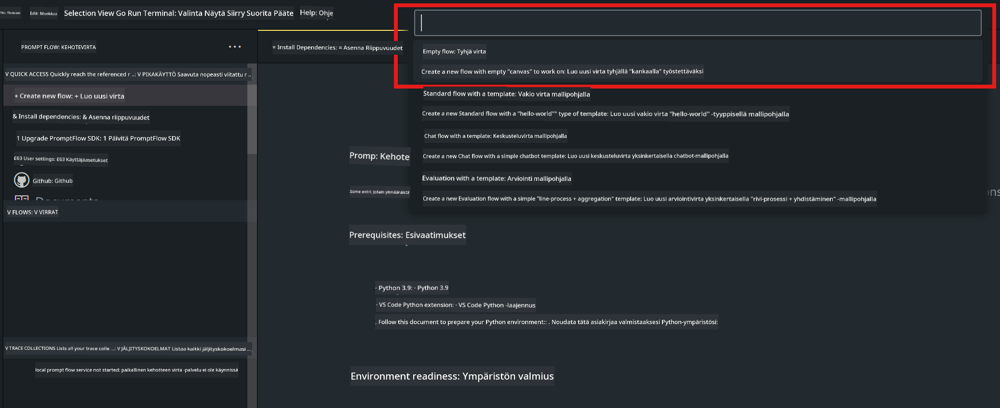
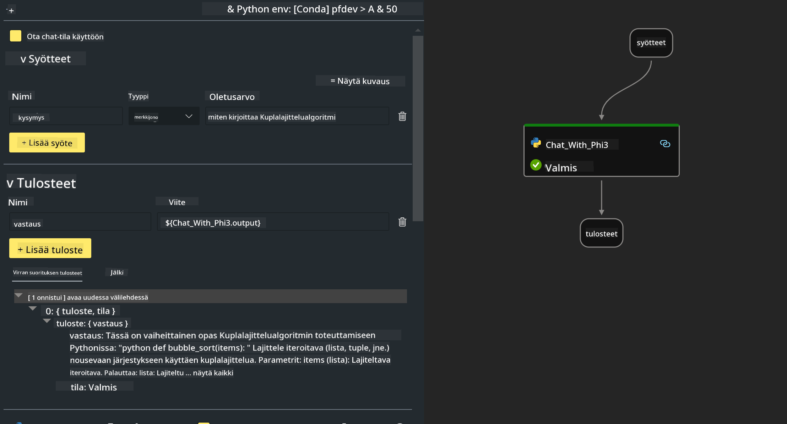
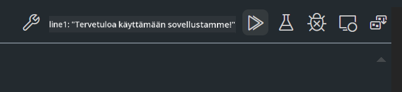

<!--
CO_OP_TRANSLATOR_METADATA:
{
  "original_hash": "3dbbf568625b1ee04b354c2dc81d3248",
  "translation_date": "2025-07-17T04:27:01+00:00",
  "source_file": "md/02.Application/02.Code/Phi3/VSCodeExt/HOL/Apple/02.PromptflowWithMLX.md",
  "language_code": "fi"
}
-->
# **Lab 2 -  Suorita Prompt flow Phi-3-minin kanssa AIPC:ssä**

## **Mikä on Prompt flow**

Prompt flow on kehitystyökalupaketti, joka on suunniteltu sujuvoittamaan LLM-pohjaisten AI-sovellusten koko kehityssykliä ideoinnista, prototypoinnin, testauksen ja arvioinnin kautta tuotantoon ja valvontaan. Se tekee promptin suunnittelusta paljon helpompaa ja mahdollistaa tuotantolaatuisten LLM-sovellusten rakentamisen.

Prompt flown avulla voit:

- Luoda työnkulkuja, jotka yhdistävät LLM:t, promptit, Python-koodin ja muut työkalut suoritettavaksi kokonaisuudeksi.

- Debugata ja kehittää työnkulkuja, erityisesti LLM-vuorovaikutuksia, helposti.

- Arvioida työnkulkuja ja laskea laatu- ja suorituskykymittareita suuremmilla aineistoilla.

- Integroi testaus ja arviointi CI/CD-järjestelmääsi työnkulun laadun varmistamiseksi.

- Julkaista työnkulut valitsemallesi palvelualustalle tai integroida ne helposti sovelluksesi koodipohjaan.

- (Valinnainen mutta suositeltava) Tee yhteistyötä tiimisi kanssa hyödyntämällä Prompt flown pilvipalvelua Azure AI:ssa.

## **Generointikoodin työnkulkujen rakentaminen Apple Siliconilla**

***Note*** ：Jos et ole vielä suorittanut ympäristön asennusta, käy osoitteessa [Lab 0 -Installations](./01.Installations.md)

1. Avaa Prompt flow -laajennus Visual Studio Codessa ja luo tyhjä työnkulkuprojekti



2. Lisää Inputs- ja Outputs-parametrit ja lisää Python-koodi uutena työnkulkuun



Voit käyttää tätä rakennetta (flow.dag.yaml) työnkulun rakentamiseen

```yaml

inputs:
  prompt:
    type: string
    default: Write python code for Fibonacci serie. Please use markdown as output
outputs:
  result:
    type: string
    reference: ${gen_code_by_phi3.output}
nodes:
- name: gen_code_by_phi3
  type: python
  source:
    type: code
    path: gen_code_by_phi3.py
  inputs:
    prompt: ${inputs.prompt}


```

3. Kvantifioi phi-3-mini

Haluamme ajaa SLM:n paremmin paikallisilla laitteilla. Yleisesti mallia kvantifioidaan (INT4, FP16, FP32)

```bash

python -m mlx_lm.convert --hf-path microsoft/Phi-3-mini-4k-instruct

```

**Note:** oletuskansio on mlx_model

4. Lisää koodi tiedostoon ***Chat_With_Phi3.py***

```python


from promptflow import tool

from mlx_lm import load, generate


# The inputs section will change based on the arguments of the tool function, after you save the code
# Adding type to arguments and return value will help the system show the types properly
# Please update the function name/signature per need
@tool
def my_python_tool(prompt: str) -> str:

    model_id = './mlx_model_phi3_mini'

    model, tokenizer = load(model_id)

    # <|user|>\nWrite python code for Fibonacci serie. Please use markdown as output<|end|>\n<|assistant|>

    response = generate(model, tokenizer, prompt="<|user|>\n" + prompt  + "<|end|>\n<|assistant|>", max_tokens=2048, verbose=True)

    return response


```

4. Voit testata työnkulkua Debug- tai Run-toiminnolla tarkistaaksesi, toimiiko generointikoodi oikein



5. Suorita työnkulku kehitys-API:na terminaalissa

```

pf flow serve --source ./ --port 8080 --host localhost   

```

Voit testata sitä Postmanilla tai Thunder Clientillä

### **Note**

1. Ensimmäinen suoritus kestää kauan. Suositellaan lataamaan phi-3-malli Hugging face CLI:n kautta.

2. Intel NPU:n rajallisen laskentatehon vuoksi suositellaan käyttämään Phi-3-mini-4k-instruct -mallia.

3. Käytämme Intel NPU Acceleration -tekniikkaa INT4-kvantisointiin, mutta jos käynnistät palvelun uudelleen, sinun täytyy poistaa cache- ja nc_workshop-kansiot.

## **Resurssit**

1. Opi Promptflow [https://microsoft.github.io/promptflow/](https://microsoft.github.io/promptflow/)

2. Opi Intel NPU Acceleration [https://github.com/intel/intel-npu-acceleration-library](https://github.com/intel/intel-npu-acceleration-library)

3. Esimerkkikoodi, lataa [Local NPU Agent Sample Code](../../../../../../../../../code/07.Lab/01/AIPC/local-npu-agent)

**Vastuuvapauslauseke**:  
Tämä asiakirja on käännetty käyttämällä tekoälypohjaista käännöspalvelua [Co-op Translator](https://github.com/Azure/co-op-translator). Vaikka pyrimme tarkkuuteen, huomioithan, että automaattikäännöksissä saattaa esiintyä virheitä tai epätarkkuuksia. Alkuperäistä asiakirjaa sen alkuperäiskielellä tulee pitää virallisena lähteenä. Tärkeissä tiedoissa suositellaan ammattimaista ihmiskäännöstä. Emme ole vastuussa tämän käännöksen käytöstä aiheutuvista väärinymmärryksistä tai tulkinnoista.