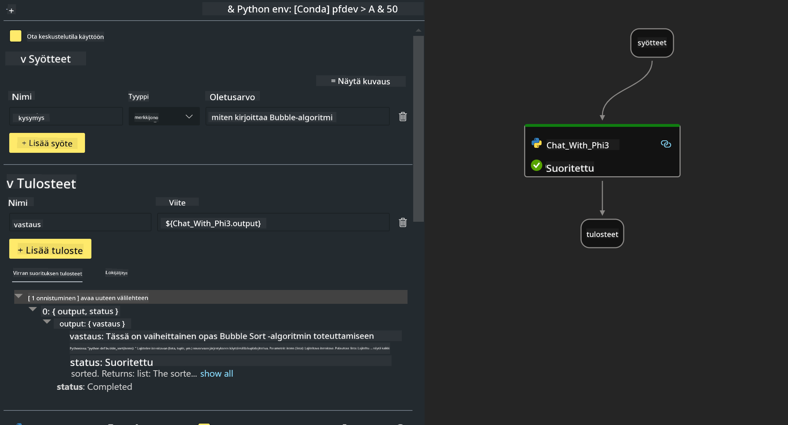

<!--
CO_OP_TRANSLATOR_METADATA:
{
  "original_hash": "3dbbf568625b1ee04b354c2dc81d3248",
  "translation_date": "2025-05-09T19:39:58+00:00",
  "source_file": "md/02.Application/02.Code/Phi3/VSCodeExt/HOL/Apple/02.PromptflowWithMLX.md",
  "language_code": "fi"
}
-->
# **Lab 2 - Suorita Prompt flow Phi-3-mini:llä AIPC:ssä**

## **Mikä on Prompt flow**

Prompt flow on kehitystyökaluvalikoima, joka helpottaa LLM-pohjaisten tekoälysovellusten koko kehityssykliä ideoinnista, prototypoinnista, testauksesta ja arvioinnista tuotantoon ja valvontaan. Se tekee promptin suunnittelusta helpompaa ja mahdollistaa tuotantotasoisten LLM-sovellusten rakentamisen.

Prompt flow:n avulla voit:

- Luoda työnkulkuja, jotka yhdistävät LLM:t, promptit, Python-koodin ja muut työkalut suoritettavaksi kokonaisuudeksi.

- Virheenkorjata ja kehittää työnkulkuja, erityisesti LLM-vuorovaikutuksia, vaivattomasti.

- Arvioida työnkulkuja ja laskea laatu- ja suorituskykymittareita suuremmilla aineistoilla.

- Integroida testauksen ja arvioinnin CI/CD-järjestelmääsi työnkulun laadun varmistamiseksi.

- Julkaista työnkulut valitsemallesi palvelualustalle tai integroida ne sovelluksesi koodipohjaan helposti.

- (Valinnainen mutta suositeltava) Tehdä yhteistyötä tiimisi kanssa hyödyntämällä Prompt flow:n pilvipalvelua Azure AI:ssa.

## **Generointikoodin työnkulkujen rakentaminen Apple Siliconilla**

***Note*** ：Jos ympäristöasennukset eivät ole vielä valmiit, käy sivulla [Lab 0 -Installations](./01.Installations.md)

1. Avaa Prompt flow -laajennus Visual Studio Codessa ja luo tyhjä työnkulkuprojekti


2. Lisää syöte- ja tulostusparametrit ja lisää Python-koodi uutena työnkulkun osana



Voit käyttää tätä rakennetta (flow.dag.yaml) työnkulun rakentamiseen

```yaml

inputs:
  prompt:
    type: string
    default: Write python code for Fibonacci serie. Please use markdown as output
outputs:
  result:
    type: string
    reference: ${gen_code_by_phi3.output}
nodes:
- name: gen_code_by_phi3
  type: python
  source:
    type: code
    path: gen_code_by_phi3.py
  inputs:
    prompt: ${inputs.prompt}


```

3. Kvantifioi phi-3-mini

Tavoitteena on ajaa SLM paremmin paikallisilla laitteilla. Yleisesti mallia kvantifioidaan (INT4, FP16, FP32)

```bash

python -m mlx_lm.convert --hf-path microsoft/Phi-3-mini-4k-instruct

```

**Note:** oletuskansio on mlx_model

4. Lisää koodi tiedostoon ***Chat_With_Phi3.py***

```python


from promptflow import tool

from mlx_lm import load, generate


# The inputs section will change based on the arguments of the tool function, after you save the code
# Adding type to arguments and return value will help the system show the types properly
# Please update the function name/signature per need
@tool
def my_python_tool(prompt: str) -> str:

    model_id = './mlx_model_phi3_mini'

    model, tokenizer = load(model_id)

    # <|user|>\nWrite python code for Fibonacci serie. Please use markdown as output<|end|>\n<|assistant|>

    response = generate(model, tokenizer, prompt="<|user|>\n" + prompt  + "<|end|>\n<|assistant|>", max_tokens=2048, verbose=True)

    return response


```

4. Voit testata työnkulkua Debug- tai Run-toiminnolla, jotta näet, toimiiko generointikoodi oikein


5. Aja työnkulku kehitys-API:na terminaalissa

```

pf flow serve --source ./ --port 8080 --host localhost   

```

Voit testata sitä Postmanilla tai Thunder Clientillä

### **Note**

1. Ensimmäinen suoritus kestää kauan. Suositeltavaa on ladata phi-3-malli Hugging Face CLI:llä.

2. Intel NPU:n rajallisen laskentatehon vuoksi on suositeltavaa käyttää Phi-3-mini-4k-instruct -mallia.

3. Käytämme Intel NPU Acceleration -tekniikkaa INT4-kvantifiointiin, mutta jos käynnistät palvelun uudelleen, sinun täytyy poistaa cache- ja nc_workshop-kansiot.

## **Resurssit**

1. Opi Promptflow [https://microsoft.github.io/promptflow/](https://microsoft.github.io/promptflow/)

2. Opi Intel NPU Acceleration [https://github.com/intel/intel-npu-acceleration-library](https://github.com/intel/intel-npu-acceleration-library)

3. Esimerkkikoodi, lataa [Local NPU Agent Sample Code](../../../../../../../../../code/07.Lab/01/AIPC/local-npu-agent)

**Vastuuvapauslauseke**:  
Tämä asiakirja on käännetty käyttämällä tekoälypohjaista käännöspalvelua [Co-op Translator](https://github.com/Azure/co-op-translator). Vaikka pyrimme tarkkuuteen, huomioithan, että automaattiset käännökset saattavat sisältää virheitä tai epätarkkuuksia. Alkuperäinen asiakirja sen alkuperäiskielellä on pidettävä auktoriteettisena lähteenä. Tärkeissä tiedoissa suositellaan ammattimaista ihmiskäännöstä. Emme ole vastuussa tämän käännöksen käytöstä johtuvista väärinymmärryksistä tai tulkinnoista.