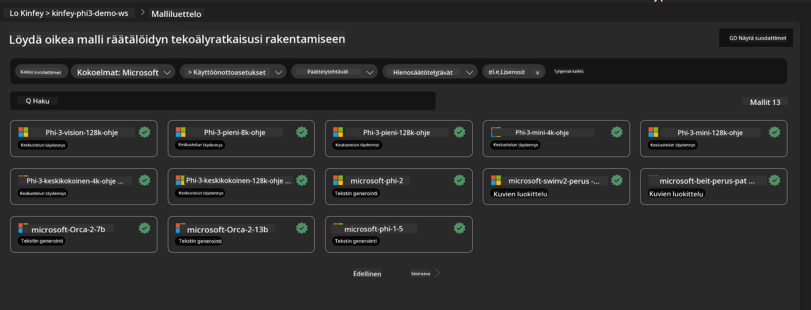
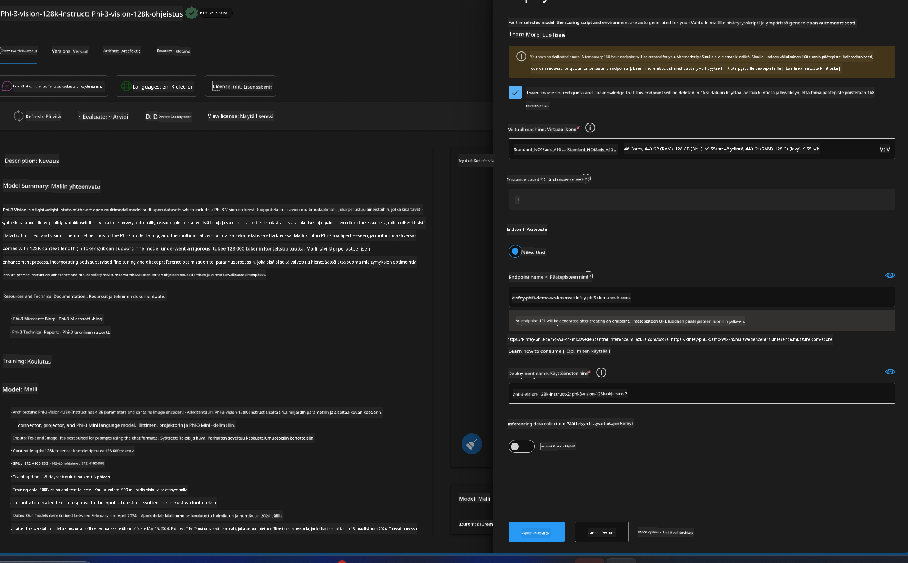
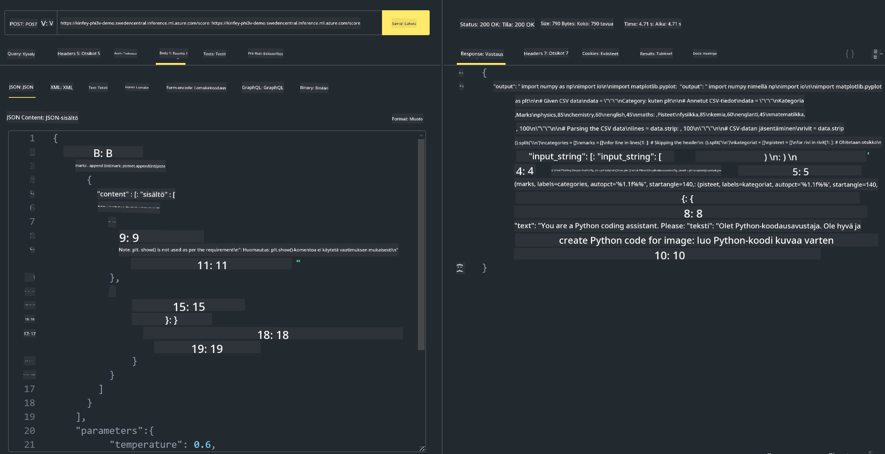

<!--
CO_OP_TRANSLATOR_METADATA:
{
  "original_hash": "20cb4e6ac1686248e8be913ccf6c2bc2",
  "translation_date": "2025-05-09T19:44:02+00:00",
  "source_file": "md/02.Application/02.Code/Phi3/VSCodeExt/HOL/Apple/03.DeployPhi3VisionOnAzure.md",
  "language_code": "fi"
}
-->
# **Lab 3 - Ota Phi-3-vision käyttöön Azure Machine Learning Servicessä**

Käytämme NPU:ta paikallisen koodin tuotantoon vientiin, ja haluamme tämän jälkeen tuoda Phi-3-VISIONin käyttöön, jotta voimme muuntaa kuvia koodiksi.

Tässä johdannossa rakennamme nopeasti Model As Service -tyyppisen Phi-3 Vision -palvelun Azure Machine Learning Serviceen.

***Note***: Phi-3 Vision vaatii laskentatehoa sisällön nopeampaan generointiin. Tarvitsemme pilvilaskentatehoa tämän saavuttamiseksi.

### **1. Luo Azure Machine Learning Service**

Meidän täytyy luoda Azure Machine Learning Service Azure-portaaliin. Jos haluat oppia miten, käy tällä linkillä [https://learn.microsoft.com/azure/machine-learning/quickstart-create-resources?view=azureml-api-2](https://learn.microsoft.com/azure/machine-learning/quickstart-create-resources?view=azureml-api-2)

### **2. Valitse Phi-3 Vision Azure Machine Learning Servicessä**



### **3. Ota Phi-3-Vision käyttöön Azuren palvelussa**



### **4. Testaa päätepistettä Postmanissa**



***Note***

1. Lähetettävien parametrien tulee sisältää Authorization, azureml-model-deployment ja Content-Type. Tarkista käyttöönoton tiedot näiden saamiseksi.

2. Phi-3-Vision tarvitsee kuvalinkin parametrien lähettämiseen. Katso GPT-4-Vision -menetelmä parametrien lähettämiseen, esimerkiksi

```json

{
  "input_data":{
    "input_string":[
      {
        "role":"user",
        "content":[ 
          {
            "type": "text",
            "text": "You are a Python coding assistant.Please create Python code for image "
          },
          {
              "type": "image_url",
              "image_url": {
                "url": "https://ajaytech.co/wp-content/uploads/2019/09/index.png"
              }
          }
        ]
      }
    ],
    "parameters":{
          "temperature": 0.6,
          "top_p": 0.9,
          "do_sample": false,
          "max_new_tokens": 2048
    }
  }
}

```

3. Kutsu **/score** POST-menetelmällä

**Onnittelut**! Olet saanut Phi-3-VISIONin nopeasti käyttöön ja kokeillut, miten kuvia voidaan käyttää koodin generointiin. Seuraavaksi voimme rakentaa sovelluksia yhdistämällä NPU:t ja pilvipalvelut.

**Vastuuvapauslauseke**:  
Tämä asiakirja on käännetty käyttämällä tekoälypohjaista käännöspalvelua [Co-op Translator](https://github.com/Azure/co-op-translator). Vaikka pyrimme tarkkuuteen, huomioithan, että automaattikäännöksissä saattaa esiintyä virheitä tai epätarkkuuksia. Alkuperäistä asiakirjaa sen alkuperäiskielellä tulee pitää ensisijaisena lähteenä. Tärkeissä asioissa suositellaan ammattimaista ihmiskäännöstä. Emme ole vastuussa tämän käännöksen käytöstä aiheutuvista väärinymmärryksistä tai virhetulkinnoista.