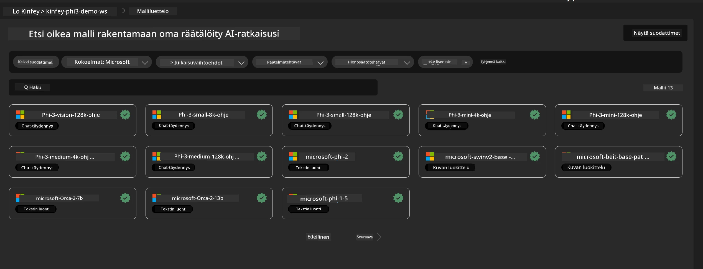
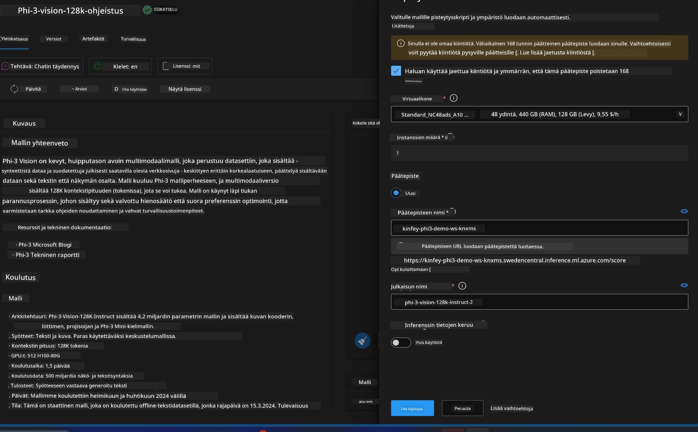
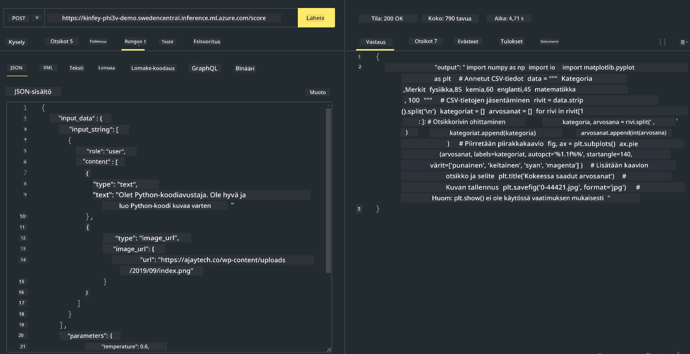

<!--
CO_OP_TRANSLATOR_METADATA:
{
  "original_hash": "20cb4e6ac1686248e8be913ccf6c2bc2",
  "translation_date": "2025-07-17T04:34:13+00:00",
  "source_file": "md/02.Application/02.Code/Phi3/VSCodeExt/HOL/Apple/03.DeployPhi3VisionOnAzure.md",
  "language_code": "fi"
}
-->
# **Lab 3 - Ota Phi-3-vision käyttöön Azure Machine Learning Servicessä**

Käytämme NPU:ta paikallisen koodin tuotantokäyttöönottoon, ja sen jälkeen haluamme tuoda PHI-3-VISIONin käyttöön sen kautta, jotta voimme muuttaa kuvia koodiksi.

Tässä johdannossa voimme nopeasti rakentaa Model As Service -palvelun Phi-3 Visionille Azure Machine Learning Servicessä.

***Note***: Phi-3 Vision vaatii laskentatehoa sisällön nopeampaan generointiin. Tarvitsemme pilvilaskentatehoa tämän saavuttamiseksi.


### **1. Luo Azure Machine Learning Service**

Meidän täytyy luoda Azure Machine Learning Service Azure-portaalissa. Jos haluat oppia miten, käy osoitteessa [https://learn.microsoft.com/azure/machine-learning/quickstart-create-resources?view=azureml-api-2](https://learn.microsoft.com/azure/machine-learning/quickstart-create-resources?view=azureml-api-2)


### **2. Valitse Phi-3 Vision Azure Machine Learning Servicessä**




### **3. Ota Phi-3-Vision käyttöön Azuressa**





### **4. Testaa päätepistettä Postmanilla**





***Note***

1. Lähetettävien parametrien tulee sisältää Authorization, azureml-model-deployment ja Content-Type. Sinun täytyy tarkistaa käyttöönoton tiedot saadaksesi nämä.

2. Parametrien lähettämiseen Phi-3-Vision tarvitsee kuvalinkin. Katso GPT-4-Visionin tapa lähettää parametreja, esimerkiksi

```json

{
  "input_data":{
    "input_string":[
      {
        "role":"user",
        "content":[ 
          {
            "type": "text",
            "text": "You are a Python coding assistant.Please create Python code for image "
          },
          {
              "type": "image_url",
              "image_url": {
                "url": "https://ajaytech.co/wp-content/uploads/2019/09/index.png"
              }
          }
        ]
      }
    ],
    "parameters":{
          "temperature": 0.6,
          "top_p": 0.9,
          "do_sample": false,
          "max_new_tokens": 2048
    }
  }
}

```

3. Kutsu **/score** Post-metodilla

**Onnittelut**! Olet suorittanut nopean PHI-3-VISION -käyttöönoton ja kokeillut, miten kuvia voi käyttää koodin generointiin. Seuraavaksi voimme rakentaa sovelluksia yhdistämällä NPU:t ja pilvipalvelut.

**Vastuuvapauslauseke**:  
Tämä asiakirja on käännetty käyttämällä tekoälypohjaista käännöspalvelua [Co-op Translator](https://github.com/Azure/co-op-translator). Vaikka pyrimme tarkkuuteen, huomioithan, että automaattikäännöksissä saattaa esiintyä virheitä tai epätarkkuuksia. Alkuperäistä asiakirjaa sen alkuperäiskielellä tulee pitää virallisena lähteenä. Tärkeissä asioissa suositellaan ammattimaista ihmiskäännöstä. Emme ole vastuussa tämän käännöksen käytöstä aiheutuvista väärinymmärryksistä tai tulkinnoista.