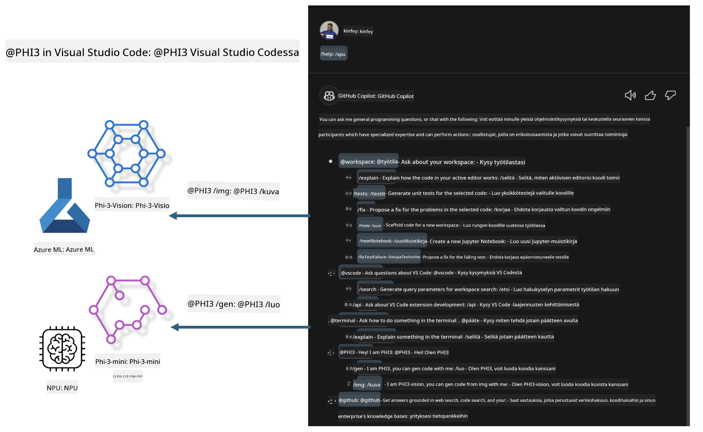

<!--
CO_OP_TRANSLATOR_METADATA:
{
  "original_hash": "00b7a699de8ac405fa821f4c0f7fc0ab",
  "translation_date": "2025-05-09T19:14:28+00:00",
  "source_file": "md/02.Application/02.Code/Phi3/VSCodeExt/README.md",
  "language_code": "fi"
}
-->
# **Rakenna oma Visual Studio Code GitHub Copilot Chat Microsoft Phi-3 -perheellä**

Oletko käyttänyt workspace-agenttia GitHub Copilot Chatissa? Haluatko rakentaa oman tiimisi koodiapurin? Tämä käytännön harjoitus yhdistää avoimen lähdekoodin mallin luodakseen yritystason koodiapurin.

## **Perusteet**

### **Miksi valita Microsoft Phi-3**

Phi-3 on perhesarja, joka sisältää phi-3-mini, phi-3-small ja phi-3-medium -mallit, jotka perustuvat eri koulutusparametreihin tekstin generointiin, dialogin täydentämiseen ja koodin luomiseen. Lisäksi on phi-3-vision, joka perustuu Vision-tekniikkaan. Se soveltuu yrityksille tai eri tiimeille offline-generatiivisten tekoälyratkaisujen luomiseen.

Suositeltavaa lukea tästä linkistä [https://github.com/microsoft/PhiCookBook/blob/main/md/01.Introduction/01/01.PhiFamily.md](https://github.com/microsoft/PhiCookBook/blob/main/md/01.Introduction/01/01.PhiFamily.md)

### **Microsoft GitHub Copilot Chat**

GitHub Copilot Chat -laajennus tarjoaa keskustelukäyttöliittymän, jonka avulla voit olla vuorovaikutuksessa GitHub Copilotin kanssa ja saada vastauksia koodaukseen liittyviin kysymyksiin suoraan VS Codessa, ilman että sinun tarvitsee selata dokumentaatiota tai etsiä tietoa verkosta.

Copilot Chat voi käyttää syntaksin korostusta, sisennystä ja muita muotoiluominaisuuksia tehdäkseen vastauksista selkeämpiä. Käyttäjän kysymyksen tyypistä riippuen vastaus voi sisältää linkkejä kontekstiin, jota Copilot on käyttänyt vastauksen luomiseen, kuten lähdekooditiedostoja tai dokumentaatiota, tai painikkeita VS Code -toimintojen käyttämiseen.

- Copilot Chat integroituu kehitystyöhösi ja tarjoaa apua juuri silloin kun sitä tarvitset:

- Aloita keskustelu suoraan editorista tai terminaalista saadaksesi apua koodauksen aikana

- Käytä Chat-näkymää, jossa tekoälyavustaja on vierelläsi auttamassa milloin tahansa

- Käynnistä Quick Chat esittääksesi nopean kysymyksen ja palataksesi nopeasti työn pariin

Voit käyttää GitHub Copilot Chatia erilaisissa tilanteissa, kuten:

- Vastaamaan koodauskysymyksiin parhaista ratkaisuista

- Selittämään toisen kirjoittamaa koodia ja ehdottamaan parannuksia

- Ehdottamaan koodikorjauksia

- Generoimaan yksikkötestejä

- Generoimaan koodidokumentaatiota

Suositeltavaa lukea tästä linkistä [https://code.visualstudio.com/docs/copilot/copilot-chat](https://code.visualstudio.com/docs/copilot/copilot-chat?WT.mc_id=aiml-137032-kinfeylo)

### **Microsoft GitHub Copilot Chat @workspace**

**@workspace**-viittaus Copilot Chatissa antaa sinun esittää kysymyksiä koko koodikannastasi. Kysymyksen perusteella Copilot hakee älykkäästi asiaankuuluvat tiedostot ja symbolit, joita se käyttää vastauksessaan linkkeinä ja koodiesimerkkeinä.

Vastatakseen kysymykseesi **@workspace** etsii samoista lähteistä, joita kehittäjä käyttäisi navigoidessaan koodikantaa VS Codessa:

- Kaikki työtilan tiedostot, paitsi .gitignore-tiedoston ohittamat tiedostot

- Hakemistorakenne, mukaan lukien alikansiot ja tiedostonimet

- GitHubin koodin hakemisto, jos työtila on GitHub-repositorio ja indeksoitu koodihakua varten

- Symbolit ja määritelmät työtilassa

- Tällä hetkellä valittu teksti tai näkyvä teksti aktiivisessa editorissa

Huomautus: .gitignore ohitetaan, jos sinulla on tiedosto auki tai valittuna teksti ohitetussa tiedostossa.

Suositeltavaa lukea tästä linkistä [[https://code.visualstudio.com/docs/copilot/copilot-chat](https://code.visualstudio.com/docs/copilot/workspace-context?WT.mc_id=aiml-137032-kinfeylo)]

## **Lisätietoa tästä harjoituksesta**

GitHub Copilot on parantanut merkittävästi yritysten ohjelmointitehokkuutta, ja jokainen yritys haluaa räätälöidä GitHub Copilotin toimintoja omiin tarpeisiinsa. Monet yritykset ovat räätälöineet laajennuksia, jotka ovat samankaltaisia kuin GitHub Copilot, perustuen omiin liiketoimintaskenaarioihinsa ja avoimen lähdekoodin malleihin. Yrityksille räätälöidyt laajennukset ovat helpommin hallittavissa, mutta tämä vaikuttaa myös käyttäjäkokemukseen. GitHub Copilot on kuitenkin tehokkaampi yleisten skenaarioiden ja ammatillisuuden käsittelyssä. Jos kokemus voidaan pitää yhtenäisenä, on parempi räätälöidä oma yrityskohtainen laajennus. GitHub Copilot Chat tarjoaa yrityksille API-rajapinnat laajentaa keskustelukokemusta. Yhtenäisen kokemuksen ylläpitäminen ja räätälöidyt toiminnot tarjoavat paremman käyttäjäkokemuksen.

Tässä harjoituksessa käytetään pääasiassa Phi-3-mallia yhdessä paikallisen NPU:n ja Azuren hybridin kanssa rakentaakseen räätälöidyn agentin GitHub Copilot Chatiin ***@PHI3*** auttamaan yrityksen kehittäjiä koodin generoinnissa***(@PHI3 /gen)*** ja kuvien perusteella generoidun koodin luomisessa ***(@PHI3 /img)***.

### ***Huom:*** 

Tämä harjoitus on tällä hetkellä toteutettu Intel CPU:n ja Apple Siliconin AIPC:ssä. Päivitämme tulevaisuudessa myös Qualcommin NPU-version.

## **Harjoitus**

| Nimi | Kuvaus | AIPC | Apple |
| ------------ | ----------- | -------- |-------- |
| Lab0 - Asennukset(✅) | Määritä ja asenna tarvittavat ympäristöt ja asennustyökalut | [Go](./HOL/AIPC/01.Installations.md) |[Go](./HOL/Apple/01.Installations.md) |
| Lab1 - Suorita Prompt flow Phi-3-mini:lla (✅) | Yhdistettynä AIPC / Apple Siliconiin, paikallisen NPU:n avulla luodaan koodin generointi Phi-3-mini:llä | [Go](./HOL/AIPC/02.PromptflowWithNPU.md) |  [Go](./HOL/Apple/02.PromptflowWithMLX.md) |
| Lab2 - Ota Phi-3-vision käyttöön Azure Machine Learning -palvelussa(✅) | Luo koodi ottamalla käyttöön Azure Machine Learning -palvelun malliluettelo - Phi-3-vision-kuva | [Go](./HOL/AIPC/03.DeployPhi3VisionOnAzure.md) |[Go](./HOL/Apple/03.DeployPhi3VisionOnAzure.md) |
| Lab3 - Luo @phi-3 agentti GitHub Copilot Chatiin(✅)  | Luo räätälöity Phi-3-agentti GitHub Copilot Chatiin suorittamaan koodin generointia, kaaviokoodia, RAG:ia jne. | [Go](./HOL/AIPC/04.CreatePhi3AgentInVSCode.md) | [Go](./HOL/Apple/04.CreatePhi3AgentInVSCode.md) |
| Esimerkkikoodi (✅)  | Lataa esimerkkikoodi | [Go](../../../../../../../code/07.Lab/01/AIPC) | [Go](../../../../../../../code/07.Lab/01/Apple) |

## **Resurssit**

1. Phi-3 Cookbook [https://github.com/microsoft/Phi-3CookBook](https://github.com/microsoft/Phi-3CookBook)

2. Lisätietoa GitHub Copilotista [https://learn.microsoft.com/training/paths/copilot/](https://learn.microsoft.com/training/paths/copilot/?WT.mc_id=aiml-137032-kinfeylo)

3. Lisätietoa GitHub Copilot Chatista [https://learn.microsoft.com/training/paths/accelerate-app-development-using-github-copilot/](https://learn.microsoft.com/training/paths/accelerate-app-development-using-github-copilot/?WT.mc_id=aiml-137032-kinfeylo)

4. Lisätietoa GitHub Copilot Chat API:sta [https://code.visualstudio.com/api/extension-guides/chat](https://code.visualstudio.com/api/extension-guides/chat?WT.mc_id=aiml-137032-kinfeylo)

5. Lisätietoa Azure AI Foundrystä [https://learn.microsoft.com/training/paths/create-custom-copilots-ai-studio/](https://learn.microsoft.com/training/paths/create-custom-copilots-ai-studio/?WT.mc_id=aiml-137032-kinfeylo)

6. Lisätietoa Azure AI Foundryn Malliluettelosta [https://learn.microsoft.com/azure/ai-studio/how-to/model-catalog-overview](https://learn.microsoft.com/azure/ai-studio/how-to/model-catalog-overview)

**Vastuuvapauslauseke**:  
Tämä asiakirja on käännetty käyttämällä tekoälypohjaista käännöspalvelua [Co-op Translator](https://github.com/Azure/co-op-translator). Vaikka pyrimme tarkkuuteen, otathan huomioon, että automaattikäännöksissä saattaa esiintyä virheitä tai epätarkkuuksia. Alkuperäinen asiakirja sen alkuperäiskielellä on pidettävä virallisena lähteenä. Tärkeissä tiedoissa suositellaan ammattimaista ihmiskäännöstä. Emme ole vastuussa tämän käännöksen käytöstä aiheutuvista väärinymmärryksistä tai tulkinnoista.