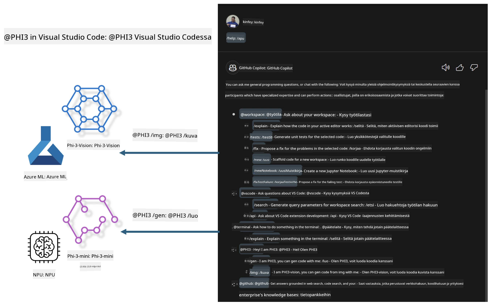

# **Rakenna oma Visual Studio Code GitHub Copilot Chat Microsoft Phi-3 -perheen avulla**

Oletko käyttänyt workspace-agenttia GitHub Copilot Chatissa? Haluatko rakentaa oman tiimisi koodiavustajan? Tämä käytännön harjoitus pyrkii yhdistämään avoimen lähdekoodin mallin rakentaakseen yritystason koodiliiketoiminta-agentin.

## **Perusteet**

### **Miksi valita Microsoft Phi-3**

Phi-3 on perhesarja, joka sisältää phi-3-mini, phi-3-small ja phi-3-medium eri koulutusparametreihin perustuen tekstin generointiin, dialogin täydentämiseen ja koodin generointiin. Lisäksi on phi-3-vision Vision-pohjainen malli. Se soveltuu yrityksille tai erilaisille tiimeille offline-generatiivisten tekoälyratkaisujen luomiseen.

Suositellaan lukemaan tämä linkki [https://github.com/microsoft/PhiCookBook/blob/main/md/01.Introduction/01/01.PhiFamily.md](https://github.com/microsoft/PhiCookBook/blob/main/md/01.Introduction/01/01.PhiFamily.md)

### **Microsoft GitHub Copilot Chat**

GitHub Copilot Chat -laajennus tarjoaa sinulle keskustelukäyttöliittymän, jonka avulla voit olla vuorovaikutuksessa GitHub Copilotin kanssa ja saada vastauksia koodaukseen liittyviin kysymyksiin suoraan VS Codessa ilman, että sinun tarvitsee etsiä dokumentaatiosta tai verkkofoorumeilta.

Copilot Chat saattaa käyttää syntaksin korostusta, sisennystä ja muita muotoiluominaisuuksia lisätäkseen selkeyttä generoituun vastaukseen. Käyttäjän kysymyksen tyypistä riippuen tulos voi sisältää linkkejä kontekstiin, jota Copilot käytti vastauksen muodostamiseen, kuten lähdekooditiedostoja tai dokumentaatiota, tai painikkeita VS Code -toimintojen käyttämiseen.

- Copilot Chat integroituu kehittäjätyöskentelyysi ja tarjoaa apua silloin, kun sitä tarvitset:

- Aloita suora keskustelu suoraan editorista tai terminaalista saadaksesi apua koodatessasi

- Käytä Chat-näkymää saadaksesi tekoälyavustajan tueksesi milloin tahansa

- Käynnistä Quick Chat esittääksesi nopean kysymyksen ja jatkaaksesi työskentelyäsi

Voit käyttää GitHub Copilot Chatia useissa tilanteissa, kuten:

- Vastata koodaukseen liittyviin kysymyksiin parhaan ratkaisun löytämiseksi

- Selvittää jonkun toisen koodia ja ehdottaa parannuksia

- Ehdottaa koodikorjauksia

- Generoida yksikkötestitapauksia

- Laatia koodin dokumentaatiota

Suositellaan lukemaan tämä linkki [https://code.visualstudio.com/docs/copilot/copilot-chat](https://code.visualstudio.com/docs/copilot/copilot-chat?WT.mc_id=aiml-137032-kinfeylo)

###  **Microsoft GitHub Copilot Chat @workspace**

Copilot Chatin **@workspace**-viittaus antaa sinun esittää kysymyksiä koko koodikannastasi. Kysymyksen perusteella Copilot hakee älykkäästi asiaankuuluvat tiedostot ja symbolit, joita se sitten käyttää vastauksessaan linkkeinä ja koodiesimerkkeinä.

Vastatakseen kysymykseesi, **@workspace** etsii samoista lähteistä kuin kehittäjä navigoidessaan koodikannassa VS Codessa:

- Kaikki työtilan tiedostot, paitsi .gitignore-tiedostolla ohitetut tiedostot

- Hakemistorakenne, jossa on sisäkkäisiä kansioita ja tiedostonimiä

- GitHubin koodihakemisto, mikäli työtila on GitHub-repositorio ja indeksoitu koodihakua varten

- Symbolit ja määritelmät työtilassa

- Tällä hetkellä valittu tai aktiivisen editorin näkyvissä oleva teksti

Huom: .gitignore ohitetaan, jos sinulla on tiedosto avoinna tai valittu teksti ohitetussa tiedostossa.

Suositellaan lukemaan tämä linkki [[https://code.visualstudio.com/docs/copilot/copilot-chat](https://code.visualstudio.com/docs/copilot/workspace-context?WT.mc_id=aiml-137032-kinfeylo)]

## **Lisätietoja tästä harjoituksesta**

GitHub Copilot on parantanut merkittävästi yritysten ohjelmointitehokkuutta, ja jokainen yritys haluaa mukauttaa GitHub Copilotin relevantteja toimintoja. Monet yritykset ovat mukauttaneet Copilotin kaltaisia laajennuksia omien liiketoimintatilanteidensa ja avoimen lähdekoodin mallien perusteella. Yrityksille mukautetut laajennukset ovat helpommin hallittavissa, mutta tämä voi vaikuttaa käyttökokemukseen. GitHub Copilotilla on kuitenkin vahvemmat toiminnot yleisten tilanteiden ja asiantuntijuuden käsittelyssä. Jos käyttökokemus voidaan pitää yhtenäisenä, on parempi mukauttaa yrityksen oma laajennus. GitHub Copilot Chat tarjoaa yrityksille soveltuvat API:t keskustelukokemuksen laajentamiseen. Yhtenäisen kokemuksen ylläpitäminen ja samalla mukautettujen toimintojen tarjoaminen parantaa käyttökokemusta.

Tässä harjoituksessa käytetään pääasiassa Phi-3 -mallia yhdessä paikallisen NPU:n ja Azuren hybridin kanssa rakentamaan mukautettu Agent GitHub Copilot Chatiin ***@PHI3*** auttamaan yrityskehittäjiä koodin generoinnissa***(@PHI3 /gen)*** ja kuviin perustuvassa koodin generoinnissa ***(@PHI3 /img)***.

### ***Huom:*** 

Tämä harjoitus on tällä hetkellä toteutettu Intel CPU:n ja Apple Siliconin AIPC:ssä. Päivitämme lähitulevaisuudessa myös Qualcomm-versiota NPU:lle.

## **Harjoitus**

| Nimi | Kuvaus | AIPC | Apple |
| ------------ | ----------- | -------- |-------- |
| Lab0 - Asennukset(✅) | Määritä ja asenna liittyvät ympäristöt ja asennustyökalut | [Mene](./HOL/AIPC/01.Installations.md) |[Mene](./HOL/Apple/01.Installations.md) |
| Lab1 - Suorita Prompt flow Phi-3-minillä (✅) | Yhdistetty AIPC:n / Apple Siliconin kanssa, paikallista NPU:ta käyttäen koodin generointiin Phi-3-minin avulla | [Mene](./HOL/AIPC/02.PromptflowWithNPU.md) | [Mene](./HOL/Apple/02.PromptflowWithMLX.md) |
| Lab2 - Ota Phi-3-vision käyttöön Azure Machine Learning Service -palvelussa(✅) | Luo koodia ottamalla käyttöön Azure Machine Learning Service -malliluettelo - Phi-3-vision kuva | [Mene](./HOL/AIPC/03.DeployPhi3VisionOnAzure.md) |[Mene](./HOL/Apple/03.DeployPhi3VisionOnAzure.md) |
| Lab3 - Luo @phi-3 agentti GitHub Copilot Chatiin(✅)  | Luo mukautettu Phi-3 agentti GitHub Copilot Chatiin suorittamaan koodin generointia, kaavioiden generointia, RAG:ia yms. | [Mene](./HOL/AIPC/04.CreatePhi3AgentInVSCode.md) | [Mene](./HOL/Apple/04.CreatePhi3AgentInVSCode.md) |
| Esimerkkikoodi (✅)  | Lataa esimerkkikoodi | [Mene](../../../../../../../code/07.Lab/01/AIPC) | [Mene](../../../../../../../code/07.Lab/01/Apple) |

## **Resurssit**

1. Phi-3 Cookbook [https://github.com/microsoft/Phi-3CookBook](https://github.com/microsoft/Phi-3CookBook)

2. Lue lisää GitHub Copilotista [https://learn.microsoft.com/training/paths/copilot/](https://learn.microsoft.com/training/paths/copilot/?WT.mc_id=aiml-137032-kinfeylo)

3. Lue lisää GitHub Copilot Chatista [https://learn.microsoft.com/training/paths/accelerate-app-development-using-github-copilot/](https://learn.microsoft.com/training/paths/accelerate-app-development-using-github-copilot/?WT.mc_id=aiml-137032-kinfeylo)

4. Lue lisää GitHub Copilot Chat API:sta [https://code.visualstudio.com/api/extension-guides/chat](https://code.visualstudio.com/api/extension-guides/chat?WT.mc_id=aiml-137032-kinfeylo)

5. Lue lisää Microsoft Foundrysta [https://learn.microsoft.com/training/paths/create-custom-copilots-ai-studio/](https://learn.microsoft.com/training/paths/create-custom-copilots-ai-studio/?WT.mc_id=aiml-137032-kinfeylo)

6. Lue lisää Microsoft Foundryn Malliluettelosta [https://learn.microsoft.com/azure/ai-studio/how-to/model-catalog-overview](https://learn.microsoft.com/azure/ai-studio/how-to/model-catalog-overview)

---

<!-- CO-OP TRANSLATOR DISCLAIMER START -->
**Vastuuvapauslauseke**:
Tämä asiakirja on käännetty tekoälypohjaisella käännöspalvelulla [Co-op Translator](https://github.com/Azure/co-op-translator). Vaikka pyrimme tarkkuuteen, otathan huomioon, että automaattisissa käännöksissä saattaa esiintyä virheitä tai epätarkkuuksia. Alkuperäistä asiakirjaa sen alkuperäisellä kielellä tulee pitää virallisena lähteenä. Tärkeissä tiedoissa suositellaan ammattimaista ihmiskäännöstä. Emme ota vastuuta tämän käännöksen käytöstä johtuvista väärinymmärryksistä tai tulkinnoista.
<!-- CO-OP TRANSLATOR DISCLAIMER END -->