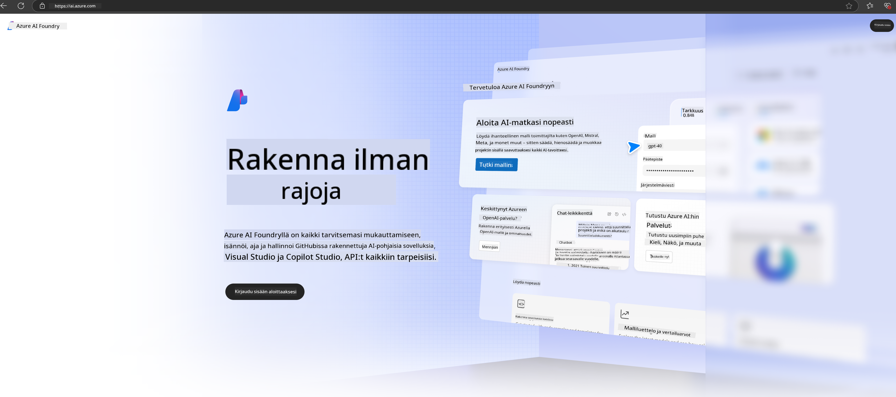

<!--
CO_OP_TRANSLATOR_METADATA:
{
  "original_hash": "3a1e48b628022485aac989c9f733e792",
  "translation_date": "2025-05-09T20:12:42+00:00",
  "source_file": "md/02.QuickStart/AzureAIFoundry_QuickStart.md",
  "language_code": "fi"
}
-->
# **Phi-3:n käyttäminen Azure AI Foundryssa**

Generatiivisen tekoälyn kehityksen myötä tavoitteena on käyttää yhtenäistä alustaa eri LLM- ja SLM-mallien, yritystietojen integroinnin, hienosäädön/RAG-toimintojen sekä eri yritystoimintojen arvioinnin hallintaan LLM- ja SLM-mallien integroinnin jälkeen. Näin generatiivinen tekoäly voidaan toteuttaa älykkäissä sovelluksissa entistä paremmin. [Azure AI Foundry](https://ai.azure.com) on yritystason generatiivisen tekoälyn sovellusalusta.

Azure AI Foundryn avulla voit arvioida suurten kielimallien (LLM) vastauksia ja orkestroida prompt-sovelluskomponentteja prompt flow’n avulla paremman suorituskyvyn saavuttamiseksi. Alusta mahdollistaa helpon skaalautuvuuden konseptien muuttamiseksi täysimittaiseksi tuotannoksi. Jatkuva seuranta ja hienosäätö tukevat pitkäaikaista menestystä.

Phi-3-mallin voi nopeasti ottaa käyttöön Azure AI Foundryssa yksinkertaisin askelin, ja sen jälkeen käyttää Azure AI Foundrya Phi-3:een liittyvien Playground/Chat-, hienosäätö-, arviointi- ja muiden tehtävien hoitamiseen.

## **1. Valmistelut**

Jos sinulla on jo [Azure Developer CLI](https://learn.microsoft.com/azure/developer/azure-developer-cli/overview?WT.mc_id=aiml-138114-kinfeylo) asennettuna koneellesi, tämän mallipohjan käyttäminen on yhtä helppoa kuin ajaa tämä komento uudessa kansiossa.

## Manuaalinen luonti

Microsoft Azure AI Foundry -projektin ja hubin luominen on erinomainen tapa järjestää ja hallita tekoälytyötäsi. Tässä vaiheittainen ohje aloittamiseen:

### Projektin luominen Azure AI Foundryssa

1. **Siirry Azure AI Foundryyn**: Kirjaudu Azure AI Foundryn portaaliin.
2. **Luo projekti**:
   - Jos olet projektissa, valitse sivun vasemmasta yläkulmasta "Azure AI Foundry" siirtyäksesi aloitussivulle.
   - Valitse "+ Create project".
   - Anna projektille nimi.
   - Jos sinulla on hub, se valitaan oletuksena. Jos sinulla on käyttöoikeus useampaan hubiin, voit valita toisen pudotusvalikosta. Jos haluat luoda uuden hubin, valitse "Create new hub" ja anna sille nimi.
   - Valitse "Create".

### Hubin luominen Azure AI Foundryssa

1. **Siirry Azure AI Foundryyn**: Kirjaudu sisään Azure-tililläsi.
2. **Luo hub**:
   - Valitse vasemman valikon Hallintakeskus (Management center).
   - Valitse "All resources", sitten nuoli "+ New project" -kohdan vieressä ja valitse "+ New hub".
   - Kirjoita "Create a new hub" -ikkunassa hubin nimi (esim. contoso-hub) ja muokkaa muita kenttiä tarpeen mukaan.
   - Valitse "Next", tarkista tiedot ja valitse "Create".

Yksityiskohtaisempia ohjeita löytyy virallisesta [Microsoftin dokumentaatiosta](https://learn.microsoft.com/azure/ai-studio/how-to/create-projects).

Onnistuneen luomisen jälkeen voit käyttää luomaasi studioa osoitteessa [ai.azure.com](https://ai.azure.com/).

Yhdellä AI Foundrylla voi olla useita projekteja. Luo projekti AI Foundryssa valmistautuaksesi.

Luo Azure AI Foundry [QuickStarts](https://learn.microsoft.com/azure/ai-studio/quickstarts/get-started-code)

## **2. Phi-mallin käyttöönotto Azure AI Foundryssa**

Valitse projektin Explore-vaihtoehto päästäksesi Model Catalogiin ja valitse Phi-3

Valitse Phi-3-mini-4k-instruct

Napsauta 'Deploy' ottaaksesi Phi-3-mini-4k-instruct -mallin käyttöön

> [!NOTE]
>
> Voit valita laskentatehon käyttöönoton yhteydessä

## **3. Playground Chat Phi Azure AI Foundryssa**

Siirry käyttöönoton sivulle, valitse Playground ja keskustele Azure AI Foundryn Phi-3:n kanssa

## **4. Mallin käyttöönotto Azure AI Foundrysta**

Mallin käyttöönotto Azure Model Catalogista onnistuu seuraavasti:

- Kirjaudu Azure AI Foundryyn.
- Valitse haluamasi malli Azure AI Foundryn mallikatalogista.
- Mallin Tiedot-sivulla valitse Deploy ja sitten Serverless API with Azure AI Content Safety.
- Valitse projekti, johon haluat ottaa mallin käyttöön. Serverless API -palvelun käyttö edellyttää, että työtila sijaitsee East US 2- tai Sweden Central -alueella. Voit muokata käyttöönoton nimeä.
- Käyttöönotto-velhon sivulla valitse hinnoittelu ja ehdot saadaksesi tietoa hinnoista ja käyttöehdoista.
- Valitse Deploy. Odota, että käyttöönotto valmistuu ja sinut ohjataan Deployments-sivulle.
- Valitse Open in playground aloittaaksesi mallin kanssa vuorovaikutuksen.
- Voit palata Deployments-sivulle, valita käyttöönoton ja huomioida endpointin Target URL:n sekä Secret Keyn, joita voit käyttää kutsuaksesi käyttöönottoa ja luodaksesi vastauksia.
- Endpointin tiedot, URL-osoite ja käyttöavaimet löytyvät aina Build-välilehdeltä Components-osiossa valitsemalla Deployments.

> [!NOTE]
> Huomioithan, että tililläsi tulee olla Azure AI Developer -roolipääsyoikeudet Resource Groupissa näiden toimintojen suorittamiseksi.

## **5. Phi API:n käyttäminen Azure AI Foundryssa**

Voit käyttää https://{Your project name}.region.inference.ml.azure.com/swagger.json -osoitetta Postmanin GET-pyynnöllä ja yhdistää sen avaimen kanssa tutustuaksesi tarjottuihin rajapintoihin.

Saat pyynnön parametrit erittäin kätevästi sekä vastauksen parametrit.

**Vastuuvapauslauseke**:  
Tämä asiakirja on käännetty tekoälypohjaisella käännöspalvelulla [Co-op Translator](https://github.com/Azure/co-op-translator). Vaikka pyrimme tarkkuuteen, huomioithan, että automaattiset käännökset saattavat sisältää virheitä tai epätarkkuuksia. Alkuperäistä asiakirjaa sen alkuperäisellä kielellä tulee pitää virallisena lähteenä. Tärkeiden tietojen osalta suositellaan ammattimaista ihmiskäännöstä. Emme ole vastuussa tämän käännöksen käytöstä aiheutuvista väärinymmärryksistä tai virhetulkintojen seurauksista.