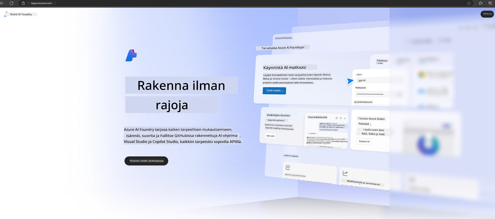

# **Phi-3:n käyttö Microsoft Foundryssa**

Generative AI:n kehittyessä toivomme käyttävämme yhtenäistä alustaa erilaisten LLM- ja SLM-mallien, yritysdatan integroinnin, hienosäädön/RAG-toimintojen sekä eri yritysten liiketoimintojen arvioinnin hallintaan LLM- ja SLM-mallien integroinnin jälkeen, jotta generatiivisen tekoälyn älykkäitä sovelluksia voidaan toteuttaa paremmin. [Microsoft Foundry](https://ai.azure.com) on yritystason generatiivisen tekoälyn sovellus- ja alusta.

Microsoft Foundryn avulla voit arvioida suurten kielimallien (LLM) vastauksia ja orkestroida kehotteiden sovelluskomponentteja prompt flow:n avulla paremman suorituskyvyn saavuttamiseksi. Alusta helpottaa skaalautuvuutta ja mahdollistaa konseptien muuttamisen täysimittaisiksi tuotantoratkaisuiksi vaivattomasti. Jatkuva valvonta ja hienosäätö tukevat pitkäaikaista menestystä.

Voimme nopeasti ottaa Phi-3-mallin käyttöön Microsoft Foundryssa yksinkertaisin askelin ja käyttää Microsoft Foundrya Phi-3:een liittyvien Playground/Chat-, hienosäätö-, arviointi- ja muiden työtehtävien tekemiseen.

## **1. Valmistelut**

Jos sinulla on jo [Azure Developer CLI](https://learn.microsoft.com/azure/developer/azure-developer-cli/overview?WT.mc_id=aiml-138114-kinfeylo) asennettuna koneellesi, tämän mallipohjan käyttäminen on yhtä helppoa kuin tämän komennon suorittaminen uudessa hakemistossa.

## Manuaalinen luominen

Microsoft Foundry -projektin ja -keskuksen luominen on erinomainen tapa järjestää ja hallita tekoälytyötäsi. Tässä askel askeleelta -opas aloittamiseen:

### Projektin luominen Microsoft Foundryssä

1. **Siirry Microsoft Foundryyn**: Kirjaudu Microsoft Foundry -portaalin sisään.
2. **Luo projekti**:
   - Jos olet jo projektissa, valitse sivun vasemmasta yläkulmasta "Microsoft Foundry" siirtyäksesi etusivulle.
   - Valitse "+ Create project".
   - Syötä projektille nimi.
   - Jos sinulla on keskus, se valitaan oletuksena. Jos sinulla on käyttöoikeus useampaan keskukseen, voit valita toisen pudotusvalikosta. Jos haluat luoda uuden keskuksen, valitse "Create new hub" ja anna nimi.
   - Valitse "Create".

### Keskuksen luominen Microsoft Foundryssä

1. **Siirry Microsoft Foundryyn**: Kirjaudu sisään Azure-tililläsi.
2. **Luo keskus**:
   - Valitse vasemman valikon hallintakeskus (Management center).
   - Valitse "All resources", sen jälkeen nuoli "+ New project" vieressä ja valitse "+ New hub".
   - "Create a new hub" -valintaikkunassa anna keskuksellesi nimi (esim. contoso-hub) ja muokkaa muita kenttiä halutessasi.
   - Valitse "Next", tarkista tiedot ja valitse "Create".

Lisätietoja saat virallisesta [Microsoftin dokumentaatiosta](https://learn.microsoft.com/azure/ai-studio/how-to/create-projects).

Onnistuneen luomisen jälkeen voit käyttää luomaasi studioa osoitteessa [ai.azure.com](https://ai.azure.com/)

Yhdellä AI Foundrylla voi olla useita projekteja. Luo AI Foundryssa projekti valmisteluun.

Luo Microsoft Foundry [QuickStarts](https://learn.microsoft.com/azure/ai-studio/quickstarts/get-started-code)

## **2. Phi-mallin käyttöönotto Microsoft Foundryssa**

Valitse projektissa Explore-vaihtoehto siirtyäksesi Mallikatalogiin ja valitse Phi-3.

Valitse Phi-3-mini-4k-instruct.

Klikkaa 'Deploy' ottaaksesi Phi-3-mini-4k-instruct -mallin käyttöön.

> [!NOTE]
>
> Voit valita laskentatehon käyttöönoton yhteydessä.

## **3. Playground Chat Phi Microsoft Foundryssa**

Siirry käyttöönotto-sivulle, valitse Playground ja chattaa Microsoft Foundryn Phi-3:n kanssa.

## **4. Mallin käyttöönotto Microsoft Foundrystä**

Mallin käyttöönottoon Azure Model Catalogista voit toimia seuraavasti:

- Kirjaudu Microsoft Foundryn sisään.
- Valitse haluamasi malli Microsoft Foundryn mallikatalogista.
- Mallin Tiedot-sivulla valitse Deploy ja sen jälkeen Serverless API with Azure AI Content Safety.
- Valitse projekti, johon mallin haluat asentaa. Serverless API -palvelun käyttäminen edellyttää, että työkalualueesi kuuluu East US 2 tai Sweden Central -alueeseen. Voit nimetä käyttöönoton vapaasti.
- Käyttöönottoprosessissa valitse Hinnasto ja ehdot lukeaksesi hinnoittelusta ja käyttöehdoista.
- Valitse Deploy. Odota, että käyttöönotto on valmis ja sinut ohjataan Deployments-sivulle.
- Valitse Open in playground aloittaaksesi vuorovaikutuksen mallin kanssa.
- Voit palata Deployments-sivulle, valita käyttöönoton ja huomata päätelaitteen Target URL:n sekä Secret Keyn, joita voit käyttää kutsuaksesi käyttöönottoa ja luodaksesi vastauksia.
- Löydät päätelaitteen tiedot, URL-osoitteen ja käyttöavaimet myös Build-välilehdeltä valitsemalla Components-osiossa Deployments.

> [!NOTE]
> Huomioithan, että tililläsi tulee olla Azure AI Developer -roolipermissiot Resource Groupilla, jotta voit suorittaa nämä vaiheet.

## **5. Phi API:n käyttäminen Microsoft Foundryssa**

Voit käyttää osoitetta https://{Your project name}.region.inference.ml.azure.com/swagger.json Postmanin GET-pyynnöllä ja yhdistää sen Key-avainpariin tutustuaksesi tarjottuihin rajapintoihin.

Saat pyynnön parametrit hyvin kätevästi sekä vastausparametrit.

---

<!-- CO-OP TRANSLATOR DISCLAIMER START -->
**Vastuuvapauslauseke**:
Tämä asiakirja on käännetty tekoälypohjaisella käännöspalvelulla [Co-op Translator](https://github.com/Azure/co-op-translator). Pyrimme tarkkuuteen, mutta otathan huomioon, että automaattiset käännökset saattavat sisältää virheitä tai epätarkkuuksia. Alkuperäinen asiakirja sen alkuperäiskielellä on virallinen lähde. Tärkeissä asioissa suositellaan ammattimaista ihmiskäännöstä. Emme ole vastuussa tämän käännöksen käytöstä aiheutuvista väärinkäsityksistä tai tulkinnoista.
<!-- CO-OP TRANSLATOR DISCLAIMER END -->