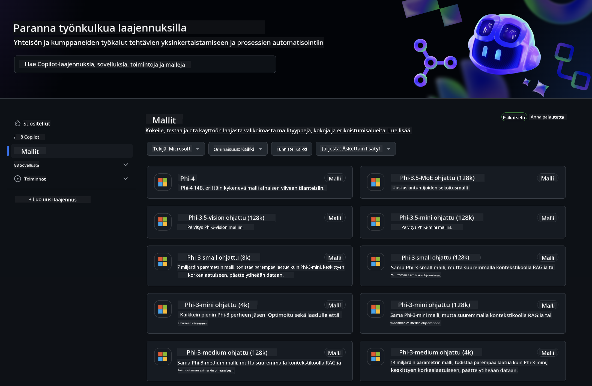
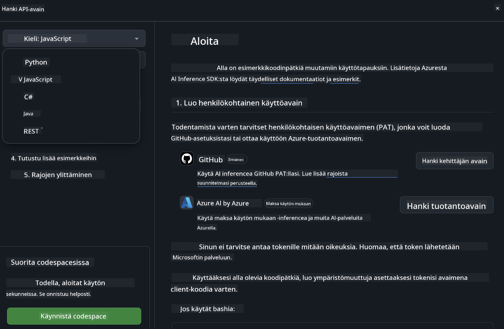
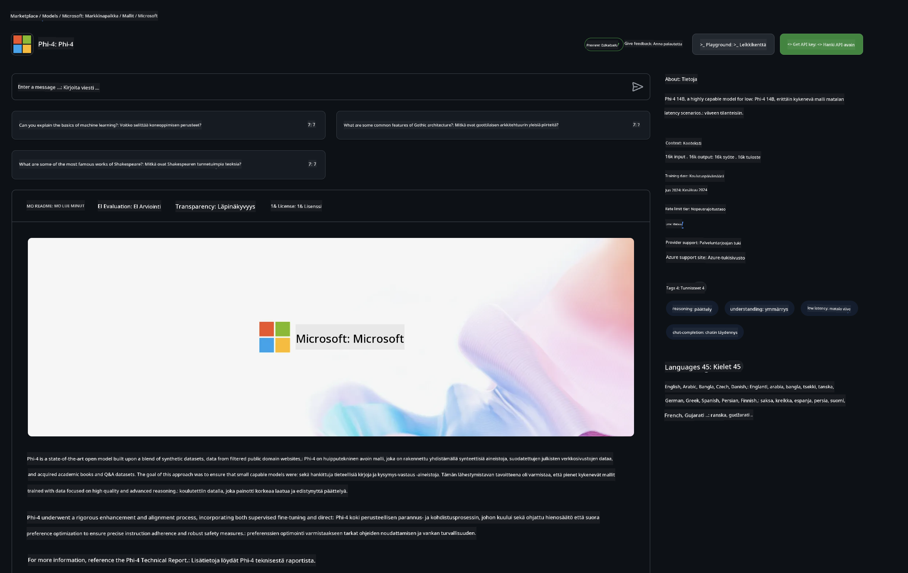

<!--
CO_OP_TRANSLATOR_METADATA:
{
  "original_hash": "5113634b77370af6790f9697d5d7de90",
  "translation_date": "2025-05-09T20:19:10+00:00",
  "source_file": "md/02.QuickStart/GitHubModel_QuickStart.md",
  "language_code": "fi"
}
-->
## GitHub Models - Rajoitettu julkinen beta

Tervetuloa [GitHub Models](https://github.com/marketplace/models) -palveluun! Olemme valmiina ja odotamme, että pääset tutkimaan Azure AI:ssa isännöityjä tekoälymalleja.



Lisätietoja GitHub Models -palvelussa saatavista malleista löydät [GitHub Model Marketplace](https://github.com/marketplace/models) -sivulta.

## Saatavilla olevat mallit

Jokaisella mallilla on oma testialue ja esimerkkikoodi


### Phi-3-mallit GitHub Model Catalogissa

[Phi-3-Medium-128k-Instruct](https://github.com/marketplace/models/azureml/Phi-3-medium-128k-instruct)

[Phi-3-medium-4k-instruct](https://github.com/marketplace/models/azureml/Phi-3-medium-4k-instruct)

[Phi-3-mini-128k-instruct](https://github.com/marketplace/models/azureml/Phi-3-mini-128k-instruct)

[Phi-3-mini-4k-instruct](https://github.com/marketplace/models/azureml/Phi-3-mini-4k-instruct)

[Phi-3-small-128k-instruct](https://github.com/marketplace/models/azureml/Phi-3-small-128k-instruct)

[Phi-3-small-8k-instruct](https://github.com/marketplace/models/azureml/Phi-3-small-8k-instruct)

## Aloittaminen

Saatavilla on muutama perusesimerkki, jotka voit suorittaa heti. Löydät ne samples-kansiosta. Jos haluat hypätä suoraan suosikkikieleesi, esimerkit löytyvät seuraavilta kieliltä:

- Python
- JavaScript
- cURL

Saatavilla on myös oma Codespaces-ympäristö, jossa voit ajaa esimerkkejä ja malleja.



## Esimerkkikoodi

Alla on muutamia esimerkkikoodinpätkiä eri käyttötapauksiin. Lisätietoja Azure AI Inference SDK:sta löydät täydellisestä dokumentaatiosta ja esimerkeistä.

## Asennus

1. Luo henkilökohtainen käyttöoikeustunnus  
Sinun ei tarvitse antaa tunnukselle mitään oikeuksia. Huomioithan, että tunnus lähetetään Microsoftin palveluun.

Käyttääksesi alla olevia koodinpätkiä, luo ympäristömuuttuja, johon asetat tunnuksesi avaimena asiakaskoodille.

Jos käytät bashia:  
```
export GITHUB_TOKEN="<your-github-token-goes-here>"
```  
Jos käytät powershelliä:  

```
$Env:GITHUB_TOKEN="<your-github-token-goes-here>"
```  

Jos käytät Windowsin komentokehotetta:  

```
set GITHUB_TOKEN=<your-github-token-goes-here>
```  

## Python-esimerkki

### Riippuvuuksien asennus  
Asenna Azure AI Inference SDK pipillä (vaatii: Python >=3.8):  

```
pip install azure-ai-inference
```  
### Perusesimerkin suorittaminen

Tämä esimerkki näyttää peruskutsun chat completion -rajapintaan. Se hyödyntää GitHub AI -mallin päätepistettä ja GitHub-tunnustasi. Kutsu on synkroninen.

```
import os
from azure.ai.inference import ChatCompletionsClient
from azure.ai.inference.models import SystemMessage, UserMessage
from azure.core.credentials import AzureKeyCredential

endpoint = "https://models.inference.ai.azure.com"
# Replace Model_Name 
model_name = "Phi-3-small-8k-instruct"
token = os.environ["GITHUB_TOKEN"]

client = ChatCompletionsClient(
    endpoint=endpoint,
    credential=AzureKeyCredential(token),
)

response = client.complete(
    messages=[
        SystemMessage(content="You are a helpful assistant."),
        UserMessage(content="What is the capital of France?"),
    ],
    model=model_name,
    temperature=1.,
    max_tokens=1000,
    top_p=1.
)

print(response.choices[0].message.content)
```

### Monikierroksisen keskustelun suorittaminen

Tässä esimerkissä käydään monikierroksinen keskustelu chat completion -rajapinnalla. Kun käytät mallia chat-sovelluksessa, sinun tulee hallita keskusteluhistoriaa ja lähettää mallille uusimmat viestit.

```
import os
from azure.ai.inference import ChatCompletionsClient
from azure.ai.inference.models import AssistantMessage, SystemMessage, UserMessage
from azure.core.credentials import AzureKeyCredential

token = os.environ["GITHUB_TOKEN"]
endpoint = "https://models.inference.ai.azure.com"
# Replace Model_Name
model_name = "Phi-3-small-8k-instruct"

client = ChatCompletionsClient(
    endpoint=endpoint,
    credential=AzureKeyCredential(token),
)

messages = [
    SystemMessage(content="You are a helpful assistant."),
    UserMessage(content="What is the capital of France?"),
    AssistantMessage(content="The capital of France is Paris."),
    UserMessage(content="What about Spain?"),
]

response = client.complete(messages=messages, model=model_name)

print(response.choices[0].message.content)
```

### Vastauksen suoratoisto

Parempaa käyttökokemusta varten haluat suoratoistaa mallin vastauksen, jotta ensimmäinen token näkyy nopeasti eikä tarvitse odottaa pitkiä vastauksia.

```
import os
from azure.ai.inference import ChatCompletionsClient
from azure.ai.inference.models import SystemMessage, UserMessage
from azure.core.credentials import AzureKeyCredential

token = os.environ["GITHUB_TOKEN"]
endpoint = "https://models.inference.ai.azure.com"
# Replace Model_Name
model_name = "Phi-3-small-8k-instruct"

client = ChatCompletionsClient(
    endpoint=endpoint,
    credential=AzureKeyCredential(token),
)

response = client.complete(
    stream=True,
    messages=[
        SystemMessage(content="You are a helpful assistant."),
        UserMessage(content="Give me 5 good reasons why I should exercise every day."),
    ],
    model=model_name,
)

for update in response:
    if update.choices:
        print(update.choices[0].delta.content or "", end="")

client.close()
```  
## JavaScript

### Riippuvuuksien asennus

Asenna Node.js.

Kopioi alla oleva teksti ja tallenna se tiedostoksi package.json kansioosi.

```
{
  "type": "module",
  "dependencies": {
    "@azure-rest/ai-inference": "latest",
    "@azure/core-auth": "latest",
    "@azure/core-sse": "latest"
  }
}
```

Huomio: @azure/core-sse tarvitaan vain, jos suoratoistat chat completion -vastauksia.

Avaa terminaali tässä kansiossa ja suorita npm install.

Kopioi jokaisen alla olevan koodinpätkän sisältö tiedostoon sample.js ja suorita se komennolla node sample.js.

### Perusesimerkin suorittaminen

Tämä esimerkki näyttää peruskutsun chat completion -rajapintaan. Se hyödyntää GitHub AI -mallin päätepistettä ja GitHub-tunnustasi. Kutsu on synkroninen.

```
import ModelClient from "@azure-rest/ai-inference";
import { AzureKeyCredential } from "@azure/core-auth";

const token = process.env["GITHUB_TOKEN"];
const endpoint = "https://models.inference.ai.azure.com";
// Update your modelname
const modelName = "Phi-3-small-8k-instruct";

export async function main() {

  const client = new ModelClient(endpoint, new AzureKeyCredential(token));

  const response = await client.path("/chat/completions").post({
    body: {
      messages: [
        { role:"system", content: "You are a helpful assistant." },
        { role:"user", content: "What is the capital of France?" }
      ],
      model: modelName,
      temperature: 1.,
      max_tokens: 1000,
      top_p: 1.
    }
  });

  if (response.status !== "200") {
    throw response.body.error;
  }
  console.log(response.body.choices[0].message.content);
}

main().catch((err) => {
  console.error("The sample encountered an error:", err);
});
```

### Monikierroksisen keskustelun suorittaminen

Tässä esimerkissä käydään monikierroksinen keskustelu chat completion -rajapinnalla. Kun käytät mallia chat-sovelluksessa, sinun tulee hallita keskusteluhistoriaa ja lähettää mallille uusimmat viestit.

```
import ModelClient from "@azure-rest/ai-inference";
import { AzureKeyCredential } from "@azure/core-auth";

const token = process.env["GITHUB_TOKEN"];
const endpoint = "https://models.inference.ai.azure.com";
// Update your modelname
const modelName = "Phi-3-small-8k-instruct";

export async function main() {

  const client = new ModelClient(endpoint, new AzureKeyCredential(token));

  const response = await client.path("/chat/completions").post({
    body: {
      messages: [
        { role: "system", content: "You are a helpful assistant." },
        { role: "user", content: "What is the capital of France?" },
        { role: "assistant", content: "The capital of France is Paris." },
        { role: "user", content: "What about Spain?" },
      ],
      model: modelName,
    }
  });

  if (response.status !== "200") {
    throw response.body.error;
  }

  for (const choice of response.body.choices) {
    console.log(choice.message.content);
  }
}

main().catch((err) => {
  console.error("The sample encountered an error:", err);
});
```

### Vastauksen suoratoisto

Parempaa käyttökokemusta varten haluat suoratoistaa mallin vastauksen, jotta ensimmäinen token näkyy nopeasti eikä tarvitse odottaa pitkiä vastauksia.

```
import ModelClient from "@azure-rest/ai-inference";
import { AzureKeyCredential } from "@azure/core-auth";
import { createSseStream } from "@azure/core-sse";

const token = process.env["GITHUB_TOKEN"];
const endpoint = "https://models.inference.ai.azure.com";
// Update your modelname
const modelName = "Phi-3-small-8k-instruct";

export async function main() {

  const client = new ModelClient(endpoint, new AzureKeyCredential(token));

  const response = await client.path("/chat/completions").post({
    body: {
      messages: [
        { role: "system", content: "You are a helpful assistant." },
        { role: "user", content: "Give me 5 good reasons why I should exercise every day." },
      ],
      model: modelName,
      stream: true
    }
  }).asNodeStream();

  const stream = response.body;
  if (!stream) {
    throw new Error("The response stream is undefined");
  }

  if (response.status !== "200") {
    stream.destroy();
    throw new Error(`Failed to get chat completions, http operation failed with ${response.status} code`);
  }

  const sseStream = createSseStream(stream);

  for await (const event of sseStream) {
    if (event.data === "[DONE]") {
      return;
    }
    for (const choice of (JSON.parse(event.data)).choices) {
        process.stdout.write(choice.delta?.content ?? ``);
    }
  }
}

main().catch((err) => {
  console.error("The sample encountered an error:", err);
});
```

## REST

### Perusesimerkin suorittaminen

Liitä seuraava komentoriville:

```
curl -X POST "https://models.inference.ai.azure.com/chat/completions" \
    -H "Content-Type: application/json" \
    -H "Authorization: Bearer $GITHUB_TOKEN" \
    -d '{
        "messages": [
            {
                "role": "system",
                "content": "You are a helpful assistant."
            },
            {
                "role": "user",
                "content": "What is the capital of France?"
            }
        ],
        "model": "Phi-3-small-8k-instruct"
    }'
```  
### Monikierroksisen keskustelun suorittaminen

Kutsu chat completion -rajapintaa ja lähetä keskusteluhistoria:

```
curl -X POST "https://models.inference.ai.azure.com/chat/completions" \
    -H "Content-Type: application/json" \
    -H "Authorization: Bearer $GITHUB_TOKEN" \
    -d '{
        "messages": [
            {
                "role": "system",
                "content": "You are a helpful assistant."
            },
            {
                "role": "user",
                "content": "What is the capital of France?"
            },
            {
                "role": "assistant",
                "content": "The capital of France is Paris."
            },
            {
                "role": "user",
                "content": "What about Spain?"
            }
        ],
        "model": "Phi-3-small-8k-instruct"
    }'
```  
### Vastauksen suoratoisto

Tässä esimerkissä kutsutaan päätepistettä ja suoratoistetaan vastaus.

```
curl -X POST "https://models.inference.ai.azure.com/chat/completions" \
    -H "Content-Type: application/json" \
    -H "Authorization: Bearer $GITHUB_TOKEN" \
    -d '{
        "messages": [
            {
                "role": "system",
                "content": "You are a helpful assistant."
            },
            {
                "role": "user",
                "content": "Give me 5 good reasons why I should exercise every day."
            }
        ],
        "stream": true,
        "model": "Phi-3-small-8k-instruct"
    }'
```

## GITHUB MODELSIN ILMAINEN KÄYTTÖ JA KÄYTTÖRAJOITUKSET



[Leikkikentän ja ilmaisen API-käytön rajoitukset](https://docs.github.com/en/github-models/prototyping-with-ai-models#rate-limits) on suunniteltu auttamaan sinua kokeilemaan malleja ja prototyypittämään tekoälysovellustasi. Näiden rajojen ylittävään käyttöön ja sovelluksen skaalaamiseen sinun tulee varata resursseja Azure-tililtä ja todentaa sieltä henkilökohtaisen GitHub-käyttöoikeustunnuksen sijaan. Koodissasi ei tarvitse tehdä muita muutoksia. Käytä tätä linkkiä oppiaksesi, miten voit ylittää ilmaiskäytön rajat Azure AI:ssa.

### Huomautuksia

Muista, että kun käytät mallia, kokeilet tekoälyä, joten sisältövirheitä voi esiintyä.

Ominaisuus on rajoitettu monin tavoin (mm. pyynnöt minuutissa, pyynnöt päivässä, tokenit per pyyntö ja samanaikaiset pyynnöt) eikä sitä ole tarkoitettu tuotantokäyttöön.

GitHub Models käyttää Azure AI Content Safety -palvelua. Näitä suodattimia ei voi poistaa käytöstä GitHub Models -kokemuksen aikana. Jos päätät käyttää malleja maksullisen palvelun kautta, muokkaa sisältösuodattimia tarpeidesi mukaan.

Tämä palvelu on GitHubin esijulkaisuehtojen alainen.

**Vastuuvapauslauseke**:  
Tämä asiakirja on käännetty käyttämällä tekoälypohjaista käännöspalvelua [Co-op Translator](https://github.com/Azure/co-op-translator). Vaikka pyrimme tarkkuuteen, otathan huomioon, että automaattikäännöksissä voi esiintyä virheitä tai epätarkkuuksia. Alkuperäistä asiakirjaa sen alkuperäiskielellä tulee pitää virallisena lähteenä. Tärkeissä tiedoissa suositellaan ammattimaista ihmiskäännöstä. Emme ole vastuussa tämän käännöksen käytöstä johtuvista väärinymmärryksistä tai virhetulkinnoista.