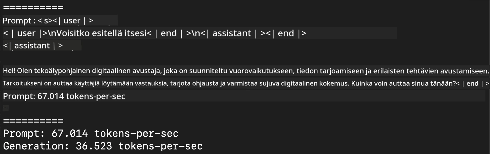
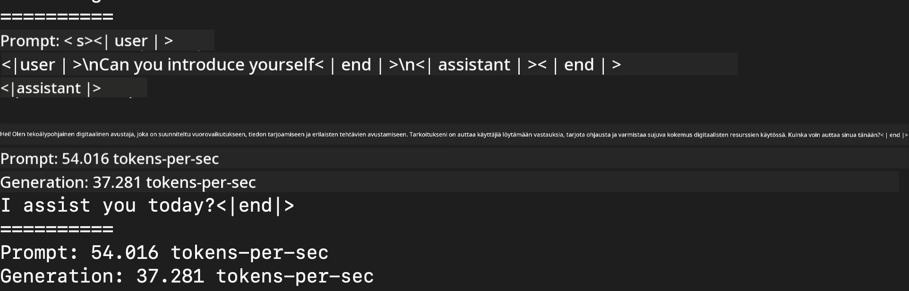
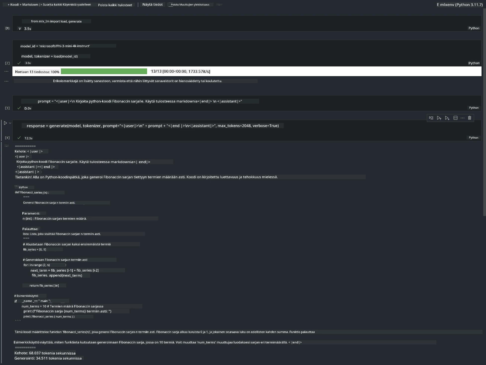

# **Inference Phi-3 Apple MLX -kehyksellä**

## **Mikä on MLX Framework**

MLX on taulukkoihin perustuva kehys koneoppimustutkimukseen Apple-sirulla, jonka on tuonut sinulle Apple koneoppimustutkimus.

MLX on suunniteltu koneoppimustutkijoiden toimesta koneoppimustutkijoille. Kehys on tarkoitettu käyttäjäystävälliseksi, mutta silti tehokkaaksi mallien kouluttamiseen ja käyttöönottoon. Kehyksen rakenne on myös konseptuaalisesti yksinkertainen. Tavoitteenamme on tehdä MLX:n laajentamisesta ja parantamisesta helppoa tutkijoille, jotta uusia ideoita voidaan nopeasti kokeilla.

LLM-malleja voidaan kiihdyttää Apple Silicon -laitteilla MLX:n avulla, ja malleja voi ajaa paikallisesti erittäin kätevästi.

## **MLX:n käyttäminen Phi-3-minin inferenssiin**

### **1. Määritä MLX-ympäristösi**

1. Python 3.11.x
2. Asenna MLX-kirjasto


```bash

pip install mlx-lm

```

### **2. Phi-3-minin ajaminen terminaalissa MLX:llä**


```bash

python -m mlx_lm.generate --model microsoft/Phi-3-mini-4k-instruct --max-token 2048 --prompt  "<|user|>\nCan you introduce yourself<|end|>\n<|assistant|>"

```

Tulos (ympäristöni on Apple M1 Max, 64GB) on



### **3. Phi-3-minin kvantisointi MLX:llä terminaalissa**


```bash

python -m mlx_lm.convert --hf-path microsoft/Phi-3-mini-4k-instruct

```

***Note：*** Malli voidaan kvantisoida mlx_lm.convert-funktiolla, ja oletuskvantisointi on INT4. Tässä esimerkissä Phi-3-mini kvantisoidaan INT4-muotoon.

Malli voidaan kvantisoida mlx_lm.convert-funktiolla, ja oletuskvantisointi on INT4. Tässä esimerkissä Phi-3-mini kvantisoidaan INT4-muotoon. Kvantisoinnin jälkeen malli tallennetaan oletushakemistoon ./mlx_model

Voimme testata MLX:llä kvantisoitua mallia terminaalista


```bash

python -m mlx_lm.generate --model ./mlx_model/ --max-token 2048 --prompt  "<|user|>\nCan you introduce yourself<|end|>\n<|assistant|>"

```

Tulos on




### **4. Phi-3-minin ajaminen MLX:llä Jupyter Notebookissa**




***Note:*** Lue tämä esimerkkitiedosto [klikkaa tästä](../../../../../code/03.Inference/MLX/MLX_DEMO.ipynb)


## **Resurssit**

1. Lisätietoa Apple MLX Frameworkista [https://ml-explore.github.io](https://ml-explore.github.io/mlx/build/html/index.html)

2. Apple MLX GitHub -repositorio [https://github.com/ml-explore](https://github.com/ml-explore)

**Vastuuvapauslauseke**:  
Tämä asiakirja on käännetty käyttämällä tekoälypohjaista käännöspalvelua [Co-op Translator](https://github.com/Azure/co-op-translator). Vaikka pyrimme tarkkuuteen, huomioithan, että automaattikäännöksissä saattaa esiintyä virheitä tai epätarkkuuksia. Alkuperäistä asiakirjaa sen alkuperäiskielellä tulee pitää virallisena lähteenä. Tärkeissä tiedoissa suositellaan ammattimaista ihmiskäännöstä. Emme ole vastuussa tämän käännöksen käytöstä aiheutuvista väärinymmärryksistä tai tulkinnoista.