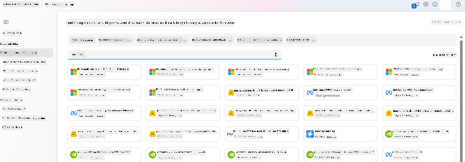
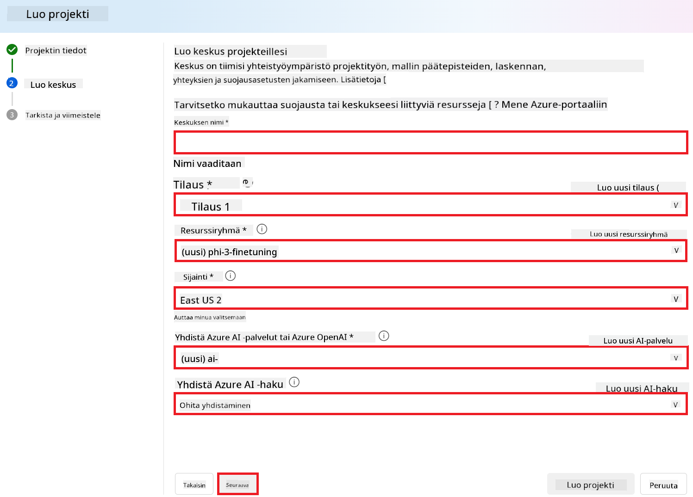
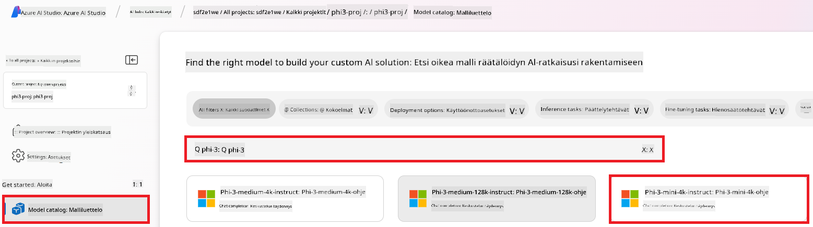
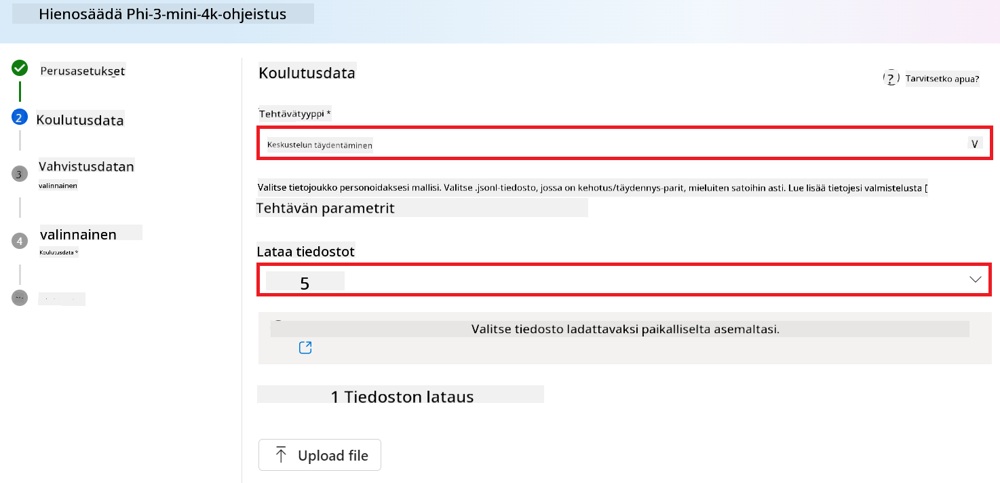
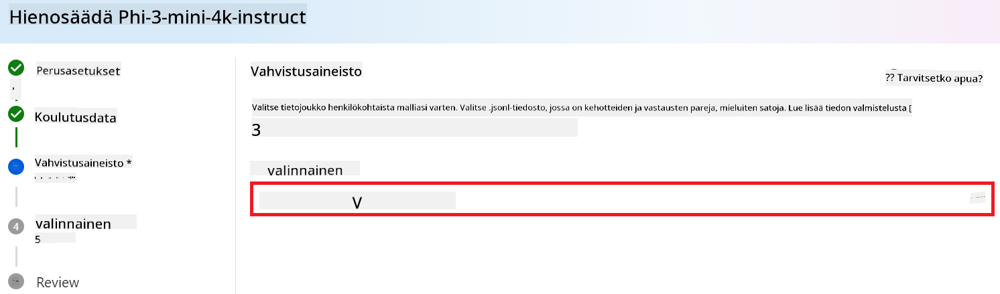
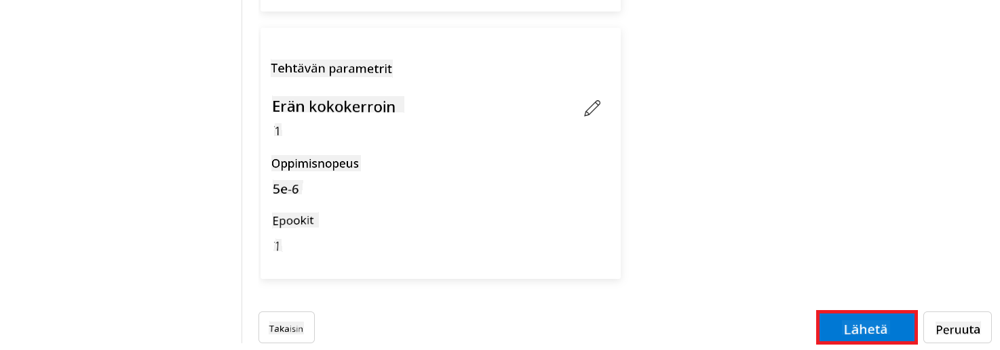
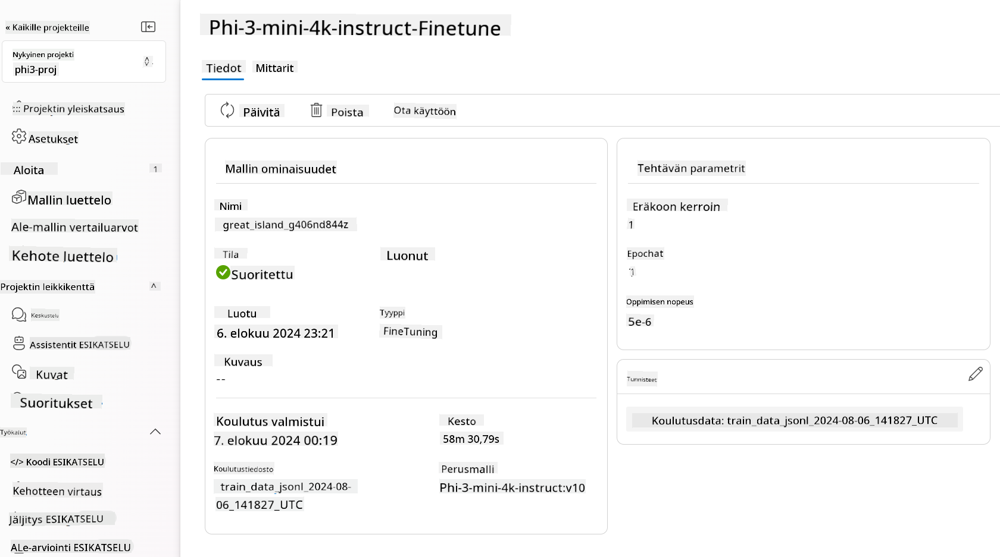

<!--
CO_OP_TRANSLATOR_METADATA:
{
  "original_hash": "c1559c5af6caccf6f623fd43a6b3a9a3",
  "translation_date": "2025-05-09T20:33:05+00:00",
  "source_file": "md/03.FineTuning/FineTuning_AIFoundry.md",
  "language_code": "fi"
}
-->
# Phi-3:n hienosäätö Azure AI Foundryn avulla

Tutustutaan, miten Microsoftin Phi-3 Mini -kielimallia voi hienosäätää Azure AI Foundryn avulla. Hienosäätö mahdollistaa Phi-3 Minin sovittamisen tiettyihin tehtäviin, tehden siitä entistä tehokkaamman ja kontekstia ymmärtävämmän.

## Huomioitavaa

- **Ominaisuudet:** Mitkä mallit ovat hienosäädettäviä? Mihin perusmallia voi hienosäätää?
- **Kustannukset:** Millainen hinnoittelumalli hienosäädöllä on?
- **Muokattavuus:** Kuinka paljon perusmallia voi muokata – ja millä tavoin?
- **Käytettävyys:** Miten hienosäätö käytännössä tapahtuu – pitääkö kirjoittaa omaa koodia? Tarvitaanko oma laskentateho?
- **Turvallisuus:** Hienosäädetyissä malleissa voi esiintyä turvallisuusriskejä – onko olemassa suojausmekanismeja ei-toivotun vahingon estämiseksi?



## Valmistautuminen hienosäätöön

### Esivaatimukset

> [!NOTE]
> Phi-3 -perheen malleissa pay-as-you-go -mallinen hienosäätö on saatavilla vain **East US 2** -alueella luoduissa hubeissa.

- Azure-tilaus. Jos sinulla ei vielä ole Azure-tilausta, luo [maksullinen Azure-tili](https://azure.microsoft.com/pricing/purchase-options/pay-as-you-go) aloittaaksesi.

- [AI Foundry -projekti](https://ai.azure.com?WT.mc_id=aiml-138114-kinfeylo).
- Azure roolipohjaiset käyttöoikeudet (Azure RBAC) myöntävät pääsyn Azure AI Foundryn toimintoihin. Tämän artikkelin ohjeiden suorittamiseksi käyttäjätilillesi on määritettävä __Azure AI Developer -rooli__ resurssiryhmässä.

### Tilauksen palveluntarjoajan rekisteröinti

Varmista, että tilaus on rekisteröity `Microsoft.Network`-resurssipalveluntarjoajalle.

1. Kirjaudu sisään [Azure-portaaliin](https://portal.azure.com).
1. Valitse vasemman laidan valikosta **Subscriptions**.
1. Valitse käytettävä tilaus.
1. Valitse vasemman laidan valikosta **AI project settings** > **Resource providers**.
1. Varmista, että **Microsoft.Network** on resurssipalveluntarjoajien listalla. Lisää se tarvittaessa.

### Datan valmistelu

Valmistele koulutus- ja validointidata mallisi hienosäätöä varten. Koulutus- ja validointidatasi sisältävät syöte- ja tulos-esimerkkejä siitä, miten haluat mallin toimivan.

Varmista, että kaikki koulutusesimerkkisi noudattavat odotettua inferenssiformaattia. Tehokkaaseen hienosäätöön tarvitaan tasapainoinen ja monipuolinen aineisto.

Tämä tarkoittaa datan tasapainon ylläpitoa, erilaisten tilanteiden sisällyttämistä ja koulutusdatan säännöllistä hienosäätöä vastaamaan todellisen maailman odotuksia, mikä johtaa tarkempiin ja tasapainoisempiin mallivastauksiin.

Eri mallityypit vaativat eri muotoisen koulutusdatan.

### Chat Completion

Käyttämäsi koulutus- ja validointidata **täytyy** olla JSON Lines (JSONL) -muodossa. `Phi-3-mini-128k-instruct` hienosäätöaineiston tulee olla keskustelumallin mukaisessa muodossa, jota Chat completions -API käyttää.

### Esimerkkitiedoston formaatti

```json
    {"messages": [{"role": "system", "content": "You are an Xbox customer support agent whose primary goal is to help users with issues they are experiencing with their Xbox devices. You are friendly and concise. You only provide factual answers to queries, and do not provide answers that are not related to Xbox."}, {"role": "user", "content": "Is Xbox better than PlayStation?"}, {"role": "assistant", "content": "I apologize, but I cannot provide personal opinions. My primary job is to assist you with any issues related to your Xbox device. Do you have any Xbox-related issues that need addressing?"}]}
    {"messages": [{"role": "system", "content": "You are an Xbox customer support agent whose primary goal is to help users with issues they are experiencing with their Xbox devices. You are friendly and concise. You only provide factual answers to queries, and do not provide answers that are not related to Xbox."}, {"role": "user", "content": "Can I play PC games on my Xbox?"}, {"role": "assistant", "content": "While Xbox consoles don't natively support PC games, they can play an array of Xbox games, many of which are also available on PC. Can I assist you with finding games compatible with your Xbox device?"}]}
    {"messages": [{"role": "system", "content": "You are an Xbox customer support agent whose primary goal is to help users with issues they are experiencing with their Xbox devices. You are friendly and concise. You only provide factual answers to queries, and do not provide answers that are not related to Xbox."}, {"role": "user", "content": "I'm having trouble connecting my Xbox to the Wi-Fi."}, {"role": "assistant", "content": "No worries, let's go through the network settings on your Xbox. Can you please tell me what happens when you try to connect it to the Wi-Fi?"}]}
```

Tuettu tiedostotyyppi on JSON Lines. Tiedostot ladataan oletustietovarastoon ja ne ovat käytettävissä projektissasi.

## Phi-3:n hienosäätö Azure AI Foundryn avulla

Azure AI Foundry mahdollistaa suurten kielimallien räätälöinnin omien aineistojen perusteella hienosäädön avulla. Hienosäätö tarjoaa merkittäviä etuja, kuten mukauttamisen ja optimoinnin tiettyihin tehtäviin ja sovelluksiin. Tämä parantaa suorituskykyä, kustannustehokkuutta, vähentää viivettä ja tuottaa räätälöityjä vastauksia.


### Uuden projektin luominen

1. Kirjaudu sisään [Azure AI Foundryyn](https://ai.azure.com).

1. Valitse **+New project** luodaksesi uuden projektin Azure AI Foundryyn.

    

1. Tee seuraavat toimet:

    - Projektin **Hub name**. Sen on oltava uniikki arvo.
    - Valitse käytettävä **Hub** (luo uusi tarvittaessa).

    

1. Luo uusi hub tekemällä seuraavat:

    - Syötä **Hub name**. Sen on oltava uniikki arvo.
    - Valitse Azure-**Subscription**.
    - Valitse käytettävä **Resource group** (luo uusi tarvittaessa).
    - Valitse haluamasi **Location**.
    - Valitse käytettävä **Connect Azure AI Services** (luo uusi tarvittaessa).
    - Valitse **Connect Azure AI Search** ja valitse **Skip connecting**.

    

1. Valitse **Next**.
1. Valitse **Create a project**.

### Datan valmistelu

Ennen hienosäätöä kerää tai luo tehtävääsi liittyvä aineisto, kuten chat-ohjeita, kysymys-vastauspareja tai muuta asiaankuuluvaa tekstidataa. Siivoa ja esikäsittele data poistamalla häiriötekijät, käsittelemällä puuttuvat arvot ja tokenisoimalla teksti.

### Phi-3-mallien hienosäätö Azure AI Foundryssa

> [!NOTE]
> Phi-3 -mallien hienosäätöä tuetaan tällä hetkellä vain East US 2 -alueella sijaitsevissa projekteissa.

1. Valitse vasemman laidan välilehdeltä **Model catalog**.

1. Kirjoita **hakupalkkiin** *phi-3* ja valitse haluamasi phi-3 -malli.

    

1. Valitse **Fine-tune**.

    

1. Syötä **Fine-tuned model name**.

    

1. Valitse **Next**.

1. Tee seuraavat valinnat:

    - Valitse **task type** arvoksi **Chat completion**.
    - Valitse käytettävä **Training data**. Voit ladata sen Azure AI Foundryn datan kautta tai paikalliselta koneelta.

    

1. Valitse **Next**.

1. Lataa käytettävä **Validation data** tai valitse **Automatic split of training data**.

    

1. Valitse **Next**.

1. Tee seuraavat valinnat:

    - Valitse haluamasi **Batch size multiplier**.
    - Valitse haluamasi **Learning rate**.
    - Valitse haluamasi **Epochs**.

    

1. Valitse **Submit** aloittaaksesi hienosäätöprosessin.

    

1. Kun mallisi hienosäätö on valmis, sen tila näkyy **Completed**-merkinnällä, kuten alla olevassa kuvassa. Nyt voit ottaa mallin käyttöön ja käyttää sitä omassa sovelluksessasi, leikkikentällä tai prompt flowssa. Lisätietoja löytyy kohdasta [How to deploy Phi-3 family of small language models with Azure AI Foundry](https://learn.microsoft.com/azure/ai-studio/how-to/deploy-models-phi-3?tabs=phi-3-5&pivots=programming-language-python).

    

> [!NOTE]
> Yksityiskohtaisempaa tietoa Phi-3:n hienosäädöstä löydät osoitteesta [Fine-tune Phi-3 models in Azure AI Foundry](https://learn.microsoft.com/azure/ai-studio/how-to/fine-tune-phi-3?tabs=phi-3-mini).

## Hienosäädettyjen mallien siivoaminen

Voit poistaa hienosäädetyn mallin hienosäätömallien listalta [Azure AI Foundrystä](https://ai.azure.com) tai mallin tietosivulta. Valitse poistettava hienosäädetty malli Fine-tuning-sivulla ja valitse sitten Poista-painike.

> [!NOTE]
> Et voi poistaa mukautettua mallia, jos sillä on olemassa oleva käyttöönotto. Sinun on ensin poistettava mallin käyttöönotto ennen kuin voit poistaa mukautetun mallin.

## Kustannukset ja käyttörajat

### Phi-3-mallien palveluna hienosäädön kustannus- ja käyttörajoitukset

Phi-mallit, joita hienosäädetään palveluna, tarjoaa Microsoft ja ne on integroitu Azure AI Foundryyn käyttöä varten. Hinnoittelutiedot löytyvät mallien [käyttöönoton](https://learn.microsoft.com/azure/ai-studio/how-to/deploy-models-phi-3?tabs=phi-3-5&pivots=programming-language-python) tai hienosäädön yhteydessä käyttöönoton ohjaimen Hinnoittelu ja ehdot -välilehdeltä.

## Sisällön suodatus

Pay-as-you-go -palveluna käytettävät mallit ovat suojattuja Azure AI Content Safetyn avulla. Reaaliaikaisiin päätepisteisiin käyttöönotettaessa voit halutessasi poistaa tämän ominaisuuden käytöstä. Kun Azure AI Content Safety on päällä, sekä syöte että malli tuottama vastaus kulkevat läpi luokittelumallien joukon, joiden tavoitteena on havaita ja estää haitallisen sisällön tuottaminen. Sisällön suodatusjärjestelmä tunnistaa ja reagoi tiettyihin mahdollisesti haitallisiin sisältöluokkiin sekä syötteissä että vastauksissa. Lisätietoja Azure AI Content Safetystä löytyy osoitteesta [Azure AI Content Safety](https://learn.microsoft.com/azure/ai-studio/concepts/content-filtering).

**Hienosäätöasetukset**

Hyperparametrit: Määritä hyperparametrit, kuten oppimisnopeus, eräkoko ja koulutusepokien määrä.

**Häviöfunktio**

Valitse tehtävääsi sopiva häviöfunktio (esim. ristientropia).

**Optimointimenetelmä**

Valitse optimointimenetelmä (esim. Adam) gradienttipäivityksiä varten koulutuksen aikana.

**Hienosäätöprosessi**

- Lataa esikoulutettu malli: Lataa Phi-3 Minin tarkistuspiste.
- Lisää mukautetut kerrokset: Lisää tehtäväkohtaiset kerrokset (esim. luokittelupää chat-ohjeita varten).

**Mallin koulutus**

Hienosäädä mallia valmiilla aineistollasi. Seuraa koulutuksen etenemistä ja säädä hyperparametreja tarvittaessa.

**Arviointi ja validointi**

Validointiaineisto: Jaa data koulutus- ja validointiosiin.

**Suorituskyvyn arviointi**

Käytä mittareita, kuten tarkkuus, F1-pistemäärä tai hämmennys (perplexity) mallin suorituskyvyn arviointiin.

## Hienosäädetyn mallin tallennus

**Tarkistuspiste**

Tallenna hienosäädetyn mallin tarkistuspiste myöhempää käyttöä varten.

## Käyttöönotto

- Ota käyttöön verkkopalveluna: Ota hienosäädetty mallisi käyttöön verkkopalveluna Azure AI Foundryssa.
- Testaa päätepiste: Lähetä testikyselyjä käyttöönotettuun päätepisteeseen varmistaaksesi sen toimivuuden.

## Iteroi ja paranna

Iteroi: Jos suorituskyky ei ole tyydyttävä, tee muutoksia hyperparametreihin, lisää dataa tai hienosäädä pidemmillä epookeilla.

## Seuraa ja hienosäädä

Seuraa mallin toimintaa jatkuvasti ja tee tarvittavia parannuksia.

## Räätälöi ja laajenna

Mukautetut tehtävät: Phi-3 Miniä voi hienosäätää moniin muihinkin tehtäviin kuin chat-ohjeisiin. Tutki muita käyttötapauksia!
Kokeile: Testaa erilaisia arkkitehtuureja, kerrosten yhdistelmiä ja menetelmiä suorituskyvyn parantamiseksi.

> [!NOTE]
> Hienosäätö on iteratiivinen prosessi. Kokeile, opi ja mukauta malliasi saavuttaaksesi parhaat tulokset juuri sinun tehtävääsi varten!

**Vastuuvapauslauseke**:  
Tämä asiakirja on käännetty käyttämällä tekoälypohjaista käännöspalvelua [Co-op Translator](https://github.com/Azure/co-op-translator). Vaikka pyrimme tarkkuuteen, otathan huomioon, että automaattiset käännökset voivat sisältää virheitä tai epätarkkuuksia. Alkuperäistä asiakirjaa sen alkuperäiskielellä tulee pitää auktoritatiivisena lähteenä. Tärkeissä asioissa suositellaan ammattimaista ihmiskäännöstä. Emme ole vastuussa tämän käännöksen käytöstä aiheutuvista väärinkäsityksistä tai virhetulkinnoista.