<!--
CO_OP_TRANSLATOR_METADATA:
{
  "original_hash": "c1559c5af6caccf6f623fd43a6b3a9a3",
  "translation_date": "2025-07-17T06:07:52+00:00",
  "source_file": "md/03.FineTuning/FineTuning_AIFoundry.md",
  "language_code": "fi"
}
-->
# Phi-3:n hienosäätö Azure AI Foundryn avulla

Tutustutaan, miten Microsoftin Phi-3 Mini -kielimallia voi hienosäätää Azure AI Foundryn avulla. Hienosäätö mahdollistaa Phi-3 Minin sovittamisen tiettyihin tehtäviin, tehden siitä entistä tehokkaamman ja kontekstin ymmärtävämmän.

## Huomioitavaa

- **Ominaisuudet:** Mitkä mallit ovat hienosäädettäviä? Mihin perusmallia voi hienosäätää?
- **Kustannukset:** Millainen hinnoittelumalli hienosäädöllä on?
- **Muokattavuus:** Kuinka paljon voin muokata perusmallia – ja millä tavoilla?
- **Käytettävyys:** Miten hienosäätö käytännössä tapahtuu – pitääkö kirjoittaa omaa koodia? Tarvitseeko tuoda oma laskentateho?
- **Turvallisuus:** Hienosäädetyt mallit voivat sisältää turvallisuusriskejä – onko olemassa suojakeinoja vahinkojen estämiseksi?

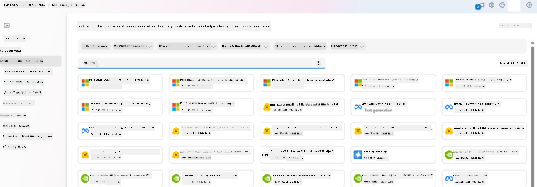

## Valmistautuminen hienosäätöön

### Esivaatimukset

> [!NOTE]
> Phi-3 -perheen malleille pay-as-you-go -mallinen hienosäätö on saatavilla vain **East US 2** -alueella luoduissa hubeissa.

- Azure-tilaus. Jos sinulla ei ole Azure-tilausta, luo [maksullinen Azure-tili](https://azure.microsoft.com/pricing/purchase-options/pay-as-you-go) aloittaaksesi.

- [AI Foundry -projekti](https://ai.azure.com?WT.mc_id=aiml-138114-kinfeylo).
- Azure-roolipohjaiset käyttöoikeudet (Azure RBAC) myöntävät pääsyn Azure AI Foundryn toimintoihin. Tämän artikkelin vaiheiden suorittamiseksi käyttäjätilillesi on määritettävä __Azure AI Developer -rooli__ resurssiryhmässä.

### Tilauksen tarjoajan rekisteröinti

Varmista, että tilaus on rekisteröity `Microsoft.Network` -resurssitarjoajalle.

1. Kirjaudu sisään [Azure-portaaliin](https://portal.azure.com).
1. Valitse vasemman valikon **Subscriptions**.
1. Valitse käytettävä tilaus.
1. Valitse vasemman valikon **AI project settings** > **Resource providers**.
1. Varmista, että **Microsoft.Network** on resurssitarjoajien listalla. Lisää se tarvittaessa.

### Datan valmistelu

Valmistele koulutus- ja validointidatasi mallin hienosäätöä varten. Koulutus- ja validointidatasetit sisältävät syöte- ja tulosesimerkkejä siitä, miten haluat mallin toimivan.

Varmista, että kaikki koulutusesimerkkisi noudattavat odotettua inferenssiformaattia. Tehokkaaseen hienosäätöön tarvitaan tasapainoinen ja monipuolinen aineisto.

Tämä tarkoittaa datan tasapainon ylläpitämistä, erilaisten tilanteiden sisällyttämistä ja koulutusdatan säännöllistä tarkentamista vastaamaan todellisia odotuksia, mikä johtaa tarkempiin ja tasapainoisempiin mallivastauksiin.

Eri mallityypit vaativat erilaisen koulutusdatan formaatin.

### Chat Completion

Käyttämäsi koulutus- ja validointidata **täytyy** olla JSON Lines (JSONL) -muodossa. `Phi-3-mini-128k-instruct` -mallin hienosäätöaineiston tulee olla keskustelumuodossa, jota Chat completions API käyttää.

### Esimerkkitiedoston formaatti

```json
    {"messages": [{"role": "system", "content": "You are an Xbox customer support agent whose primary goal is to help users with issues they are experiencing with their Xbox devices. You are friendly and concise. You only provide factual answers to queries, and do not provide answers that are not related to Xbox."}, {"role": "user", "content": "Is Xbox better than PlayStation?"}, {"role": "assistant", "content": "I apologize, but I cannot provide personal opinions. My primary job is to assist you with any issues related to your Xbox device. Do you have any Xbox-related issues that need addressing?"}]}
    {"messages": [{"role": "system", "content": "You are an Xbox customer support agent whose primary goal is to help users with issues they are experiencing with their Xbox devices. You are friendly and concise. You only provide factual answers to queries, and do not provide answers that are not related to Xbox."}, {"role": "user", "content": "Can I play PC games on my Xbox?"}, {"role": "assistant", "content": "While Xbox consoles don't natively support PC games, they can play an array of Xbox games, many of which are also available on PC. Can I assist you with finding games compatible with your Xbox device?"}]}
    {"messages": [{"role": "system", "content": "You are an Xbox customer support agent whose primary goal is to help users with issues they are experiencing with their Xbox devices. You are friendly and concise. You only provide factual answers to queries, and do not provide answers that are not related to Xbox."}, {"role": "user", "content": "I'm having trouble connecting my Xbox to the Wi-Fi."}, {"role": "assistant", "content": "No worries, let's go through the network settings on your Xbox. Can you please tell me what happens when you try to connect it to the Wi-Fi?"}]}
```

Tuettu tiedostotyyppi on JSON Lines. Tiedostot ladataan oletustietovarastoon ja ne ovat käytettävissä projektissasi.

## Phi-3:n hienosäätö Azure AI Foundryn avulla

Azure AI Foundry mahdollistaa suurten kielimallien räätälöinnin omien aineistojen pohjalta hienosäätöprosessin avulla. Hienosäätö tarjoaa merkittävää lisäarvoa mahdollistamalla mallin mukauttamisen ja optimoinnin tiettyihin tehtäviin ja sovelluksiin. Se parantaa suorituskykyä, kustannustehokkuutta, vähentää viivettä ja tuottaa räätälöityjä vastauksia.

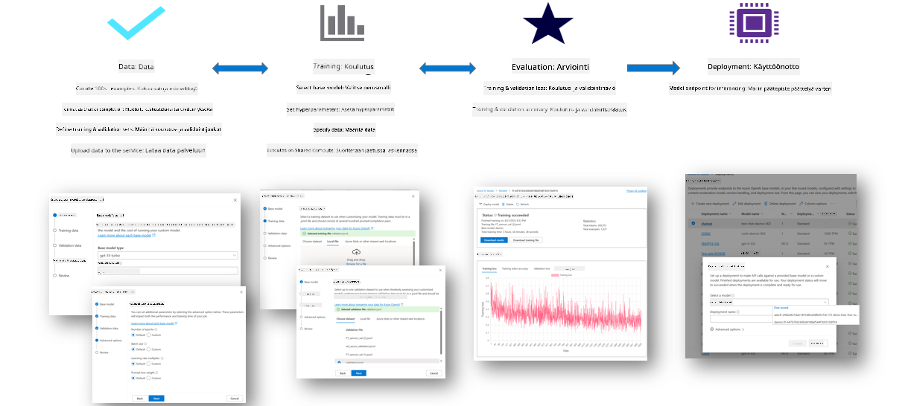

### Luo uusi projekti

1. Kirjaudu sisään [Azure AI Foundryyn](https://ai.azure.com).

1. Valitse **+New project** luodaksesi uuden projektin Azure AI Foundryyn.

    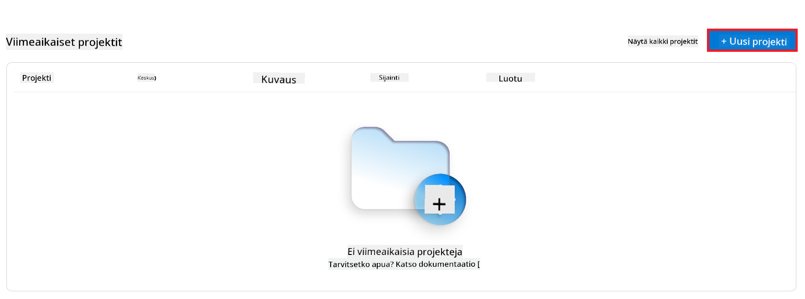

1. Suorita seuraavat tehtävät:

    - Projektin **Hub name**. Sen on oltava yksilöllinen.
    - Valitse käytettävä **Hub** (luo uusi tarvittaessa).

    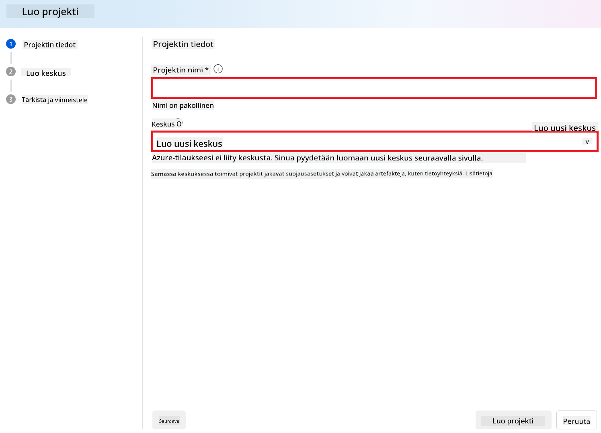

1. Luo uusi hub seuraavasti:

    - Syötä **Hub name**. Sen on oltava yksilöllinen.
    - Valitse Azure-**Subscription**.
    - Valitse käytettävä **Resource group** (luo uusi tarvittaessa).
    - Valitse haluamasi **Location**.
    - Valitse käytettävä **Connect Azure AI Services** (luo uusi tarvittaessa).
    - Valitse **Connect Azure AI Search** ja valitse **Skip connecting**.

    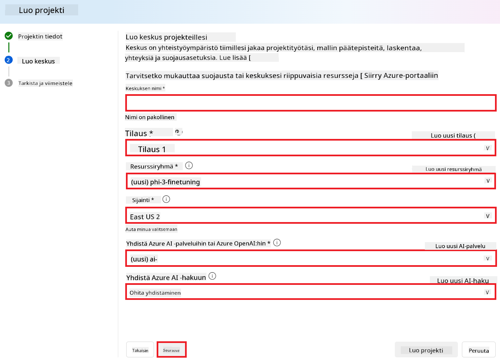

1. Valitse **Next**.
1. Valitse **Create a project**.

### Datan valmistelu

Ennen hienosäätöä kerää tai luo tehtävääsi liittyvä aineisto, kuten chat-ohjeita, kysymys-vastauspareja tai muuta asiaankuuluvaa tekstidataa. Puhdista ja esikäsittele data poistamalla häiriötekijöitä, käsittelemällä puuttuvat arvot ja tokenisoimalla teksti.

### Phi-3-mallien hienosäätö Azure AI Foundryssa

> [!NOTE]
> Phi-3-mallien hienosäätö on tällä hetkellä tuettu vain East US 2 -alueella sijaitsevissa projekteissa.

1. Valitse vasemman sivupalkin **Model catalog**.

1. Kirjoita hakupalkkiin *phi-3* ja valitse haluamasi phi-3 -malli.

    

1. Valitse **Fine-tune**.

    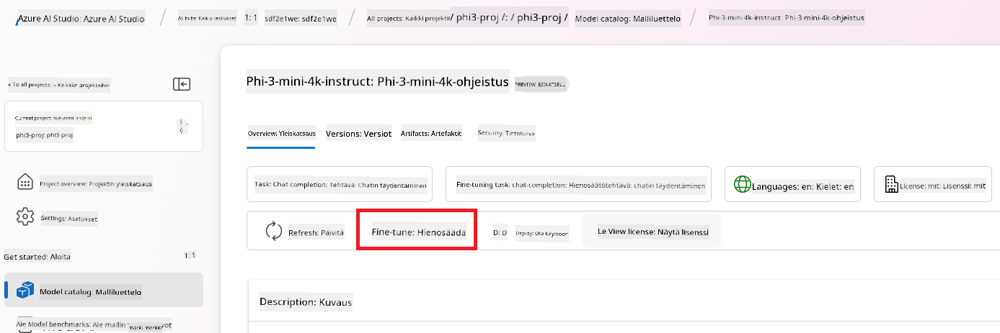

1. Syötä **Fine-tuned model name**.

    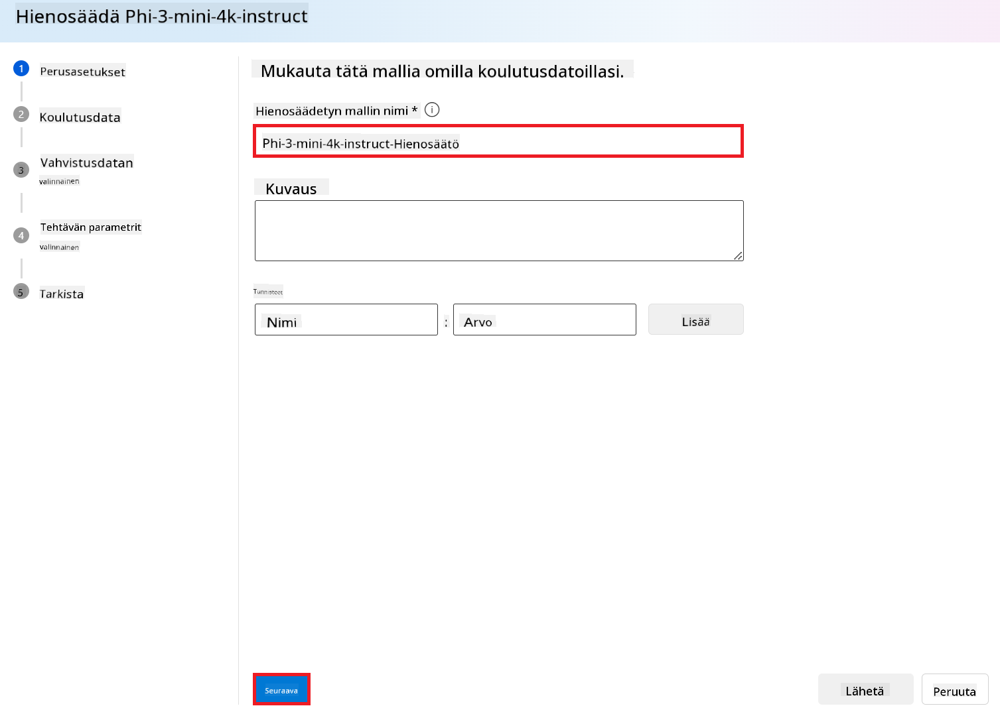

1. Valitse **Next**.

1. Suorita seuraavat tehtävät:

    - Valitse **task type** arvoksi **Chat completion**.
    - Valitse käytettävä **Training data**. Voit ladata sen Azure AI Foundryn datan kautta tai paikallisesta ympäristöstäsi.

    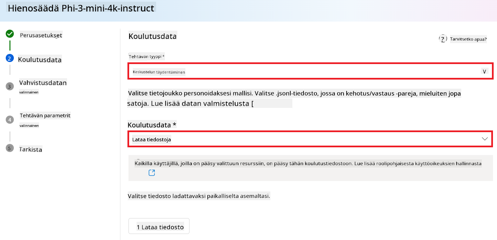

1. Valitse **Next**.

1. Lataa käytettävä **Validation data** tai valitse **Automatic split of training data**.

    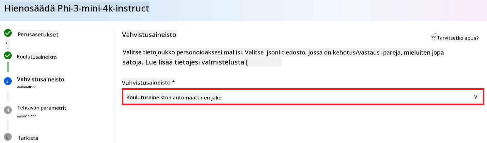

1. Valitse **Next**.

1. Suorita seuraavat tehtävät:

    - Valitse haluamasi **Batch size multiplier**.
    - Valitse haluamasi **Learning rate**.
    - Valitse haluamasi **Epochs**.

    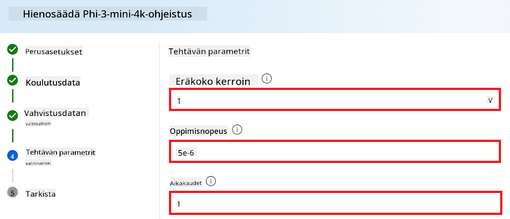

1. Valitse **Submit** aloittaaksesi hienosäätöprosessin.

    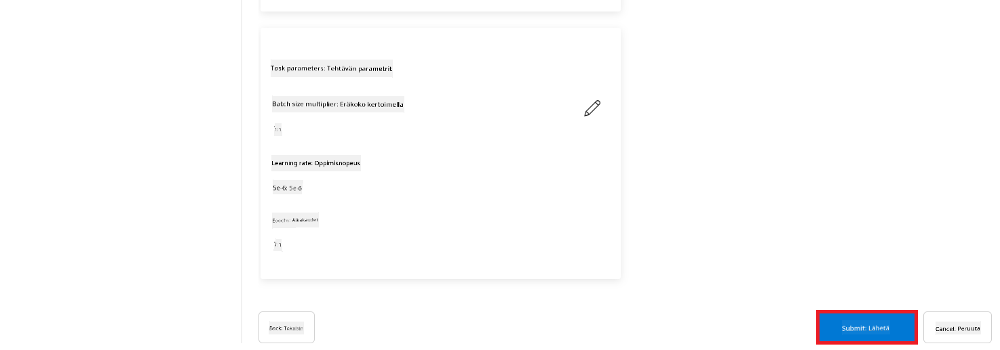

1. Kun mallisi on hienosäädetty, tila näkyy **Completed**-merkintänä, kuten alla olevassa kuvassa. Nyt voit ottaa mallin käyttöön ja käyttää sitä omassa sovelluksessasi, playgroundissa tai prompt flow’ssa. Lisätietoja löytyy kohdasta [How to deploy Phi-3 family of small language models with Azure AI Foundry](https://learn.microsoft.com/azure/ai-studio/how-to/deploy-models-phi-3?tabs=phi-3-5&pivots=programming-language-python).

    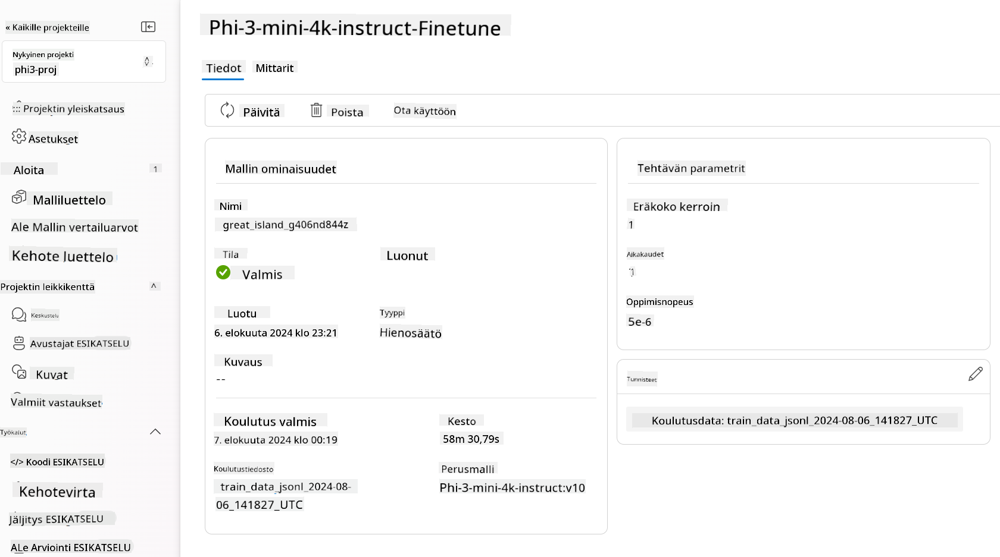

> [!NOTE]
> Tarkempia tietoja Phi-3:n hienosäädöstä löydät osoitteesta [Fine-tune Phi-3 models in Azure AI Foundry](https://learn.microsoft.com/azure/ai-studio/how-to/fine-tune-phi-3?tabs=phi-3-mini).

## Hienosäädettyjen mallien siivous

Voit poistaa hienosäädetyn mallin hienosäätömallien listalta [Azure AI Foundrysta](https://ai.azure.com) tai mallin tietosivulta. Valitse poistettava hienosäädetty malli Fine-tuning-sivulta ja napsauta Poista-painiketta.

> [!NOTE]
> Et voi poistaa mukautettua mallia, jos sillä on olemassa oleva käyttöönotto. Sinun on ensin poistettava mallin käyttöönotto ennen kuin voit poistaa mukautetun mallin.

## Kustannukset ja kiintiöt

### Kustannus- ja kiintiöhuomiot Phi-3-mallien palveluna tapahtuvasta hienosäädöstä

Phi-mallit, joita hienosäädetään palveluna, tarjoaa Microsoft ja ne on integroitu Azure AI Foundryyn käyttöä varten. Hinnoittelun löydät mallien [käyttöönoton](https://learn.microsoft.com/azure/ai-studio/how-to/deploy-models-phi-3?tabs=phi-3-5&pivots=programming-language-python) tai hienosäädön yhteydessä Käyttöönotto-velhon Hinnoittelu ja ehdot -välilehdeltä.

## Sisällön suodatus

Pay-as-you-go -mallina palveluna käyttöönotetut mallit ovat suojattuja Azure AI Content Safetyn avulla. Reaaliaikaisiin päätepisteisiin käyttöönotettaessa voit halutessasi poistaa tämän ominaisuuden käytöstä. Azure AI Content Safetyn ollessa päällä sekä syöte että malli vastaus kulkevat luokittelumallien joukon läpi, joiden tarkoituksena on havaita ja estää haitallisen sisällön tuottaminen. Sisällön suodatusjärjestelmä tunnistaa ja reagoi tiettyihin mahdollisesti haitallisiin sisältökategorioihin sekä syötteissä että vastauksissa. Lisätietoja [Azure AI Content Safetystä](https://learn.microsoft.com/azure/ai-studio/concepts/content-filtering).

**Hienosäätöasetukset**

Hyperparametrit: Määritä hyperparametrit, kuten oppimisnopeus, eräkoko ja koulutusepokien määrä.

**Häviöfunktio**

Valitse tehtävääsi sopiva häviöfunktio (esim. ristiinentropia).

**Optimointialgoritmi**

Valitse optimointialgoritmi (esim. Adam) gradienttipäivityksiä varten koulutuksen aikana.

**Hienosäätöprosessi**

- Lataa esikoulutettu malli: Lataa Phi-3 Mini -tarkistuspiste.
- Lisää mukautetut kerrokset: Lisää tehtäväkohtaiset kerrokset (esim. luokittelupää chat-ohjeille).

**Mallin koulutus**

Hienosäädä malli valmistellulla aineistollasi. Seuraa koulutuksen etenemistä ja säädä hyperparametreja tarpeen mukaan.

**Arviointi ja validointi**

Validointijoukko: Jaa aineisto koulutus- ja validointijoukkoihin.

**Suorituskyvyn arviointi**

Käytä mittareita kuten tarkkuus, F1-pisteet tai perplexity mallin suorituskyvyn arviointiin.

## Tallenna hienosäädetty malli

**Tarkistuspiste**

Tallenna hienosäädetyn mallin tarkistuspiste myöhempää käyttöä varten.

## Käyttöönotto

- Ota käyttöön web-palveluna: Ota hienosäädetty mallisi käyttöön web-palveluna Azure AI Foundryssa.
- Testaa päätepistettä: Lähetä testikyselyjä käyttöönotettuun päätepisteeseen varmistaaksesi sen toimivuuden.

## Iteroi ja paranna

Iteroi: Jos suorituskyky ei ole tyydyttävä, tee iterointeja säätämällä hyperparametreja, lisäämällä dataa tai hienosäätämällä lisää epookkeja.

## Seuraa ja hienosäädä

Seuraa mallin käyttäytymistä jatkuvasti ja tee tarvittavia hienosäätöjä.

## Mukauta ja laajenna

Mukautetut tehtävät: Phi-3 Miniä voi hienosäätää monenlaisiin tehtäviin chat-ohjeiden lisäksi. Tutki muita käyttötapauksia!
Kokeile: Testaa erilaisia arkkitehtuureja, kerrosyhdistelmiä ja tekniikoita suorituskyvyn parantamiseksi.

> [!NOTE]
> Hienosäätö on iteratiivinen prosessi. Kokeile, opi ja mukauta malliasi saavuttaaksesi parhaat tulokset juuri sinun tehtävääsi varten!

**Vastuuvapauslauseke**:  
Tämä asiakirja on käännetty käyttämällä tekoälypohjaista käännöspalvelua [Co-op Translator](https://github.com/Azure/co-op-translator). Vaikka pyrimme tarkkuuteen, huomioithan, että automaattikäännöksissä saattaa esiintyä virheitä tai epätarkkuuksia. Alkuperäistä asiakirjaa sen alkuperäiskielellä tulee pitää virallisena lähteenä. Tärkeissä tiedoissa suositellaan ammattimaista ihmiskäännöstä. Emme ole vastuussa tämän käännöksen käytöstä aiheutuvista väärinymmärryksistä tai tulkinnoista.