# Phi-3:n hienosäätö Microsoft Foundryn avulla

 Tutkitaan, kuinka hienosäätää Microsoftin Phi-3 Mini -kielimallia Microsoft Foundryn avulla. Hienosäätö mahdollistaa Phi-3 Minin mukauttamisen tiettyihin tehtäviin, tehden siitä entistä tehokkaamman ja kontekstin ymmärtävän.

## Huomioitavaa

- **Ominaisuudet:** Mitkä mallit ovat hienosäädettäviä? Mihin perusmallia voi hienosäätää?
- **Kustannukset:** Mikä on hienosäädön hinnoittelumalli?
- **Muokattavuus:** Kuinka paljon voin muuttaa perusmallia – ja millä tavoin?
- **Käytettävyys:** Miten hienosäätö käytännössä tapahtuu – tarvitseeko kirjoittaa omaa koodia? Tarvitseeko tuoda oma laskentaresurssi?
- **Turvallisuus:** Hienosäädetyt mallit tunnetaan turvallisuusriskeistä – onko olemassa suojausmekanismeja estämään ei-toivottua haittaa?

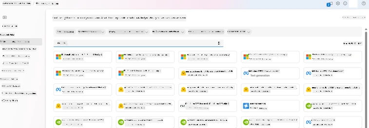

## Valmistautuminen hienosäätöön

### Esivaatimukset

> [!NOTE]
> Phi-3 -malliperheen maksun mukaan käytettävä hienosäätömalli on saatavilla vain **East US 2** -alueelle luoduissa keskuksissa.

- Azure-tilaus. Jos sinulla ei ole Azure-tilausta, luo [maksullinen Azure-tili](https://azure.microsoft.com/pricing/purchase-options/pay-as-you-go) aloittaaksesi.

- [AI Foundry -projekti](https://ai.azure.com?WT.mc_id=aiml-138114-kinfeylo).
- Azure-roolipohjaisia käyttöoikeuksia (Azure RBAC) käytetään käyttöoikeuksien myöntämiseen Microsoft Foundryssa. Tätä artikkelia varten sinun käyttäjätilillesi täytyy olla myönnetty __Azure AI Developer -rooli__ resurssiryhmässä.

### Tilausrekisteröinnin varmistus

Varmista, että tilaus on rekisteröity `Microsoft.Network` -resurssin tarjoajalle.

1. Kirjaudu sisään [Azure-portaaliin](https://portal.azure.com).
2. Valitse vasemman valikon **Subscriptions**.
3. Valitse käytettävä tilaus.
4. Valitse vasemman valikon **AI project settings** > **Resource providers**.
5. Varmista, että **Microsoft.Network** on resurssitarjoajien listalla. Lisää se, jos ei ole.

### Tietojen valmistelu

Valmistele koulutus- ja validointidatasi mallin hienosäätöä varten. Koulutus- ja validointidatat sisältävät syöte- ja tulosesimerkkejä siitä, kuinka haluat mallin suoriutuvan.

Varmista, että kaikki koulutusesimerkkisi noudattavat inferenceen odotettua muotoa. Tehokkaan hienosäädön saavuttamiseksi käytä tasapainoista ja monipuolista aineistoa.

Tämä sisältää datan tasapainottamisen, erilaiset skenaariot ja koulutusdatan säännöllisen tarkentamisen vastaamaan todellisia odotuksia, mikä johtaa tarkempiin ja tasapainoisempiin mallin vastauksiin.

Eri mallityypit vaativat eri muotoista koulutusdataa.

### Chat Completion

Käytettävän koulutus- ja validointidatan **täytyy** olla JSON Lines (JSONL) -muodossa. `Phi-3-mini-128k-instruct`-mallin hienosäätöaineiston tulee olla keskustelumuodossa, jota käyttää Chat completion API.

### Esimerkkitiedoston muoto

```json
    {"messages": [{"role": "system", "content": "You are an Xbox customer support agent whose primary goal is to help users with issues they are experiencing with their Xbox devices. You are friendly and concise. You only provide factual answers to queries, and do not provide answers that are not related to Xbox."}, {"role": "user", "content": "Is Xbox better than PlayStation?"}, {"role": "assistant", "content": "I apologize, but I cannot provide personal opinions. My primary job is to assist you with any issues related to your Xbox device. Do you have any Xbox-related issues that need addressing?"}]}
    {"messages": [{"role": "system", "content": "You are an Xbox customer support agent whose primary goal is to help users with issues they are experiencing with their Xbox devices. You are friendly and concise. You only provide factual answers to queries, and do not provide answers that are not related to Xbox."}, {"role": "user", "content": "Can I play PC games on my Xbox?"}, {"role": "assistant", "content": "While Xbox consoles don't natively support PC games, they can play an array of Xbox games, many of which are also available on PC. Can I assist you with finding games compatible with your Xbox device?"}]}
    {"messages": [{"role": "system", "content": "You are an Xbox customer support agent whose primary goal is to help users with issues they are experiencing with their Xbox devices. You are friendly and concise. You only provide factual answers to queries, and do not provide answers that are not related to Xbox."}, {"role": "user", "content": "I'm having trouble connecting my Xbox to the Wi-Fi."}, {"role": "assistant", "content": "No worries, let's go through the network settings on your Xbox. Can you please tell me what happens when you try to connect it to the Wi-Fi?"}]}
```

Tuettu tiedostotyyppi on JSON Lines. Tiedostot ladataan oletustietovarastoon ja ne ovat saatavilla projektissasi.

## Phi-3:n hienosäätö Microsoft Foundryn avulla

Microsoft Foundryn avulla voit räätälöidä suuria kielimalleja omiin datakokoelmiisi hienosäädön avulla. Hienosäätö tarjoaa merkittävää arvoa mahdollistamalla mallin mukauttamisen ja optimoinnin tiettyihin tehtäviin ja sovelluksiin. Se parantaa suorituskykyä, kustannustehokkuutta, vähentää viiveitä ja tuottaa räätälöityjä vastauksia.

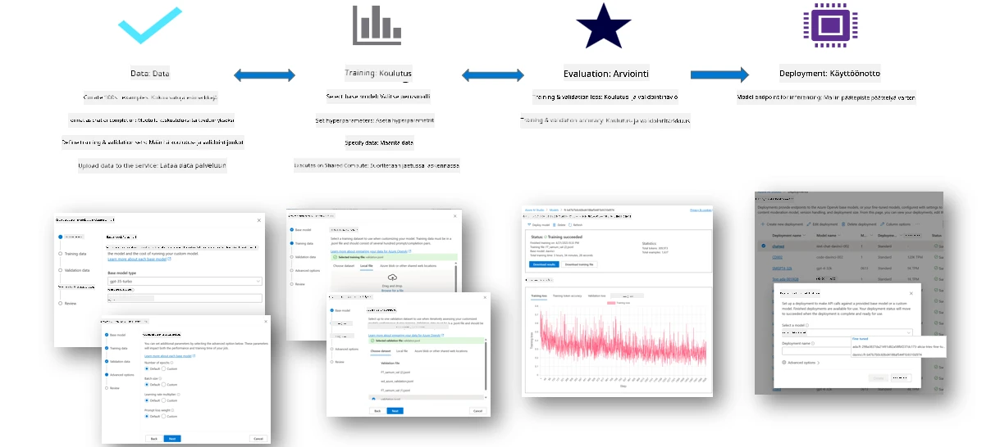

### Luo uusi projekti

1. Kirjaudu sisään [Microsoft Foundryyn](https://ai.azure.com).

2. Valitse **+New project** luodaksesi uuden projektin Microsoft Foundryssa.

    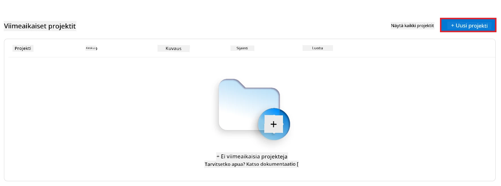

3. Suorita seuraavat toimet:

    - Projektin **Hub name**. Sen tulee olla yksilöllinen arvo.
    - Valitse käytettävä **Hub** (luo uusi tarvittaessa).

    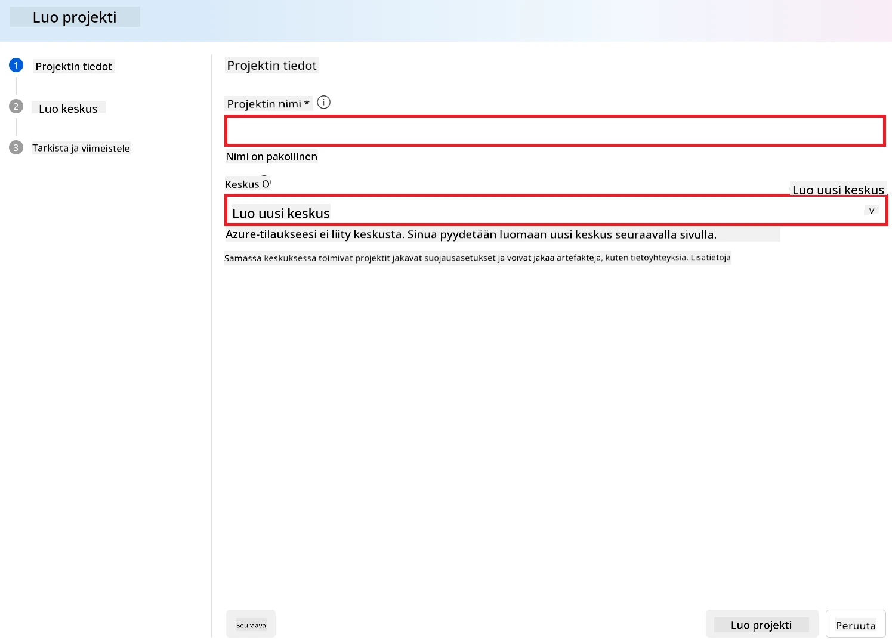

4. Suorita seuraavat toimet uuden hubin luomiseksi:

    - Syötä **Hub name**. Sen tulee olla yksilöllinen arvo.
    - Valitse Azure-tilauksesi (**Subscription**).
    - Valitse käytettävä **Resource group** (luo uusi tarvittaessa).
    - Valitse **Location** eli sijainti.
    - Valitse käytettävä **Connect Azure AI Services** (luo uusi tarvittaessa).
    - Valitse **Connect Azure AI Search** -kohdassa **Skip connecting**.

    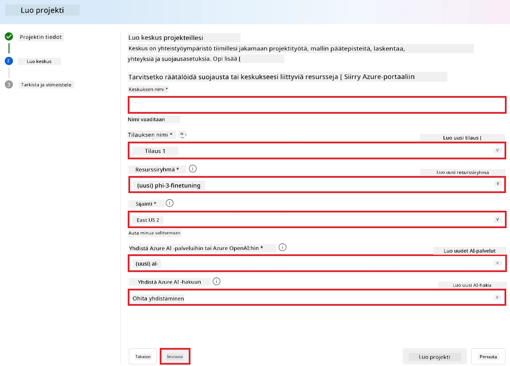

5. Valitse **Next**.
6. Valitse **Create a project**.

### Datan valmistelu

Ennen hienosäätöä kerää tai luo tehtävääsi liittyvä aineisto, kuten chat-ohjeet, kysymys-vastaus -parit tai muu olennainen tekstidata. Siivoa ja esikäsittele tätä dataa poistamalla häiriötekijät, käsittelemällä puuttuvat arvot ja tokenoimalla teksti.

### Hienosäädä Phi-3-mallit Microsoft Foundryssa

> [!NOTE]
> Phi-3 -mallien hienosäätö on tällä hetkellä tuettu sellaisissa projekteissa, jotka sijaitsevat East US 2 -alueella.

1. Valitse vasemman sivupalkin valikosta **Model catalog**.

2. Kirjoita hakupalkkiin *phi-3* ja valitse haluamasi phi-3 -malli.

    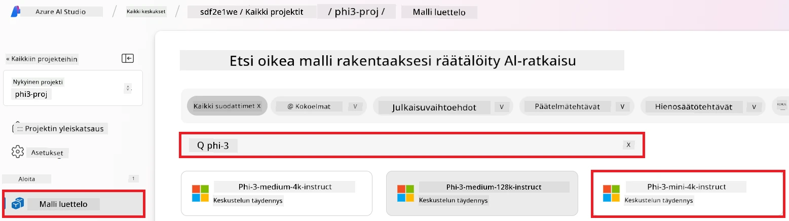

3. Valitse **Fine-tune**.

    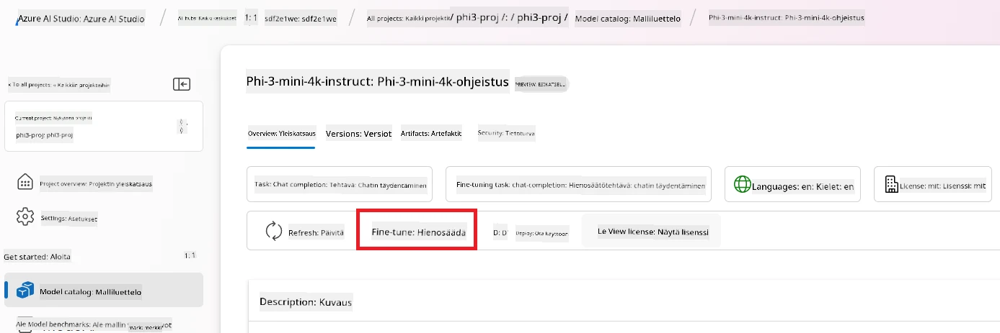

4. Syötä **Fine-tuned model name**.

    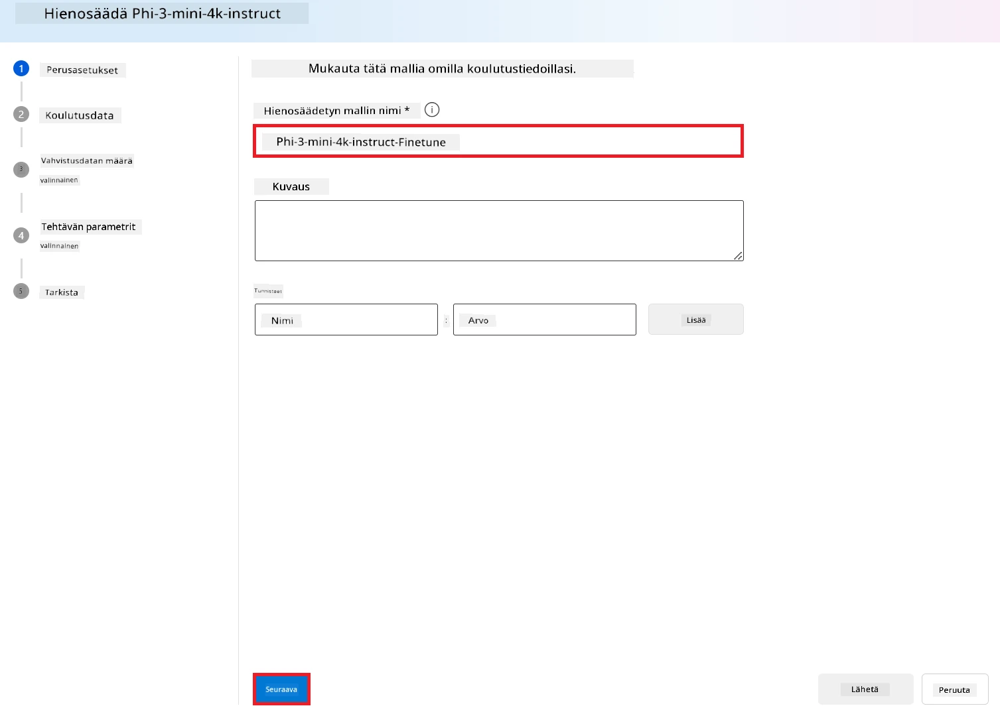

5. Valitse **Next**.

6. Suorita seuraavat toimet:

    - Valitse **task type** kohdaksi **Chat completion**.
    - Valitse käytettävä **Training data**. Voit ladata sen Microsoft Foundryn datasta tai paikalliselta koneeltasi.

    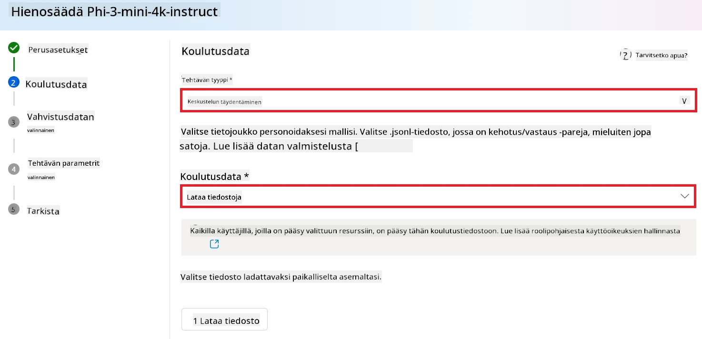

7. Valitse **Next**.

8. Lataa haluamasi **Validation data** tai valitse **Automatic split of training data**.

    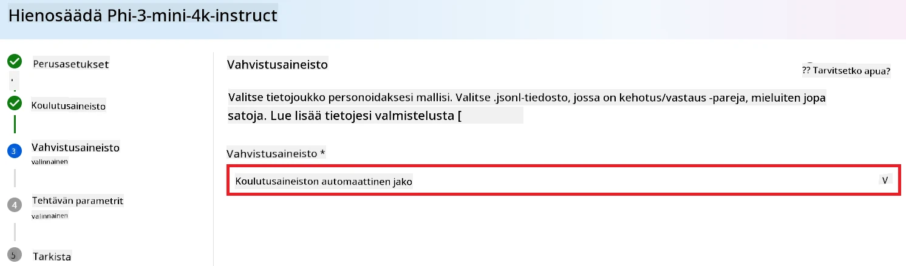

9. Valitse **Next**.

10. Suorita seuraavat toimet:

    - Valitse haluamasi **Batch size multiplier**.
    - Valitse haluamasi **Learning rate**.
    - Valitse haluamasi **Epochs**.

    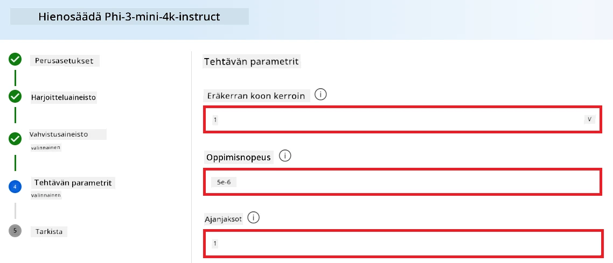

11. Valitse **Submit** aloittaaksesi hienosäätöprosessin.

    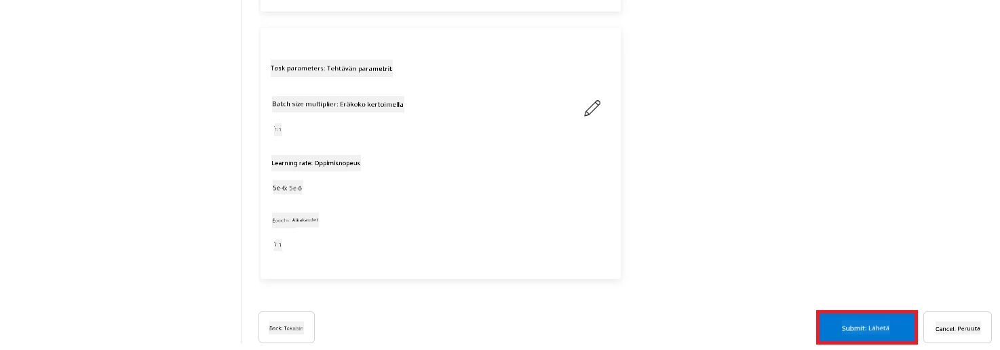

12. Kun mallisi on hienosäädetty, sen tila näkyy **Completed**-merkittynä, kuten alla olevassa kuvassa. Nyt voit ottaa mallin käyttöön ja käyttää sitä omassa sovelluksessasi, leikkikentällä tai prompt flow:ssa. Lisätietoja löytyy kohdasta [Phi-3-pienmallien käyttöönotto Microsoft Foundryn avulla](https://learn.microsoft.com/azure/ai-studio/how-to/deploy-models-phi-3?tabs=phi-3-5&pivots=programming-language-python).

    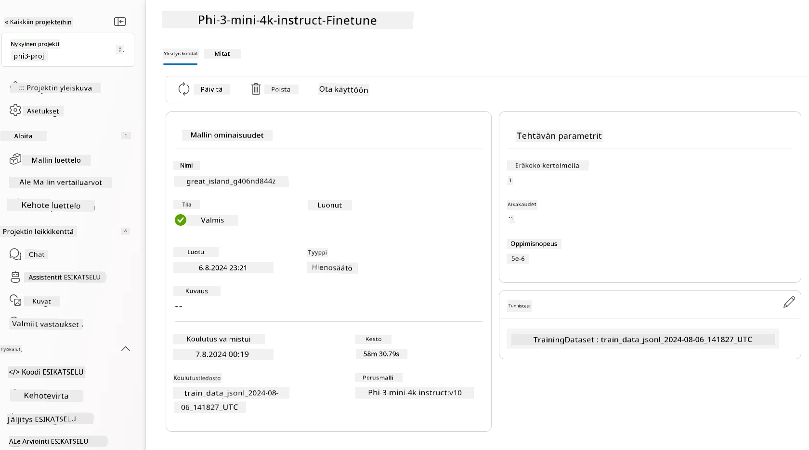

> [!NOTE]
> Lisätietoja Phi-3:n hienosäädöstä löydät osoitteesta [Fine-tune Phi-3 models in Microsoft Foundry](https://learn.microsoft.com/azure/ai-studio/how-to/fine-tune-phi-3?tabs=phi-3-mini).

## Hienosäädettyjen mallien siivous

Voit poistaa hienosäädetyn mallin hienosäätömallilistalta [Microsoft Foundrystä](https://ai.azure.com) tai mallin tiedot -sivulta. Valitse poistettava hienosäädetty malli Fine-tuning-sivulla ja napsauta sitten Poista-painiketta poistaaksesi mallin.

> [!NOTE]
> Et voi poistaa mukautettua mallia, jos sillä on olemassa oleva käyttöönotto. Sinun on ensin poistettava mallin käyttöönotto ennen mukautetun mallin poistamista.

## Kustannukset ja käyttörajat

### Phi-3-mallien hienosäädön kustannukset ja käyttörajat palveluna

Phi-mallit, joita hienosäädetään palveluna, tarjoaa Microsoft ja ne on integroitu Microsoft Foundryyn käyttöä varten. Hinnat löytyvät mallin [käyttöönotosta](https://learn.microsoft.com/azure/ai-studio/how-to/deploy-models-phi-3?tabs=phi-3-5&pivots=programming-language-python) tai hienosäädöstä Käyttöönotto-velhon Hinnoittelu ja käyttöehdot -välilehdeltä.

## Sisällön suodatus

Maksun mukaan käytettävät palveluna käyttöön otetut mallit ovat suojattuja Azure AI Content Safetyn avulla. Reaaliaikaisiin päätepisteisiin otettaessa voit halutessasi kytkeä tämän pois päältä. Azure AI Content Safety -toiminnon ollessa käytössä sekä kehotteet että vastaukset kulkevat luokittelumallien ryhmän läpi, jotka on suunniteltu haitallisen sisällön tunnistamiseen ja estämiseen. Suodatusjärjestelmä tunnistaa ja ryhtyy toimiin tietyissä potentiaalisesti haitallisissa sisällön kategorioissa sekä syötteissä että malleilta tulevissa vastauksissa. Lisätietoja saat osoitteesta [Azure AI Content Safety](https://learn.microsoft.com/azure/ai-studio/concepts/content-filtering).

**Hienosäätöasetukset**

Hyperparametrit: Määrittele hyperparametrit kuten oppimisnopeus, eräkoko ja koulutuksen epoch-määrä.

**Häviöfunktio**

Valitse tehtävään sopiva häviöfunktio (esim. ristiinentropia).

**Optimointialgoritmi**

Valitse optimointimenetelmä (esim. Adam) gradienttipäivityksiin koulutuksen aikana.

**Hienosäätöprosessi**

- Esikoulutetun mallin lataus: Lataa Phi-3 Mini -tarkistuspiste.
- Lisää omia kerroksia: Lisää tehtävänmukaiset kerrokset (esim. luokittelupää chat-ohjeille).

**Mallin koulutus**
Hienosäädä mallia valmistellulla aineistollasi. Seuraa koulutuksen edistymistä ja säädä hyperparametreja tarpeen mukaan.

**Arviointi ja validointi**

Validointiaineisto: Jaa aineisto koulutus- ja validointiosiin.

**Suorituksen arviointi**

Käytä mittareina tarkkuutta, F1-pistettä tai epävarmuutta arvioidaksesi mallin suoriutumista.

## Tallenna hienosäädetty malli

**Tarkistuspiste**
Tallenna hienosäädetyn mallin tarkistuspiste myöhempää käyttöä varten.

## Käyttöönotto

- Ota käyttöön web-palveluna: Ota hienosäädetty mallisi käyttöön Microsoft Foundryn web-palveluna.
- Testaa päätepistettä: Lähetä testikyselyjä käyttöönotetulle päätepisteelle varmistaaksesi toimivuuden.

## Iteroi ja paranna

Iteroi: Jos suorituskyky ei ole tyydyttävää, tee iterointeja muokkaamalla hyperparametreja, lisäämällä dataa tai hienosäätämällä pidemmän ajan.

## Valvo ja hienosäädä

Seuraa jatkuvasti mallin käyttäytymistä ja tee tarvittavia hienosäätöjä.

## Mukauta ja laajenna

Mukautetut tehtävät: Phi-3 Miniä voi hienosäätää monenlaisiin tehtäviin chat-ohjeiden lisäksi. Tutki muita käyttökohteita!
Kokeile: Kokeile eri arkkitehtuureja, kerrosyhdistelmiä ja tekniikoita suorituskyvyn parantamiseksi.

> [!NOTE]
> Hienosäätö on iteratiivinen prosessi. Kokeile, opi ja mukauta malliasi saavuttaaksesi parhaat tulokset juuri sinun tehtävääsi varten!

---

<!-- CO-OP TRANSLATOR DISCLAIMER START -->
**Vastuuvapauslauseke**:  
Tämä asiakirja on käännetty tekoälypohjaisella käännöspalvelulla [Co-op Translator](https://github.com/Azure/co-op-translator). Vaikka pyrimme tarkkuuteen, automatisoiduissa käännöksissä saattaa esiintyä virheitä tai epätarkkuuksia. Alkuperäinen asiakirja sen alkuperäisellä kielellä tulee katsoa viralliseksi lähteeksi. Tärkeissä tiedoissa suositellaan ammattimaista ihmiskäännöstä. Emme ole vastuussa tämän käännöksen käytöstä aiheutuvista väärinymmärryksistä tai virhetulkinnasta.
<!-- CO-OP TRANSLATOR DISCLAIMER END -->