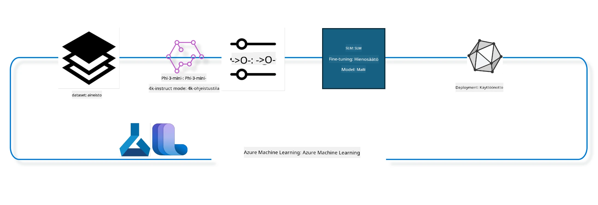

## Kuinka käyttää chat-completion-komponentteja Azure ML:n järjestelmärekisteristä mallin hienosäätöön

Tässä esimerkissä teemme hienosäädön Phi-3-mini-4k-instruct-mallille, jotta se osaa täydentää keskustelun kahden henkilön välillä käyttämällä ultrachat_200k-datasarjaa.



Esimerkki näyttää, miten hienosäätö tehdään Azure ML SDK:lla ja Pythonilla, ja miten hienosäädetty malli otetaan käyttöön online-päätepisteessä reaaliaikaista päättelyä varten.

### Koulutusdata

Käytämme ultrachat_200k-datasarjaa. Tämä on voimakkaasti suodatettu versio UltraChat-datasarjasta, jota käytettiin Zephyr-7B-β -mallin kouluttamiseen, joka on huipputason 7 miljardin parametrin keskustelumalli.

### Malli

Käytämme Phi-3-mini-4k-instruct-mallia näyttääksesi, miten käyttäjä voi hienosäätää mallin chat-completion-tehtävään. Jos avasit tämän muistikirjan tietystä mallikortista, muista korvata mallin tarkka nimi.

### Tehtävät

- Valitse hienosäädettävä malli.
- Valitse ja tutki koulutusdata.
- Määritä hienosäätötyö.
- Suorita hienosäätötyö.
- Tarkastele koulutus- ja arviointimittareita.
- Rekisteröi hienosäädetty malli.
- Ota hienosäädetty malli käyttöön reaaliaikaiseen päättelyyn.
- Siivoa resurssit.

## 1. Esiasetusten määrittäminen

- Asenna riippuvuudet
- Yhdistä AzureML-työtilaan. Lisätietoa on kohdassa SDK-todennuksen määritys. Korvaa alla <WORKSPACE_NAME>, <RESOURCE_GROUP> ja <SUBSCRIPTION_ID>.
- Yhdistä azureml-järjestelmärekisteriin
- Aseta valinnainen kokeilun nimi
- Tarkista tai luo laskentaresurssi.

> [!NOTE]
> Vaatimuksena on yksittäinen GPU-solmu, jossa voi olla useita GPU-kortteja. Esimerkiksi yhdessä Standard_NC24rs_v3-solmussa on 4 NVIDIA V100 GPU:ta, kun taas Standard_NC12s_v3:ssa on 2 NVIDIA V100 GPU:ta. Katso lisätietoja dokumentaatiosta. Solmua kohden asetettujen GPU-korttien lukumäärä määritellään alla parametrissa gpus_per_node. Parametrin oikea asettaminen varmistaa kaikkien solmun GPU:iden käytön. Suositellut GPU-laskenta-SKU:t löytyvät täältä ja täältä.

### Python-kirjastot

Asenna riippuvuudet suorittamalla alla oleva solu. Tämä ei ole valinnainen vaihe uudessa ympäristössä.

```bash
pip install azure-ai-ml
pip install azure-identity
pip install datasets==2.9.0
pip install mlflow
pip install azureml-mlflow
```

### Vuorovaikutus Azure ML:n kanssa

1. Tämä Python-skripti kommunikoi Azure Machine Learning (Azure ML) -palvelun kanssa. Seuraavassa on erittely siitä, mitä se tekee:

    - Se tuo tarvittavat moduulit paketeista azure.ai.ml, azure.identity ja azure.ai.ml.entities. Lisäksi tuo time-moduulin.

    - Se yrittää todentaa DefaultAzureCredential()-menetelmällä, joka tarjoaa yksinkertaistetun todentumiskokemuksen sovellusten nopeaan kehittämiseen Azure-pilvessä. Jos tämä epäonnistuu, se käyttää varatilanteessa InteractiveBrowserCredential()-menetelmää, joka tarjoaa vuorovaikutteisen kirjautumiskehotteen.

    - Sen jälkeen se yrittää luoda MLClient-instanssin from_config-menetelmällä, joka lukee konfiguraation oletustiedostosta (config.json). Jos tämä epäonnistuu, se luo MLClient-instanssin manuaalisesti toimittamalla subscription_id, resource_group_name ja workspace_name.

    - Se luo toisen MLClient-instanssin tällä kertaa Azure ML -rekisterille nimeltä "azureml". Tämä rekisteri on paikka, johon mallit, hienosäätöputket ja ympäristöt tallennetaan.

    - Se asettaa experiment_name-arvoksi "chat_completion_Phi-3-mini-4k-instruct".

    - Se luo yksilöllisen aikaleiman muuntamalla nykyisen ajan (sekunteina epochista, liukulukuna) kokonaisluvuksi ja sitten merkkijonoksi. Tätä aikaleimaa voi käyttää ainutlaatuisten nimien ja versioiden luomiseen.

    ```python
    # Tuo tarvittavat moduulit Azure ML:stä ja Azure Identity -kirjastosta
    from azure.ai.ml import MLClient
    from azure.identity import (
        DefaultAzureCredential,
        InteractiveBrowserCredential,
    )
    from azure.ai.ml.entities import AmlCompute
    import time  # Tuo time-moduuli
    
    # Yritä todennusta DefaultAzureCredentialilla
    try:
        credential = DefaultAzureCredential()
        credential.get_token("https://management.azure.com/.default")
    except Exception as ex:  # Jos DefaultAzureCredential epäonnistuu, käytä InteractiveBrowserCredentialia
        credential = InteractiveBrowserCredential()
    
    # Yritä luoda MLClient-instanssi käyttäen oletusmääritystiedostoa
    try:
        workspace_ml_client = MLClient.from_config(credential=credential)
    except:  # Jos se epäonnistuu, luo MLClient-instanssi antamalla tiedot manuaalisesti
        workspace_ml_client = MLClient(
            credential,
            subscription_id="<SUBSCRIPTION_ID>",
            resource_group_name="<RESOURCE_GROUP>",
            workspace_name="<WORKSPACE_NAME>",
        )
    
    # Luo toinen MLClient-instanssi Azure ML -rekisterille nimeltä "azureml"
    # Tässä rekisterissä säilytetään mallit, hienosäätöputket ja ympäristöt
    registry_ml_client = MLClient(credential, registry_name="azureml")
    
    # Aseta kokeilun nimi
    experiment_name = "chat_completion_Phi-3-mini-4k-instruct"
    
    # Luo uniikki aikaleima, jota voidaan käyttää nimissä ja versioissa, jotka tarvitsevat olla yksilöllisiä
    timestamp = str(int(time.time()))
    ```

## 2. Valitse perustamalli hienosäätöä varten

1. Phi-3-mini-4k-instruct on 3,8 miljardin parametrin kevyt, huipputason avoin malli, joka on rakennettu Phi-2:n koulutusdatojen perusteella. Malli kuuluu Phi-3-malliperheen jäseneksi, ja Mini-versiolla on kaksi varianttia: 4K ja 128K, jotka kuvaavat tuettavaa kontekstipituutta (tokeneina). Malli pitää hienosäätää tiettyyn käyttötarkoitukseen, jotta sitä voi käyttää. Voit selata näitä malleja AzureML Studion Mallikatalogissa suodattamalla chat-completion-tehtävän mukaan. Tässä esimerkissä käytämme Phi-3-mini-4k-instruct-mallia. Jos avasit tämän muistikirjan eri mallille, vaihda mallin nimi ja versio vastaavasti.

> [!NOTE]
> mallin id-ominaisuus. Tätä käytetään syötteenä hienosäätötyöhön. Se on myös näkyvissä Mallin tiedot -sivun Asset ID -kentässä AzureML Studion Mallikatalogissa.

2. Tämä Python-skripti kommunikoi Azure Machine Learning (Azure ML) -palvelun kanssa. Seuraavassa on erittely siitä, mitä se tekee:

    - Se asettaa muuttujan model_name arvoksi "Phi-3-mini-4k-instruct".

    - Se käyttää registry_ml_client-olion models-ominaisuuden get-metodia hakeakseen mallin uusimman version Azure ML -rekisteristä annetulla nimellä. Get-metodi saa kaksi argumenttia: mallin nimen ja tunnisteen, joka ilmaisee, että haetaan viimeisin versio.

    - Se tulostaa konsoliin viestin, jossa kerrotaan käytettävän mallin nimi, versio ja id. Stringin format-metodia käytetään lisäämään nämä arvot viestiin. Mallin nimi, versio ja id ovat foundation_model-olion ominaisuuksia.

    ```python
    # Aseta mallin nimi
    model_name = "Phi-3-mini-4k-instruct"
    
    # Hae uusin versio mallista Azure ML -rekisteristä
    foundation_model = registry_ml_client.models.get(model_name, label="latest")
    
    # Tulosta mallin nimi, versio ja id
    # Tämä tieto on hyödyllinen seurannassa ja virheenkorjauksessa
    print(
        "\n\nUsing model name: {0}, version: {1}, id: {2} for fine tuning".format(
            foundation_model.name, foundation_model.version, foundation_model.id
        )
    )
    ```

## 3. Luo laskentaresurssi työn käyttöön

Hienosäätötyö toimii AINOASTAAN GPU-laskennan kanssa. Laskentaresurssin koko riippuu mallin koosta, ja usein oikean kokoisen laskennan valinta on haastavaa. Tässä solussa opastamme käyttäjää valitsemaan sopivan laskentaresurssin työlle.

> [!NOTE]
> Alla listatut laskentatyypit toimivat optimoidulla konfiguraatiolla. Muutokset konfiguraatioon voivat aiheuttaa Cuda Out Of Memory -virheen. Tällaisissa tapauksissa kokeile päivittää laskentaresurssia suuremmaksi.

> [!NOTE]
> Valitessasi compute_cluster_size, varmista että laskentaresurssi on saatavilla omassa resurssiryhmässäsi. Jos tietty laskenta ei ole saatavilla, voit pyytää käyttöoikeuksia kyseisiin resursseihin.

### Mallin tarkistaminen hienosäädön tuen varalta

1. Tämä Python-skripti kommunikoi Azure Machine Learning (Azure ML) -mallin kanssa. Seuraavassa on erittely siitä, mitä se tekee:

    - Se tuo ast-moduulin, joka tarjoaa funktioita Pythonin abstraktin syntaksipuun käsittelyyn.

    - Se tarkistaa, onko foundation_model-oliolla Azure ML -mallina tagi finetune_compute_allow_list. Tagit Azure ML:ssa ovat avain-arvo -pareja, joita voi käyttää mallien suodattamiseen ja lajitteluun.

    - Jos finetune_compute_allow_list-tagi löytyy, se käyttää ast.literal_eval-funktiota turvallisesti tulkitakseen tagin arvon (merkkijono) Python-listaksi. Tämä lista annetaan muuttujalle computes_allow_list. Sen jälkeen tulostetaan viesti, että laskentaresurssi tulisi luoda tästä listasta.

    - Jos tagi ei ole olemassa, asettaa computes_allow_list-arvoksi None ja tulostaa viestin, että tagi ei kuulu mallin tageihin.

    - Yhteenvetona skripti tarkistaa mallin metatiedoista tietyn tagin, muuntaa tagin arvon listaksi jos se löytyy, ja antaa käyttäjälle palautetta.

    ```python
    # Tuo ast-moduuli, joka tarjoaa toimintoja Pythonin abstraktin syntaksipuun käsittelyyn
    import ast
    
    # Tarkista, onko 'finetune_compute_allow_list' -tunniste mallin tunnisteissa
    if "finetune_compute_allow_list" in foundation_model.tags:
        # Jos tunniste on läsnä, käytä ast.literal_eval-funktiota turvallisesti jäsentämään tunnisteen arvo (merkkijono) Python-listaksi
        computes_allow_list = ast.literal_eval(
            foundation_model.tags["finetune_compute_allow_list"]
        )  # Muunna merkkijono Python-listaksi
        # Tulosta viesti, joka ilmoittaa, että laskenta tulisi luoda listasta
        print(f"Please create a compute from the above list - {computes_allow_list}")
    else:
        # Jos tunnistetta ei ole, aseta computes_allow_list arvoksi None
        computes_allow_list = None
        # Tulosta viesti, joka ilmoittaa, että 'finetune_compute_allow_list' -tunniste ei ole osa mallin tunnisteita
        print("`finetune_compute_allow_list` is not part of model tags")
    ```

### Laskenta-instanssin tarkistus

1. Tämä Python-skripti kommunikoi Azure Machine Learning (Azure ML) -palvelun kanssa ja suorittaa tarkistuksia laskenta-instanssille. Seuraavassa on erittely toiminnasta:

    - Se yrittää hakea compute_cluster-muuttujan nimeä vastaavan laskenta-instanssin Azure ML -työtilasta. Jos instanssin provisioning-tila on "failed", se nostaa ValueErrorin.

    - Se tarkistaa onko computes_allow_list ei-None. Jos ei ole, se muuntaa sallitut laskentakoot pieniksi kirjaimiksi ja tarkistaa, löytyykö nykyisen instanssin koko listalta. Jos ei löydy, nostaa ValueErrorin.

    - Jos computes_allow_list on None, se tarkistaa onko instanssin koko epäsopivien GPU-virtuaalikoneiden listassa. Jos on, nostaa ValueErrorin.

    - Se hakee kaikki työtilan lasketut koot listana. Iteroi niiden läpi ja etsii nykyisen instanssin yksikkökokoa vastaavan koodin. Jos löytyy, hakee kyseisen kokoluokan GPU-määrän ja asettaa gpu_count_found-arvon Trueksi.

    - Jos gpu_count_found on True, tulostaa instanssin GPU-määrän. Muuten nostaa ValueErrorin.

    - Yhteenvetona skripti suorittaa useita tarkistuksia Azure ML -työtilan laskenta-instanssille liittyen sen tilaan, kokoon sallittujen ja estettyjen listojen mukaan sekä GPU-määrään.

    ```python
    # Tulosta poikkeusviesti
    print(e)
    # Nosta ValueError, jos laskentakoko ei ole käytettävissä työtilassa
    raise ValueError(
        f"WARNING! Compute size {compute_cluster_size} not available in workspace"
    )
    
    # Hae laskenta-instanssi Azure ML -työtilasta
    compute = workspace_ml_client.compute.get(compute_cluster)
    # Tarkista, onko laskenta-instanssin provisiointitila "failed"
    if compute.provisioning_state.lower() == "failed":
        # Nosta ValueError, jos provisiointitila on "failed"
        raise ValueError(
            f"Provisioning failed, Compute '{compute_cluster}' is in failed state. "
            f"please try creating a different compute"
        )
    
    # Tarkista, että computes_allow_list ei ole None
    if computes_allow_list is not None:
        # Muunna kaikki computes_allow_list:n laskentakoot pieniksi kirjaimiksi
        computes_allow_list_lower_case = [x.lower() for x in computes_allow_list]
        # Tarkista, onko laskenta-instanssin koko computes_allow_list_lower_case -listalla
        if compute.size.lower() not in computes_allow_list_lower_case:
            # Nosta ValueError, jos laskenta-instanssin koko ei ole computes_allow_list_lower_case -listalla
            raise ValueError(
                f"VM size {compute.size} is not in the allow-listed computes for finetuning"
            )
    else:
        # Määrittele lista tukemattomista GPU-VM-kokoista
        unsupported_gpu_vm_list = [
            "standard_nc6",
            "standard_nc12",
            "standard_nc24",
            "standard_nc24r",
        ]
        # Tarkista, onko laskenta-instanssin koko unsupported_gpu_vm_list -listalla
        if compute.size.lower() in unsupported_gpu_vm_list:
            # Nosta ValueError, jos laskenta-instanssin koko on unsupported_gpu_vm_list -listalla
            raise ValueError(
                f"VM size {compute.size} is currently not supported for finetuning"
            )
    
    # Alusta lippu, jolla tarkistetaan, onko laskenta-instanssin GPU-määrä löydetty
    gpu_count_found = False
    # Hae lista kaikista työtilassa saatavilla olevista laskentakokoista
    workspace_compute_sku_list = workspace_ml_client.compute.list_sizes()
    available_sku_sizes = []
    # Käy läpi saatavilla olevien laskentakokojen lista
    for compute_sku in workspace_compute_sku_list:
        available_sku_sizes.append(compute_sku.name)
        # Tarkista, vastaako laskentakoon nimi laskenta-instanssin kokoa
        if compute_sku.name.lower() == compute.size.lower():
            # Jos vastaa, hae kyseisen laskentakoon GPU-määrä ja aseta gpu_count_found arvoksi True
            gpus_per_node = compute_sku.gpus
            gpu_count_found = True
    # Jos gpu_count_found on True, tulosta laskenta-instanssin GPU-määrä
    if gpu_count_found:
        print(f"Number of GPU's in compute {compute.size}: {gpus_per_node}")
    else:
        # Jos gpu_count_found on False, nosta ValueError
        raise ValueError(
            f"Number of GPU's in compute {compute.size} not found. Available skus are: {available_sku_sizes}."
            f"This should not happen. Please check the selected compute cluster: {compute_cluster} and try again."
        )
    ```

## 4. Valitse datasarja mallin hienosäätöön

1. Käytämme ultrachat_200k-datasettiä. Datasarjalla on neljä osaa, jotka soveltuvat valvottuun hienosäätöön (Supervised fine-tuning, sft). Generointijärjestys (gen). Kunkin osan näytteiden määrä on seuraava:

    ```bash
    train_sft test_sft  train_gen  test_gen
    207865  23110  256032  28304
    ```

1. Seuraavat solut näyttävät perustason datan valmistelun hienosäätöä varten:

### Visualisoi joitakin datarivejä

Haluamme tämän esimerkin ajettavan nopeasti, joten tallennamme train_sft- ja test_sft-tiedostot, jotka sisältävät 5 % jo rajatuista riveistä. Tämä tarkoittaa, että hienosäädetty malli ei saavuta yhtä suurta tarkkuutta, eikä sitä näin ollen tule käyttää tosielämän sovelluksiin.
download-dataset.py -skriptiä käytetään ultrachat_200k-datasetin lataamiseen ja sen muuntamiseen hienosäätöputken komponentin käyttämään muotoon. Koska datasetti on suuri, meillä on tässä vain osa siitä.

1. Alla oleva skripti lataa vain 5 % datasta. Prosenttiosuutta voi nostaa muuttamalla parameteria dataset_split_pc halutuksi.

> [!NOTE]
> Joillakin kielimalleilla on erilaiset kielikoodit, joten datasarjan sarakenimien tulee vastata näitä.

1. Tässä on esimerkki, miltä datan tulisi näyttää
Chat-completion-datasetti tallennetaan parquet-muodossa, jossa jokainen rivi noudattaa seuraavaa rakennetta:

    - Tämä on JSON (JavaScript Object Notation) -dokumentti, joka on suosittu tiedonvaihtoformaatti. Se ei ole suoritettavaa koodia, vaan tapa tallentaa ja siirtää tietoja. Rakenteen erittely:

    - "prompt": Avain, jonka arvo on merkkijono, joka kuvaa tehtävää tai kysymystä tekoälyavustajalle.

    - "messages": Avain, jonka arvo on olioiden lista. Jokainen olio kuvaa viestiä käyttäjän ja tekoälyavustajan keskustelussa. Jokaisella viestioliolla on kaksi avainta:

    - "content": Avain, jonka arvo on merkkijono, joka sisältää viestin tekstin.
    - "role": Avain, jonka arvo on merkkijono, joka kuvaa viestin lähettäjän roolia. Se voi olla joko "user" tai "assistant".
    - "prompt_id": Avain, jonka arvo on merkkijono, joka yksilöi pyynnön ID:n.

1. Tässä tietyssä JSON-dokumentissa keskustellaan siitä, kuinka käyttäjä pyytää tekoälyavustajaa luomaan päähenkilön dystopiselle tarinalle. Avustaja vastaa, minkä jälkeen käyttäjä pyytää lisätietoja. Avustaja suostuu antamaan lisätietoja. Koko keskustelu liittyy tiettyyn prompt_id:hen.

    ```python
    {
        // The task or question posed to an AI assistant
        "prompt": "Create a fully-developed protagonist who is challenged to survive within a dystopian society under the rule of a tyrant. ...",
        
        // An array of objects, each representing a message in a conversation between a user and an AI assistant
        "messages":[
            {
                // The content of the user's message
                "content": "Create a fully-developed protagonist who is challenged to survive within a dystopian society under the rule of a tyrant. ...",
                // The role of the entity that sent the message
                "role": "user"
            },
            {
                // The content of the assistant's message
                "content": "Name: Ava\n\n Ava was just 16 years old when the world as she knew it came crashing down. The government had collapsed, leaving behind a chaotic and lawless society. ...",
                // The role of the entity that sent the message
                "role": "assistant"
            },
            {
                // The content of the user's message
                "content": "Wow, Ava's story is so intense and inspiring! Can you provide me with more details.  ...",
                // The role of the entity that sent the message
                "role": "user"
            }, 
            {
                // The content of the assistant's message
                "content": "Certainly! ....",
                // The role of the entity that sent the message
                "role": "assistant"
            }
        ],
        
        // A unique identifier for the prompt
        "prompt_id": "d938b65dfe31f05f80eb8572964c6673eddbd68eff3db6bd234d7f1e3b86c2af"
    }
    ```

### Datan lataus

1. Tämä Python-skripti käyttää download-dataset.py -apuskirjoitusta datasarjan lataamiseen. Seuraavassa erittely siitä, mitä se tekee:

    - Se tuo os-moduulin, joka tarjoaa käyttöjärjestelmäriippuvaisia toimintoja.

    - Se käyttää os.system-funktiota ajaakseen download-dataset.py-skriptin kuorissa tiettyjen komentoriviparametrien kanssa. Parametrit määrittelevät ladattavan datasetin (HuggingFaceH4/ultrachat_200k), tallennushakemiston (ultrachat_200k_dataset) ja datasarjan osan prosentteina (5). os.system palauttaa komennon poistumistilan, joka tallennetaan muuttujaan exit_status.

    - Se tarkistaa, onko exit_status eri kuin 0. Unix-tyyppisissä järjestelmissä 0 tarkoittaa onnistumista, muut arvot virhettä. Jos tila ei ole 0, se nostaa poikkeuksen, joka kertoo tietojen latausvirheestä.

    - Yhteenvetona tämä skripti lataa datasarjan apuskirjoituksella ja nostaa virheen, jos komento epäonnistuu.

    ```python
    # Tuo os-moduuli, joka tarjoaa tavan käyttää käyttöjärjestelmäriippuvaista toiminnallisuutta
    import os
    
    # Käytä os.system-funktiota suorittaaksesi download-dataset.py-skriptin komentorivillä tietyillä komennoilla
    # Argumentit määrittävät ladattavan datan joukon (HuggingFaceH4/ultrachat_200k), hakemiston johon se ladataan (ultrachat_200k_dataset), ja osan datasta jaettavaksi (5)
    # os.system-funktio palauttaa suorittamansa komennon poistumistilanteen; tämä tila tallennetaan muuttujaan exit_status
    exit_status = os.system(
        "python ./download-dataset.py --dataset HuggingFaceH4/ultrachat_200k --download_dir ultrachat_200k_dataset --dataset_split_pc 5"
    )
    
    # Tarkista onko exit_status eri kuin 0
    # Unix-tyyppisissä käyttöjärjestelmissä poistumistila 0 tarkoittaa yleensä, että komento onnistui, kun taas mikä tahansa muu luku tarkoittaa virhettä
    # Jos exit_status ei ole 0, nosta Exception-virhe viestillä, joka kertoo, että datan latauksessa oli virhe
    if exit_status != 0:
        raise Exception("Error downloading dataset")
    ```

### Datan lataus DataFrameen

1. Tämä Python-skripti lataa JSON Lines -tiedoston pandas DataFrameen ja näyttää ensimmäiset 5 riviä. Seuraavassa erittely siitä, mitä se tekee:

    - Se tuo pandas-kirjaston, joka on tehokas datan käsittely- ja analysointikirjasto.

    - Se asettaa pandas:n näyttövaihtoehtoihin sarakkeiden maksimileveydeksi 0. Tämä tarkoittaa, että jokaisen sarakkeen koko teksti näytetään kokonaisuudessaan, ilman leikkauksia, kun DataFrame tulostetaan.
    - Se käyttää pd.read_json-funktiota ladatakseen train_sft.jsonl-tiedoston ultrachat_200k_dataset-kansiosta DataFrameen. lines=True-argumentti osoittaa, että tiedosto on JSON Lines -muodossa, jossa kukin rivi on erillinen JSON-objekti.

    - Se käyttää head-metodia näyttääksesi DataFramen ensimmäiset 5 riviä. Jos DataFrame sisältää vähemmän kuin 5 riviä, se näyttää kaikki.

    - Yhteenvetona tämä skripti lataa JSON Lines -tiedoston DataFrameen ja näyttää ensimmäiset 5 riviä kokonaisine saraketeksteineen.
    
    ```python
    # Tuo pandas-kirjasto, joka on tehokas tietojen käsittely- ja analysointikirjasto
    import pandas as pd
    
    # Aseta pandas-kirjaston näyttöasetusten maksimi sarakeleveydeksi 0
    # Tämä tarkoittaa, että kunkin sarakkeen koko teksti näytetään katkaisematta, kun DataFrame tulostetaan
    pd.set_option("display.max_colwidth", 0)
    
    # Käytä pd.read_json-funktiota ladataksesi train_sft.jsonl-tiedosto ultrachat_200k_dataset-kansiosta DataFrameen
    # lines=True -argumentti ilmaisee, että tiedosto on JSON Lines -muodossa, jossa kukin rivi on oma JSON-objekti
    df = pd.read_json("./ultrachat_200k_dataset/train_sft.jsonl", lines=True)
    
    # Käytä head-metodia näyttääksesi DataFramen ensimmäiset 5 riviä
    # Jos DataFramessa on vähemmän kuin 5 riviä, se näyttää kaikki ne
    df.head()
    ```

## 5. Lähetä hienosäätötyö käyttämällä mallia ja dataa syötteinä

Luo työ, joka käyttää chat-completion-putkiprojektin komponenttia. Opi lisää kaikista hienosäädön tukemista parametreista.

### Määrittele hienosäätöparametrit

1. Hienosäätöparametrit voidaan jakaa kahteen kategoriaan – koulutusparametrit ja optimointiparametrit

1. Koulutusparametrit määrittelevät koulutuksen osa-alueet, kuten -

    - Käytettävä optimointimenetelmä, ajastin
    - Hienosäädön optimointiin käytettävä mittari
    - Koulutusvaiheiden määrä, eräkoko ja niin edelleen
    - Optimointiparametrit auttavat optimoimaan GPU-muistia ja hyödyntämään laskentaresursseja tehokkaasti.

1. Alla on joitain tämän kategorian parametreja. Optimointiparametrit vaihtelevat mallikohtaisesti ja ne toimitetaan mallin mukana käsittelemään näitä vaihteluita.

    - Ota käyttöön deepspeed ja LoRA
    - Ota käyttöön sekatarkkuuskoulutus
    - Ota käyttöön monisolmukoulutus

> [!NOTE]
> Ohjattu hienosäätö saattaa johtaa kohteen vääristymiseen tai katastrofaaliseen unohtamiseen. Suosittelemme tarkistamaan tämän ongelman ja suorittamaan kohdistusvaiheen hienosäädön jälkeen.

### Hienosäätöparametrit

1. Tämä Python-skripti asettaa parametreja koneoppimismallin hienosäätöön. Tässä on erittely, mitä se tekee:

    - Se asettaa oletuskoulutusparametrit, kuten koulutus-epookkien määrän, koulutus- ja arviointieräkoot, oppimisnopeuden ja oppimisnopeuden ajastimen tyypin.

    - Se asettaa oletusoptimointiparametrit, kuten käytetäänkö Layer-wise Relevance Propagation (LoRa) ja DeepSpeed, sekä DeepSpeed-vaiheen.

    - Se yhdistää koulutus- ja optimointiparametrit yhdeksi sanakirjaksi nimeltä finetune_parameters.

    - Se tarkistaa, sisältääkö foundation_model mallikohtaisia oletusparametreja. Jos sisältää, skripti tulostaa varoitusviestin ja päivittää finetune_parameters-sanakirjan mallikohtaisilla oletusarvoilla. ast.literal_eval-funktiota käytetään mallikohtaisten oletusten muuntamiseen merkkijonosta Python-sanakirjaksi.

    - Se tulostaa lopullisen hienosäätöparametrien joukon, jota käytetään suorituksessa.

    - Yhteenvetona tämä skripti määrittelee ja näyttää hienosäätöparametrit koneoppimismallille, mahdollistaa oletusparametrien korvaamisen mallikohtaisilla.

    ```python
    # Aseta oletusarvoiset koulutusparametrit, kuten koulutusepokkien määrä, eräkoot koulutusta ja arviointia varten, oppimisnopeus ja oppimisnopeuden aikataulun tyyppi
    training_parameters = dict(
        num_train_epochs=3,
        per_device_train_batch_size=1,
        per_device_eval_batch_size=1,
        learning_rate=5e-6,
        lr_scheduler_type="cosine",
    )
    
    # Aseta oletusarvoiset optimointiparametrit, kuten käytetäänkö Layer-wise Relevance Propagation (LoRa) ja DeepSpeed, sekä DeepSpeed-vaihe
    optimization_parameters = dict(
        apply_lora="true",
        apply_deepspeed="true",
        deepspeed_stage=2,
    )
    
    # Yhdistä koulutus- ja optimointiparametrit yhdeksi sanakirjaksi nimeltä finetune_parameters
    finetune_parameters = {**training_parameters, **optimization_parameters}
    
    # Tarkista, onko perustamallissa mitään mallikohtaisia oletusparametreja
    # Jos on, tulosta varoitusviesti ja päivitä finetune_parameters-sanakirjaa näillä mallikohtaisilla oletusasetuksilla
    # ast.literal_eval-funktiota käytetään muuntamaan mallikohtaiset oletukset merkkijonosta Python-sanakirjaksi
    if "model_specific_defaults" in foundation_model.tags:
        print("Warning! Model specific defaults exist. The defaults could be overridden.")
        finetune_parameters.update(
            ast.literal_eval(  # muunna merkkijono Python-sanakirjaksi
                foundation_model.tags["model_specific_defaults"]
            )
        )
    
    # Tulosta lopullinen hienosäätöparametrien joukko, jota käytetään suorituksessa
    print(
        f"The following finetune parameters are going to be set for the run: {finetune_parameters}"
    )
    ```

### Koulutusputki

1. Tämä Python-skripti määrittelee funktion, joka luo näyttönimen koneoppimisen koulutusputkelle, ja kutsuu sitten tätä funktiota näyttönimen luomiseen ja tulostamiseen. Tässä on erittely, mitä se tekee:

1. get_pipeline_display_name-funktio määritellään. Tämä funktio generoi näyttönimen koulutusputkeen liittyvien parametrien perusteella.

1. Funktion sisällä se laskee kokonais-eräkoon kertomalla jokaisen laitteen eräkoon, gradienttien kassapäivitysvaiheiden määrän, GPU:iden määrän solmua kohti ja hienosäätöön käytettyjen solmujen määrän.

1. Se hakee muita parametreja, kuten oppimisnopeuden ajastimen tyyppi, onko DeepSpeed käytössä, DeepSpeed-vaihe, käytetäänkö Layer-wise Relevance Propagationia (LoRa), säilytettävien mallin tarkistuspisteiden enimmäismäärä ja maksimiketjun pituus.

1. Se rakentaa merkkijonon, joka sisältää kaikki nämä parametrit yhdistettynä yhdysmerkeillä. Jos DeepSpeed tai LoRa on käytössä, merkkijono sisältää "ds" ja DeepSpeed-vaiheen tai "lora". Muuten se sisältää "nods" tai "nolora".

1. Funktio palauttaa tämän merkkijonon, joka toimii koulutusputken näyttönimenä.

1. Funktion määrittelyn jälkeen sitä kutsutaan näyttönimen luomiseksi ja tämä nimi tulostetaan.

1. Yhteenvetona tämä skripti generoi näyttönimen koneoppimisen koulutusputkelle eri parametrien perusteella ja tulostaa sen.

    ```python
    # Määritä funktio koulutusputken näyttönimen luomiseksi
    def get_pipeline_display_name():
        # Laske kokonaisbatchkoko kertomalla laitteen peruseräkoon, gradienttien akkumulaatiovaiheiden lukumäärän, GPU:iden lukumäärän solmua kohden ja hienosäätöön käytettyjen solmujen lukumäärän
        batch_size = (
            int(finetune_parameters.get("per_device_train_batch_size", 1))
            * int(finetune_parameters.get("gradient_accumulation_steps", 1))
            * int(gpus_per_node)
            * int(finetune_parameters.get("num_nodes_finetune", 1))
        )
        # Hae oppimisnopeuden ajoittimen tyyppi
        scheduler = finetune_parameters.get("lr_scheduler_type", "linear")
        # Hae, onko DeepSpeed käytössä
        deepspeed = finetune_parameters.get("apply_deepspeed", "false")
        # Hae DeepSpeed-vaihe
        ds_stage = finetune_parameters.get("deepspeed_stage", "2")
        # Jos DeepSpeed on käytössä, sisällytä näyttönimeen "ds" ja DeepSpeed-vaihe; jos ei, sisällytä "nods"
        if deepspeed == "true":
            ds_string = f"ds{ds_stage}"
        else:
            ds_string = "nods"
        # Hae, onko kerroskohtainen merkitysten levittäminen (LoRa) käytössä
        lora = finetune_parameters.get("apply_lora", "false")
        # Jos LoRa on käytössä, sisällytä näyttönimeen "lora"; jos ei, sisällytä "nolora"
        if lora == "true":
            lora_string = "lora"
        else:
            lora_string = "nolora"
        # Hae raja mallin tarkistuspisteiden lukumäärälle
        save_limit = finetune_parameters.get("save_total_limit", -1)
        # Hae maksimisekvenssin pituus
        seq_len = finetune_parameters.get("max_seq_length", -1)
        # Rakenna näyttönimi yhdistämällä kaikki nämä parametrit, erotettuna väliviivalla
        return (
            model_name
            + "-"
            + "ultrachat"
            + "-"
            + f"bs{batch_size}"
            + "-"
            + f"{scheduler}"
            + "-"
            + ds_string
            + "-"
            + lora_string
            + f"-save_limit{save_limit}"
            + f"-seqlen{seq_len}"
        )
    
    # Kutsu funktiota näyttönimen luomiseksi
    pipeline_display_name = get_pipeline_display_name()
    # Tulosta näyttönimi
    print(f"Display name used for the run: {pipeline_display_name}")
    ```

### Putken määrittely

Tämä Python-skripti määrittelee ja konfiguroi koneoppimisputken käyttäen Azure Machine Learning SDK:ta. Tässä on erittely, mitä se tekee:

1. Se tuo tarvittavat moduulit Azure AI ML SDK:sta.

1. Se hakee "chat_completion_pipeline" -nimisen putkikomponentin rekisteristä.

1. Se määrittelee putkityön käyttämällä `@pipeline`-koristetta ja funktiota `create_pipeline`. Putken nimeksi asetetaan `pipeline_display_name`.

1. `create_pipeline`-funktion sisällä se alustaa haetun putkikomponentin erilaisilla parametreilla, mukaan lukien mallin polku, laskentaklustereita eri vaiheisiin, koulutus- ja testidatasarjojen splitit, hienosäätöön käytettävien GPU:iden määrä ja muut hienosäätöparametrit.

1. Se yhdistää hienosäätötyön tuloksen putkityön tulokseen, jotta hienosäädetty malli voidaan helposti rekisteröidä, mikä on tarpeen mallin ottamiseksi käyttöön online- tai batch-päätepisteissä.

1. Se luo putki-instanssin kutsumalla `create_pipeline`-funktiota.

1. Se asettaa putken `force_rerun`-asetukseksi `True`, mikä tarkoittaa, että aikaisempien töiden välimuistissa olevia tuloksia ei käytetä.

1. Se asettaa putken `continue_on_step_failure`-asetukseksi `False`, eli putki pysähtyy, jos jokin vaihe epäonnistuu.

1. Yhteenvetona tämä skripti määrittelee ja konfiguroi koneoppimisputken chat completion -tehtävään käyttäen Azure Machine Learning SDK:ta.

    ```python
    # Tuo tarvittavat moduulit Azure AI ML SDK:sta
    from azure.ai.ml.dsl import pipeline
    from azure.ai.ml import Input
    
    # Hae rekisteristä pipeline-komponentti nimeltä "chat_completion_pipeline"
    pipeline_component_func = registry_ml_client.components.get(
        name="chat_completion_pipeline", label="latest"
    )
    
    # Määrittele pipeline-työ @pipeline-dekoraattorin ja create_pipeline-funktion avulla
    # Pipen nimi asetetaan pipeline_display_name-arvoksi
    @pipeline(name=pipeline_display_name)
    def create_pipeline():
        # Alusta haettu pipeline-komponentti erilaisilla parametreilla
        # Näihin kuuluvat mallin polku, laskentaklustereiden määritykset eri vaiheille, datasetin jako harjoittelua ja testausta varten, hienosäätöön käytettävien GPU:iden määrä sekä muut hienosäätöparametrit
        chat_completion_pipeline = pipeline_component_func(
            mlflow_model_path=foundation_model.id,
            compute_model_import=compute_cluster,
            compute_preprocess=compute_cluster,
            compute_finetune=compute_cluster,
            compute_model_evaluation=compute_cluster,
            # Karttaa datasetin jako parametreihin
            train_file_path=Input(
                type="uri_file", path="./ultrachat_200k_dataset/train_sft.jsonl"
            ),
            test_file_path=Input(
                type="uri_file", path="./ultrachat_200k_dataset/test_sft.jsonl"
            ),
            # Harjoittelun asetukset
            number_of_gpu_to_use_finetuning=gpus_per_node,  # Aseta laskentaklustereiden käytettävissä olevien GPU:iden määräksi
            **finetune_parameters
        )
        return {
            # Karttaa hienosäädön työn tuotos pipeline-työn ulostuloksi
            # Tämä tehdään, jotta hienosäädetty malli voidaan helposti rekisteröidä
            # Mallin rekisteröinti tarvitaan mallin käyttöönottoa varten online- tai batch-päätepisteessä
            "trained_model": chat_completion_pipeline.outputs.mlflow_model_folder
        }
    
    # Luo pipeline-instanssi kutsumalla create_pipeline-funktiota
    pipeline_object = create_pipeline()
    
    # Älä käytä välimuistissa olevia tuloksia aiemmista töistä
    pipeline_object.settings.force_rerun = True
    
    # Aseta jatkotoimenpiteet epäonnistuneen vaiheen jälkeen epätodeksi
    # Tämä tarkoittaa, että pipeline pysähtyy, jos jokin vaihe epäonnistuu
    pipeline_object.settings.continue_on_step_failure = False
    ```

### Lähetä työ

1. Tämä Python-skripti lähettää koneoppimisputkityön Azure Machine Learning -työtilaan ja odottaa työn valmistumista. Tässä on erittely, mitä se tekee:

    - Se kutsuu workspace_ml_clientin jobs-olion create_or_update-metodia lähettääkseen putkityön. Ajaettava putki määritellään pipeline_object-parametrilla ja kokeilu, jonka alla työ ajetaan, määritellään experiment_name-parametrilla.

    - Sen jälkeen se kutsuu workspace_ml_clientin jobs-olion stream-metodia odottaakseen putkityön valmistumista. Odotettava työ määritellään pipeline_job-olion name-ominaisuudella.

    - Yhteenvetona tämä skripti lähettää koneoppimisputkityön Azure Machine Learning -työtilaan ja odottaa sen valmistumista.

    ```python
    # Lähetä putkityö Azure Machine Learning -työtilaan
    # Suoritettava putki määritellään pipeline_objectilla
    # Koerunko, jonka alla työ suoritetaan, määritellään experiment_namella
    pipeline_job = workspace_ml_client.jobs.create_or_update(
        pipeline_object, experiment_name=experiment_name
    )
    
    # Odota, että putkityö valmistuu
    # Odotettava työ määritellään pipeline_job-olion name-attribuutilla
    workspace_ml_client.jobs.stream(pipeline_job.name)
    ```

## 6. Rekisteröi hienosäädetty malli työtilaan

Rekisteröimme mallin hienosäätötyön tuloksesta. Tämä seuraa sukupolvea hienosäädetyn mallin ja hienosäätötyön välillä. Hienosäätötyö puolestaan seuraa sukupolvea pohjamalliin, dataan ja koulutuskoodiin.

### ML-mallin rekisteröinti

1. Tämä Python-skripti rekisteröi koneoppimismallin, joka on koulutettu Azure Machine Learning -putkessa. Tässä on erittely, mitä se tekee:

    - Se tuo tarvittavat moduulit Azure AI ML SDK:sta.

    - Se tarkistaa, onko pipeline-työn trained_model-tulostus olemassa kutsumalla workspace_ml_clientin jobs-olion get-metodia ja tarkistamalla sen outputs-ominaisuuden.

    - Se rakentaa polun koulutettuun malliin muotoilemalla merkkijonon, jossa on putkityön nimi ja tuloksen ("trained_model") nimi.

    - Se määrittelee hienosäädetylle mallille nimen lisäämällä alkuperäiseen mallinimeen "-ultrachat-200k" ja korvaamalla vinoviivat yhdysmerkeillä.

    - Se valmistautuu rekisteröimään mallin luomalla Model-olion, jossa on monia parametreja, kuten mallin polku, mallityyppi (MLflow-malli), mallin nimi ja versio sekä mallin kuvaus.

    - Se rekisteröi mallin kutsumalla workspace_ml_clientin models-olion create_or_update-metodia Model-olion kanssa.

    - Se tulostaa rekisteröidyn mallin.

1. Yhteenvetona tämä skripti rekisteröi koneoppimismallin, joka on koulutettu Azure Machine Learning -putkessa.
    
    ```python
    # Tuo tarvittavat moduulit Azure AI ML SDK:sta
    from azure.ai.ml.entities import Model
    from azure.ai.ml.constants import AssetTypes
    
    # Tarkista, onko `trained_model`-tulos saatavilla pipeline-työstä
    print("pipeline job outputs: ", workspace_ml_client.jobs.get(pipeline_job.name).outputs)
    
    # Luo polku koulutettuun malliin muotoilemalla merkkijono pipeline-työn nimen ja ulostulon nimen ("trained_model") avulla
    model_path_from_job = "azureml://jobs/{0}/outputs/{1}".format(
        pipeline_job.name, "trained_model"
    )
    
    # Määritä hienosäädetylle mallille nimi lisäämällä "-ultrachat-200k" alkuperäisen mallin nimeen ja korvaamalla kaikki kauttaviivat (-merkeillä)
    finetuned_model_name = model_name + "-ultrachat-200k"
    finetuned_model_name = finetuned_model_name.replace("/", "-")
    
    print("path to register model: ", model_path_from_job)
    
    # Valmistele mallin rekisteröinti luomalla Model-objekti eri parametreilla
    # Näitä ovat polku malliin, mallin tyyppi (MLflow-malli), mallin nimi ja versio sekä mallin kuvaus
    prepare_to_register_model = Model(
        path=model_path_from_job,
        type=AssetTypes.MLFLOW_MODEL,
        name=finetuned_model_name,
        version=timestamp,  # Käytä aikaleimaa versiona välttääksesi versioristiriidan
        description=model_name + " fine tuned model for ultrachat 200k chat-completion",
    )
    
    print("prepare to register model: \n", prepare_to_register_model)
    
    # Rekisteröi malli kutsumalla workspace_ml_clientin models-objektin create_or_update-metodia Model-objektilla argumenttina
    registered_model = workspace_ml_client.models.create_or_update(
        prepare_to_register_model
    )
    
    # Tulosta rekisteröity malli
    print("registered model: \n", registered_model)
    ```

## 7. Ota hienosäädetty malli käyttöön online-päätepisteeseen

Online-päätepisteet tarjoavat kestävän REST-rajapinnan, jota voidaan käyttää mallin hyödyntämiseen sovelluksissa.

### Hallinnoi päätepistettä

1. Tämä Python-skripti luo hallinnoidun online-päätepisteen Azure Machine Learningissä rekisteröidylle mallille. Tässä erittely, mitä se tekee:

    - Se tuo tarvittavat moduulit Azure AI ML SDK:sta.

    - Se määrittelee online-päätepisteelle ainutlaatuisen nimen lisäämällä aikaleiman merkkijonoon "ultrachat-completion-".

    - Se valmistautuu luomaan online-päätepisteen luomalla ManagedOnlineEndpoint-olion, jossa on monia parametreja, kuten päätepisteen nimi, kuvaus ja todennustila ("key").

    - Se luo online-päätepisteen kutsumalla workspace_ml_clientin begin_create_or_update-metodia ManagedOnlineEndpoint-oliolla ja odottaa luontiprosessin valmistumista kutsumalla wait-metodia.

1. Yhteenvetona tämä skripti luo hallinnoidun online-päätepisteen Azure Machine Learningissä rekisteröidylle mallille.

    ```python
    # Tuo tarvittavat moduulit Azure AI ML SDK:sta
    from azure.ai.ml.entities import (
        ManagedOnlineEndpoint,
        ManagedOnlineDeployment,
        ProbeSettings,
        OnlineRequestSettings,
    )
    
    # Määritä online-päätepisteelle ainutlaatuinen nimi lisäämällä aikaleima merkkijonon "ultrachat-completion-" perään
    online_endpoint_name = "ultrachat-completion-" + timestamp
    
    # Valmistaudu luomaan online-päätepiste luomalla ManagedOnlineEndpoint-olio eri parametreilla
    # Näihin kuuluu päätepisteen nimi, päätepisteen kuvaus ja todennusmenetelmä ("key")
    endpoint = ManagedOnlineEndpoint(
        name=online_endpoint_name,
        description="Online endpoint for "
        + registered_model.name
        + ", fine tuned model for ultrachat-200k-chat-completion",
        auth_mode="key",
    )
    
    # Luo online-päätepiste kutsumalla workspace_ml_clientin begin_create_or_update-metodia ManagedOnlineEndpoint-olion argumenttina
    # Odota sitten luontitoiminnon valmistumista kutsumalla wait-metodia
    workspace_ml_client.begin_create_or_update(endpoint).wait()
    ```

> [!NOTE]
> Löydät täältä tuettujen SKU:jen listan käyttöönottoa varten - [Managed online endpoints SKU list](https://learn.microsoft.com/azure/machine-learning/reference-managed-online-endpoints-vm-sku-list)

### ML-mallin käyttöönotto

1. Tämä Python-skripti ottaa käyttöönotetun koneoppimismallin hallinnoituun online-päätepisteeseen Azure Machine Learningissä. Tässä erittely, mitä se tekee:

    - Se tuo ast-moduulin, joka tarjoaa funktioita Pythonin abstraktin syntaksipuun käsittelyyn.

    - Se asettaa käyttöönoton instanssityypiksi "Standard_NC6s_v3".

    - Se tarkistaa, onko foundation_modelissa tagi inference_compute_allow_list. Jos on, se muuntaa tagin arvon merkkijonosta Python-listaksi ja määrittää sen inference_computes_allow_list-muuttujaan. Jos ei ole, asettaa inference_computes_allow_listin arvoksi None.

    - Se tarkistaa, onko määritetty instanssityyppi sallitussa listassa. Jos ei ole, se tulostaa viestin, jossa pyytää käyttäjää valitsemaan instanssityypin sallitusta listasta.

    - Se valmistautuu luomaan käyttöönoton luomalla ManagedOnlineDeployment-olion, johon kuuluu monia parametreja, kuten käyttöönoton nimi, päätepisteen nimi, mallin tunniste, instanssityyppi ja määrä, liveness-probe-asetukset ja pyyntöasetukset.

    - Se luo käyttöönoton kutsumalla workspace_ml_clientin begin_create_or_update-metodia ManagedOnlineDeployment-oliolla ja odottaa luontiprosessin valmistumista kutsumalla wait-metodia.

    - Se asettaa päätepisteen liikenteen ohjaamaan 100 % liikenteestä "demo"-käyttöönottoon.

    - Se päivittää päätepisteen kutsumalla workspace_ml_clientin begin_create_or_update-metodia päätepisteolion kanssa ja odottaa päivityksen valmistumista kutsumalla result-metodia.

1. Yhteenvetona tämä skripti ottaa käyttöönotetun koneoppimismallin hallinnoituun online-päätepisteeseen Azure Machine Learningissä.

    ```python
    # Tuo ast-moduuli, joka tarjoaa toimintoja Pythonin abstraktin syntaksipuun käsittelyyn
    import ast
    
    # Aseta käyttöönoton instanssityyppi
    instance_type = "Standard_NC6s_v3"
    
    # Tarkista, onko `inference_compute_allow_list` -tunniste läsnä perustamallissa
    if "inference_compute_allow_list" in foundation_model.tags:
        # Jos on, muunna tunnisteen arvo merkkijonosta Python-listaksi ja määritä se `inference_computes_allow_list`-muuttujaan
        inference_computes_allow_list = ast.literal_eval(
            foundation_model.tags["inference_compute_allow_list"]
        )
        print(f"Please create a compute from the above list - {computes_allow_list}")
    else:
        # Jos ei ole, aseta `inference_computes_allow_list` arvoksi `None`
        inference_computes_allow_list = None
        print("`inference_compute_allow_list` is not part of model tags")
    
    # Tarkista, onko määritelty instanssityyppi sallittujen listalla
    if (
        inference_computes_allow_list is not None
        and instance_type not in inference_computes_allow_list
    ):
        print(
            f"`instance_type` is not in the allow listed compute. Please select a value from {inference_computes_allow_list}"
        )
    
    # Valmistaudu käyttöönottoon luomalla `ManagedOnlineDeployment`-objekti erilaisilla parametreilla
    demo_deployment = ManagedOnlineDeployment(
        name="demo",
        endpoint_name=online_endpoint_name,
        model=registered_model.id,
        instance_type=instance_type,
        instance_count=1,
        liveness_probe=ProbeSettings(initial_delay=600),
        request_settings=OnlineRequestSettings(request_timeout_ms=90000),
    )
    
    # Luo käyttöönotto kutsumalla `workspace_ml_client`-olion `begin_create_or_update`-metodia `ManagedOnlineDeployment`-objektilla argumenttina
    # Odota sitten luontitoiminnon valmistumista kutsumalla `wait`-metodia
    workspace_ml_client.online_deployments.begin_create_or_update(demo_deployment).wait()
    
    # Aseta päätetien liikenne ohjaamaan 100 % liikenteestä "demo"-käyttöönottoon
    endpoint.traffic = {"demo": 100}
    
    # Päivitä päätetie kutsumalla `workspace_ml_client`-olion `begin_create_or_update`-metodia `endpoint`-objektilla argumenttina
    # Odota sitten päivitystoiminnon valmistumista kutsumalla `result`-metodia
    workspace_ml_client.begin_create_or_update(endpoint).result()
    ```

## 8. Testaa päätepistettä esimerkkidatalla

Haemme esimerkkidataa testidatasta ja lähetämme sen online-päätepisteeseen ennustetta varten. Näytämme sitten ennustetut luokat rinnakkain totuusluokkien kanssa.

### Tulosten lukeminen

1. Tämä Python-skripti lukee JSON Lines -tiedoston pandas DataFrameen, ottaa satunnaisotoksen ja nollaa indeksin. Tässä erittely, mitä se tekee:

    - Se lukee tiedoston ./ultrachat_200k_dataset/test_gen.jsonl pandas DataFrameen. read_json-funktiota käytetään lines=True-argumentilla, koska tiedosto on JSON Lines -muodossa, jossa kukin rivi on erillinen JSON-objekti.

    - Se ottaa satunnaisotoksen 1 rivistä DataFramesta. sample-funktiota käytetään n=1-argumentilla määrittelemään satunnaisvalintojen määrä.

    - Se nollaa DataFramen indeksin. reset_index-funktiota käytetään drop=True-argumentilla, jolloin alkuperäinen indeksi poistetaan ja korvataan uudella kokonaislukujen indeksillä.

    - Se näyttää DataFramen ensimmäiset 2 riviä head-funktiolla argumentilla 2. Koska DataFrame sisältää vain yhden rivin otoksen jälkeen, tämä näyttää vain sen yhden rivin.

1. Yhteenvetona tämä skripti lukee JSON Lines -tiedoston pandas DataFrameen, ottaa satunnaisotoksen yhdestä rivistä, nollaa indeksin ja näyttää ensimmäisen rivin.
    
    ```python
    # Tuo pandas-kirjasto
    import pandas as pd
    
    # Lue JSON Lines -tiedosto './ultrachat_200k_dataset/test_gen.jsonl' pandas DataFrameen
    # 'lines=True' -parametri tarkoittaa, että tiedosto on JSON Lines -muodossa, jossa jokainen rivi on erillinen JSON-objekti
    test_df = pd.read_json("./ultrachat_200k_dataset/test_gen.jsonl", lines=True)
    
    # Ota satunnainen näyte yhdestä rivistä DataFramesta
    # 'n=1' -parametri määrittää satunnaisten rivien määrän, joka valitaan
    test_df = test_df.sample(n=1)
    
    # Nollaa DataFramen indeksi
    # 'drop=True' -parametri tarkoittaa, että alkuperäinen indeksi jätetään pois ja korvataan oletusarvoisilla kokonaislukuindekseillä
    # 'inplace=True' -parametri tarkoittaa, että DataFramea muokataan siellä paikallaan (ilman uuden objektin luontia)
    test_df.reset_index(drop=True, inplace=True)
    
    # Näytä DataFramen kaksi ensimmäistä riviä
    # Koska DataFramessa on näytteenoton jälkeen vain yksi rivi, näytetään vain se yksi rivi
    test_df.head(2)
    ```

### Luo JSON-objekti

1. Tämä Python-skripti luo JSON-objektin tietyillä parametreilla ja tallentaa sen tiedostoon. Tässä erittely, mitä se tekee:

    - Se tuo json-moduulin, joka tarjoaa funktioita JSON-datan käsittelyyn.
- Se luo sanakirjan parameters, jonka avaimet ja arvot edustavat koneoppimismallin parametreja. Avaimet ovat "temperature", "top_p", "do_sample" ja "max_new_tokens", ja niiden vastaavat arvot ovat 0,6, 0,9, True ja 200.

- Se luo toisen sanakirjan test_json, jossa on kaksi avainta: "input_data" ja "params". "input_data"-avaimen arvo on toinen sanakirja, jossa on avaimet "input_string" ja "parameters". "input_string" on lista, joka sisältää ensimmäisen viestin test_df DataFrame:sta. "parameters" on aiemmin luotu parameters-sanakirja. "params"-avaimen arvo on tyhjä sanakirja.

- Se avaa tiedoston nimeltä sample_score.json

    ```python
    # Tuo json-moduuli, joka tarjoaa funktioita JSON-datan käsittelyyn
    import json
    
    # Luo sanakirja `parameters`, jossa avaimina ja arvoina koneoppimismallin parametrit
    # Avaimet ovat "temperature", "top_p", "do_sample" ja "max_new_tokens", ja niiden vastaavat arvot ovat 0.6, 0.9, True ja 200
    parameters = {
        "temperature": 0.6,
        "top_p": 0.9,
        "do_sample": True,
        "max_new_tokens": 200,
    }
    
    # Luo toinen sanakirja `test_json`, jossa on kaksi avainta: "input_data" ja "params"
    # "input_data"-arvo on toinen sanakirja, jonka avaimet ovat "input_string" ja "parameters"
    # "input_string"-arvo on lista, joka sisältää ensimmäisen viestin `test_df`-DataFramesta
    # "parameters"-arvo on aiemmin luotu `parameters`-sanakirja
    # "params"-arvo on tyhjä sanakirja
    test_json = {
        "input_data": {
            "input_string": [test_df["messages"][0]],
            "parameters": parameters,
        },
        "params": {},
    }
    
    # Avaa tiedosto nimeltä `sample_score.json` kansiossa `./ultrachat_200k_dataset` kirjoitustilassa
    with open("./ultrachat_200k_dataset/sample_score.json", "w") as f:
        # Kirjoita `test_json`-sanakirja tiedostoon JSON-muodossa käyttäen `json.dump`-funktiota
        json.dump(test_json, f)
    ```

### Päätteen kutsuminen

1. Tämä Python-skripti kutsuu Azure Machine Learningin online-päätettä pisteyttääkseen JSON-tiedoston. Tässä on katsaus siihen, mitä se tekee:

- Se kutsuu workspace_ml_client-olion online_endpoints-ominaisuuden invoke-metodia. Tätä metodia käytetään lähettämään pyyntö online-päätteelle ja saamaan vastaus.

- Se määrittää päätteen nimen ja käyttöönoton endpoint_name- ja deployment_name-argumenteilla. Tällä kertaa päätteen nimi on tallennettu online_endpoint_name-muuttujaan ja käyttöönoton nimi on "demo".

- Se määrittää pisteytettävän JSON-tiedoston polun request_file-argumentilla. Tässä tapauksessa tiedosto on ./ultrachat_200k_dataset/sample_score.json.

- Se tallentaa päätteen vastauksen response-muuttujaan.

- Se tulostaa raakavasteen.

1. Yhteenvetona tämä skripti kutsuu Azure Machine Learningin online-päätettä pisteyttämään JSON-tiedoston ja tulostaa vastauksen.

    ```python
    # Kutsu Azure Machine Learningin online-päätepistettä pisteyttämään `sample_score.json`-tiedosto
    # `workspace_ml_client`-objektin `online_endpoints`-ominaisuuden `invoke`-metodia käytetään lähettämään pyyntö online-päätepisteelle ja saamaan vastaus
    # `endpoint_name`-argumentti määrittää päätepisteen nimen, joka on tallennettu `online_endpoint_name`-muuttujaan
    # `deployment_name`-argumentti määrittää käyttöönoton nimen, joka on "demo"
    # `request_file`-argumentti määrittää polun pisteytettävään JSON-tiedostoon, joka on `./ultrachat_200k_dataset/sample_score.json`
    response = workspace_ml_client.online_endpoints.invoke(
        endpoint_name=online_endpoint_name,
        deployment_name="demo",
        request_file="./ultrachat_200k_dataset/sample_score.json",
    )
    
    # Tulosta raakavastaus päätepisteeltä
    print("raw response: \n", response, "\n")
    ```

## 9. Poista online-pääte

1. Muista poistaa online-pääte, muuten laskutus mittari jatkaa toimintaansa päätteen käyttämän laskennan osalta. Tämä Python-rivin koodi poistaa online-päätteen Azure Machine Learningissa. Tässä on katsaus siihen, mitä se tekee:

- Se kutsuu workspace_ml_client-olion online_endpoints-ominaisuuden begin_delete-metodia. Tätä metodia käytetään aloittamaan online-päätteen poisto.

- Se määrittää poistettavan päätteen nimen name-argumentilla. Tällä kertaa päätteen nimi on tallennettu online_endpoint_name-muuttujaan.

- Se kutsuu wait-metodia odottaakseen poistamisen valmistumista. Tämä on estävä operaatio, mikä tarkoittaa, että se estää skriptin jatkumisen, kunnes poisto on valmis.

- Yhteenvetona tämä koodirivi aloittaa online-päätteen poistamisen Azure Machine Learningissa ja odottaa operaation valmistumista.

    ```python
    # Poista online-päätepiste Azure Machine Learningissä
    # `workspace_ml_client`-objektin `online_endpoints`-ominaisuuden `begin_delete`-metodia käytetään aloittamaan online-päätepisteen poistaminen
    # `name`-argumentti määrittää poistettavan päätepisteen nimen, joka on tallennettu `online_endpoint_name`-muuttujaan
    # `wait`-metodia kutsutaan odottamaan poistotoiminnon valmistumista. Tämä on estävä operaatio, mikä tarkoittaa, että se estää skriptiä jatkamasta, kunnes poisto on valmis
    workspace_ml_client.online_endpoints.begin_delete(name=online_endpoint_name).wait()
    ```

---

<!-- CO-OP TRANSLATOR DISCLAIMER START -->
**Vastuuvapauslauseke**:
Tämä asiakirja on käännetty käyttämällä tekoälypohjaista käännöspalvelua [Co-op Translator](https://github.com/Azure/co-op-translator). Pyrimme tarkkuuteen, mutta ota huomioon, että automaattikäännöksissä saattaa esiintyä virheitä tai epätarkkuuksia. Alkuperäinen asiakirja sen alkuperäiskielellä on virallinen lähde. Oleellisten tietojen kohdalla suositellaan ammattimaista ihmiskäännöstä. Emme ole vastuussa tämän käännöksen käytöstä aiheutuvista väärinymmärryksistä tai virhetulkinnoista.
<!-- CO-OP TRANSLATOR DISCLAIMER END -->