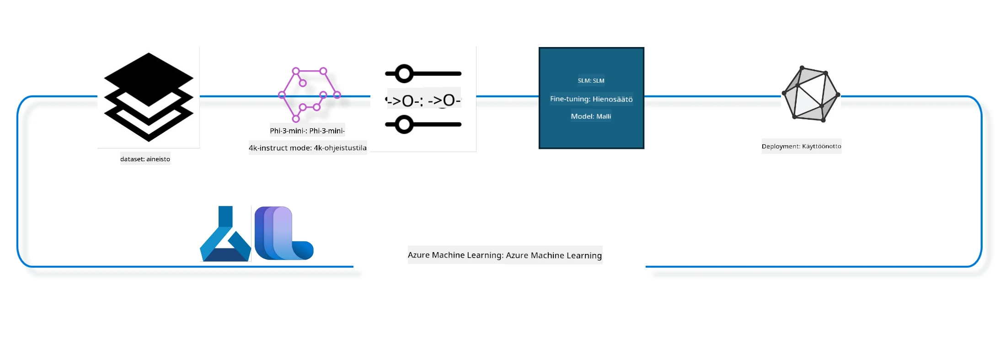

## Kuinka käyttää chat-komponentteja Azure ML -järjestelmärekisteristä mallin hienosäätöön

Tässä esimerkissä hienosäädämme Phi-3-mini-4k-instruct -mallia täydentämään keskustelun kahden henkilön välillä käyttäen ultrachat_200k -aineistoa.



Esimerkki näyttää, kuinka hienosäätö tehdään Azure ML SDK:n ja Pythonin avulla, ja kuinka hienosäädetty malli otetaan käyttöön online-päätepisteessä reaaliaikaista ennustetta varten.

### Koulutusaineisto

Käytämme ultrachat_200k -aineistoa. Tämä on voimakkaasti suodatettu versio UltraChat-aineistosta, ja sitä käytettiin Zephyr-7B-β -mallin koulutukseen, joka on huippuluokan 7 miljardin parametrin chat-malli.

### Malli

Käytämme Phi-3-mini-4k-instruct -mallia näyttämään, miten käyttäjä voi hienosäätää mallia chat-tehtävää varten. Jos avasit tämän muistikirjan tietystä mallikortista, muista vaihtaa mallin nimi vastaavasti.

### Tehtävät

- Valitse hienosäädettävä malli.
- Valitse ja tutki koulutusaineisto.
- Määritä hienosäätötehtävä.
- Suorita hienosäätötehtävä.
- Tarkastele koulutus- ja arviointimittareita.
- Rekisteröi hienosäädetty malli.
- Ota hienosäädetty malli käyttöön reaaliaikaista ennustetta varten.
- Siivoa resurssit.

## 1. Valmistele esivaatimukset

- Asenna riippuvuudet
- Yhdistä AzureML-työtilaan. Lisätietoja löydät kohdasta SDK-todennuksen määrittäminen. Vaihda alla <WORKSPACE_NAME>, <RESOURCE_GROUP> ja <SUBSCRIPTION_ID>.
- Yhdistä Azure ML -järjestelmärekisteriin
- Aseta haluttaessa kokeilun nimi
- Tarkista tai luo laskentaresurssi.

> [!NOTE]
> Vaatimuksena on yksi GPU-solmu, joka voi sisältää useita GPU-kortteja. Esimerkiksi Standard_NC24rs_v3 -solmussa on 4 NVIDIA V100 GPU:ta ja Standard_NC12s_v3 -solmussa 2 NVIDIA V100 GPU:ta. Katso lisätietoja dokumentaatiosta. GPU-korttien määrä per solmu asetetaan alla parametrilla gpus_per_node. Oikea arvo takaa kaikkien GPU:iden käytön solmussa. Suositellut GPU-laskentamallit löytyvät täältä ja täältä.

### Python-kirjastot

Asenna riippuvuudet suorittamalla alla oleva solu. Tämä ei ole valinnainen vaihe uudessa ympäristössä.

```bash
pip install azure-ai-ml
pip install azure-identity
pip install datasets==2.9.0
pip install mlflow
pip install azureml-mlflow
```

### Vuorovaikutus Azure ML:n kanssa

1. Tämä Python-skripti on tarkoitettu Azure Machine Learning (Azure ML) -palvelun kanssa työskentelyyn. Sen toiminta:

    - Tuodaan tarvittavat moduulit azure.ai.ml-, azure.identity- ja azure.ai.ml.entities-kirjastoista sekä time-moduuli.

    - Yrittää todennusta DefaultAzureCredential()-luokalla, joka tarjoaa yksinkertaistetun todennuksen Azure-pilvessä pyöriviä sovelluksia varten. Jos tämä epäonnistuu, käytetään vuorovaikutteista selaintodennusta InteractiveBrowserCredential()-luokalla.

    - Yrittää luoda MLClient-instanssin from_config-menetelmällä, joka lukee asetukset oletusyhdistystiedostosta (config.json). Jos tämä epäonnistuu, luodaan MLClient-instanssi manuaalisesti tilaustunnuksella, resurssiryhmän nimellä ja työtilan nimellä.

    - Luo toisen MLClient-instanssin Azure ML -rekisterille nimeltä "azureml", johon tallennetaan malleja, hienosäätöputkia ja ympäristöjä.

    - Asettaa kokeilun nimeksi "chat_completion_Phi-3-mini-4k-instruct".

    - Luo yksilöllisen aikaleiman muuntamalla nykyinen aika sekunteina (liukulukuna) kokonaisluvuksi ja sitten merkkijonoksi. Tätä käytetään yksilöllisiin nimiin ja versioihin.

    ```python
    # Tuo tarvittavat moduulit Azure ML:stä ja Azure Identiteetistä
    from azure.ai.ml import MLClient
    from azure.identity import (
        DefaultAzureCredential,
        InteractiveBrowserCredential,
    )
    from azure.ai.ml.entities import AmlCompute
    import time  # Tuo time-moduuli
    
    # Yritä todennusta käyttäen DefaultAzureCredentialia
    try:
        credential = DefaultAzureCredential()
        credential.get_token("https://management.azure.com/.default")
    except Exception as ex:  # Jos DefaultAzureCredential epäonnistuu, käytä InteractiveBrowserCredentialia
        credential = InteractiveBrowserCredential()
    
    # Yritä luoda MLClient-instanssi käyttämällä oletuskonfiguraatiotiedostoa
    try:
        workspace_ml_client = MLClient.from_config(credential=credential)
    except:  # Jos se epäonnistuu, luo MLClient-instanssi antamalla tiedot manuaalisesti
        workspace_ml_client = MLClient(
            credential,
            subscription_id="<SUBSCRIPTION_ID>",
            resource_group_name="<RESOURCE_GROUP>",
            workspace_name="<WORKSPACE_NAME>",
        )
    
    # Luo toinen MLClient-instanssi Azure ML -rekisterille nimeltä "azureml"
    # Tämä rekisteri on paikka, johon mallit, hienosäätöputket ja ympäristöt tallennetaan
    registry_ml_client = MLClient(credential, registry_name="azureml")
    
    # Aseta kokeen nimi
    experiment_name = "chat_completion_Phi-3-mini-4k-instruct"
    
    # Luo ainutlaatuinen aikaleima, jota voidaan käyttää nimissä ja versioissa jotka tarvitsevat olla ainutlaatuisia
    timestamp = str(int(time.time()))
    ```

## 2. Valitse perusmalli hienosäätöön

1. Phi-3-mini-4k-instruct on 3,8 miljardin parametrin kevyt, huippuluokan avoin malli, joka perustuu Phi-2:n koulutusaineistoihin. Malleihin kuuluu Phi-3-perhe, ja Mini-versiossa on kaksi varianttia: 4K ja 128K, jotka kuvaavat mallin tukemaa kontekstipituutta (tokeneina). Malli on hienosäädettävä omaan käyttötarkoitukseemme. Näitä malleja voi selata AzureML Studion Mallikatalogissa, suodattamalla chat-completion-tehtävään. Tässä esimerkissä käytämme Phi-3-mini-4k-instruct-mallia. Jos avasit tämän muistikirjan toiselle mallille, vaihda nimi ja versio vastaavasti.

> [!NOTE]
> Mallin id-ominaisuus toimii syötteenä hienosäätötehtävään. Tämä löytyy myös Asset ID -kentästä mallin tiedoista AzureML Studion Mallikatalogissa.

2. Tämä Python-skripti on vuorovaikutuksessa Azure Machine Learning (Azure ML) -palvelun kanssa. Toiminta:

    - Asettaa model_name-muuttujan arvoksi "Phi-3-mini-4k-instruct".

    - Käyttää registry_ml_clientin models-ominaisuuden get-menetelmää hakemaan mallin viimeisimmän version Azure ML -rekisteristä. Metodi saa argumentteinaan mallin nimen ja merkin, jolla haetaan viimeisin versio.

    - Tulostaa konsoliin viestin, jossa kerrotaan mallin nimi, versio ja id, joita käytetään hienosäätöön. Viesti muodostetaan merkkijonon format-menetelmällä käyttämällä foundation_model-objektin ominaisuuksia.

    ```python
    # Aseta mallin nimi
    model_name = "Phi-3-mini-4k-instruct"
    
    # Hae mallin uusin versio Azure ML -rekisteristä
    foundation_model = registry_ml_client.models.get(model_name, label="latest")
    
    # Tulosta mallin nimi, versio ja tunnus
    # Nämä tiedot ovat hyödyllisiä seurannassa ja virheiden korjauksessa
    print(
        "\n\nUsing model name: {0}, version: {1}, id: {2} for fine tuning".format(
            foundation_model.name, foundation_model.version, foundation_model.id
        )
    )
    ```

## 3. Luo laskentaresurssi tehtävälle

Hienosäätö toimii VAIN GPU-laskentaresurssilla. Laskennan koko riippuu mallin koosta, ja oikean laskentayksikön valitseminen voi olla haastavaa. Tässä solussa ohjataan käyttäjää valitsemaan soveltuva laskentaresurssi.

> [!NOTE]
> Alla listatut laskentamallit toimivat optimoiduilla asetuksilla. Muutokset voivat aiheuttaa Cuda Out Of Memory -virheen. Tällöin kokeile kasvattaa laskentayksikön kokoa.

> [!NOTE]
> Valitessasi compute_cluster_size -muuttujaa varmista, että laskentaresurssi on käytettävissä omassa resurssiryhmässäsi. Mikäli ei, voit pyytää pääsyä kyseiseen resurssiin.

### Mallin hienosäädön tueksi tuetun laskennan tarkistus

1. Tämä Python-skripti toimii Azure ML -mallin kanssa. Toiminta:

    - Tuodaan ast-moduuli, joka tarjoaa funktioita Pythonin abstraktin syntaksipuun käsittelyyn.

    - Tarkistetaan, onko foundation_model-objektilla tag nimeltä finetune_compute_allow_list. Tagit ovat avain-arvo-parit, joita voidaan käyttää malli-listauksissa suodattamiseen.

    - Jos tagi on olemassa, sen arvo (merkkijono) parsitaan turvallisesti listaksi ast.literal_eval-funktiolla ja tallennetaan computes_allow_list-muuttujaan. Tulostetaan viesti, jossa kerrotaan, että laskentaresurssi pitäisi valita tästä listasta.

    - Jos tagia ei ole, asetetaan computes_allow_list None-arvoon ja tulostetaan viesti siitä, ettei tagi ole mallin tageissa.

    - Yhteenvetona skripti tarkastaa tietyn tagin mallin metatiedoista, muuntaa sen arvon listaksi, jos se löytyy, ja antaa käyttäjälle palautteen.

    ```python
    # Tuo ast-moduuli, joka tarjoaa toimintoja Pythonin abstraktin syntaksipuun käsittelyyn
    import ast
    
    # Tarkista, onko 'finetune_compute_allow_list' tunniste mallin tunnisteissa
    if "finetune_compute_allow_list" in foundation_model.tags:
        # Jos tunniste on läsnä, käytä ast.literal_eval-funktiota turvallisesti jäsentämään tunnisteen arvo (merkkijono) Python-listaksi
        computes_allow_list = ast.literal_eval(
            foundation_model.tags["finetune_compute_allow_list"]
        )  # Muunna merkkijono Python-listaksi
        # Tulosta viesti, joka ilmoittaa, että laskenta tulisi luoda listasta
        print(f"Please create a compute from the above list - {computes_allow_list}")
    else:
        # Jos tunnistetta ei ole, aseta computes_allow_list arvoksi None
        computes_allow_list = None
        # Tulosta viesti, joka ilmoittaa, että 'finetune_compute_allow_list' tunniste ei ole osa mallin tunnisteita
        print("`finetune_compute_allow_list` is not part of model tags")
    ```

### Laskentaresurssin tarkistus

1. Tämä Python-skripti tarkastaa Azure ML -palvelussa laskentaresurssin tilan usealla tavalla:

    - Yrittää hakea compute_cluster-muuttujan nimellä työtilan laskentaresurssin. Jos resurssi on provisionausvaiheessa epäonnistunut ("failed"), nostaa ValueErrorin.

    - Jos computes_allow_list ei ole None, muuntaa laskentakoot pieniksi kirjaimiksi ja tarkistaa, onko nykyisen resurssin koko sallittujen listalla. Jos ei ole, nostaa ValueErrorin.

    - Jos computes_allow_list on None, tarkistaa onko nykyinen laskentakoko kiellettyjen GPU-VM-kokojen joukossa. Jos on, nostaa ValueErrorin.

    - Hakee kaikki työtilan käytettävissä olevat laskentakoot ja etsii niistä nykyisen laskentakoon vastaavan. Löydyttyään hakee kyseisen laskentakoon GPU-korttien määrän ja asettaa gpu_count_found-arvon Trueksi.

    - Jos gpu_count_found on True, tulostaa laskentaresurssin GPU-määrän, muussa tapauksessa nostaa ValueErrorin.

    - Yhteenvetona skripti suorittaa useita tarkistuksia laskentaresurssista, sen koosta, sallittujen kokojen listasta ja GPU-korttien määrästä.

    ```python
    # Tulosta poikkeusviesti
    print(e)
    # Nosta ValueError, jos laskentakoko ei ole saatavilla työtilassa
    raise ValueError(
        f"WARNING! Compute size {compute_cluster_size} not available in workspace"
    )
    
    # Hae laskenta-instanssi Azure ML -työtilasta
    compute = workspace_ml_client.compute.get(compute_cluster)
    # Tarkista, onko laskenta-instanssin provisiointitila "failed"
    if compute.provisioning_state.lower() == "failed":
        # Nosta ValueError, jos provisiointitila on "failed"
        raise ValueError(
            f"Provisioning failed, Compute '{compute_cluster}' is in failed state. "
            f"please try creating a different compute"
        )
    
    # Tarkista, onko computes_allow_list ei None
    if computes_allow_list is not None:
        # Muunna kaikki computes_allow_listin laskentakoot pieniksi kirjaimiksi
        computes_allow_list_lower_case = [x.lower() for x in computes_allow_list]
        # Tarkista, onko laskenta-instanssin koko computes_allow_list_lower_case -listassa
        if compute.size.lower() not in computes_allow_list_lower_case:
            # Nosta ValueError, jos laskenta-instanssin koko ei ole computes_allow_list_lower_case -listassa
            raise ValueError(
                f"VM size {compute.size} is not in the allow-listed computes for finetuning"
            )
    else:
        # Määritä lista tuetuista GPU VM -kooista
        unsupported_gpu_vm_list = [
            "standard_nc6",
            "standard_nc12",
            "standard_nc24",
            "standard_nc24r",
        ]
        # Tarkista, onko laskenta-instanssin koko unsupported_gpu_vm_list -listassa
        if compute.size.lower() in unsupported_gpu_vm_list:
            # Nosta ValueError, jos laskenta-instanssin koko on unsupported_gpu_vm_list -listassa
            raise ValueError(
                f"VM size {compute.size} is currently not supported for finetuning"
            )
    
    # Alusta lippu tarkistamaan, onko laskenta-instanssin GPU-määrä löydetty
    gpu_count_found = False
    # Hae lista kaikista työtilan saatavilla olevista laskentakokoista
    workspace_compute_sku_list = workspace_ml_client.compute.list_sizes()
    available_sku_sizes = []
    # Käy läpi saatavilla olevien laskentakokojen lista
    for compute_sku in workspace_compute_sku_list:
        available_sku_sizes.append(compute_sku.name)
        # Tarkista, vastaako laskentakoon nimi laskenta-instanssin kokoa
        if compute_sku.name.lower() == compute.size.lower():
            # Jos vastaa, hae kyseisen laskentakoon GPU-määrä ja aseta gpu_count_found arvoksi True
            gpus_per_node = compute_sku.gpus
            gpu_count_found = True
    # Jos gpu_count_found on True, tulosta laskenta-instanssin GPU-määrä
    if gpu_count_found:
        print(f"Number of GPU's in compute {compute.size}: {gpus_per_node}")
    else:
        # Jos gpu_count_found on False, nosta ValueError
        raise ValueError(
            f"Number of GPU's in compute {compute.size} not found. Available skus are: {available_sku_sizes}."
            f"This should not happen. Please check the selected compute cluster: {compute_cluster} and try again."
        )
    ```

## 4. Valitse aineisto mallin hienosäätöön

1. Käytämme ultrachat_200k -aineistoa. Aineisto sisältää neljä osaa, jotka soveltuvat ohjattuun hienosäätöön (supervised fine-tuning, sft).
Generaation järjestys (gen). Esimerkkien määrä kussakin osassa on seuraava:

    ```bash
    train_sft test_sft  train_gen  test_gen
    207865  23110  256032  28304
    ```

1. Seuraavat solut osoittavat peruskäsittelyn hienosäätöä varten:

### Näytä joitain tietorivejä

Haluamme, että tämä esimerkki suoritetaan nopeasti, joten tallennamme train_sft- ja test_sft-tiedostot, jotka sisältävät 5 % aineiston valituista riveistä. Tämä tarkoittaa, että hienosäädetyn mallin tarkkuus laskee, joten sitä ei tulisi käyttää todellisissa sovelluksissa.
download-dataset.py -skripti käyttää ultrachat_200k -aineiston lataamiseen ja muuntaa aineiston hienosäätöputken komponenttiystävälliseen muotoon. Aineisto on suuri, joten meillä on käytössämme vain osa aineistosta.

1. Alla oleva skripti lataa vain 5 % aineistosta. Tätä voi kasvattaa muuttamalla dataset_split_pc-parametrin arvoa halutuksi prosentiksi.

> [!NOTE]
> Joissain kielimalleissa käytetään eri kielikoodeja, joten aineiston sarakenimien tulee vastata niitä.

1. Tässä esimerkki aineiston muodosta:
Chat-completion-aineisto tallennetaan parquet-muodossa, jokainen merkintä seuraavan skeeman mukaisena:

    - Kyseessä on JSON (JavaScript Object Notation) -dokumentti, joka on suosittu tietojen vaihtomuoto. Se ei ole suoritettava koodi, vaan tapa tallentaa ja siirtää tietoa. Rakenne:

    - "prompt": Avain sisältää merkkijonon, joka kuvaa tehtävää tai kysymystä tekoälyavustajalle.

    - "messages": Avain sisältää listan objekteja. Jokainen objekti vastaa viestiä keskustelussa käyttäjän ja tekoälyavustajan välillä. Jokaisella viestiobjektilla on kaksi avainta:

    - "content": Merkkijono, joka kuvaa viestin sisältöä.
    - "role": Merkkijono, joka kertoo viestin lähettäjän roolin, joko "user" tai "assistant".
    - "prompt_id": Merkkijono, joka on yksilöivä tunniste kehotteelle.

1. Tässä JSON-dokumentissa käydään keskustelua, jossa käyttäjä pyytää tekoälyavustajaa luomaan päähenkilön dystooppiseen tarinaan. Avustaja vastaa, käyttäjä pyytää lisää yksityiskohtia, ja avustaja lupaa antaa niitä. Koko keskustelu on liitetty tiettyyn prompt_id:hen.

    ```python
    {
        // The task or question posed to an AI assistant
        "prompt": "Create a fully-developed protagonist who is challenged to survive within a dystopian society under the rule of a tyrant. ...",
        
        // An array of objects, each representing a message in a conversation between a user and an AI assistant
        "messages":[
            {
                // The content of the user's message
                "content": "Create a fully-developed protagonist who is challenged to survive within a dystopian society under the rule of a tyrant. ...",
                // The role of the entity that sent the message
                "role": "user"
            },
            {
                // The content of the assistant's message
                "content": "Name: Ava\n\n Ava was just 16 years old when the world as she knew it came crashing down. The government had collapsed, leaving behind a chaotic and lawless society. ...",
                // The role of the entity that sent the message
                "role": "assistant"
            },
            {
                // The content of the user's message
                "content": "Wow, Ava's story is so intense and inspiring! Can you provide me with more details.  ...",
                // The role of the entity that sent the message
                "role": "user"
            }, 
            {
                // The content of the assistant's message
                "content": "Certainly! ....",
                // The role of the entity that sent the message
                "role": "assistant"
            }
        ],
        
        // A unique identifier for the prompt
        "prompt_id": "d938b65dfe31f05f80eb8572964c6673eddbd68eff3db6bd234d7f1e3b86c2af"
    }
    ```

### Lataa aineisto

1. Tämä Python-skripti lataa aineiston apuna käytettävällä download-dataset.py-skriptillä. Toiminta:

    - Tuodaan os-moduuli, joka tarjoaa käyttöjärjestelmäriippuvaisia toimintoja.

    - Suoritetaan os.system -funktiolla download-dataset.py -skripti komentoriviparametrein, jotka määrittelevät ladattavan aineiston (HuggingFaceH4/ultrachat_200k), tallennussijainnin (ultrachat_200k_dataset) ja ositteluprosentin (5). Funktio palauttaa suorituksen tilakoodin exit_status-muuttujaan.

    - Jos exit_status ei ole 0 (eli suoritus epäonnistui), nostetaan Exception-virhe ladattaessa aineistoa.

    - Yhteenvetona skripti suorittaa aineiston latauskomennon apuskriptillä ja hälyttää, jos lataus epäonnistuu.

    ```python
    # Tuo os-moduuli, joka tarjoaa tavan käyttää käyttöjärjestelmäkohtaisia toimintoja
    import os
    
    # Käytä os.system-funktiota ajaaksesi download-dataset.py-skriptin komentorivillä tietyillä argumenteilla
    # Argumentit määrittävät ladattavan datasetin (HuggingFaceH4/ultrachat_200k), kansion johon se ladataan (ultrachat_200k_dataset), ja datasetin jakoprosentin (5)
    # os.system-funktio palauttaa suorittamansa komennon poistumistilan; tämä tila tallennetaan exit_status-muuttujaan
    exit_status = os.system(
        "python ./download-dataset.py --dataset HuggingFaceH4/ultrachat_200k --download_dir ultrachat_200k_dataset --dataset_split_pc 5"
    )
    
    # Tarkista onko exit_status eri kuin 0
    # Unix-tyyppisissä käyttöjärjestelmissä poistumistila 0 tarkoittaa yleensä, että komento onnistui, kun taas jokin muu numero tarkoittaa virhettä
    # Jos exit_status ei ole 0, nosta Exception-virhe viestillä, joka ilmoittaa virheestä datasetin latauksessa
    if exit_status != 0:
        raise Exception("Error downloading dataset")
    ```

### Aineiston lataaminen DataFrameen
1. Tämä Python-skripti lataa JSON Lines -tiedoston pandas DataFrameen ja näyttää ensimmäiset 5 riviä. Tässä erittely siitä, mitä se tekee:

    - Se tuo pandas-kirjaston, joka on tehokas tiedon käsittelyyn ja analysointiin tarkoitettu kirjasto.

    - Se asettaa pandas-kirjaston näyttövaihtoehtoihin sarakkeen maksimileveydeksi 0. Tämä tarkoittaa, että jokaisen sarakkeen koko teksti näytetään ilman leikkaamista, kun DataFrame tulostetaan.

    - Se käyttää pd.read_json-funktiota ladatakseen train_sft.jsonl-tiedoston kansiosta ultrachat_200k_dataset DataFrameen. lines=True -argumentti osoittaa, että tiedosto on JSON Lines -muodossa, jossa kukin rivi on oma JSON-objektinsa.

    - Se käyttää head-metodia näyttääkseen DataFramen ensimmäiset 5 riviä. Jos DataFramessa on alle 5 riviä, se näyttää kaikki ne.

    - Yhteenvetona tämä skripti lataa JSON Lines -tiedoston DataFrameen ja näyttää ensimmäiset 5 riviä koko saraketekstin kanssa.
    
    ```python
    # Tuo pandas-kirjasto, joka on tehokas tietojen käsittely- ja analyysikirjasto
    import pandas as pd
    
    # Aseta pandas-kirjaston näyttövaihtoehtojen maksimi sarakeleveydelle arvoksi 0
    # Tämä tarkoittaa, että jokaisen sarakkeen koko teksti näytetään katkaisematta, kun DataFrame tulostetaan
    pd.set_option("display.max_colwidth", 0)
    
    # Käytä pd.read_json-funktiota ladataksesi train_sft.jsonl-tiedoston ultrachat_200k_dataset-kansiosta DataFrameen
    # lines=True-argumentti tarkoittaa, että tiedosto on JSON Lines -muodossa, jossa jokainen rivi on erillinen JSON-objekti
    df = pd.read_json("./ultrachat_200k_dataset/train_sft.jsonl", lines=True)
    
    # Käytä head-metodia näyttämään DataFramen ensimmäiset 5 riviä
    # Jos DataFramessa on vähemmän kuin 5 riviä, näytetään kaikki ne
    df.head()
    ```

## 5. Lähetä hienosäätötyö mallin ja datan syötteinä

Luo työ, joka käyttää chat-completion putkikomponenttia. Opettele lisää hienosäädön tukemista parametreista.

### Määrittele hienosäädön parametrit

1. Hienosäädön parametrit voidaan ryhmitellä kahteen kategoriaan – koulutusparametrit, optimointiparametrit

1. Koulutusparametrit määrittelevät koulutuksen asiat, kuten -

    - Käytettävän optimointialgoritmin, ajastimen
    - Metriikan, jota hienosäätö optimoi
    - Koulutusaskelten määrän, eräkoot ja niin edelleen
    - Optimointiparametrit auttavat optimoimaan GPU-muistin käyttöä ja laskentaresurssien tehokasta hyödyntämistä.

1. Alla on muutamia kuulumisia tähän kategoriaan. Optimointiparametrit vaihtelevat mallikohtaisesti ja on paketoitu mallin kanssa näiden vaihteluiden käsittelemiseksi.

    - Ota käyttöön deepspeed ja LoRA
    - Ota käyttöön sekaprecisiokoulutus
    - Ota käyttöön monisolmukoulutus

> [!NOTE]
> Ohjattu hienosäätö voi johtaa kohdistuksen menetykseen tai katastrofaaliseen unohtamiseen. Suosittelemme tarkistamaan tämän ongelman ja suorittamaan kohdistusvaiheen hienosäädön jälkeen.

### Hienosäätöparametrit

1. Tämä Python-skripti määrittelee parametrien asetuksen koneoppimismallin hienosäätöä varten. Tässä erittely siitä, mitä se tekee:

    - Se asettaa oletuskoulutusparametrit kuten koulutuskierrosten lukumäärän, koulutus- ja arviointieräkoot, oppimisnopeuden ja oppimisnopeuden ajastintyypin.

    - Se asettaa oletusoptimointiparametrit, kuten otetaanko Layer-wise Relevance Propagation (LoRa) ja DeepSpeed käyttöön, sekä DeepSpeed-vaiheen.

    - Se yhdistää koulutus- ja optimointiparametrit yhdeksi sanakirjaksi nimeltä finetune_parameters.

    - Se tarkistaa, onko foundation_modelilla mallikohtaisia oletusparametreja. Jos on, se tulostaa varoitusviestin ja päivittää finetune_parameters-sanakirjan mallikohtaisilla oletuksilla. ast.literal_eval-funktiota käytetään muuttamaan mallikohtaiset oletukset merkkijonosta Python-sanakirjaksi.

    - Se tulostaa lopullisen joukon hienosäätöparametreja, joita käytetään suorituksessa.

    - Yhteenvetona tämä skripti määrittelee ja näyttää koneoppimismallin hienosäätöparametrit siten, että oletusparametreja voi korvata mallikohtaisilla.
    
    ```python
    # Määritä oletuskoulutusparametrit, kuten koulutusepochien määrä, eräkokot koulutukselle ja arvioinnille, oppimisnopeus ja oppimisnopeuden ajastimen tyyppi
    training_parameters = dict(
        num_train_epochs=3,
        per_device_train_batch_size=1,
        per_device_eval_batch_size=1,
        learning_rate=5e-6,
        lr_scheduler_type="cosine",
    )
    
    # Määritä oletusoptimointiparametrit, kuten käytetäänkö Layer-wise Relevance Propagationia (LoRa) ja DeepSpeedia, sekä DeepSpeed-vaihe
    optimization_parameters = dict(
        apply_lora="true",
        apply_deepspeed="true",
        deepspeed_stage=2,
    )
    
    # Yhdistä koulutus- ja optimointiparametrit yhdeksi sanakirjaksi nimeltä finetune_parameters
    finetune_parameters = {**training_parameters, **optimization_parameters}
    
    # Tarkista, onko foundation_modelilla mallikohtaisia oletusparametreja
    # Jos on, tulosta varoitusviesti ja päivitä finetune_parameters-sanakirja näillä mallikohtaisilla oletuksilla
    # ast.literal_eval-funktiota käytetään muuntamaan mallikohtaiset oletukset merkkijonosta Python-sanakirjaksi
    if "model_specific_defaults" in foundation_model.tags:
        print("Warning! Model specific defaults exist. The defaults could be overridden.")
        finetune_parameters.update(
            ast.literal_eval(  # muuntaa merkkijonon Python-sanakirjaksi
                foundation_model.tags["model_specific_defaults"]
            )
        )
    
    # Tulosta suorassa käytettävät lopulliset hienosäätöparametrit
    print(
        f"The following finetune parameters are going to be set for the run: {finetune_parameters}"
    )
    ```

### Koulutusputki

1. Tämä Python-skripti määrittelee funktion, joka luo näyttönimen koneoppimisen koulutusputkelle, ja kutsuu sitten tätä funktiota näyttönimen luomiseksi ja tulostamiseksi. Tässä erittely siitä, mitä se tekee:

1. Määritellään funktio get_pipeline_display_name. Tämä funktio luo näyttönimen koulutusputken eri parametreihin perustuen.

1. Funktion sisällä lasketaan kokonaiseräkoko kertomalla laitteessa kohden oleva eräkoko, gradienttilisäysten määrä, GPU:iden lukumäärä per solmu ja hienosäädössä käytettyjen solmujen määrä.

1. Haetaan muita parametreja, kuten oppimisnopeuden ajastimen tyyppi, onko käytössä DeepSpeed, DeepSpeed-vaihe, käytetäänkö Layer-wise Relevance Propagation (LoRa), säilytyrajoitus mallintarkistuspisteisiin ja maksimi sekvenssin pituus.

1. Rakennetaan merkkijono, joka sisältää kaikki nämä parametrit väliviivoin eroteltuina. Jos DeepSpeed tai LoRa on käytössä, merkkijonossa on "ds" ja DeepSpeed-vaihe tai "lora" vastaavasti. Muussa tapauksessa merkkijonossa on "nods" tai "nolora".

1. Funktio palauttaa tämän merkkijonon, joka toimii näyttönimenä koulutusputkelle.

1. Funktion määrittelyn jälkeen sitä kutsutaan näyttönimen luomiseksi, ja nimi tulostetaan.

1. Yhteenvetona tämä skripti luo näyttönimen koneoppimisen koulutusputkelle eri parametrien perusteella ja tulostaa sen.

    ```python
    # Määritä funktio koulutusputken näyttönimen luomiseksi
    def get_pipeline_display_name():
        # Laske kokonais-eräkokous kertomalla laitteen eräkokous, gradienttien accumulaatiovaiheiden määrä, GPU:iden määrä per solmu ja hienosäätöön käytettyjen solmujen määrä
        batch_size = (
            int(finetune_parameters.get("per_device_train_batch_size", 1))
            * int(finetune_parameters.get("gradient_accumulation_steps", 1))
            * int(gpus_per_node)
            * int(finetune_parameters.get("num_nodes_finetune", 1))
        )
        # Hae oppimisnopeuden ajastimen tyyppi
        scheduler = finetune_parameters.get("lr_scheduler_type", "linear")
        # Hae tieto siitä, onko DeepSpeed käytössä
        deepspeed = finetune_parameters.get("apply_deepspeed", "false")
        # Hae DeepSpeed-vaihe
        ds_stage = finetune_parameters.get("deepspeed_stage", "2")
        # Jos DeepSpeed on käytössä, lisää näyttönimeen "ds" seurattuna DeepSpeed-vaiheella; muuten lisää "nods"
        if deepspeed == "true":
            ds_string = f"ds{ds_stage}"
        else:
            ds_string = "nods"
        # Hae tieto siitä, onko Layer-wise Relevance Propagation (LoRa) käytössä
        lora = finetune_parameters.get("apply_lora", "false")
        # Jos LoRa on käytössä, lisää näyttönimeen "lora"; muuten lisää "nolora"
        if lora == "true":
            lora_string = "lora"
        else:
            lora_string = "nolora"
        # Hae rajaus tallennettavien mallin vaiheiden määrälle
        save_limit = finetune_parameters.get("save_total_limit", -1)
        # Hae maksimi sekvenssin pituus
        seq_len = finetune_parameters.get("max_seq_length", -1)
        # Muodosta näyttönimi yhdistämällä kaikki nämä parametrit yhdysmerkillä erotettuna
        return (
            model_name
            + "-"
            + "ultrachat"
            + "-"
            + f"bs{batch_size}"
            + "-"
            + f"{scheduler}"
            + "-"
            + ds_string
            + "-"
            + lora_string
            + f"-save_limit{save_limit}"
            + f"-seqlen{seq_len}"
        )
    
    # Kutsu funktiota näyttönimen luomiseksi
    pipeline_display_name = get_pipeline_display_name()
    # Tulosta näyttönimi
    print(f"Display name used for the run: {pipeline_display_name}")
    ```

### Putken määrittely

Tämä Python-skripti määrittelee ja konfiguroi koneoppimisen putken Azure Machine Learning SDK:ta käyttäen. Tässä erittely siitä, mitä se tekee:

1. Se tuo tarvittavat moduulit Azure AI ML SDK:sta.

1. Se hakee rekisteristä putkikomponentin nimeltä "chat_completion_pipeline".

1. Se määrittelee putkityön käyttäen `@pipeline`-koristetta ja funktiota `create_pipeline`. Putken nimeksi asetetaan `pipeline_display_name`.

1. `create_pipeline`-funktion sisällä alustetaan haettu putkikomponentti erilaisilla parametreilla, mukaan lukien mallin polku, laskentaklustereita eri vaiheille, aineistojakautumat koulutukseen ja testaukseen, hienosäädössä käytettävien GPU:iden määrä sekä muuta hienosäätöparametreja.

1. Kartoitus hienosäätötyön tulosteesta putkityön tulosteeseen tehdään, jotta hienosäädetty malli voidaan helposti rekisteröidä, mikä on tarpeen mallin käyttöönottoa varten online- tai eräpalvelimelle.

1. Luodaan putkesta instanssi kutsumalla `create_pipeline`-funktiota.

1. Asetetaan putken `force_rerun`-asetus `True`ksi, eli välimuistissa olevaa edellinen tulosta ei käytetä.

1. Asetetaan putken `continue_on_step_failure`-asetus `False`ksi, eli putki pysähtyy, jos jokin vaihe epäonnistuu.

1. Yhteenvetona tämä skripti määrittelee ja konfiguroi koneoppimisen putken chat completion -tehtävään Azure Machine Learning SDK:lla.

    ```python
    # Tuo tarvittavat moduulit Azure AI ML SDK:sta
    from azure.ai.ml.dsl import pipeline
    from azure.ai.ml import Input
    
    # Hae rekisteristä putkiston komponentti nimeltä "chat_completion_pipeline"
    pipeline_component_func = registry_ml_client.components.get(
        name="chat_completion_pipeline", label="latest"
    )
    
    # Määrittele putkistotehtävä @pipeline-dekoraattorilla ja create_pipeline-funktiolla
    # Putkiston nimeksi asetetaan pipeline_display_name
    @pipeline(name=pipeline_display_name)
    def create_pipeline():
        # Alusta haettu putkiston komponentti erilaisilla parametreilla
        # Näihin sisältyvät mallin polku, laskentaklustereita eri vaiheisiin, datasetin jako opetukseen ja testaukseen, hienosäätöön käytettävien GPU:iden määrä sekä muut hienosäätöparametrit
        chat_completion_pipeline = pipeline_component_func(
            mlflow_model_path=foundation_model.id,
            compute_model_import=compute_cluster,
            compute_preprocess=compute_cluster,
            compute_finetune=compute_cluster,
            compute_model_evaluation=compute_cluster,
            # Määrittele datasetin jaot parametreiksi
            train_file_path=Input(
                type="uri_file", path="./ultrachat_200k_dataset/train_sft.jsonl"
            ),
            test_file_path=Input(
                type="uri_file", path="./ultrachat_200k_dataset/test_sft.jsonl"
            ),
            # Koulutusasetukset
            number_of_gpu_to_use_finetuning=gpus_per_node,  # Aseta käytettävien GPU:iden määräksi laskennan käytettävissä oleva määrä
            **finetune_parameters
        )
        return {
            # Määritä hienosäätötyön tulos putkistotehtävän tulokseksi
            # Tämä tehdään, jotta hienosäädetty malli voidaan helposti rekisteröidä
            # Mallin rekisteröinti vaaditaan, jotta malli voidaan ottaa käyttöön verkko- tai erärajapinnassa
            "trained_model": chat_completion_pipeline.outputs.mlflow_model_folder
        }
    
    # Luo putkistoalustus kutsumalla create_pipeline-funktiota
    pipeline_object = create_pipeline()
    
    # Älä käytä välimuistissa olevia tuloksia aiemmista töistä
    pipeline_object.settings.force_rerun = True
    
    # Aseta jatka vaiheiden epäonnistuessa arvoksi False
    # Tämä tarkoittaa, että putkisto pysähtyy, jos jokin vaihe epäonnistuu
    pipeline_object.settings.continue_on_step_failure = False
    ```

### Lähetä työ

1. Tämä Python-skripti lähettää koneoppimisen putkityön Azure Machine Learning -työtilaan ja odottaa työn valmistumista. Tässä erittely siitä, mitä se tekee:

    - Se kutsuu workspace_ml_clientin jobs-objektin create_or_update-metodia lähettääkseen putkityön. Suoritettavana putkena on pipeline_object ja kokeilun nimenä experiment_name.

    - Se kutsuu sen jälkeen jobs-objektin stream-metodia odottaakseen putkityön valmistumista. Odotettava työ on pipeline_job-objektin name-attribuutin mukainen.

    - Yhteenvetona tämä skripti lähettää koneoppimisen putkityön Azure Machine Learning -työtilaan ja odottaa työn valmistumista.

    ```python
    # Lähetä pipeline-tehtävä Azure Machine Learning -työtilaan
    # Suoritettava pipeline määritellään muuttujalla pipeline_object
    # Kokeilu, jonka alla tehtävä suoritetaan, määritellään muuttujalla experiment_name
    pipeline_job = workspace_ml_client.jobs.create_or_update(
        pipeline_object, experiment_name=experiment_name
    )
    
    # Odota pipeline-tehtävän valmistumista
    # Odotettava tehtävä määritellään pipeline_job-olion name-attribuutilla
    workspace_ml_client.jobs.stream(pipeline_job.name)
    ```

## 6. Rekisteröi hienosäädetty malli työtilaan

Rekisteröimme mallin hienosäätötyön tulosteesta. Tämä seuraa perimän kulkua hienosäädetyn mallin ja hienosäätötyön välillä. Hienosäätötyö puolestaan seuraa perimän foundation-malliin, dataan ja koulutuskoodiin.

### ML-mallin rekisteröinti

1. Tämä Python-skripti rekisteröi koneoppimismallin, joka on koulutettu Azure Machine Learning -putkessa. Tässä erittely siitä, mitä se tekee:

    - Se tuo tarvittavat moduulit Azure AI ML SDK:sta.

    - Se tarkistaa, onko pipeline-työltä saatavilla trained_model-lähtö kutsumalla workspace_ml_clientin jobs-objektin get-metodia ja pääsyllä outputs-attribuuttiin.

    - Se rakentaa polun koulutetulle mallille muotoilemalla merkkijonon, jossa on putkityön nimi ja lähtö ("trained_model").

    - Se määrittelee hienosäädetylle mallille nimen lisäämällä alkuperäiseen mallin nimeen "-ultrachat-200k" ja korvaamalla kauttaviivat väliviivoilla.

    - Se valmistautuu rekisteröimään mallin luomalla Model-objektin, johon kuuluu muun muassa mallin polku, mallityyppi (MLflow-malli), mallin nimi ja versio sekä mallin kuvaus.

    - Se rekisteröi mallin kutsumalla workspace_ml_clientin models-objektin create_or_update-metodia Model-objektin kanssa.

    - Se tulostaa rekisteröidyn mallin.

1. Yhteenvetona tämä skripti rekisteröi Azure Machine Learning -putkessa koulutetun koneoppimismallin.
    
    ```python
    # Tuo tarvittavat moduulit Azure AI ML SDK:sta
    from azure.ai.ml.entities import Model
    from azure.ai.ml.constants import AssetTypes
    
    # Tarkista, onko `trained_model`-tulos saatavilla pipeline-jobista
    print("pipeline job outputs: ", workspace_ml_client.jobs.get(pipeline_job.name).outputs)
    
    # Rakenna polku koulutettuun malliin muotoilemalla merkkijono pipeline-jobin nimellä ja tuloksen nimellä ("trained_model")
    model_path_from_job = "azureml://jobs/{0}/outputs/{1}".format(
        pipeline_job.name, "trained_model"
    )
    
    # Määrittele hienosäädetylle mallille nimi lisäämällä "-ultrachat-200k" alkuperäisen mallin nimen perään ja korvaamalla kaikki kauttaviivat viivoilla
    finetuned_model_name = model_name + "-ultrachat-200k"
    finetuned_model_name = finetuned_model_name.replace("/", "-")
    
    print("path to register model: ", model_path_from_job)
    
    # Valmistaudu rekisteröimään malli luomalla Model-objekti erilaisilla parametreilla
    # Näihin sisältyy mallin polku, mallin tyyppi (MLflow-malli), mallin nimi ja versio sekä mallin kuvaus
    prepare_to_register_model = Model(
        path=model_path_from_job,
        type=AssetTypes.MLFLOW_MODEL,
        name=finetuned_model_name,
        version=timestamp,  # Käytä aikaleimaa versiona välttääksesi versioristiriidan
        description=model_name + " fine tuned model for ultrachat 200k chat-completion",
    )
    
    print("prepare to register model: \n", prepare_to_register_model)
    
    # Rekisteröi malli kutsumalla workspace_ml_clientin models-objektin create_or_update-metodia Model-objektilla argumenttina
    registered_model = workspace_ml_client.models.create_or_update(
        prepare_to_register_model
    )
    
    # Tulosta rekisteröity malli
    print("registered model: \n", registered_model)
    ```

## 7. Ota hienosäädetty malli käyttöön online-päätepisteessä

Online-päätepisteet tarjoavat kestävän REST-rajapinnan, jota voidaan käyttää sovelluksissa, jotka tarvitsevat mallia.

### Päätepisteen hallinta

1. Tämä Python-skripti luo hallinnoidun online-päätepisteen Azure Machine Learningissa rekisteröidylle mallille. Tässä erittely siitä, mitä se tekee:

    - Se tuo tarvittavat moduulit Azure AI ML SDK:sta.

    - Se määrittelee yksilöllisen nimen online-päätepisteelle lisäämällä aikaleiman merkkijonon "ultrachat-completion-" perään.

    - Se valmistautuu luomaan online-päätepisteen luomalla ManagedOnlineEndpoint-objektin eri parametreilla, kuten päätepisteen nimi, kuvaus ja todennustila ("key").

    - Se luo online-päätepisteen kutsumalla workspace_ml_clientin begin_create_or_update-metodia ManagedOnlineEndpoint-objektin kanssa ja odottaa luontitoiminnon valmistumista kutsumalla wait-metodia.

1. Yhteenvetona tämä skripti luo hallinnoidun online-päätepisteen Azure Machine Learningissa rekisteröidylle mallille.

    ```python
    # Tuo tarvittavat moduulit Azure AI ML SDK:sta
    from azure.ai.ml.entities import (
        ManagedOnlineEndpoint,
        ManagedOnlineDeployment,
        ProbeSettings,
        OnlineRequestSettings,
    )
    
    # Määritä ainutlaatuinen nimi online-päätteelle lisäämällä aikaleima merkkijonoon "ultrachat-completion-"
    online_endpoint_name = "ultrachat-completion-" + timestamp
    
    # Valmistaudu luomaan online-pääte luomalla ManagedOnlineEndpoint-objekti erilaisilla parametreilla
    # Näihin kuuluu päätteen nimi, päätteen kuvaus ja todennusvaihtoehto ("key")
    endpoint = ManagedOnlineEndpoint(
        name=online_endpoint_name,
        description="Online endpoint for "
        + registered_model.name
        + ", fine tuned model for ultrachat-200k-chat-completion",
        auth_mode="key",
    )
    
    # Luo online-pääte kutsumalla workspace_ml_clientin begin_create_or_update-metodia ManagedOnlineEndpoint-objektin avulla
    # Odota sitten luontitoiminnon valmistumista kutsumalla wait-metodia
    workspace_ml_client.begin_create_or_update(endpoint).wait()
    ```

> [!NOTE]
> Täältä löydät listan käyttöönoton tukemista SKU:ista - [Managed online endpoints SKU list](https://learn.microsoft.com/azure/machine-learning/reference-managed-online-endpoints-vm-sku-list)

### ML-mallin käyttöönotto

1. Tämä Python-skripti ottaa rekisteröidyn koneoppimismallin käyttöön hallinnoidussa online-päätepisteessä Azure Machine Learningissa. Tässä erittely siitä, mitä se tekee:

    - Se tuo ast-moduulin, joka tarjoaa funktioita Pythonin abstraktin syntaksipuun käsittelyyn.

    - Se asettaa käyttöönoton instanssityypiksi "Standard_NC6s_v3".

    - Se tarkistaa, onko foundation_modelissa tunniste inference_compute_allow_list. Jos on, se muuntaa tunnisteen arvon merkkijonosta Python-listaksi ja määrittää sen inference_computes_allow_list-muuttujaan. Jos ei, se asettaa muuttujan arvoksi None.

    - Se tarkistaa, onko määritelty instanssityyppi sallitulla listalla. Jos ei ole, se tulostaa viestin pyytäen valitsemaan instanssityypin sallitulta listalta.

    - Se valmistautuu luomaan käyttöönoton luomalla ManagedOnlineDeployment-objektin muun muassa käyttöönoton nimellä, päätepisteen nimellä, mallin ID:llä, instanssityypillä ja määrällä, liveness-tarkastuksilla ja pyyntöasetuksilla.

    - Se luo käyttöönoton kutsumalla workspace_ml_clientin begin_create_or_update-metodia ManagedOnlineDeployment-objektin kanssa ja odottaa luontitoiminnon valmistumista wait-metodin avulla.

    - Se asettaa päätepisteen liikenteen ohjaamaan 100 % liikenteestä "demo"-käyttöönottoon.

    - Se päivittää päätepisteen kutsumalla begin_create_or_update-metodia workspace_ml_clientin kanssa ja odottaa päivityksen valmistumista result-metodilla.

1. Yhteenvetona tämä skripti ottaa rekisteröidyn koneoppimismallin käyttöön hallinnoidussa online-päätepisteessä Azure Machine Learningissa.

    ```python
    # Tuo ast-moduuli, joka tarjoaa funktioita Pythonin abstraktin syntaksipuun käsittelyyn
    import ast
    
    # Aseta käyttöönoton instanssityyppi
    instance_type = "Standard_NC6s_v3"
    
    # Tarkista, onko `inference_compute_allow_list` -tunniste perustamallissa
    if "inference_compute_allow_list" in foundation_model.tags:
        # Jos on, muunna tunnisteen arvo merkkijonosta Python-listaksi ja määritä se `inference_computes_allow_list`-muuttujaan
        inference_computes_allow_list = ast.literal_eval(
            foundation_model.tags["inference_compute_allow_list"]
        )
        print(f"Please create a compute from the above list - {computes_allow_list}")
    else:
        # Jos ei ole, aseta `inference_computes_allow_list` arvoksi `None`
        inference_computes_allow_list = None
        print("`inference_compute_allow_list` is not part of model tags")
    
    # Tarkista, onko määritelty instanssityyppi sallittujen listalla
    if (
        inference_computes_allow_list is not None
        and instance_type not in inference_computes_allow_list
    ):
        print(
            f"`instance_type` is not in the allow listed compute. Please select a value from {inference_computes_allow_list}"
        )
    
    # Valmistaudu luomaan käyttöönotto luomalla `ManagedOnlineDeployment`-olio erilaisin parametrein
    demo_deployment = ManagedOnlineDeployment(
        name="demo",
        endpoint_name=online_endpoint_name,
        model=registered_model.id,
        instance_type=instance_type,
        instance_count=1,
        liveness_probe=ProbeSettings(initial_delay=600),
        request_settings=OnlineRequestSettings(request_timeout_ms=90000),
    )
    
    # Luo käyttöönotto kutsumalla `workspace_ml_client`-objektin `begin_create_or_update`-metodia ja antamalla argumentiksi `ManagedOnlineDeployment`-olio
    # Odota sitten luontitoiminnon valmistumista kutsumalla `wait`-metodia
    workspace_ml_client.online_deployments.begin_create_or_update(demo_deployment).wait()
    
    # Aseta päätepisteen liikenne ohjaamaan 100 % liikenteestä "demo"-käyttöönottoon
    endpoint.traffic = {"demo": 100}
    
    # Päivitä päätepiste kutsumalla `workspace_ml_client`-objektin `begin_create_or_update`-metodia ja antamalla argumentiksi `endpoint`-olio
    # Odota sitten päivitystoiminnon valmistumista kutsumalla `result`-metodia
    workspace_ml_client.begin_create_or_update(endpoint).result()
    ```

## 8. Testaa päätepistettä esimerkkidatalla

Haemme joitakin näytteitä testiaineistosta ja lähetämme online-päätepisteeseen tulkintaa varten. Näytämme sitten arvioidut luokat rinnakkain totuustietojen kanssa.

### Tulosten lukeminen

1. Tämä Python-skripti lukee JSON Lines -tiedoston pandas DataFrameen, ottaa satunnaisotannan ja nollaa indeksit. Tässä erittely siitä, mitä se tekee:

    - Se lukee tiedoston ./ultrachat_200k_dataset/test_gen.jsonl pandas DataFrameen. read_json-funktiota käytetään lines=True-argumentilla, koska tiedosto on JSON Lines -muodossa, jossa kukin rivi on oma JSON-objekti.

    - Se ottaa satunnaisotannan yhdestä rivistä DataFramesta. sample-funktiota käytetään n=1-argumentilla määrittelemään valittavien rivien lukumäärä.

    - Se nollaa DataFramen indeksin. reset_index-funktiota käytetään drop=True-argumentilla pudottamaan alkuperäinen indeksi ja korvaamaan se uudella oletuskokonaislukuarvoisella indeksillä.

    - Se näyttää DataFramesta ensimmäiset 2 riviä head-funktion avulla argumentilla 2. Koska DataFramessa on otannan jälkeen yksi rivi, tämä näyttää vain tuon yhden rivin.

1. Yhteenvetona tämä skripti lukee JSON Lines -tiedoston pandas DataFrameen, ottaa satunnaisotannan yhdestä rivistä, nollaa indeksin ja näyttää ensimmäisen rivin.
    
    ```python
    # Tuo pandas-kirjasto
    import pandas as pd
    
    # Lue JSON Lines -tiedosto './ultrachat_200k_dataset/test_gen.jsonl' pandas DataFrameen
    # 'lines=True' argumentti tarkoittaa, että tiedosto on JSON Lines -muodossa, jossa kukin rivi on erillinen JSON-objekti
    test_df = pd.read_json("./ultrachat_200k_dataset/test_gen.jsonl", lines=True)
    
    # Ota satunnainen otos yhdestä rivistä DataFramesta
    # 'n=1' argumentti määrittää, kuinka monta satunnaista riviä valitaan
    test_df = test_df.sample(n=1)
    
    # Nollaa DataFramen indeksi
    # 'drop=True' argumentti tarkoittaa, että alkuperäinen indeksi poistetaan ja korvataan oletusarvoisilla kokonaislukuindekseillä
    # 'inplace=True' argumentti tarkoittaa, että DataFramea muokataan paikan päällä (ilman uuden objektin luomista)
    test_df.reset_index(drop=True, inplace=True)
    
    # Näytä ensimmäiset 2 riviä DataFramesta
    # Koska DataFrame sisältää kuitenkin vain yhden rivin otoksen jälkeen, tämä näyttää vain yhden rivin
    test_df.head(2)
    ```

### Luo JSON-objekti
1. Tämä Python-skripti luo JSON-objektin tietyillä parametreilla ja tallentaa sen tiedostoon. Tässä on erittely siitä, mitä se tekee:

    - Se tuo json-moduulin, joka tarjoaa toimintoja JSON-datan käsittelyyn.

    - Se luo sanakirjan parameters, jonka avaimet ja arvot edustavat koneoppimismallin parametreja. Avaimet ovat "temperature", "top_p", "do_sample" ja "max_new_tokens", ja niihin liittyvät arvot ovat vastaavasti 0.6, 0.9, True ja 200.

    - Se luo toisen sanakirjan test_json, jossa on kaksi avainta: "input_data" ja "params". "input_data"-avaimen arvo on toinen sanakirja, jonka avaimet ovat "input_string" ja "parameters". "input_string" on lista, joka sisältää ensimmäisen viestin test_df DataFramesta. "parameters" on aiemmin luotu parameters-sanakirja. "params"-avain on tyhjä sanakirja.

    - Se avaa tiedoston nimeltä sample_score.json
    
    ```python
    # Tuo json-moduuli, joka tarjoaa toimintoja JSON-datan käsittelyyn
    import json
    
    # Luo sanakirja `parameters`, jonka avaimet ja arvot edustavat koneoppimismallin parametreja
    # Avaimet ovat "temperature", "top_p", "do_sample" ja "max_new_tokens" ja niiden vastaavat arvot ovat 0.6, 0.9, True ja 200
    parameters = {
        "temperature": 0.6,
        "top_p": 0.9,
        "do_sample": True,
        "max_new_tokens": 200,
    }
    
    # Luo toinen sanakirja `test_json`, jossa on kaksi avainta: "input_data" ja "params"
    # Avaimen "input_data" arvo on toinen sanakirja, jonka avaimet ovat "input_string" ja "parameters"
    # Avaimen "input_string" arvo on lista, joka sisältää ensimmäisen viestin `test_df`-DataFramesta
    # Avaimen "parameters" arvo on aiemmin luotu `parameters`-sanakirja
    # Avaimen "params" arvo on tyhjä sanakirja
    test_json = {
        "input_data": {
            "input_string": [test_df["messages"][0]],
            "parameters": parameters,
        },
        "params": {},
    }
    
    # Avaa tiedosto nimeltä `sample_score.json` kansiossa `./ultrachat_200k_dataset` kirjoitustilassa
    with open("./ultrachat_200k_dataset/sample_score.json", "w") as f:
        # Kirjoita `test_json`-sanakirja tiedostoon JSON-muodossa käyttäen `json.dump`-funktiota
        json.dump(test_json, f)
    ```

### Päätteen kutsuminen

1. Tämä Python-skripti kutsuu Azure Machine Learning -palvelussa olevaa online-päätettä pisteyttämään JSON-tiedoston. Tässä on erittely siitä, mitä se tekee:

    - Se kutsuu workspace_ml_client-objektin online_endpoints-ominaisuuden invoke-metodia. Tätä metodia käytetään lähettämään pyyntö online-päätteelle ja saamaan vastaus.

    - Se määrittää päätteen ja käyttöönoton nimet endpoint_name- ja deployment_name-parametreilla. Tässä tapauksessa päätteen nimi on tallennettu online_endpoint_name-muuttujaan ja käyttöönoton nimi on "demo".

    - Se määrittää pisteytettävän JSON-tiedoston polun request_file-parametrilla. Tässä tapauksessa tiedosto on ./ultrachat_200k_dataset/sample_score.json.

    - Se tallentaa päätteen vastauksen response-muuttujaan.

    - Se tulostaa raakavastauksen.

1. Yhteenvetona tämä skripti kutsuu Azure Machine Learningin online-päätettä pisteyttämään JSON-tiedoston ja tulostaa vastauksen.

    ```python
    # Kutsu Azure Machine Learningin online-päätepistettä pisteyttämään `sample_score.json`-tiedosto
    # `workspace_ml_client`-olion `online_endpoints`-ominaisuuden `invoke`-metodia käytetään lähettämään pyyntö online-päätepisteelle ja saamaan vastaus
    # `endpoint_name`-argumentti määrittää päätepisteen nimen, joka on tallennettu `online_endpoint_name`-muuttujaan
    # `deployment_name`-argumentti määrittää käyttöönoton nimen, joka on "demo"
    # `request_file`-argumentti määrittää polun pisteytettävään JSON-tiedostoon, joka on `./ultrachat_200k_dataset/sample_score.json`
    response = workspace_ml_client.online_endpoints.invoke(
        endpoint_name=online_endpoint_name,
        deployment_name="demo",
        request_file="./ultrachat_200k_dataset/sample_score.json",
    )
    
    # Tulosta raaka vastaus päätepisteeltä
    print("raw response: \n", response, "\n")
    ```

## 9. Poista online-pääte

1. Muista poistaa online-pääte, muuten laskutusmittari jatkaa laskemista päätteen käyttämän laskentatehon mukaan. Tämä Python-koodirivi poistaa online-päätteen Azure Machine Learningissa. Tässä on erittely siitä, mitä se tekee:

    - Se kutsuu workspace_ml_client-objektin online_endpoints-ominaisuuden begin_delete-metodia. Tätä metodia käytetään käynnistämään online-päätteen poisto.

    - Se määrittää poistettavan päätteen nimen name-parametrilla. Tässä tapauksessa päätteen nimi on tallennettu online_endpoint_name-muuttujaan.

    - Se kutsuu wait-metodia odottaakseen poistotoiminnon valmistumista. Tämä on estävä operaatio, mikä tarkoittaa, että se estää skriptin jatkamisen, kunnes poisto on valmis.

    - Yhteenvetona tämä koodirivi käynnistää online-päätteen poiston Azure Machine Learningissa ja odottaa, että operaatio valmistuu.

    ```python
    # Poista online-päätepiste Azure Machine Learningissä
    # `workspace_ml_client`-olion `online_endpoints`-ominaisuuden `begin_delete`-metodia käytetään online-päätepisteen poistamisen aloittamiseen
    # `name`-argumentti määrittää poistettavan päätepisteen nimen, joka on tallennettu `online_endpoint_name`-muuttujaan
    # `wait`-metodia kutsutaan odottamaan poisto-operaation valmistumista. Tämä on estävä operaatio, mikä tarkoittaa, että skripti ei jatka ennen kuin poisto on valmis
    workspace_ml_client.online_endpoints.begin_delete(name=online_endpoint_name).wait()
    ```

---

<!-- CO-OP TRANSLATOR DISCLAIMER START -->
**Vastuuvapauslauseke**:
Tämä asiakirja on käännetty käyttämällä tekoälypohjaista käännöspalvelua [Co-op Translator](https://github.com/Azure/co-op-translator). Vaikka pyrimme tarkkuuteen, ota huomioon, että automaattiset käännökset saattavat sisältää virheitä tai epätarkkuuksia. Alkuperäistä asiakirjaa sen alkuperäiskielellä tulee pitää virallisena lähteenä. Tärkeissä tiedoissa suositellaan ammattilaisen tekemää ihmiskäännöstä. Emme ole vastuussa tämän käännöksen käytöstä aiheutuvista väärinymmärryksistä tai tulkinnoista.
<!-- CO-OP TRANSLATOR DISCLAIMER END -->