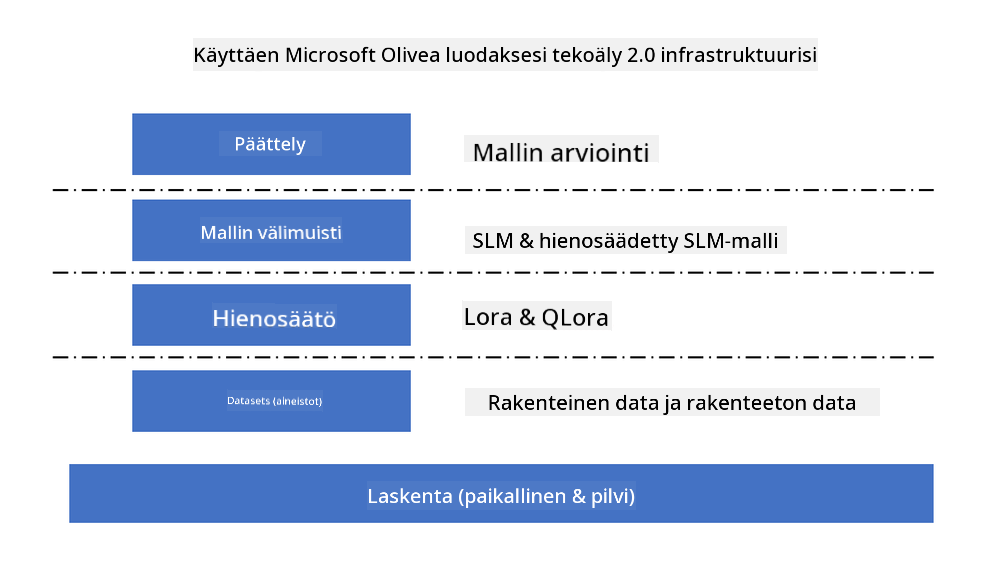
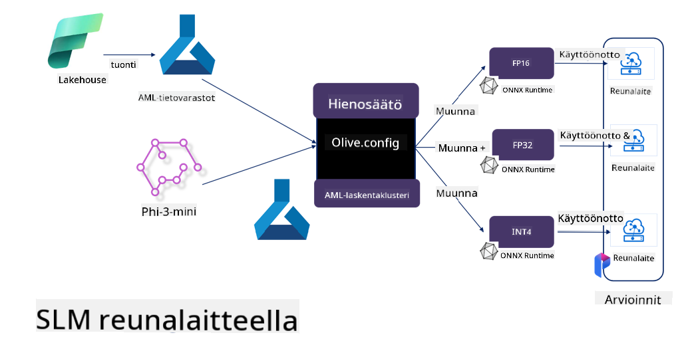

<!--
CO_OP_TRANSLATOR_METADATA:
{
  "original_hash": "5764be88ad2eb4f341e742eb8f14fab1",
  "translation_date": "2025-05-09T20:52:40+00:00",
  "source_file": "md/03.FineTuning/FineTuning_MicrosoftOlive.md",
  "language_code": "fi"
}
-->
# **Phi-3:n hienosäätö Microsoft Olivella**

[Olive](https://github.com/microsoft/OLive?WT.mc_id=aiml-138114-kinfeylo) on helppokäyttöinen laitteistotietoinen mallin optimointityökalu, joka yhdistää alan johtavat tekniikat mallin pakkaamisessa, optimoinnissa ja käännöksessä.

Se on suunniteltu sujuvoittamaan koneoppimismallien optimointiprosessia, varmistaen, että ne hyödyntävät mahdollisimman tehokkaasti tiettyjä laitteistoarkkitehtuureja.

Työskentelitpä pilvipohjaisten sovellusten tai reunalaitteiden parissa, Olive mahdollistaa mallien optimoinnin vaivattomasti ja tehokkaasti.

## Keskeiset ominaisuudet:
- Olive kokoaa yhteen ja automatisoi optimointitekniikat haluttuihin laitteistokohteisiin.
- Yksikään optimointimenetelmä ei sovi kaikkiin tilanteisiin, joten Olive mahdollistaa laajennettavuuden, jolloin alan asiantuntijat voivat liittää omia optimointiuudistuksiaan.

## Vähennä insinöörityötä:
- Kehittäjien täytyy usein oppia ja käyttää useita laitevalmistajakohtaisia työkaluketjuja koulutettujen mallien valmisteluun ja optimointiin käyttöönottoa varten.
- Olive yksinkertaistaa tätä kokemusta automatisoimalla optimointitekniikat halutulle laitteistolle.

## Valmis E2E-optimointiratkaisu:

Yhdistämällä ja virittämällä integroituja tekniikoita Olive tarjoaa yhtenäisen ratkaisun päästä päähän -optimointiin.
Se ottaa huomioon rajoitteet kuten tarkkuuden ja viiveen mallia optimoidessa.

## Microsoft Oliven käyttö hienosäätöön

Microsoft Olive on erittäin helppokäyttöinen avoimen lähdekoodin mallin optimointityökalu, joka kattaa sekä hienosäädön että referenssin generatiivisen tekoälyn alalla. Se vaatii vain yksinkertaisen konfiguraation, ja yhdistettynä avoimen lähdekoodin pieniin kielimalleihin sekä niihin liittyviin ajoympäristöihin (AzureML / paikallinen GPU, CPU, DirectML) voit suorittaa mallin hienosäädön tai referenssin automaattisen optimoinnin avulla ja löytää parhaan mallin käyttöönotettavaksi pilvessä tai reunalaitteissa. Tämä mahdollistaa yrityksille oman toimialakohtaisten mallien rakentamisen paikallisesti ja pilvessä.



## Phi-3:n hienosäätö Microsoft Olivella



## Phi-3 Olive -esimerkkikoodi ja esimerkki
Tässä esimerkissä käytät Olivea:

- Hienosäätämään LoRA-adapteria luokittelemaan lauseita tunteisiin Sad, Joy, Fear, Surprise.
- Yhdistämään adapterin painot perusmalliin.
- Optimoimaan ja kvantisoimaan mallin int4-muotoon.

[Sample Code](../../code/03.Finetuning/olive-ort-example/README.md)

### Microsoft Oliven asennus

Microsoft Oliven asennus on hyvin yksinkertaista, ja se voidaan asentaa myös CPU:lle, GPU:lle, DirectML:lle ja Azure ML:lle

```bash
pip install olive-ai
```

Jos haluat ajaa ONNX-mallia CPU:lla, voit käyttää

```bash
pip install olive-ai[cpu]
```

Jos haluat ajaa ONNX-mallia GPU:lla, voit käyttää

```python
pip install olive-ai[gpu]
```

Jos haluat käyttää Azure ML:ää, käytä

```python
pip install git+https://github.com/microsoft/Olive#egg=olive-ai[azureml]
```

**Huomio**
Käyttöjärjestelmävaatimus: Ubuntu 20.04 / 22.04

### **Microsoft Oliven Config.json**

Asennuksen jälkeen voit konfiguroida erilaisia mallikohtaisia asetuksia Config-tiedoston kautta, mukaan lukien data, laskenta, koulutus, käyttöönotto ja mallin generointi.

**1. Data**

Microsoft Olivella voidaan tukea koulutusta paikallisella ja pilvidatalla, ja asetukset voidaan määrittää konfiguraatiossa.

*Paikallisen datan asetukset*

Voit helposti määrittää koulutukseen käytettävän datasarjan hienosäätöä varten, yleensä json-muodossa, ja sovittaa sen datamalliin. Tämä tulee säätää mallin vaatimusten mukaan (esim. sovittaa Microsoft Phi-3-minin vaatimaan muotoon. Jos käytössä on muita malleja, katso muiden mallien vaadittuja hienosäätöformaatteja).

```json

    "data_configs": [
        {
            "name": "dataset_default_train",
            "type": "HuggingfaceContainer",
            "load_dataset_config": {
                "params": {
                    "data_name": "json", 
                    "data_files":"dataset/dataset-classification.json",
                    "split": "train"
                }
            },
            "pre_process_data_config": {
                "params": {
                    "dataset_type": "corpus",
                    "text_cols": [
                            "phrase",
                            "tone"
                    ],
                    "text_template": "### Text: {phrase}\n### The tone is:\n{tone}",
                    "corpus_strategy": "join",
                    "source_max_len": 2048,
                    "pad_to_max_len": false,
                    "use_attention_mask": false
                }
            }
        }
    ],
```

**Pilvidatalähteen asetukset**

Linkittämällä Azure AI Studion/Azure Machine Learning Servicen datastore pilvidataan, voit valita eri datalähteitä Azure AI Studioon/Azure Machine Learning Serviceen Microsoft Fabricin ja Azure Datan kautta hienosäätöä varten.

```json

    "data_configs": [
        {
            "name": "dataset_default_train",
            "type": "HuggingfaceContainer",
            "load_dataset_config": {
                "params": {
                    "data_name": "json", 
                    "data_files": {
                        "type": "azureml_datastore",
                        "config": {
                            "azureml_client": {
                                "subscription_id": "Your Azure Subscrition ID",
                                "resource_group": "Your Azure Resource Group",
                                "workspace_name": "Your Azure ML Workspaces name"
                            },
                            "datastore_name": "workspaceblobstore",
                            "relative_path": "Your train_data.json Azure ML Location"
                        }
                    },
                    "split": "train"
                }
            },
            "pre_process_data_config": {
                "params": {
                    "dataset_type": "corpus",
                    "text_cols": [
                            "Question",
                            "Best Answer"
                    ],
                    "text_template": "<|user|>\n{Question}<|end|>\n<|assistant|>\n{Best Answer}\n<|end|>",
                    "corpus_strategy": "join",
                    "source_max_len": 2048,
                    "pad_to_max_len": false,
                    "use_attention_mask": false
                }
            }
        }
    ],
    
```

**2. Laskentakonfiguraatio**

Jos haluat käyttää paikallisia resursseja, voit suoraan hyödyntää paikallisia datalähteitä. Jos tarvitset Azure AI Studio / Azure Machine Learning Servicen resursseja, sinun tulee konfiguroida siihen liittyvät Azure-parametrit, laskentakapasiteetin nimi jne.

```json

    "systems": {
        "aml": {
            "type": "AzureML",
            "config": {
                "accelerators": ["gpu"],
                "hf_token": true,
                "aml_compute": "Your Azure AI Studio / Azure Machine Learning Service Compute Name",
                "aml_docker_config": {
                    "base_image": "Your Azure AI Studio / Azure Machine Learning Service docker",
                    "conda_file_path": "conda.yaml"
                }
            }
        },
        "azure_arc": {
            "type": "AzureML",
            "config": {
                "accelerators": ["gpu"],
                "aml_compute": "Your Azure AI Studio / Azure Machine Learning Service Compute Name",
                "aml_docker_config": {
                    "base_image": "Your Azure AI Studio / Azure Machine Learning Service docker",
                    "conda_file_path": "conda.yaml"
                }
            }
        }
    },
```

***Huomio***

Koska suoritus tapahtuu kontissa Azure AI Studio / Azure Machine Learning Servicen kautta, vaadittu ympäristö tulee konfiguroida. Tämä tehdään conda.yaml-ympäristötiedostossa.

```yaml

name: project_environment
channels:
  - defaults
dependencies:
  - python=3.8.13
  - pip=22.3.1
  - pip:
      - einops
      - accelerate
      - azure-keyvault-secrets
      - azure-identity
      - bitsandbytes
      - datasets
      - huggingface_hub
      - peft
      - scipy
      - sentencepiece
      - torch>=2.2.0
      - transformers
      - git+https://github.com/microsoft/Olive@jiapli/mlflow_loading_fix#egg=olive-ai[gpu]
      - --extra-index-url https://aiinfra.pkgs.visualstudio.com/PublicPackages/_packaging/ORT-Nightly/pypi/simple/ 
      - ort-nightly-gpu==1.18.0.dev20240307004
      - --extra-index-url https://aiinfra.pkgs.visualstudio.com/PublicPackages/_packaging/onnxruntime-genai/pypi/simple/
      - onnxruntime-genai-cuda

    

```

**3. Valitse SLM**

Voit käyttää mallia suoraan Hugging Facesta tai yhdistää sen Azure AI Studio / Azure Machine Learningin Malliluetteloon ja valita käytettävän mallin. Alla olevassa koodiesimerkissä käytämme Microsoft Phi-3-minia esimerkkinä.

Jos malli on paikallisesti, voit käyttää tätä tapaa

```json

    "input_model":{
        "type": "PyTorchModel",
        "config": {
            "hf_config": {
                "model_name": "model-cache/microsoft/phi-3-mini",
                "task": "text-generation",
                "model_loading_args": {
                    "trust_remote_code": true
                }
            }
        }
    },
```

Jos haluat käyttää mallia Azure AI Studio / Azure Machine Learning Servicestä, voit käyttää tätä tapaa

```json

    "input_model":{
        "type": "PyTorchModel",
        "config": {
            "model_path": {
                "type": "azureml_registry_model",
                "config": {
                    "name": "microsoft/Phi-3-mini-4k-instruct",
                    "registry_name": "azureml-msr",
                    "version": "11"
                }
            },
             "model_file_format": "PyTorch.MLflow",
             "hf_config": {
                "model_name": "microsoft/Phi-3-mini-4k-instruct",
                "task": "text-generation",
                "from_pretrained_args": {
                    "trust_remote_code": true
                }
            }
        }
    },
```

**Huomio:**
Tarvitsemme integraation Azure AI Studion / Azure Machine Learning Servicen kanssa, joten mallin asetuksissa tulee huomioida versio ja nimistöt.

Kaikki Azuren mallit tulee asettaa PyTorch.MLflow-muotoon.

Sinulla tulee olla Hugging Face -tili ja liittää avain Azure AI Studion / Azure Machine Learningin Key-arvoon.

**4. Algoritmi**

Microsoft Olive kapseloi Lora- ja QLora-hienosäätöalgoritmit erittäin hyvin. Sinun tarvitsee konfiguroida vain muutamia parametreja. Tässä otan QLoran esimerkkinä.

```json
        "lora": {
            "type": "LoRA",
            "config": {
                "target_modules": [
                    "o_proj",
                    "qkv_proj"
                ],
                "double_quant": true,
                "lora_r": 64,
                "lora_alpha": 64,
                "lora_dropout": 0.1,
                "train_data_config": "dataset_default_train",
                "eval_dataset_size": 0.3,
                "training_args": {
                    "seed": 0,
                    "data_seed": 42,
                    "per_device_train_batch_size": 1,
                    "per_device_eval_batch_size": 1,
                    "gradient_accumulation_steps": 4,
                    "gradient_checkpointing": false,
                    "learning_rate": 0.0001,
                    "num_train_epochs": 3,
                    "max_steps": 10,
                    "logging_steps": 10,
                    "evaluation_strategy": "steps",
                    "eval_steps": 187,
                    "group_by_length": true,
                    "adam_beta2": 0.999,
                    "max_grad_norm": 0.3
                }
            }
        },
```

Jos haluat kvantisointimuunnoksen, Microsoft Oliven päähaara tukee jo onnxruntime-genai-menetelmää. Voit asettaa sen tarpeidesi mukaan:

1. yhdistä adapterin painot perusmalliin
2. Muunna malli onnx-malliksi halutulla tarkkuudella ModelBuilderin avulla

esim. muunnos kvantisoituun INT4-muotoon

```json

        "merge_adapter_weights": {
            "type": "MergeAdapterWeights"
        },
        "builder": {
            "type": "ModelBuilder",
            "config": {
                "precision": "int4"
            }
        }
```

**Huomio**
- Jos käytät QLoRAa, ONNXRuntime-genai:n kvantisointimuunnos ei ole toistaiseksi tuettu.
- Tässä kannattaa korostaa, että voit asettaa yllä olevat vaiheet tarpeidesi mukaan. Ei ole pakollista konfiguroida kaikkia näitä vaiheita kokonaan. Tarpeidesi mukaan voit käyttää suoraan algoritmin vaiheita ilman hienosäätöä. Lopuksi tulee konfiguroida tarvittavat moottorit.

```json

    "engine": {
        "log_severity_level": 0,
        "host": "aml",
        "target": "aml",
        "search_strategy": false,
        "execution_providers": ["CUDAExecutionProvider"],
        "cache_dir": "../model-cache/models/phi3-finetuned/cache",
        "output_dir" : "../model-cache/models/phi3-finetuned"
    }
```

**5. Hienosäätö valmis**

Komentorivillä suorita olive-config.json-kansion sisällä

```bash
olive run --config olive-config.json  
```

**Vastuuvapauslauseke**:  
Tämä asiakirja on käännetty tekoälypohjaisella käännöspalvelulla [Co-op Translator](https://github.com/Azure/co-op-translator). Pyrimme tarkkuuteen, mutta huomioithan, että automaattikäännöksissä voi esiintyä virheitä tai epätarkkuuksia. Alkuperäinen asiakirja sen alkuperäiskielellä tulee pitää auktoritatiivisena lähteenä. Tärkeiden tietojen osalta suositellaan ammattimaista ihmiskäännöstä. Emme ole vastuussa tämän käännöksen käytöstä aiheutuvista väärinymmärryksistä tai tulkinnoista.