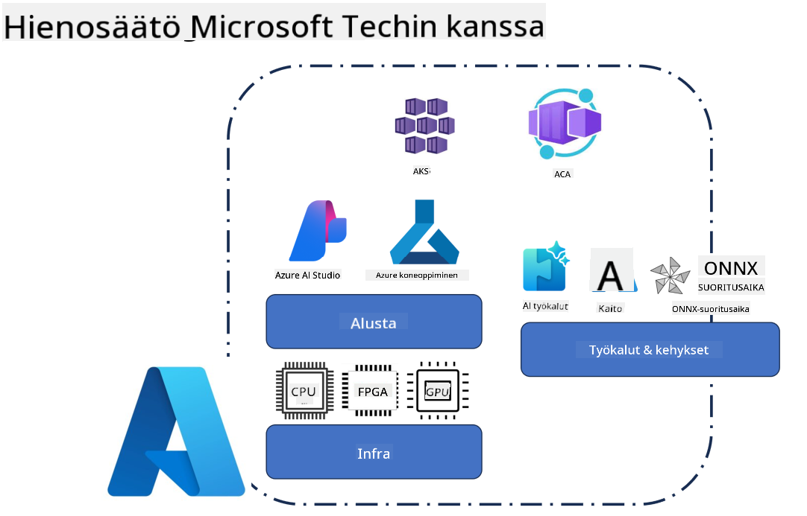
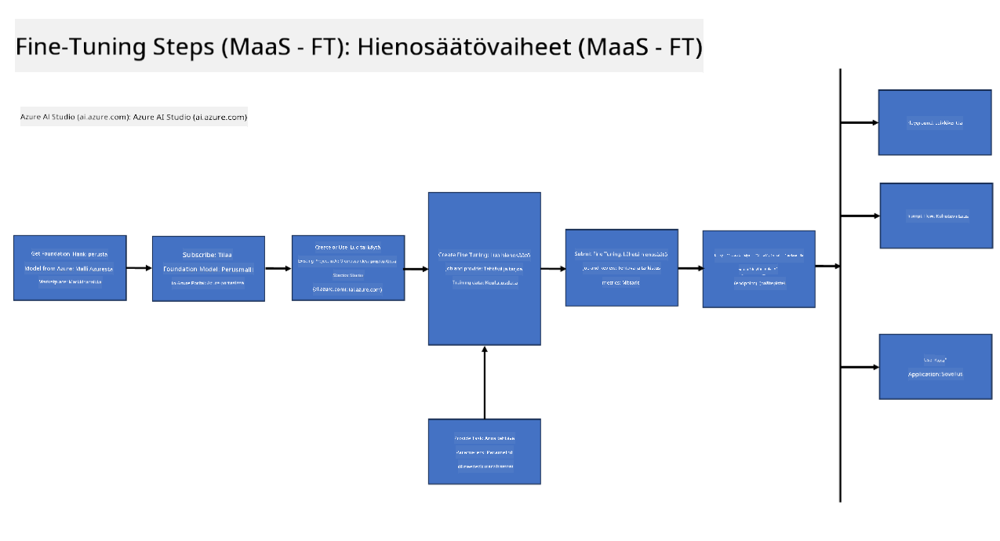

<!--
CO_OP_TRANSLATOR_METADATA:
{
  "original_hash": "cb5648935f63edc17e95ce38f23adc32",
  "translation_date": "2025-05-09T21:56:11+00:00",
  "source_file": "md/03.FineTuning/FineTuning_Scenarios.md",
  "language_code": "fi"
}
-->
## Fine Tuning -skenaariot

**Alusta** Tämä sisältää erilaisia teknologioita, kuten Azure AI Foundryn, Azure Machine Learningin, AI-työkalut, Kaiton ja ONNX Runtime -ympäristön.

**Infrastruktuuri** Tämä kattaa CPU:n ja FPGA:n, jotka ovat olennaisia hienosäätöprosessissa. Näytän sinulle kuvakkeet kullekin näistä teknologioista.

**Työkalut ja kehykset** Tämä sisältää ONNX Runtime -ympäristön. Näytän sinulle kuvakkeet kullekin näistä teknologioista.  
[Lisää kuvakkeet ONNX Runtime -ympäristöstä]

Microsoftin teknologioiden kanssa tapahtuva hienosäätöprosessi koostuu erilaisista komponenteista ja työkaluista. Ymmärtämällä ja hyödyntämällä näitä teknologioita voimme tehokkaasti hienosäätää sovelluksiamme ja luoda parempia ratkaisuja.

## Model as Service

Hienosäädä malli isännöidyn hienosäädön avulla ilman, että sinun tarvitsee luoda tai hallita laskentaa.

Serverittömästi tapahtuva hienosäätö on saatavilla Phi-3-mini- ja Phi-3-medium-malleille, mikä mahdollistaa kehittäjille nopean ja helpon mallien räätälöinnin pilvi- ja reunaskenaarioissa ilman, että heidän tarvitsee järjestää laskentatehoa. Olemme myös ilmoittaneet, että Phi-3-small on nyt saatavilla Models-as-a-Service -tarjoamamme kautta, jotta kehittäjät voivat nopeasti ja helposti aloittaa tekoälyn kehittämisen ilman taustainfrastruktuurin hallintaa.

## Model as a Platform

Käyttäjät hallinnoivat omaa laskentatehoaan hienosäätöä varten.

[Fine Tuning Sample](https://github.com/Azure/azureml-examples/blob/main/sdk/python/foundation-models/system/finetune/chat-completion/chat-completion.ipynb)

## Fine Tuning -skenaariot

| | | | | | | |
|-|-|-|-|-|-|-|
|Skenaario|LoRA|QLoRA|PEFT|DeepSpeed|ZeRO|DORA|
|Esikoulutettujen LLM-mallien sovittaminen tiettyihin tehtäviin tai aloihin|Kyllä|Kyllä|Kyllä|Kyllä|Kyllä|Kyllä|
|Hienosäätö NLP-tehtäviin, kuten tekstiluokitteluun, nimettyjen entiteettien tunnistukseen ja konekäännökseen|Kyllä|Kyllä|Kyllä|Kyllä|Kyllä|Kyllä|
|Hienosäätö kysymys-vastaus -tehtäviin|Kyllä|Kyllä|Kyllä|Kyllä|Kyllä|Kyllä|
|Hienosäätö ihmismäisten vastausten tuottamiseen chatbotteihin|Kyllä|Kyllä|Kyllä|Kyllä|Kyllä|Kyllä|
|Hienosäätö musiikin, taiteen tai muiden luovien sisältöjen tuottamiseen|Kyllä|Kyllä|Kyllä|Kyllä|Kyllä|Kyllä|
|Laskennallisten ja taloudellisten kustannusten vähentäminen|Kyllä|Kyllä|Ei|Kyllä|Kyllä|Ei|
|Muistinkäytön vähentäminen|Ei|Kyllä|Ei|Kyllä|Kyllä|Kyllä|
|Vähemmillä parametreilla tapahtuva tehokas hienosäätö|Ei|Kyllä|Kyllä|Ei|Ei|Kyllä|
|Muistitehokas dataparallelismin muoto, joka antaa pääsyn kaikkien käytettävissä olevien GPU-laitteiden yhteenlaskettuun muistimäärään|Ei|Ei|Ei|Kyllä|Kyllä|Kyllä|

## Fine Tuning -suorituskykyesimerkit

**Vastuuvapauslauseke**:  
Tämä asiakirja on käännetty käyttämällä tekoälypohjaista käännöspalvelua [Co-op Translator](https://github.com/Azure/co-op-translator). Vaikka pyrimme tarkkuuteen, huomioithan, että automaattikäännöksissä saattaa esiintyä virheitä tai epätarkkuuksia. Alkuperäistä asiakirjaa sen alkuperäiskielellä tulee pitää virallisena lähteenä. Tärkeiden tietojen osalta suositellaan ammattimaista ihmiskäännöstä. Emme ole vastuussa tämän käännöksen käytöstä johtuvista väärinymmärryksistä tai virhetulkinnoista.