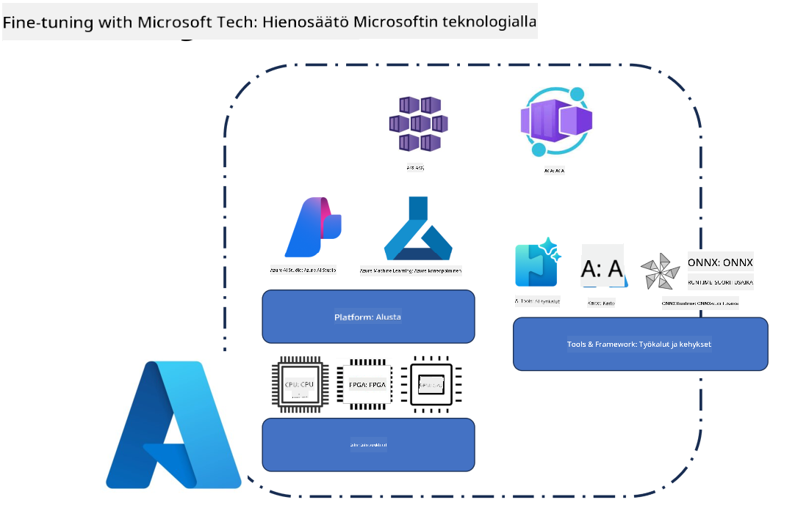
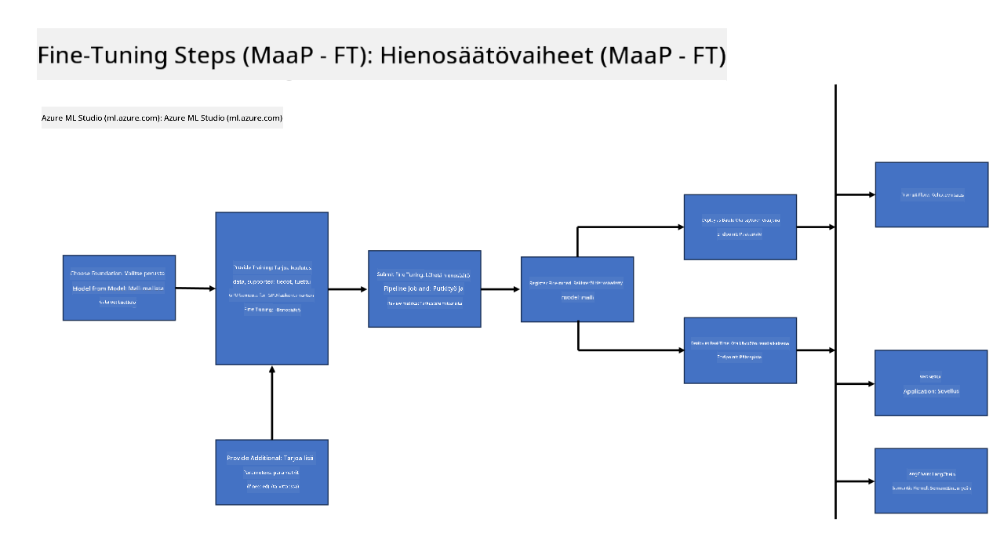
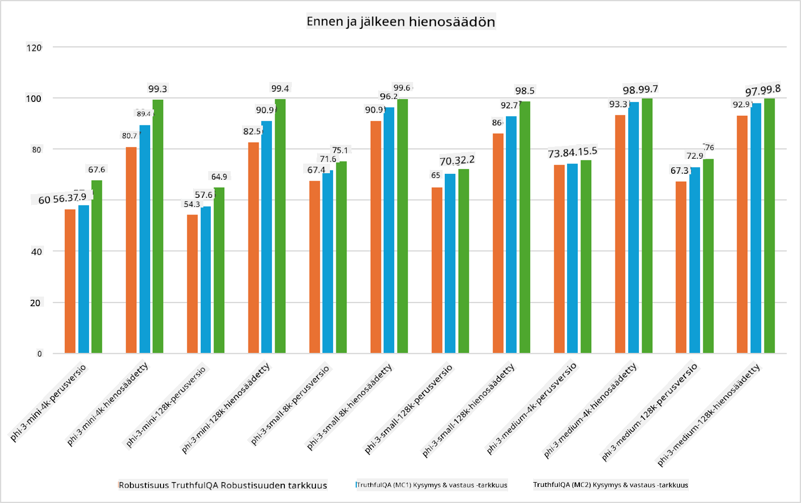

<!--
CO_OP_TRANSLATOR_METADATA:
{
  "original_hash": "cb5648935f63edc17e95ce38f23adc32",
  "translation_date": "2025-07-17T08:28:02+00:00",
  "source_file": "md/03.FineTuning/FineTuning_Scenarios.md",
  "language_code": "fi"
}
-->
## Hienosäätötilanteet

**Alusta** Tämä kattaa erilaisia teknologioita, kuten Azure AI Foundryn, Azure Machine Learningin, AI-työkalut, Kaiton ja ONNX Runtime -ympäristön.

**Infrastruktuuri** Tämä sisältää CPU:n ja FPGA:n, jotka ovat olennaisia hienosäätöprosessissa. Näytän sinulle kunkin näistä teknologioista vastaavat kuvakkeet.

**Työkalut ja kehykset** Tämä sisältää ONNX Runtime -ympäristön. Näytän sinulle kunkin näistä teknologioista vastaavat kuvakkeet.  
[Lisää kuvakkeet ONNX Runtime -ympäristöstä]

Microsoftin teknologioilla toteutettava hienosäätöprosessi koostuu useista komponenteista ja työkaluista. Ymmärtämällä ja hyödyntämällä näitä teknologioita voimme tehokkaasti hienosäätää sovelluksiamme ja luoda parempia ratkaisuja.

## Malli palveluna

Hienosäädä malli isännöidyn hienosäädön avulla ilman, että sinun tarvitsee luoda tai hallita laskentatehoa.

Serverittömästi toimiva hienosäätö on saatavilla Phi-3-mini- ja Phi-3-medium-malleille, mikä mahdollistaa kehittäjien nopean ja vaivattoman mallien räätälöinnin pilvi- ja reunaskenaarioihin ilman, että heidän tarvitsee järjestää laskentatehoa. Olemme myös ilmoittaneet, että Phi-3-small on nyt saatavilla Models-as-a-Service -tarjonnan kautta, joten kehittäjät voivat nopeasti ja helposti aloittaa tekoälyn kehittämisen ilman, että heidän tarvitsee hallita taustalla olevaa infrastruktuuria.

## Malli alustana

Käyttäjät hallinnoivat omaa laskentatehoaan hienosäätääkseen mallejaan.

[Fine Tuning Sample](https://github.com/Azure/azureml-examples/blob/main/sdk/python/foundation-models/system/finetune/chat-completion/chat-completion.ipynb)

## Hienosäätötilanteet

| | | | | | | |
|-|-|-|-|-|-|-|
|Tilanne|LoRA|QLoRA|PEFT|DeepSpeed|ZeRO|DORA|
|Esikoulutettujen LLM-mallien sovittaminen tiettyihin tehtäviin tai toimialoihin|Kyllä|Kyllä|Kyllä|Kyllä|Kyllä|Kyllä|
|Hienosäätö NLP-tehtäviin, kuten tekstiluokitus, nimettyjen entiteettien tunnistus ja konekäännös|Kyllä|Kyllä|Kyllä|Kyllä|Kyllä|Kyllä|
|Hienosäätö kysymys-vastaus -tehtäviin|Kyllä|Kyllä|Kyllä|Kyllä|Kyllä|Kyllä|
|Hienosäätö ihmismäisten vastausten tuottamiseen chatboteissa|Kyllä|Kyllä|Kyllä|Kyllä|Kyllä|Kyllä|
|Hienosäätö musiikin, taiteen tai muiden luovien sisältöjen tuottamiseen|Kyllä|Kyllä|Kyllä|Kyllä|Kyllä|Kyllä|
|Laskenta- ja kustannuskulujen vähentäminen|Kyllä|Kyllä|Ei|Kyllä|Kyllä|Ei|
|Muistinkäytön vähentäminen|Ei|Kyllä|Ei|Kyllä|Kyllä|Kyllä|
|Vähemmän parametreja käyttävä tehokas hienosäätö|Ei|Kyllä|Kyllä|Ei|Ei|Kyllä|
|Muistitehokas dataparallelismin muoto, joka antaa pääsyn kaikkien käytettävissä olevien GPU-laitteiden yhteenlaskettuun muistimäärään|Ei|Ei|Ei|Kyllä|Kyllä|Kyllä|

## Hienosäädön suorituskykyesimerkkejä

**Vastuuvapauslauseke**:  
Tämä asiakirja on käännetty käyttämällä tekoälypohjaista käännöspalvelua [Co-op Translator](https://github.com/Azure/co-op-translator). Vaikka pyrimme tarkkuuteen, huomioithan, että automaattikäännöksissä saattaa esiintyä virheitä tai epätarkkuuksia. Alkuperäistä asiakirjaa sen alkuperäiskielellä tulee pitää virallisena lähteenä. Tärkeissä asioissa suositellaan ammattimaista ihmiskäännöstä. Emme ole vastuussa tämän käännöksen käytöstä aiheutuvista väärinymmärryksistä tai tulkinnoista.