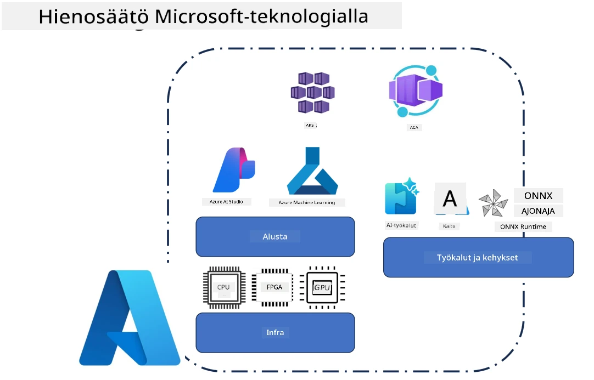
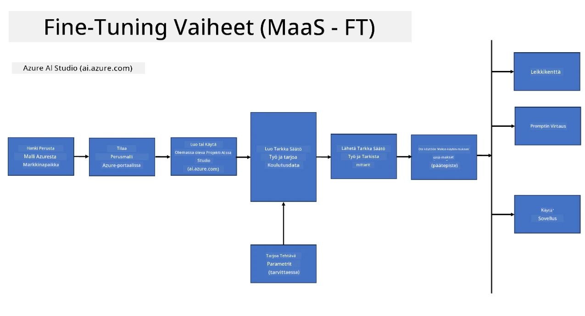
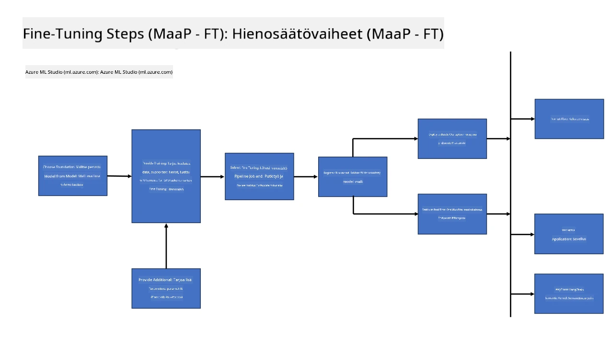
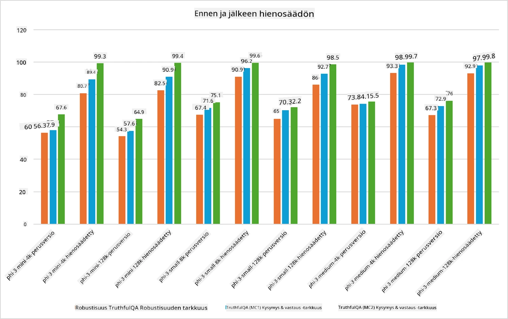

## Hienosäätötilanteet

Tässä osiossa esitellään yleiskuva hienosäätötilanteista Microsoft Foundry- ja Azure-ympäristöissä, mukaan lukien käyttöönoton mallit, infrastruktuurikerrokset ja yleisesti käytetyt optimointitekniikat.

**Alusta**  
Tähän sisältyvät hallinnoidut palvelut kuten Microsoft Foundry (entinen Microsoft Foundry) ja Azure Machine Learning, jotka tarjoavat mallien hallintaa, orkestrointia, kokeiden seurantaa ja käyttöönoton työnkulkuja.

**Infrastruktuuri**  
Hienosäätö vaatii skaalautuvia laskentaresursseja. Azure-ympäristöissä tämä sisältää tyypillisesti GPU-pohjaiset virtuaalikoneet ja CPU-resurssit kevyille kuormille sekä skaalautuvan tallennustilan datasarjoille ja tarkistuspisteille.

**Työkalut & Kehykset**  
Hienosäädön työnkulut perustuvat yleensä kehyksiin ja optimointikirjastoihin, kuten Hugging Face Transformers, DeepSpeed ja PEFT (Parameter-Efficient Fine-Tuning).

Hienosäätöprosessi Microsoftin teknologioilla kattaa alusta-palvelut, laskentainfrastruktuurin ja koulutuskehykset. Ymmärtämällä, miten nämä komponentit toimivat yhdessä, kehittäjät voivat tehokkaasti mukauttaa perustamalleja tiettyihin tehtäviin ja tuotantotilanteisiin.

## Malli palveluna

Hienosäädä malli käyttämällä isännöityä hienosäätöä ilman, että tarvitsee luoda tai hallita laskentaa.

Serverittömästi tapahtuva hienosäätö on nyt saatavilla Phi-3-, Phi-3.5- ja Phi-4-malliperheille, mikä mahdollistaa kehittäjille mallien nopean ja helpon räätälöinnin pilvi- ja reunastilanteisiin ilman, että heidän tarvitsee järjestää laskentaa.

## Malli alustana

Käyttäjät hallinnoivat omaa laskentaa hienosäätönsä suorittamiseksi.

[Hienosäätöesimerkki](https://github.com/Azure/azureml-examples/blob/main/sdk/python/foundation-models/system/finetune/chat-completion/chat-completion.ipynb)

## Hienosäätötekniikoiden vertailu

|Tapaus|LoRA|QLoRA|PEFT|DeepSpeed|ZeRO|DoRA|
|---|---|---|---|---|---|---|
|Esikoulutettujen LLM-mallien sovittaminen tiettyihin tehtäviin tai toimialoihin|Kyllä|Kyllä|Kyllä|Kyllä|Kyllä|Kyllä|
|Hienosäätö NLP-tehtäviin, kuten tekstiluokitteluun, nimettyjen entiteettien tunnistukseen ja konekääntämiseen|Kyllä|Kyllä|Kyllä|Kyllä|Kyllä|Kyllä|
|Hienosäätö kysymys-vastaus -tehtäviin|Kyllä|Kyllä|Kyllä|Kyllä|Kyllä|Kyllä|
|Hienosäätö ihmismäisten vastausten tuottamiseen chattiboteissa|Kyllä|Kyllä|Kyllä|Kyllä|Kyllä|Kyllä|
|Hienosäätö musiikin, taiteen tai muiden luovuuden muotojen tuottamiseen|Kyllä|Kyllä|Kyllä|Kyllä|Kyllä|Kyllä|
|Laskenta- ja kustannuskulujen pienentäminen|Kyllä|Kyllä|Kyllä|Kyllä|Kyllä|Kyllä|
|Muistikäytön vähentäminen|Kyllä|Kyllä|Kyllä|Kyllä|Kyllä|Kyllä|
|Harvempien parametrien käyttö tehokkaaseen hienosäätöön|Kyllä|Kyllä|Kyllä|Ei|Ei|Kyllä|
|Muistitehokas dataparallellismin muoto, joka antaa pääsyn kaikkien käytettävissä olevien GPU-laitteiden yhteenlaskettuun GPU-muistiin|Ei|Ei|Ei|Kyllä|Kyllä|Ei|

> [!NOTE]
> LoRA, QLoRA, PEFT ja DoRA ovat parametri-tehokkaita hienosäätömenetelmiä, kun taas DeepSpeed ja ZeRO keskittyvät hajautettuun koulutukseen ja muistin optimointiin.

## Hienosäädön suorituskykyesimerkkejä

---

<!-- CO-OP TRANSLATOR DISCLAIMER START -->
**Vastuuvapauslauseke**:
Tämä asiakirja on käännetty käyttämällä tekoälypohjaista käännöspalvelua [Co-op Translator](https://github.com/Azure/co-op-translator). Pyrimme tarkkuuteen, mutta huomioithan, että automaattikäännöksissä saattaa esiintyä virheitä tai epätarkkuuksia. Alkuperäistä asiakirjaa sen omalla kielellä tulee pitää virallisena lähteenä. Tärkeissä asioissa suosittelemme ammattimaista ihmiskäännöstä. Emme ole vastuussa mahdollisista väärinymmärryksistä tai tulkinnoista, jotka johtuvat tämän käännöksen käytöstä.
<!-- CO-OP TRANSLATOR DISCLAIMER END -->