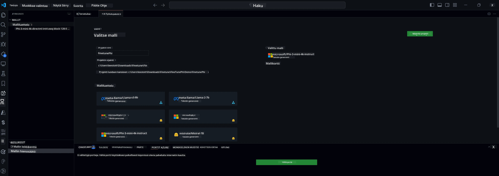

<!--
CO_OP_TRANSLATOR_METADATA:
{
  "original_hash": "c2bc0950f44919ac75a88c1a871680c2",
  "translation_date": "2025-07-17T09:14:55+00:00",
  "source_file": "md/03.FineTuning/Finetuning_VSCodeaitoolkit.md",
  "language_code": "fi"
}
-->
## Tervetuloa AI Toolkit for VS Codeen

[AI Toolkit for VS Code](https://github.com/microsoft/vscode-ai-toolkit/tree/main) kokoaa yhteen erilaisia malleja Azure AI Studio Catalogista ja muista katalogeista, kuten Hugging Facesta. Työkalupaketti helpottaa yleisiä kehitystehtäviä generatiivisten AI-työkalujen ja mallien avulla AI-sovellusten rakentamisessa tarjoamalla:
- Aloitusmallien etsintä ja kokeiluympäristö.
- Mallin hienosäätö ja päättely paikallisilla laskentaresursseilla.
- Etähienosäätö ja päättely Azure-resursseilla.

[Asenna AI Toolkit for VSCode](https://marketplace.visualstudio.com/items?itemName=ms-windows-ai-studio.windows-ai-studio)



**[Private Preview]** Yhden klikkauksen käyttöönotto Azure Container Appsille mallin hienosäädön ja päättelyn suorittamiseksi pilvessä.

Hypätään nyt AI-sovelluskehitykseesi:

- [Tervetuloa AI Toolkit for VS Codeen](../../../../md/03.FineTuning)
- [Paikallinen kehitys](../../../../md/03.FineTuning)
  - [Valmistelut](../../../../md/03.FineTuning)
  - [Aktivoi Conda](../../../../md/03.FineTuning)
  - [Pelkkä perusmallin hienosäätö](../../../../md/03.FineTuning)
  - [Mallin hienosäätö ja päättely](../../../../md/03.FineTuning)
  - [Mallin hienosäätö](../../../../md/03.FineTuning)
  - [Microsoft Olive](../../../../md/03.FineTuning)
  - [Hienosäätöesimerkit ja -resurssit](../../../../md/03.FineTuning)
- [**\[Private Preview\]** Etäkehitys](../../../../md/03.FineTuning)
  - [Esivaatimukset](../../../../md/03.FineTuning)
  - [Etäkehitysprojektin perustaminen](../../../../md/03.FineTuning)
  - [Azure-resurssien käyttöönotto](../../../../md/03.FineTuning)
  - [\[Valinnainen\] Huggingface-tokenin lisääminen Azure Container Appin salaisuuksiin](../../../../md/03.FineTuning)
  - [Hienosäädön käynnistäminen](../../../../md/03.FineTuning)
  - [Päättelypisteen käyttöönotto](../../../../md/03.FineTuning)
  - [Päättelypisteen käyttöönotto](../../../../md/03.FineTuning)
  - [Edistynyt käyttö](../../../../md/03.FineTuning)

## Paikallinen kehitys
### Valmistelut

1. Varmista, että isäntäkoneeseen on asennettu NVIDIA-ajuri.
2. Suorita `huggingface-cli login`, jos käytät HF:ää datasetin hyödyntämiseen.
3. `Olive`-avaimen asetusten selitykset kaikelle, mikä muuttaa muistin käyttöä.

### Aktivoi Conda
Koska käytämme WSL-ympäristöä, joka on jaettu, sinun täytyy aktivoida conda-ympäristö manuaalisesti. Tämän vaiheen jälkeen voit suorittaa hienosäädön tai päättelyn.

```bash
conda activate [conda-env-name] 
```

### Pelkkä perusmallin hienosäätö
Jos haluat kokeilla pelkkää perusmallia ilman hienosäätöä, voit suorittaa tämän komennon conda-aktivoinnin jälkeen.

```bash
cd inference

# Web browser interface allows to adjust a few parameters like max new token length, temperature and so on.
# User has to manually open the link (e.g. http://0.0.0.0:7860) in a browser after gradio initiates the connections.
python gradio_chat.py --baseonly
```

### Mallin hienosäätö ja päättely

Kun työtila on avattu kehityssäiliössä, avaa terminaali (oletuspolku on projektin juurihakemisto) ja suorita alla oleva komento hienosäätääksesi LLM-mallia valitulla datasetillä.

```bash
python finetuning/invoke_olive.py 
```

Välietapit ja lopullinen malli tallennetaan `models`-kansioon.

Seuraavaksi suorita päättely hienosäädetyllä mallilla keskusteluissa `console`-ikkunassa, `web-selaimessa` tai `prompt flow`ssa.

```bash
cd inference

# Console interface.
python console_chat.py

# Web browser interface allows to adjust a few parameters like max new token length, temperature and so on.
# User has to manually open the link (e.g. http://127.0.0.1:7860) in a browser after gradio initiates the connections.
python gradio_chat.py
```

Jos haluat käyttää `prompt flow`ta VS Codessa, katso tämä [Pikaopas](https://microsoft.github.io/promptflow/how-to-guides/quick-start.html).

### Mallin hienosäätö

Lataa seuraava malli laitteesi GPU:n saatavuuden mukaan.

Aloittaaksesi paikallisen hienosäätösession QLoRA:lla, valitse katalogistamme malli, jota haluat hienosäätää.
| Alusta(t) | GPU käytettävissä | Mallin nimi | Koko (GB) |
|---------|---------|--------|--------|
| Windows | Kyllä | Phi-3-mini-4k-**directml**-int4-awq-block-128-onnx | 2.13GB |
| Linux | Kyllä | Phi-3-mini-4k-**cuda**-int4-onnx | 2.30GB |
| Windows<br>Linux | Ei | Phi-3-mini-4k-**cpu**-int4-rtn-block-32-acc-level-4-onnx | 2.72GB |

**_Huom_** Mallien lataamiseen ei tarvitse Azure-tiliä.

Phi3-mini (int4) -mallin koko on noin 2–3 GB. Latausaika riippuu verkkoyhteytesi nopeudesta.

Aloita valitsemalla projektille nimi ja sijainti.
Seuraavaksi valitse malli mallikatalogista. Sinua pyydetään lataamaan projektipohja. Voit sitten klikata "Configure Project" säätääksesi asetuksia.

### Microsoft Olive

Käytämme [Olivea](https://microsoft.github.io/Olive/why-olive.html) suorittamaan QLoRA-hienosäätöä PyTorch-mallille katalogistamme. Kaikki asetukset on esiasetettu oletusarvoihin optimoimaan hienosäätöprosessi paikallisesti muistinkäytön kannalta, mutta niitä voi säätää tarpeidesi mukaan.

### Hienosäätöesimerkit ja -resurssit

- [Hienosäädön aloitusopas](https://learn.microsoft.com/windows/ai/toolkit/toolkit-fine-tune)
- [Hienosäätö HuggingFace-datasetillä](https://github.com/microsoft/vscode-ai-toolkit/blob/main/archive/walkthrough-hf-dataset.md)
- [Hienosäätö yksinkertaisella datasetillä](https://github.com/microsoft/vscode-ai-toolkit/blob/main/archive/walkthrough-simple-dataset.md)

## **[Private Preview]** Etäkehitys

### Esivaatimukset

1. Jotta voit suorittaa mallin hienosäädön etäisessä Azure Container App -ympäristössä, varmista, että tilauksessasi on riittävästi GPU-kapasiteettia. Lähetä [tukipyyntö](https://azure.microsoft.com/support/create-ticket/) pyytääksesi tarvittavaa kapasiteettia sovelluksellesi. [Lisätietoja GPU-kapasiteetista](https://learn.microsoft.com/azure/container-apps/workload-profiles-overview)
2. Jos käytät yksityistä datasettiä HuggingFacessa, varmista, että sinulla on [HuggingFace-tili](https://huggingface.co/?WT.mc_id=aiml-137032-kinfeylo) ja olet [luonut käyttöoikeustunnuksen](https://huggingface.co/docs/hub/security-tokens?WT.mc_id=aiml-137032-kinfeylo)
3. Ota käyttöön Etähienosäätö ja Päättely -ominaisuus AI Toolkit for VS Codessa
   1. Avaa VS Code -asetukset valitsemalla *File -> Preferences -> Settings*.
   2. Siirry *Extensions* ja valitse *AI Toolkit*.
   3. Valitse *"Enable Remote Fine-tuning And Inference"* -vaihtoehto.
   4. Käynnistä VS Code uudelleen, jotta muutos astuu voimaan.

- [Etähienosäätö](https://github.com/microsoft/vscode-ai-toolkit/blob/main/archive/remote-finetuning.md)

### Etäkehitysprojektin perustaminen
1. Suorita komentopaletti `AI Toolkit: Focus on Resource View`.
2. Siirry *Model Fine-tuning* -kohtaan päästäksesi mallikatalogiin. Anna projektille nimi ja valitse sijainti koneellasi. Klikkaa sitten *"Configure Project"*.
3. Projektin konfigurointi
    1. Vältä *"Fine-tune locally"* -vaihtoehdon valitsemista.
    2. Olive-konfiguraatioasetukset tulevat näkyviin esiasetettuina oletusarvoina. Muokkaa ja täytä asetukset tarpeidesi mukaan.
    3. Jatka *Generate Project* -vaiheeseen. Tämä vaihe hyödyntää WSL:ää ja luo uuden Conda-ympäristön, valmistaen tulevia päivityksiä varten, jotka sisältävät Dev Containerit.
4. Klikkaa *"Relaunch Window In Workspace"* avataksesi etäkehitysprojektisi.

> **Huom:** Projekti toimii tällä hetkellä joko paikallisesti tai etänä AI Toolkit for VS Codessa. Jos valitset projektin luomisvaiheessa *"Fine-tune locally"*, se toimii vain WSL:ssä ilman etäkehitysmahdollisuutta. Jos et valitse *"Fine-tune locally"*, projekti rajoittuu etäiseen Azure Container App -ympäristöön.

### Azure-resurssien käyttöönotto
Aloittaaksesi sinun täytyy ottaa käyttöön Azure-resurssi etähienosäätöä varten. Tee tämä suorittamalla komentopaletti `AI Toolkit: Provision Azure Container Apps job for fine-tuning`.

Seuraa käyttöönoton etenemistä tulostuskanavalla näkyvän linkin kautta.

### [Valinnainen] Huggingface-tokenin lisääminen Azure Container Appin salaisuuksiin
Jos käytät yksityistä HuggingFace-datasettiä, aseta HuggingFace-token ympäristömuuttujaksi, jotta manuaalista kirjautumista Hugging Face Hubiin ei tarvita.
Voit tehdä tämän komennolla `AI Toolkit: Add Azure Container Apps Job secret for fine-tuning`. Tällä komennolla voit asettaa salaisuuden nimeksi [`HF_TOKEN`](https://huggingface.co/docs/huggingface_hub/package_reference/environment_variables#hftoken) ja käyttää HuggingFace-tokeniasi salaisuuden arvona.

### Hienosäädön käynnistäminen
Käynnistä etähienosäätö suorittamalla komento `AI Toolkit: Run fine-tuning`.

Järjestelmä- ja konsolilokeja voit tarkastella Azure-portaalissa tulostuspaneelissa näkyvän linkin kautta (lisäohjeita [View and Query Logs on Azure](https://aka.ms/ai-toolkit/remote-provision#view-and-query-logs-on-azure)). Voit myös tarkastella konsolilokeja suoraan VSCode:n tulostuspaneelissa suorittamalla komennon `AI Toolkit: Show the running fine-tuning job streaming logs`.
> **Huom:** Työ saattaa olla jonossa resurssien puutteen vuoksi. Jos lokia ei näy, suorita komento `AI Toolkit: Show the running fine-tuning job streaming logs`, odota hetki ja suorita komento uudelleen yhdistääksesi lokivirtaan.

Tämän prosessin aikana QLoRAa käytetään hienosäätöön, ja se luo LoRA-adaptereita mallin päättelyä varten.
Hienosäädön tulokset tallennetaan Azure Filesiin.

### Päättelypisteen käyttöönotto
Kun adapterit on koulutettu etäympäristössä, käytä yksinkertaista Gradio-sovellusta mallin kanssa vuorovaikutukseen.
Samoin kuin hienosäätöprosessissa, sinun täytyy ottaa käyttöön Azure-resurssit etäpäättelyä varten suorittamalla komentopaletti `AI Toolkit: Provision Azure Container Apps for inference`.

Oletuksena tilauksen ja resurssiryhmän tulisi olla samat kuin hienosäätöä varten. Päättely käyttää samaa Azure Container App -ympäristöä ja pääsee käsiksi malliin ja mallin adapteriin, jotka on tallennettu Azure Filesiin hienosäätövaiheessa.

### Päättelypisteen käyttöönotto
Jos haluat muokata päättelykoodia tai ladata päättelymallin uudelleen, suorita komento `AI Toolkit: Deploy for inference`. Tämä synkronoi viimeisimmän koodisi Azure Container Appiin ja käynnistää replikan uudelleen.

Kun käyttöönotto on onnistuneesti suoritettu, pääset päättely-API:iin klikkaamalla "*Go to Inference Endpoint*" -painiketta VSCode-ilmoituksessa. Tai web-API-päätepiste löytyy `ACA_APP_ENDPOINT`-kentästä tiedostossa `./infra/inference.config.json` ja tulostuspaneelista. Nyt voit arvioida mallia tämän päätepisteen kautta.

### Edistynyt käyttö
Lisätietoja etäkehityksestä AI Toolkitin kanssa löydät dokumentaatiosta [Fine-Tuning models remotely](https://aka.ms/ai-toolkit/remote-provision) ja [Inferencing with the fine-tuned model](https://aka.ms/ai-toolkit/remote-inference).

**Vastuuvapauslauseke**:  
Tämä asiakirja on käännetty käyttämällä tekoälypohjaista käännöspalvelua [Co-op Translator](https://github.com/Azure/co-op-translator). Vaikka pyrimme tarkkuuteen, huomioithan, että automaattikäännöksissä saattaa esiintyä virheitä tai epätarkkuuksia. Alkuperäistä asiakirjaa sen alkuperäiskielellä tulee pitää virallisena lähteenä. Tärkeissä tiedoissa suositellaan ammattimaista ihmiskäännöstä. Emme ole vastuussa tämän käännöksen käytöstä aiheutuvista väärinymmärryksistä tai tulkinnoista.