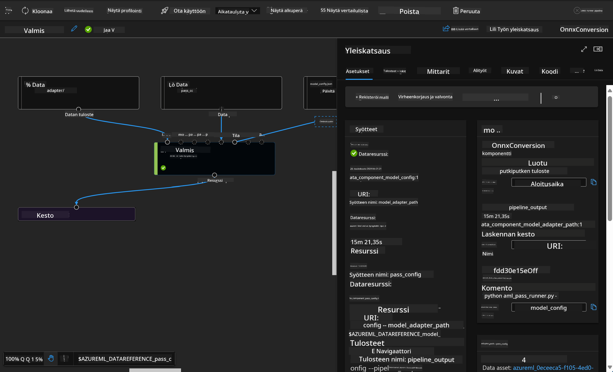

<!--
CO_OP_TRANSLATOR_METADATA:
{
  "original_hash": "7fe541373802e33568e94e13226d463c",
  "translation_date": "2025-07-17T09:43:52+00:00",
  "source_file": "md/03.FineTuning/Introduce_AzureML.md",
  "language_code": "fi"
}
-->
# **Esittely Azure Machine Learning -palvelusta**

[Azure Machine Learning](https://ml.azure.com?WT.mc_id=aiml-138114-kinfeylo) on pilvipalvelu, joka nopeuttaa ja hallinnoi koneoppimisen (ML) projektin elinkaaren eri vaiheita.

ML-ammattilaiset, datatieteilijät ja insinöörit voivat käyttää sitä päivittäisissä työprosesseissaan:

- Mallien kouluttamiseen ja käyttöönottoon.
- Koneoppimisen operaatioiden (MLOps) hallintaan.
- Voit luoda mallin Azure Machine Learningissä tai käyttää mallia, joka on rakennettu avoimen lähdekoodin alustoilla, kuten PyTorch, TensorFlow tai scikit-learn.
- MLOps-työkalut auttavat sinua seuraamaan, uudelleenkouluttamaan ja ottamaan mallit uudelleen käyttöön.

## Kenelle Azure Machine Learning on tarkoitettu?

**Datatieteilijöille ja ML-insinööreille**

He voivat käyttää työkaluja nopeuttaakseen ja automatisoidakseen päivittäisiä työprosessejaan.  
Azure ML tarjoaa ominaisuuksia oikeudenmukaisuuden, selitettävyyden, seurannan ja auditoinnin tueksi.

**Sovelluskehittäjille**  
He voivat integroida malleja sovelluksiin tai palveluihin saumattomasti.

**Alustakehittäjille**

Heillä on käytössään kattava työkalupaketti, jota tukevat kestävät Azure Resource Manager -rajapinnat.  
Nämä työkalut mahdollistavat kehittyneiden ML-työkalujen rakentamisen.

**Yrityksille**

Microsoft Azure -pilvessä toimivat yritykset hyötyvät tutusta tietoturvasta ja roolipohjaisesta käyttöoikeuksien hallinnasta.  
Projektit voidaan määrittää siten, että pääsy suojattuihin tietoihin ja tiettyihin toimintoihin on hallittua.

## Tuottavuutta koko tiimille  
ML-projektit vaativat usein monipuolisen tiimin rakentamaan ja ylläpitämään ratkaisuja.

Azure ML tarjoaa työkaluja, joiden avulla voit:  
- Tehdä yhteistyötä tiimisi kanssa jakamalla muistikirjoja, laskentaresursseja, serverittömiä laskentaympäristöjä, dataa ja ympäristöjä.  
- Kehittää malleja oikeudenmukaisuuden, selitettävyyden, seurannan ja auditoinnin näkökulmista täyttäen jäljitettävyys- ja auditointivaatimukset.  
- Ottaa ML-mallit nopeasti ja helposti käyttöön laajassa mittakaavassa sekä hallita ja valvoa niitä tehokkaasti MLOpsin avulla.  
- Suorittaa koneoppimisen työkuormia missä tahansa sisäänrakennetun hallinnan, tietoturvan ja vaatimustenmukaisuuden kanssa.

## Yhteensopivat alustatyökalut

Jokainen ML-tiimin jäsen voi käyttää suosimiaan työkaluja työn suorittamiseen.  
Olipa kyse nopeista kokeiluista, hyperparametrien virityksestä, putkien rakentamisesta tai päätelmien hallinnasta, voit käyttää tuttuja käyttöliittymiä, kuten:  
- Azure Machine Learning Studio  
- Python SDK (v2)  
- Azure CLI (v2)  
- Azure Resource Manager REST -rajapinnat

Kun hiot malleja ja teet yhteistyötä kehityssyklin aikana, voit jakaa ja löytää aineistoja, resursseja ja mittareita Azure Machine Learning studion käyttöliittymässä.

## **LLM/SLM Azure ML:ssä**

Azure ML on lisännyt monia LLM/SLM-toimintoja, yhdistäen LLMOpsin ja SLMOpsin luodakseen koko yrityksen kattavan generatiivisen tekoälyteknologia-alustan.

### **Malliluettelo**

Yrityskäyttäjät voivat ottaa käyttöön erilaisia malleja eri liiketoimintatilanteiden mukaan Malliluettelon kautta, ja tarjota palveluita Model as Service -periaatteella yrityskehittäjille tai käyttäjille.

Azure Machine Learning studion Malliluettelo on keskus, josta löydät ja käytät laajaa valikoimaa malleja, jotka mahdollistavat generatiivisten tekoälysovellusten rakentamisen. Malliluettelossa on satoja malleja eri mallitoimittajilta, kuten Azure OpenAI -palvelu, Mistral, Meta, Cohere, Nvidia, Hugging Face, mukaan lukien Microsoftin kouluttamat mallit. Microsoftin ulkopuoliset toimittajat ovat Microsoftin Tuoteehtojen mukaisesti määriteltyjä ei-Microsoftin tuotteita, ja ne ovat mallin mukana toimitettujen ehtojen alaisia.

### **Työputki**

Koneoppimisen putken ydin on jakaa kokonainen koneoppimistehtävä monivaiheiseksi työnkuluksi. Jokainen vaihe on hallittava komponentti, jota voidaan kehittää, optimoida, konfiguroida ja automatisoida erikseen. Vaiheet yhdistetään selkeästi määriteltyjen rajapintojen kautta. Azure Machine Learningin putkipalvelu orkestroi automaattisesti kaikki riippuvuudet putken vaiheiden välillä.

SLM/LLM hienosäädössä voimme hallita dataa, koulutusta ja generointiprosesseja putken avulla.

### **Prompt flow**

Azure Machine Learning prompt flow’n hyödyt  
Azure Machine Learning prompt flow tarjoaa monia etuja, jotka auttavat käyttäjiä siirtymään ideoinnista kokeiluihin ja lopulta tuotantovalmiisiin LLM-pohjaisiin sovelluksiin:

**Prompt-tekniikan ketteryys**

Interaktiivinen kirjoituskokemus: Azure Machine Learning prompt flow tarjoaa visuaalisen esityksen työnkulun rakenteesta, jolloin käyttäjät ymmärtävät ja navigoivat projekteissaan helposti. Se tarjoaa myös muistikirjamaisen koodauskokemuksen tehokkaaseen työnkulun kehitykseen ja virheenkorjaukseen.  
Promptin säätövariantit: Käyttäjät voivat luoda ja vertailla useita prompt-variantteja, mikä helpottaa iteratiivista hienosäätöä.

Arviointi: Sisäänrakennetut arviointityönkulut mahdollistavat promptien ja työnkulkujen laadun ja tehokkuuden arvioinnin.

Laajat resurssit: Azure Machine Learning prompt flow sisältää kirjaston valmiita työkaluja, esimerkkejä ja malleja, jotka toimivat kehityksen lähtökohtana, inspiroivat luovuutta ja nopeuttavat prosessia.

**Yritystason valmius LLM-pohjaisille sovelluksille**

Yhteistyö: Azure Machine Learning prompt flow tukee tiimityötä, jolloin useat käyttäjät voivat työskennellä yhdessä prompt-tekniikan projekteissa, jakaa tietoa ja ylläpitää versionhallintaa.

Kaikki yhdessä alustassa: Azure Machine Learning prompt flow virtaviivaistaa koko prompt-tekniikan prosessin kehityksestä ja arvioinnista käyttöönottoon ja seurantaan. Käyttäjät voivat helposti ottaa työnkulut käyttöön Azure Machine Learning -päätepisteinä ja seurata niiden suorituskykyä reaaliajassa, varmistaen optimaalisen toiminnan ja jatkuvan parantamisen.

Azure Machine Learning Enterprise Readiness Solutions: Prompt flow hyödyntää Azure Machine Learningin vahvoja yritystason valmiusratkaisuja, tarjoten turvallisen, skaalautuvan ja luotettavan perustan työnkulkujen kehitykselle, kokeilulle ja käyttöönotolle.

Azure Machine Learning prompt flow’n avulla käyttäjät voivat vapauttaa prompt-tekniikan ketteryyden, tehdä tehokasta yhteistyötä ja hyödyntää yritystason ratkaisuja menestyksekkääseen LLM-pohjaisten sovellusten kehitykseen ja käyttöönottoon.

Yhdistämällä Azure ML:n laskentatehon, datan ja eri komponentit yrityskehittäjät voivat helposti rakentaa omia tekoälysovelluksiaan.

**Vastuuvapauslauseke**:  
Tämä asiakirja on käännetty käyttämällä tekoälypohjaista käännöspalvelua [Co-op Translator](https://github.com/Azure/co-op-translator). Vaikka pyrimme tarkkuuteen, huomioithan, että automaattikäännöksissä saattaa esiintyä virheitä tai epätarkkuuksia. Alkuperäistä asiakirjaa sen alkuperäiskielellä tulee pitää virallisena lähteenä. Tärkeissä asioissa suositellaan ammattimaista ihmiskäännöstä. Emme ole vastuussa tämän käännöksen käytöstä aiheutuvista väärinymmärryksistä tai tulkinnoista.