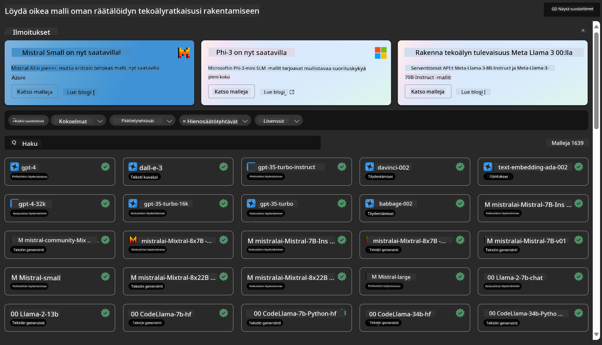
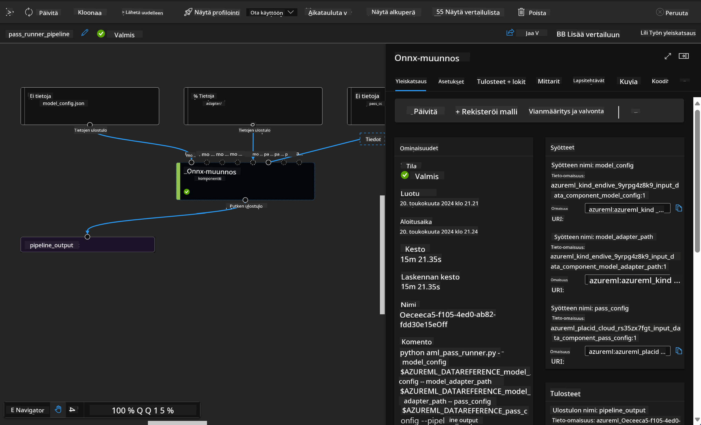

<!--
CO_OP_TRANSLATOR_METADATA:
{
  "original_hash": "7fe541373802e33568e94e13226d463c",
  "translation_date": "2025-05-09T22:21:21+00:00",
  "source_file": "md/03.FineTuning/Introduce_AzureML.md",
  "language_code": "fi"
}
-->
# **Esittele Azure Machine Learning Service**

[Azure Machine Learning](https://ml.azure.com?WT.mc_id=aiml-138114-kinfeylo) on pilvipalvelu, joka nopeuttaa ja hallinnoi koneoppimisen (ML) projektin elinkaaren eri vaiheita.

ML-ammattilaiset, datatieteilijät ja insinöörit voivat käyttää sitä päivittäisissä työprosesseissaan:

- Mallien kouluttamiseen ja käyttöönottoon.
- Koneoppimisen operaatioiden (MLOps) hallintaan.
- Voit luoda mallin Azure Machine Learningissä tai käyttää mallia, joka on rakennettu avoimen lähdekoodin alustoilla, kuten PyTorch, TensorFlow tai scikit-learn.
- MLOps-työkalut auttavat sinua seuraamaan, uudelleenkouluttamaan ja ottamaan mallit uudelleen käyttöön.

## Kenelle Azure Machine Learning on tarkoitettu?

**Datatieteilijöille ja ML-insinööreille**

He voivat käyttää työkaluja nopeuttaakseen ja automatisoidakseen päivittäisiä työprosessejaan.  
Azure ML tarjoaa ominaisuuksia oikeudenmukaisuuteen, selitettävyyteen, seurantaan ja auditointiin.

**Sovelluskehittäjille**  
He voivat saumattomasti integroida malleja sovelluksiin tai palveluihin.

**Alustakehittäjille**

Heillä on käytössään kattava työkalupaketti, jota tukevat kestävät Azure Resource Manager -rajapinnat.  
Näillä työkaluilla voi rakentaa edistyneitä ML-työkaluja.

**Yrityksille**

Microsoft Azure -pilvessä toimivat yritykset hyötyvät tutusta tietoturvasta ja roolipohjaisesta pääsynhallinnasta.  
Voit määrittää projekteja, joilla hallitaan pääsyä suojattuun dataan ja tiettyihin toimintoihin.

## Tuottavuutta koko tiimille

ML-projektit vaativat usein monipuolisen osaamisen omaavan tiimin rakentamiseen ja ylläpitoon.

Azure ML tarjoaa työkaluja, jotka mahdollistavat:  
- Yhteistyön tiimisi kanssa jakamalla muistikirjoja, laskentaresursseja, palvelimettomia laskentaympäristöjä, dataa ja ympäristöjä.  
- Mallien kehittämisen oikeudenmukaisuuden, selitettävyyden, seurannan ja auditoinnin vaatimusten mukaisesti.  
- ML-mallien nopean ja helpon käyttöönoton laajassa mittakaavassa sekä niiden tehokkaan hallinnan ja valvonnan MLOpsin avulla.  
- Koneoppimistehtävien suorittamisen missä tahansa sisäänrakennetun hallinnan, tietoturvan ja vaatimustenmukaisuuden avulla.

## Ristiinkäytettävät alustatyökalut

Jokainen ML-tiimin jäsen voi käyttää suosimiaan työkaluja työn tekemiseen.  
Olipa kyse nopeista kokeiluista, hyperparametrien virityksestä, putkien rakentamisesta tai päätelmien hallinnasta, voit käyttää tuttuja käyttöliittymiä, kuten:  
- Azure Machine Learning Studio  
- Python SDK (v2)  
- Azure CLI (v2)  
- Azure Resource Manager REST API:t  

Mallien hiomisen ja yhteistyön aikana kehityssyklin eri vaiheissa voit jakaa ja löytää resursseja, aineistoja ja mittareita Azure Machine Learning studion käyttöliittymästä.

## **LLM/SLM Azure ML:ssä**

Azure ML on lisännyt monia LLM/SLM-toimintoja, yhdistäen LLMOpsin ja SLMOpsin yritystason generatiivisen tekoälyn teknologia-alustaksi.

### **Malliluettelo**

Yrityskäyttäjät voivat ottaa käyttöön eri malleja eri liiketoimintatilanteiden mukaan Malliluettelon avulla ja tarjota palveluita Model as Service -periaatteella yrityskehittäjien tai käyttäjien käyttöön.

Azure Machine Learning studion Malliluettelo on keskus, josta löydät ja voit käyttää laajaa mallivalikoimaa generatiivisten tekoälysovellusten rakentamiseen. Malliluettelossa on satoja malleja eri mallitoimittajilta, kuten Azure OpenAI -palvelu, Mistral, Meta, Cohere, Nvidia, Hugging Face, mukaan lukien Microsoftin kouluttamat mallit. Muut kuin Microsoftin tarjoamat mallit ovat Microsoftin tuotetermiensä mukaisesti määriteltyjä Ei-Microsoftin tuotteita ja niitä koskevat mallin mukana tulevat ehdot.

### **Työputki**

Koneoppimisen putken ydin on jakaa kokonainen koneoppimistehtävä monivaiheiseksi työnkuluksi. Jokainen vaihe on hallittavissa oleva komponentti, jota voidaan kehittää, optimoida, konfiguroida ja automatisoida erikseen. Vaiheet yhdistetään hyvin määriteltyjen rajapintojen kautta. Azure Machine Learningin putkipalvelu orkestroi automaattisesti kaikki riippuvuudet putken vaiheiden välillä.

SLM/LLM hienosäädössä voimme hallita dataa, koulutusta ja generointiprosesseja putken kautta.

### **Prompt flow**

Azure Machine Learning prompt flow tarjoaa useita etuja, jotka auttavat käyttäjiä siirtymään ideoinnista kokeiluihin ja lopulta tuotantovalmiisiin LLM-pohjaisiin sovelluksiin:

**Prompt-tekniikan ketteryys**

Interaktiivinen kirjoituskokemus: Azure Machine Learning prompt flow tarjoaa visuaalisen esityksen työnkulun rakenteesta, jonka avulla käyttäjät ymmärtävät ja navigoivat projekteissaan helposti. Se tarjoaa myös muistikirjamaisen koodauskokemuksen tehokkaaseen työnkulun kehitykseen ja virheenkorjaukseen.  
Variantit promptin hienosäätöön: Käyttäjät voivat luoda ja vertailla useita prompt-variantteja, mikä helpottaa iteratiivista hienosäätöprosessia.

Arviointi: Sisäänrakennetut arviointityönkulut mahdollistavat käyttäjille promptien ja työnkulkujen laadun ja tehokkuuden arvioinnin.

Laajat resurssit: Azure Machine Learning prompt flow sisältää kirjaston valmiita työkaluja, esimerkkejä ja malleja, jotka toimivat lähtökohtana kehitykselle, innostaen luovuutta ja nopeuttaen prosessia.

**Yrityskäyttövalmius LLM-pohjaisille sovelluksille**

Yhteistyö: Azure Machine Learning prompt flow tukee tiimityötä, mahdollistaen useiden käyttäjien työskentelyn yhdessä prompt-tekniikkaprojekteissa, tiedon jakamisen ja versionhallinnan ylläpidon.

Kaikki yhdessä alustassa: Azure Machine Learning prompt flow virtaviivaistaa koko prompt-tekniikan prosessin kehityksestä ja arvioinnista käyttöönottoon ja valvontaan. Käyttäjät voivat helposti ottaa työnkulut käyttöön Azure Machine Learning -päätepisteinä ja seurata niiden suorituskykyä reaaliajassa, varmistaen optimaalisen toiminnan ja jatkuvan parantamisen.

Azure Machine Learning Enterprise Readiness Solutions: Prompt flow hyödyntää Azure Machine Learningin vahvoja yrityskäyttövalmiusratkaisuja, tarjoten turvallisen, skaalautuvan ja luotettavan perustan työnkulkujen kehittämiselle, kokeilulle ja käyttöönotolle.

Azure Machine Learning prompt flow’n avulla käyttäjät voivat vapauttaa prompt-tekniikkansa ketteryyden, tehdä tehokasta yhteistyötä ja hyödyntää yritystason ratkaisuja menestyksekkääseen LLM-pohjaisten sovellusten kehittämiseen ja käyttöönottoon.

Yhdistämällä laskentatehon, datan ja Azure ML:n eri komponentit yrityskehittäjät voivat helposti rakentaa omia tekoälysovelluksiaan.

**Vastuuvapauslauseke**:  
Tämä asiakirja on käännetty käyttämällä tekoälypohjaista käännöspalvelua [Co-op Translator](https://github.com/Azure/co-op-translator). Pyrimme tarkkuuteen, mutta huomioithan, että automaattikäännöksissä saattaa esiintyä virheitä tai epätarkkuuksia. Alkuperäistä asiakirjaa sen alkuperäiskielellä tulee pitää virallisena lähteenä. Tärkeissä asioissa suositellaan ammattimaista ihmiskäännöstä. Emme ole vastuussa tämän käännöksen käytöstä johtuvista väärinymmärryksistä tai tulkinnoista.