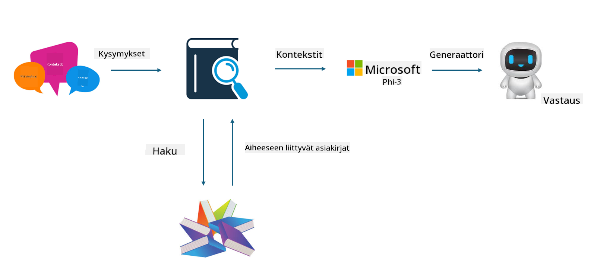

<!--
CO_OP_TRANSLATOR_METADATA:
{
  "original_hash": "743d7e9cb9c4e8ea642d77bee657a7fa",
  "translation_date": "2025-05-09T22:27:44+00:00",
  "source_file": "md/03.FineTuning/LetPhi3gotoIndustriy.md",
  "language_code": "fi"
}
-->
# **Anna Phi-3:n tulla alan asiantuntijaksi**

Jotta Phi-3-mallia voidaan soveltaa teollisuudessa, siihen täytyy lisätä alan liiketoimintadataa. Meillä on kaksi vaihtoehtoa: ensimmäinen on RAG (Retrieval Augmented Generation) ja toinen on hienosäätö (Fine Tuning).

## **RAG vs Hienosäätö**

### **Retrieval Augmented Generation**

RAG on datan hakua + tekstin generointia. Yrityksen jäsennelty ja jäsentämätön data tallennetaan vektoritietokantaan. Kun haetaan relevanttia sisältöä, löydetään asiaankuuluva yhteenveto ja sisältö muodostamaan kontekstin, ja LLM/SLM:n tekstin täydentämiskyky yhdistetään sisällön tuottamiseksi.

### **Hienosäätö**

Hienosäätö perustuu tietyn mallin parantamiseen. Siinä ei tarvitse aloittaa mallin algoritmista, mutta dataa pitää kerätä jatkuvasti. Jos haluat alan sovelluksiin tarkempaa terminologiaa ja kielen ilmaisua, hienosäätö on parempi valinta. Jos data kuitenkin muuttuu usein, hienosäätö voi olla monimutkaista.

### **Miten valita**

1. Jos vastauksemme edellyttää ulkoisen datan käyttöä, RAG on paras valinta

2. Jos tarvitset vakaan ja tarkan alan tiedon tuottamista, hienosäätö on hyvä vaihtoehto. RAG priorisoi asiaankuuluvan sisällön hakemisen, mutta ei aina tavoita erikoisalojen nyansseja.

3. Hienosäätö vaatii laadukkaan datan, ja jos dataa on vain vähän, sillä ei ole suurta vaikutusta. RAG on joustavampi

4. Hienosäätö on musta laatikko, metafysiikkaa, ja sen sisäistä mekanismia on vaikea ymmärtää. RAG:n avulla datan lähteen löytäminen on helpompaa, mikä auttaa tehokkaasti hallitsemaan harhaluuloja tai sisältövirheitä ja tarjoaa paremman läpinäkyvyyden.

### **Käyttötilanteet**

1. Vertikaaliset alat, jotka tarvitsevat erityistä ammattisanastoa ja ilmaisuja, ***Hienosäätö*** on paras valinta

2. QA-järjestelmät, joissa yhdistellään eri tietopisteitä, ***RAG*** on paras valinta

3. Automaattisten liiketoimintaprosessien yhdistelmässä ***RAG + Hienosäätö*** on paras valinta

## **Miten käyttää RAG:ia**

Vektoritietokanta on matemaattisessa muodossa tallennettu datakokoelma. Vektoritietokannat helpottavat koneoppimismallien aiempien syötteiden muistamista, mahdollistaen koneoppimisen hyödyntämisen hakujen, suositusten ja tekstin generoinnin kaltaisissa käyttötapauksissa. Data tunnistetaan samankaltaisuusmittareiden perusteella, ei pelkästään täsmällisten vastaavuuksien avulla, mikä antaa tietokoneille mahdollisuuden ymmärtää datan kontekstia.

Vektoritietokanta on avain RAG:n toteuttamiseen. Voimme muuntaa datan vektoritallennukseen vektoreita hyödyntävien mallien, kuten text-embedding-3:n, jina-ai-embeddingin ym. avulla.

Lisätietoja RAG-sovelluksen luomisesta [https://github.com/microsoft/Phi-3CookBook](https://github.com/microsoft/Phi-3CookBook?WT.mc_id=aiml-138114-kinfeylo)

## **Miten käyttää Hienosäätöä**

Yleisimmin käytetyt algoritmit hienosäädössä ovat Lora ja QLora. Miten valita?
- [Lisätietoja tästä esimerkkikirjasta](../../../../code/04.Finetuning/Phi_3_Inference_Finetuning.ipynb)
- [Python-esimerkki FineTuningistä](../../../../code/04.Finetuning/FineTrainingScript.py)

### **Lora ja QLora**

LoRA (Low-Rank Adaptation) ja QLoRA (Quantized Low-Rank Adaptation) ovat molemmat tekniikoita suurten kielimallien (LLM) hienosäätöön käyttämällä Parameter Efficient Fine Tuning (PEFT) -menetelmiä. PEFT-tekniikat on suunniteltu kouluttamaan malleja tehokkaammin kuin perinteiset menetelmät.  
LoRA on itsenäinen hienosäätötekniikka, joka vähentää muistinkäyttöä soveltamalla painopäivitysmatriisiin matalarankaisen approksimaation. Se tarjoaa nopean koulutusajan ja ylläpitää suorituskyvyn lähellä perinteisiä hienosäätömenetelmiä.

QLoRA on LoRAn laajennus, joka hyödyntää kvantisointitekniikoita muistinkäytön vähentämiseksi entisestään. QLoRA kvantisoi esikoulutetun LLM:n painoparametrien tarkkuuden 4-bittiseksi, mikä on muistitehokkaampaa kuin LoRA. QLoRA:n koulutus on kuitenkin noin 30 % hitaampaa kuin LoRAn koulutus kvantisointi- ja dekvantisointivaiheiden takia.

QLoRA käyttää LoRAa apuna korjaamaan kvantisoinnissa syntyneitä virheitä. QLoRA mahdollistaa valtavien, miljardeja parametreja sisältävien mallien hienosäädön suhteellisen pienillä ja helposti saatavilla olevilla GPU:illa. Esimerkiksi QLoRA voi hienosäätää 70 miljardin parametrin mallin, joka vaatisi 36 GPU:ta, käyttäen vain 2

**Vastuuvapauslauseke**:  
Tämä asiakirja on käännetty käyttämällä tekoälypohjaista käännöspalvelua [Co-op Translator](https://github.com/Azure/co-op-translator). Vaikka pyrimme tarkkuuteen, huomioithan, että automaattiset käännökset saattavat sisältää virheitä tai epätarkkuuksia. Alkuperäistä asiakirjaa sen alkuperäiskielellä tulee pitää auktoritatiivisena lähteenä. Tärkeiden tietojen osalta suositellaan ammattimaista ihmiskäännöstä. Emme ole vastuussa tämän käännöksen käytöstä johtuvista väärinymmärryksistä tai tulkinnoista.