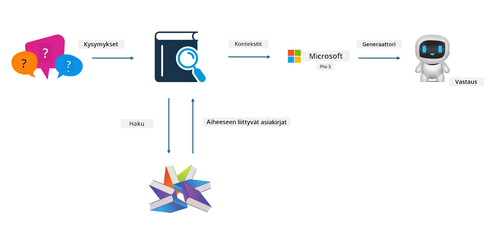
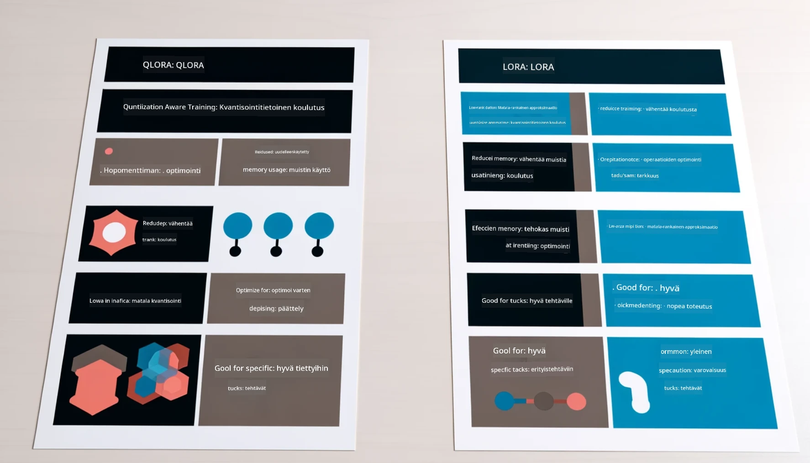

# **Anna Phi-3:n tulla alan asiantuntijaksi**

Jotta Phi-3-mallia voidaan käyttää tietyllä alalla, siihen täytyy lisätä alan liiketoimintadataa. Meillä on kaksi eri vaihtoehtoa: ensimmäinen on RAG (Retrieval Augmented Generation) ja toinen Fine Tuning.

## **RAG vs Fine-Tuning**

### **Retrieval Augmented Generation**

RAG tarkoittaa datan hakua + tekstin generointia. Yrityksen rakenteellinen ja rakenteeton data tallennetaan vektoritietokantaan. Kun haetaan relevanttia sisältöä, löydetään siihen liittyvä tiivistelmä ja sisältö, jotka muodostavat kontekstin, ja yhdistetään LLM/SLM:n tekstin täydentämiskyky sisällön luomiseksi.

### **Fine-tuning**

Fine-tuning perustuu tietyn mallin parantamiseen. Ei tarvitse aloittaa mallin algoritmista, mutta dataa täytyy kerätä jatkuvasti. Jos haluat tarkempaa terminologiaa ja kielen ilmaisua alan sovelluksissa, fine-tuning on parempi valinta. Jos data kuitenkin muuttuu usein, fine-tuning voi olla monimutkaista.

### **Miten valita**

1. Jos vastauksemme vaatii ulkopuolisen datan käyttöä, RAG on paras valinta

2. Jos tarvitset vakaata ja tarkkaa alan tietämystä, fine-tuning on hyvä vaihtoehto. RAG painottaa relevantin sisällön hakua, mutta ei välttämättä aina tavoita erikoisalojen vivahteita.

3. Fine-tuning vaatii laadukkaan datan, ja jos data on vain pienen alueen kattava, vaikutus ei ole merkittävä. RAG on joustavampi.

4. Fine-tuning on musta laatikko, metafysiikkaa, ja sen sisäistä mekanismia on vaikea ymmärtää. RAG puolestaan helpottaa datan lähteen löytämistä, mikä auttaa tehokkaasti korjaamaan harhaluuloja tai sisältövirheitä ja tarjoaa paremman läpinäkyvyyden.

### **Käyttötapaukset**

1. Vertikaaliset alat, jotka vaativat erityistä ammattisanastoa ja ilmaisuja, ***Fine-tuning*** on paras valinta

2. QA-järjestelmät, joissa yhdistellään eri tietopisteitä, ***RAG*** on paras valinta

3. Automaattisten liiketoimintaprosessien yhdistelmässä ***RAG + Fine-tuning*** on paras valinta

## **Miten käyttää RAG:ia**

Vektoritietokanta on matemaattisessa muodossa tallennettu datakokoelma. Vektoritietokannat helpottavat koneoppimismallien aiempien syötteiden muistamista, mahdollistaen koneoppimisen hyödyntämisen esimerkiksi haussa, suosituksissa ja tekstin generoinnissa. Data voidaan tunnistaa samankaltaisuusmittareiden perusteella, ei pelkästään täsmällisten osumien avulla, jolloin tietokoneet ymmärtävät datan kontekstin.

Vektoritietokanta on avain RAG:n toteuttamiseen. Voimme muuntaa datan vektoritallennukseen vektorimalleilla, kuten text-embedding-3, jina-ai-embedding jne.

Lisätietoja RAG-sovelluksen luomisesta [https://github.com/microsoft/Phi-3CookBook](https://github.com/microsoft/Phi-3CookBook?WT.mc_id=aiml-138114-kinfeylo) 

## **Miten käyttää Fine-tuningia**

Yleisimmin käytetyt algoritmit Fine-tuningissa ovat Lora ja QLora. Miten valita?
- [Lisätietoja tämän esimerkkimuistikirjan avulla](../../../../code/04.Finetuning/Phi_3_Inference_Finetuning.ipynb)
- [Python FineTuning -esimerkki](../../../../code/04.Finetuning/FineTrainingScript.py)

### **Lora ja QLora**

LoRA (Low-Rank Adaptation) ja QLoRA (Quantized Low-Rank Adaptation) ovat molemmat tekniikoita suurten kielimallien (LLM) hienosäätöön käyttäen Parameter Efficient Fine Tuning (PEFT) -menetelmiä. PEFT-tekniikat on suunniteltu kouluttamaan malleja tehokkaammin kuin perinteiset menetelmät.  
LoRA on itsenäinen hienosäätötekniikka, joka vähentää muistinkulutusta soveltamalla matalarankista approksimaatiota painopäivitysmatriisiin. Se tarjoaa nopean koulutusajan ja säilyttää suorituskyvyn lähellä perinteisiä hienosäätömenetelmiä.

QLoRA on LoRAn laajennettu versio, joka hyödyntää kvantisointitekniikoita vähentääkseen muistinkulutusta entisestään. QLoRA kvantoi esikoulutetun LLM:n painoparametrien tarkkuuden 4-bittiseksi, mikä on muistitehokkaampaa kuin LoRA. Koulutus QLoRAlla on kuitenkin noin 30 % hitaampaa kuin LoRAlla kvantisointi- ja dekantisointivaiheiden vuoksi.

QLoRA käyttää LoRAa apuvälineenä korjaamaan kvantisoinnista aiheutuneita virheitä. QLoRA mahdollistaa valtavien, miljardien parametrien mallien hienosäädön suhteellisen pienillä ja helposti saatavilla olevilla GPU:illa. Esimerkiksi QLoRA voi hienosäätää 70 miljardin parametrin mallin, joka normaalisti vaatisi 36 GPU:ta, vain 2:lla.

**Vastuuvapauslauseke**:  
Tämä asiakirja on käännetty käyttämällä tekoälypohjaista käännöspalvelua [Co-op Translator](https://github.com/Azure/co-op-translator). Vaikka pyrimme tarkkuuteen, huomioithan, että automaattikäännöksissä saattaa esiintyä virheitä tai epätarkkuuksia. Alkuperäistä asiakirjaa sen alkuperäiskielellä tulee pitää virallisena lähteenä. Tärkeissä tiedoissa suositellaan ammattimaista ihmiskäännöstä. Emme ole vastuussa tämän käännöksen käytöstä aiheutuvista väärinymmärryksistä tai tulkinnoista.