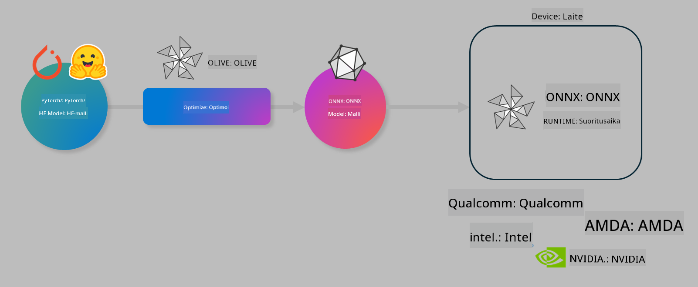

<!--
CO_OP_TRANSLATOR_METADATA:
{
  "original_hash": "6bbe47de3b974df7eea29dfeccf6032b",
  "translation_date": "2025-05-09T22:38:14+00:00",
  "source_file": "md/03.FineTuning/olive-lab/readme.md",
  "language_code": "fi"
}
-->
# Lab. Optimoi tekoälymalleja laitteen päällä suoritettavaa inferenssiä varten

## Johdanto

> [!IMPORTANT]
> Tämä laboratorio vaatii **Nvidia A10 tai A100 GPU:n** sekä siihen liittyvät ajurit ja CUDA-työkalupaketin (versio 12+) asennettuna.

> [!NOTE]
> Tämä on **35 minuutin** laboratorio, joka tarjoaa käytännönläheisen johdatuksen mallien optimoinnin keskeisiin käsitteisiin laitteen päällä suoritettavaa inferenssiä varten OLIVE-työkalun avulla.

## Oppimistavoitteet

Tämän laboratorion jälkeen osaat käyttää OLIVEa:

- Kvantisointiin AWQ-kvantisointimenetelmällä.
- Hienosäätämään tekoälymallia tiettyyn tehtävään.
- Luomaan LoRA-adaptereita (hienosäädetty malli) tehokkaaseen inferenssiin ONNX Runtime -ympäristössä.

### Mikä on Olive

Olive (*O*NNX *live*) on mallin optimointityökalu, jonka mukana tulee komentorivityökalu (CLI), joka mahdollistaa mallien toimittamisen ONNX runtime +++https://onnxruntime.ai+++ ympäristöön laadukkaasti ja tehokkaasti.



Olive ottaa syötteenä yleensä PyTorch- tai Hugging Face -mallin ja tuottaa siitä optimoidun ONNX-mallin, joka suoritetaan laitteella (käyttökohde) ONNX runtime -ympäristössä. Olive optimoi mallin käyttökohteen tekoälykiihdyttimelle (NPU, GPU, CPU), jonka tarjoaa laitevalmistaja kuten Qualcomm, AMD, Nvidia tai Intel.

Olive suorittaa *työnkulun*, joka on järjestetty sarja yksittäisiä mallin optimointitehtäviä, joita kutsutaan *passauksiksi*. Esimerkkejä passauksista ovat mallin pakkaus, graafin kaappaus, kvantisointi ja graafin optimointi. Jokaisella passauksella on joukko parametreja, joita voi säätää parhaiden mittarien, kuten tarkkuuden ja latenssin, saavuttamiseksi. Olive käyttää hakualgoritmia, joka automaattisesti hienosäätää passauksia yksi kerrallaan tai useita yhdessä.

#### Olive-edut

- **Vähentää turhautumista ja aikaa**, joka kuluu kokeilemalla eri tekniikoita graafin optimointiin, pakkaamiseen ja kvantisointiin manuaalisesti. Määritä laatu- ja suorituskykyvaatimukset, niin Olive etsii automaattisesti parhaan mallin sinulle.
- **Yli 40 valmiiksi rakennettua mallin optimointikomponenttia**, jotka kattavat uusimmat tekniikat kvantisoinnissa, pakkaamisessa, graafin optimoinnissa ja hienosäädössä.
- **Helppokäyttöinen komentorivityökalu** yleisiin mallin optimointitehtäviin, kuten olive quantize, olive auto-opt, olive finetune.
- Mallin pakkaus ja käyttöönotto sisäänrakennettuna.
- Tukee mallien luomista **Multi LoRA -palvelua varten**.
- Työnkulkujen rakentaminen YAML/JSON-muodossa mallin optimoinnin ja käyttöönoton orkestrointiin.
- **Hugging Face** ja **Azure AI** -integraatio.
- Sisäänrakennettu **välimuistimekanismi** kustannusten **säästämiseksi**.

## Laboratorio-ohjeet

> [!NOTE]
> Varmista, että olet perustanut Azure AI Hubin ja projektin sekä määrittänyt A100-laskentaympäristön Lab 1:n ohjeiden mukaisesti.

### Vaihe 0: Yhdistä Azure AI Compute -ympäristöösi

Yhdistät Azure AI Compute -ympäristöön **VS Code** -etätoiminnon avulla.

1. Avaa **VS Code** -työpöytäsovellus.
2. Avaa **komentopaletti** painamalla **Shift+Ctrl+P**.
3. Etsi komentopalettista **AzureML - remote: Connect to compute instance in New Window**.
4. Seuraa näytön ohjeita yhdistääksesi Compute-ympäristöön. Tämä sisältää Azure-tilauksesi, resurssiryhmäsi, projektisi ja Lab 1:ssä määrittämäsi laskentaympäristön valinnan.
5. Kun olet yhdistetty Azure ML Compute -solmuusi, tämä näkyy **VS Coden vasemmassa alakulmassa** `><Azure ML: Compute Name`

### Vaihe 1: Kopioi tämä repo

VS Codessa voit avata uuden terminaalin painamalla **Ctrl+J** ja kloonata tämän repoon:

Terminaalissa näet kehotteen

```
azureuser@computername:~/cloudfiles/code$ 
```
Kloonaa ratkaisu

```bash
cd ~/localfiles
git clone https://github.com/microsoft/phi-3cookbook.git
```

### Vaihe 2: Avaa kansio VS Codessa

Avaa oikea kansio VS Codessa suorittamalla terminaalissa seuraava komento, joka avaa uuden ikkunan:

```bash
code phi-3cookbook/code/04.Finetuning/Olive-lab
```

Vaihtoehtoisesti voit avata kansion valitsemalla **File** > **Open Folder**.

### Vaihe 3: Riippuvuudet

Avaa terminaali VS Codessa Azure AI Compute -instanssissasi (vinkki: **Ctrl+J**) ja suorita seuraavat komennot asentaaksesi riippuvuudet:

```bash
conda create -n olive-ai python=3.11 -y
conda activate olive-ai
pip install -r requirements.txt
az extension remove -n azure-cli-ml
az extension add -n ml
```

> [!NOTE]
> Riippuvuuksien asentaminen kestää noin 5 minuuttia.

Tässä laboratoriossa lataat ja lähetät malleja Azure AI Model -katalogiin. Jotta pääset käyttämään mallikatalogia, kirjaudu Azureen seuraavasti:

```bash
az login
```

> [!NOTE]
> Kirjautumisen yhteydessä sinua pyydetään valitsemaan tilaus. Varmista, että valitset tämän laboratorion käytettävissä olevan tilauksen.

### Vaihe 4: Suorita Olive-komennot

Avaa terminaali VS Codessa Azure AI Compute -instanssissasi (vinkki: **Ctrl+J**) ja varmista, että `olive-ai` conda-ympäristö on aktivoitu:

```bash
conda activate olive-ai
```

Suorita seuraavat Olive-komennot komentorivillä.

1. **Tarkastele dataa:** Tässä esimerkissä hienosäädät Phi-3.5-Mini -mallia siten, että se erikoistuu vastaamaan matkailuun liittyviin kysymyksiin. Alla oleva koodi näyttää ensimmäiset tietueet datasetistä, joka on JSON lines -muodossa:

    ```bash
    head data/data_sample_travel.jsonl
    ```

1. **Kvantisoi malli:** Ennen mallin koulutusta kvantisoi malli seuraavalla komennolla, joka käyttää Active Aware Quantization (AWQ) -tekniikkaa +++https://arxiv.org/abs/2306.00978+++. AWQ kvantisoi mallin painot ottamalla huomioon inferenssin aikana tuotetut aktivoinnit. Tämä tarkoittaa, että kvantisointiprosessi huomioi aktivointien todellisen datan jakauman, mikä johtaa paremman tarkkuuden säilyttämiseen verrattuna perinteisiin painokvantisointimenetelmiin.

    ```bash
    olive quantize \
       --model_name_or_path microsoft/Phi-3.5-mini-instruct \
       --trust_remote_code \
       --algorithm awq \
       --output_path models/phi/awq \
       --log_level 1
    ```

    AWQ-kvantisointi kestää noin **8 minuuttia** ja pienentää mallin koon noin **7,5GB:stä 2,5GB:iin**.

    Tässä laboratoriossa näytämme, miten malleja syötetään Hugging Facesta (esimerkiksi: `microsoft/Phi-3.5-mini-instruct`). However, Olive also allows you to input models from the Azure AI catalog by updating the `model_name_or_path` argument to an Azure AI asset ID (for example:  `azureml://registries/azureml/models/Phi-3.5-mini-instruct/versions/4`). 

1. **Train the model:** Next, the `olive finetune` -komento hienosäätää kvantisoidun mallin. Kvantisointi *ennen* hienosäätöä antaa paremman tarkkuuden, koska hienosäätöprosessi korjaa osan kvantisoinnin aiheuttamasta tarkkuuden menetyksestä.

    ```bash
    olive finetune \
        --method lora \
        --model_name_or_path models/phi/awq \
        --data_files "data/data_sample_travel.jsonl" \
        --data_name "json" \
        --text_template "<|user|>\n{prompt}<|end|>\n<|assistant|>\n{response}<|end|>" \
        --max_steps 100 \
        --output_path ./models/phi/ft \
        --log_level 1
    ```

    Hienosäätö kestää noin **6 minuuttia** (100 askelta).

1. **Optimoi:** Kun malli on koulutettu, optimoi malli Olive-komennolla `auto-opt` command, which will capture the ONNX graph and automatically perform a number of optimizations to improve the model performance for CPU by compressing the model and doing fusions. It should be noted, that you can also optimize for other devices such as NPU or GPU by just updating the `--device` and `--provider`. Tässä laboratoriossa käytämme CPU:ta.

    ```bash
    olive auto-opt \
       --model_name_or_path models/phi/ft/model \
       --adapter_path models/phi/ft/adapter \
       --device cpu \
       --provider CPUExecutionProvider \
       --use_ort_genai \
       --output_path models/phi/onnx-ao \
       --log_level 1
    ```

    Optimointi kestää noin **5 minuuttia**.

### Vaihe 5: Mallin inferenssin pika-testi

Testataksesi mallin inferenssiä, luo kansioosi Python-tiedosto nimeltä **app.py** ja kopioi siihen seuraava koodi:

```python
import onnxruntime_genai as og
import numpy as np

print("loading model and adapters...", end="", flush=True)
model = og.Model("models/phi/onnx-ao/model")
adapters = og.Adapters(model)
adapters.load("models/phi/onnx-ao/model/adapter_weights.onnx_adapter", "travel")
print("DONE!")

tokenizer = og.Tokenizer(model)
tokenizer_stream = tokenizer.create_stream()

params = og.GeneratorParams(model)
params.set_search_options(max_length=100, past_present_share_buffer=False)
user_input = "what is the best thing to see in chicago"
params.input_ids = tokenizer.encode(f"<|user|>\n{user_input}<|end|>\n<|assistant|>\n")

generator = og.Generator(model, params)

generator.set_active_adapter(adapters, "travel")

print(f"{user_input}")

while not generator.is_done():
    generator.compute_logits()
    generator.generate_next_token()

    new_token = generator.get_next_tokens()[0]
    print(tokenizer_stream.decode(new_token), end='', flush=True)

print("\n")
```

Suorita koodi komennolla:

```bash
python app.py
```

### Vaihe 6: Lataa malli Azure AI:hin

Mallin lataaminen Azure AI -mallivarastoon mahdollistaa mallin jakamisen kehitystiimisi jäsenten kanssa ja hoitaa myös versionhallinnan. Lataa malli suorittamalla seuraava komento:

> [!NOTE]
> Päivitä `{}` placeholders with the name of your resource group and Azure AI Project Name. 

To find your resource group `"resourceGroup"` ja Azure AI -projektin nimi ennen komennon suorittamista

```
az ml workspace show
```

Vaihtoehtoisesti voit mennä +++ai.azure.com+++ ja valita **management center** > **project** > **overview**

Päivitä `{}`-paikkamerkit omalla resurssiryhmän ja Azure AI -projektisi nimellä.

```bash
az ml model create \
    --name ft-for-travel \
    --version 1 \
    --path ./models/phi/onnx-ao \
    --resource-group {RESOURCE_GROUP_NAME} \
    --workspace-name {PROJECT_NAME}
```

Voit sitten nähdä ladatun mallisi ja ottaa sen käyttöön osoitteessa https://ml.azure.com/model/list

**Vastuuvapauslauseke**:  
Tämä asiakirja on käännetty käyttämällä tekoälypohjaista käännöspalvelua [Co-op Translator](https://github.com/Azure/co-op-translator). Pyrimme tarkkuuteen, mutta huomioithan, että automaattikäännöksissä saattaa esiintyä virheitä tai epätarkkuuksia. Alkuperäinen asiakirja sen alkuperäiskielellä on virallinen lähde. Tärkeissä asioissa suositellaan ammattimaista ihmiskäännöstä. Emme ole vastuussa tämän käännöksen käytöstä aiheutuvista väärinymmärryksistä tai tulkinnoista.