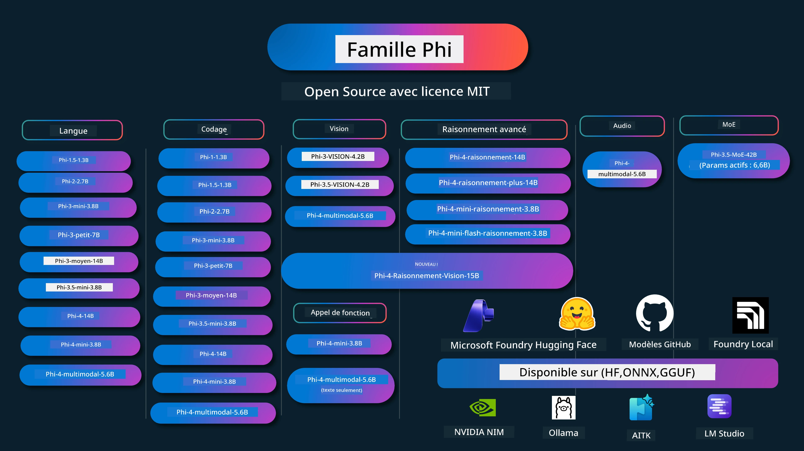

# Phi Cookbook : Exemples Pratiques avec les Modèles Phi de Microsoft

[](https://codespaces.new/microsoft/phicookbook)
[](https://vscode.dev/redirect?url=vscode://ms-vscode-remote.remote-containers/cloneInVolume?url=https://github.com/microsoft/phicookbook)

[](https://GitHub.com/microsoft/phicookbook/graphs/contributors/?WT.mc_id=aiml-137032-kinfeylo)
[](https://GitHub.com/microsoft/phicookbook/issues/?WT.mc_id=aiml-137032-kinfeylo)
[](https://GitHub.com/microsoft/phicookbook/pulls/?WT.mc_id=aiml-137032-kinfeylo)
[](http://makeapullrequest.com?WT.mc_id=aiml-137032-kinfeylo)

[](https://GitHub.com/microsoft/phicookbook/watchers/?WT.mc_id=aiml-137032-kinfeylo)
[](https://GitHub.com/microsoft/phicookbook/network/?WT.mc_id=aiml-137032-kinfeylo)
[](https://GitHub.com/microsoft/phicookbook/stargazers/?WT.mc_id=aiml-137032-kinfeylo)

[](https://discord.com/invite/ByRwuEEgH4)

Phi est une série de modèles d'IA open source développés par Microsoft.

Phi est actuellement le modèle de langage petit (SLM) le plus puissant et rentable, avec d'excellents résultats aux benchmarks dans de nombreux domaines tels que multilingue, raisonnement, génération de texte/chat, codage, images, audio et autres scénarios.

Vous pouvez déployer Phi dans le cloud ou sur des appareils en périphérie, et vous pouvez facilement construire des applications d'IA générative avec une puissance de calcul limitée.

Suivez ces étapes pour commencer à utiliser ces ressources :
1. **Forkez le dépôt** : Cliquez sur [](https://GitHub.com/microsoft/phicookbook/network/?WT.mc_id=aiml-137032-kinfeylo)
2. **Clonez le dépôt** :   `git clone https://github.com/microsoft/PhiCookBook.git`
3. [**Rejoignez la communauté Microsoft AI Discord et rencontrez des experts et développeurs**](https://discord.com/invite/ByRwuEEgH4?WT.mc_id=aiml-137032-kinfeylo)



### 🌐 Support Multilingue

#### Pris en charge via GitHub Action (Automatisé et Toujours à Jour)

<!-- CO-OP TRANSLATOR LANGUAGES TABLE START -->
[Arabe](../ar/README.md) | [Bengali](../bn/README.md) | [Bulgare](../bg/README.md) | [Birman (Myanmar)](../my/README.md) | [Chinois (Simplifié)](../zh-CN/README.md) | [Chinois (Traditionnel, Hong Kong)](../zh-HK/README.md) | [Chinois (Traditionnel, Macao)](../zh-MO/README.md) | [Chinois (Traditionnel, Taïwan)](../zh-TW/README.md) | [Croate](../hr/README.md) | [Tchèque](../cs/README.md) | [Danois](../da/README.md) | [Néerlandais](../nl/README.md) | [Estonien](../et/README.md) | [Finnois](../fi/README.md) | [Français](./README.md) | [Allemand](../de/README.md) | [Grec](../el/README.md) | [Hébreu](../he/README.md) | [Hindi](../hi/README.md) | [Hongrois](../hu/README.md) | [Indonésien](../id/README.md) | [Italien](../it/README.md) | [Japonais](../ja/README.md) | [Kannada](../kn/README.md) | [Coréen](../ko/README.md) | [Lituanien](../lt/README.md) | [Malais](../ms/README.md) | [Malayalam](../ml/README.md) | [Marathi](../mr/README.md) | [Népalais](../ne/README.md) | [Pidgin Nigérian](../pcm/README.md) | [Norvégien](../no/README.md) | [Persan (Farsi)](../fa/README.md) | [Polonais](../pl/README.md) | [Portugais (Brésil)](../pt-BR/README.md) | [Portugais (Portugal)](../pt-PT/README.md) | [Punjabi (Gurmukhi)](../pa/README.md) | [Roumain](../ro/README.md) | [Russe](../ru/README.md) | [Serbe (Cyrillique)](../sr/README.md) | [Slovaque](../sk/README.md) | [Slovène](../sl/README.md) | [Espagnol](../es/README.md) | [Swahili](../sw/README.md) | [Suédois](../sv/README.md) | [Tagalog (Philippin)](../tl/README.md) | [Tamoul](../ta/README.md) | [Telugu](../te/README.md) | [Thaïlandais](../th/README.md) | [Turc](../tr/README.md) | [Ukrainien](../uk/README.md) | [Urdu](../ur/README.md) | [Vietnamien](../vi/README.md)

> **Préférez cloner localement ?**
>
> Ce dépôt inclut plus de 50 traductions linguistiques ce qui augmente significativement la taille du téléchargement. Pour cloner sans les traductions, utilisez le sparse checkout :
>
> **Bash / macOS / Linux:**  
> ```bash
> git clone --filter=blob:none --sparse https://github.com/microsoft/PhiCookBook.git
> cd PhiCookBook
> git sparse-checkout set --no-cone '/*' '!translations' '!translated_images'
> ```
>
> **CMD (Windows):**  
> ```cmd
> git clone --filter=blob:none --sparse https://github.com/microsoft/PhiCookBook.git
> cd PhiCookBook
> git sparse-checkout set --no-cone "/*" "!translations" "!translated_images"
> ```
>
> Cela vous fournit tout ce dont vous avez besoin pour suivre le cours avec un téléchargement beaucoup plus rapide.
<!-- CO-OP TRANSLATOR LANGUAGES TABLE END -->

## Table des Matières

- Introduction
  - [Bienvenue dans la famille Phi](./md/01.Introduction/01/01.PhiFamily.md)
  - [Configurer votre environnement](./md/01.Introduction/01/01.EnvironmentSetup.md)
  - [Comprendre les technologies clés](./md/01.Introduction/01/01.Understandingtech.md)
  - [Sécurité de l'IA pour les modèles Phi](./md/01.Introduction/01/01.AISafety.md)
  - [Support matériel Phi](./md/01.Introduction/01/01.Hardwaresupport.md)
  - [Modèles Phi & Disponibilité sur différentes plateformes](./md/01.Introduction/01/01.Edgeandcloud.md)
  - [Utiliser Guidance-ai et Phi](./md/01.Introduction/01/01.Guidance.md)
  - [Modèles sur GitHub Marketplace](https://github.com/marketplace/models)
  - [Catalogue de modèles Azure AI](https://ai.azure.com)

- Inférence Phi dans différents environnements
    -  [Hugging face](./md/01.Introduction/02/01.HF.md)
    -  [Modèles GitHub](./md/01.Introduction/02/02.GitHubModel.md)
    -  [Catalogue Azure AI Foundry](./md/01.Introduction/02/03.AzureAIFoundry.md)
    -  [Ollama](./md/01.Introduction/02/04.Ollama.md)
    -  [Boîte à outils IA VSCode (AITK)](./md/01.Introduction/02/05.AITK.md)
    -  [NVIDIA NIM](./md/01.Introduction/02/06.NVIDIA.md)
    -  [Foundry Local](./md/01.Introduction/02/07.FoundryLocal.md)

- Inférence Phi Family
    - [Inférence Phi sur iOS](./md/01.Introduction/03/iOS_Inference.md)
    - [Inférence Phi sur Android](./md/01.Introduction/03/Android_Inference.md)
    - [Inférence Phi sur Jetson](./md/01.Introduction/03/Jetson_Inference.md)
    - [Inférence Phi sur AI PC](./md/01.Introduction/03/AIPC_Inference.md)
    - [Inférence Phi avec Apple MLX Framework](./md/01.Introduction/03/MLX_Inference.md)
    - [Inférence Phi sur serveur local](./md/01.Introduction/03/Local_Server_Inference.md)
    - [Inférence Phi sur serveur distant avec AI Toolkit](./md/01.Introduction/03/Remote_Interence.md)
    - [Inférence Phi avec Rust](./md/01.Introduction/03/Rust_Inference.md)
    - [Inférence Phi – Vision en local](./md/01.Introduction/03/Vision_Inference.md)
    - [Inférence Phi avec Kaito AKS, Conteneurs Azure (support officiel)](./md/01.Introduction/03/Kaito_Inference.md)
-  [Quantification Phi Family](./md/01.Introduction/04/QuantifyingPhi.md)
    - [Quantification Phi-3.5 / 4 avec llama.cpp](./md/01.Introduction/04/UsingLlamacppQuantifyingPhi.md)
    - [Quantification Phi-3.5 / 4 avec les extensions Generative AI pour onnxruntime](./md/01.Introduction/04/UsingORTGenAIQuantifyingPhi.md)
    - [Quantification Phi-3.5 / 4 avec Intel OpenVINO](./md/01.Introduction/04/UsingIntelOpenVINOQuantifyingPhi.md)
    - [Quantification Phi-3.5 / 4 avec Apple MLX Framework](./md/01.Introduction/04/UsingAppleMLXQuantifyingPhi.md)

- Évaluation Phi
    - [IA Responsable](./md/01.Introduction/05/ResponsibleAI.md)
    - [Azure AI Foundry pour l'évaluation](./md/01.Introduction/05/AIFoundry.md)
    - [Utiliser Promptflow pour l'évaluation](./md/01.Introduction/05/Promptflow.md)
 
- RAG avec Azure AI Search
    - [Comment utiliser Phi-4-mini et Phi-4-multimodal(RAG) avec Azure AI Search](https://github.com/microsoft/PhiCookBook/blob/main/code/06.E2E/E2E_Phi-4-RAG-Azure-AI-Search.ipynb)

- Exemples de développement d'applications Phi
  - Applications Texte & Chat
    - Échantillons Phi-4 🆕
      - [📓] [Discussion avec modèle ONNX Phi-4-mini](./md/02.Application/01.TextAndChat/Phi4/ChatWithPhi4ONNX/README.md)
      - [Chat avec modèle ONNX Phi-4 local .NET](../../md/04.HOL/dotnet/src/LabsPhi4-Chat-01OnnxRuntime)
      - [Application console Chat .NET avec Phi-4 ONNX utilisant Sementic Kernel](../../md/04.HOL/dotnet/src/LabsPhi4-Chat-02SK)
    - Échantillons Phi-3 / 3.5
      - [Chatbot local dans le navigateur utilisant Phi3, ONNX Runtime Web et WebGPU](https://github.com/microsoft/onnxruntime-inference-examples/tree/main/js/chat)
      - [OpenVino Chat](./md/02.Application/01.TextAndChat/Phi3/E2E_OpenVino_Chat.md)
      - [Modèle Multiple - Phi-3-mini interactif et OpenAI Whisper](./md/02.Application/01.TextAndChat/Phi3/E2E_Phi-3-mini_with_whisper.md)
      - [MLFlow - Création d'une enveloppe et utilisation de Phi-3 avec MLFlow](./md//02.Application/01.TextAndChat/Phi3/E2E_Phi-3-MLflow.md)
      - [Optimisation de modèle - Comment optimiser le modèle Phi-3-min pour ONNX Runtime Web avec Olive](https://github.com/microsoft/Olive/tree/main/examples/phi3)
      - [Application WinUI3 avec Phi-3 mini-4k-instruct-onnx](https://github.com/microsoft/Phi3-Chat-WinUI3-Sample/)
      -[Exemple d'application de prises de notes alimentée par l'IA Multi Modèle WinUI3](https://github.com/microsoft/ai-powered-notes-winui3-sample)
      - [Affinage et intégration de modèles Phi-3 personnalisés avec Prompt flow](./md/02.Application/01.TextAndChat/Phi3/E2E_Phi-3-FineTuning_PromptFlow_Integration.md)
      - [Affinage et intégration de modèles Phi-3 personnalisés avec Prompt flow dans Azure AI Foundry](./md/02.Application/01.TextAndChat/Phi3/E2E_Phi-3-FineTuning_PromptFlow_Integration_AIFoundry.md)
      - [Évaluation du modèle Phi-3 / Phi-3.5 affiné dans Azure AI Foundry en se concentrant sur les principes d'IA responsable de Microsoft](./md/02.Application/01.TextAndChat/Phi3/E2E_Phi-3-Evaluation_AIFoundry.md)
      - [📓] [Exemple de prédiction linguistique Phi-3.5-mini-instruct (Chinois/Anglais)](./md/02.Application/01.TextAndChat/Phi3/phi3-instruct-demo.ipynb)
      - [Chatbot Phi-3.5-Instruct WebGPU RAG](./md/02.Application/01.TextAndChat/Phi3/WebGPUWithPhi35Readme.md)
      - [Utilisation du GPU Windows pour créer une solution Prompt flow avec Phi-3.5-Instruct ONNX](./md/02.Application/01.TextAndChat/Phi3/UsingPromptFlowWithONNX.md)
      - [Utilisation de Microsoft Phi-3.5 tflite pour créer une application Android](./md/02.Application/01.TextAndChat/Phi3/UsingPhi35TFLiteCreateAndroidApp.md)
      - [Exemple Q&A .NET utilisant le modèle local ONNX Phi-3 avec Microsoft.ML.OnnxRuntime](../../md/04.HOL/dotnet/src/LabsPhi301)
      - [Application console chat .NET avec Semantic Kernel et Phi-3](../../md/04.HOL/dotnet/src/LabsPhi302)

  - Exemples de code Azure AI Inference SDK basés sur du code 
    - Exemples Phi-4 🆕
      - [📓] [Générer du code de projet avec Phi-4-multimodal](./md/02.Application/02.Code/Phi4/GenProjectCode/README.md)
    - Exemples Phi-3 / 3.5
      - [Construisez votre propre Visual Studio Code GitHub Copilot Chat avec Microsoft Phi-3 Family](./md/02.Application/02.Code/Phi3/VSCodeExt/README.md)
      - [Créez votre propre agent de chat Visual Studio Code Copilot avec Phi-3.5 par GitHub Models](/md/02.Application/02.Code/Phi3/CreateVSCodeChatAgentWithGitHubModels.md)

  - Exemples de raisonnement avancé
    - Exemples Phi-4 🆕
      - [📓] [Exemples Phi-4-mini-raisonnement ou Phi-4-raisonnement](./md/02.Application/03.AdvancedReasoning/Phi4/AdvancedResoningPhi4mini/README.md)
      - [📓] [Affinage de Phi-4-mini-raisonnement avec Microsoft Olive](./md/02.Application/03.AdvancedReasoning/Phi4/AdvancedResoningPhi4mini/olive_ft_phi_4_reasoning_with_medicaldata.ipynb)
      - [📓] [Affinage de Phi-4-mini-raisonnement avec Apple MLX](./md/02.Application/03.AdvancedReasoning/Phi4/AdvancedResoningPhi4mini/mlx_ft_phi_4_reasoning_with_medicaldata.ipynb)
      - [📓] [Phi-4-mini-raisonnement avec GitHub Models](./md/02.Application/02.Code/Phi4r/github_models_inference.ipynb)
      - [📓] [Phi-4-mini-raisonnement avec Azure AI Foundry Models](./md/02.Application/02.Code/Phi4r/azure_models_inference.ipynb)
  - Démos
      - [Démos Phi-4-mini hébergées sur Hugging Face Spaces](https://huggingface.co/spaces/microsoft/phi-4-mini?WT.mc_id=aiml-137032-kinfeylo)
      - [Démos Phi-4-multimodal hébergées sur Hugging Face Spaces](https://huggingface.co/spaces/microsoft/phi-4-multimodal?WT.mc_id=aiml-137032-kinfeylo)
  - Exemples Vision
    - Exemples Phi-4 🆕
      - [📓] [Utilisez Phi-4-multimodal pour lire des images et générer du code](./md/02.Application/04.Vision/Phi4/CreateFrontend/README.md) 
    - Exemples Phi-3 / 3.5
      -  [📓][Phi-3-vision-Image texte à texte](./md/02.Application/04.Vision/Phi3/E2E_Phi-3-vision-image-text-to-text-online-endpoint.ipynb)
      - [Phi-3-vision-ONNX](https://onnxruntime.ai/docs/genai/tutorials/phi3-v.html)
      - [📓][Phi-3-vision CLIP Embedding](./md/02.Application/04.Vision/Phi3/E2E_Phi-3-vision-image-text-to-text-online-endpoint.ipynb)
      - [DEMO : Phi-3 Recycling](https://github.com/jennifermarsman/PhiRecycling/)
      - [Phi-3-vision - Assistant linguistique visuel - avec Phi3-Vision et OpenVINO](https://docs.openvino.ai/nightly/notebooks/phi-3-vision-with-output.html)
      - [Phi-3 Vision Nvidia NIM](./md/02.Application/04.Vision/Phi3/E2E_Nvidia_NIM_Vision.md)
      - [Phi-3 Vision OpenVino](./md/02.Application/04.Vision/Phi3/E2E_OpenVino_Phi3Vision.md)
      - [📓][Exemple Phi-3.5 Vision multi-cadres ou multi-images](./md/02.Application/04.Vision/Phi3/phi3-vision-demo.ipynb)
      - [Phi-3 Vision modèle local ONNX utilisant Microsoft.ML.OnnxRuntime .NET](../../md/04.HOL/dotnet/src/LabsPhi303)
      - [Modèle local ONNX Vision Phi-3 basé sur un menu utilisant Microsoft.ML.OnnxRuntime .NET](../../md/04.HOL/dotnet/src/LabsPhi304)

  - Exemples Mathématiques
    - Exemples Phi-4-Mini-Flash-Reasoning-Instruct 🆕 [Démo Math avec Phi-4-Mini-Flash-Reasoning-Instruct](./md/02.Application/09.Math/MathDemo.ipynb)

  - Exemples Audio
    - Exemples Phi-4 🆕
      - [📓] [Extraction de transcriptions audio utilisant Phi-4-multimodal](./md/02.Application/05.Audio/Phi4/Transciption/README.md)
      - [📓] [Exemple audio Phi-4-multimodal](./md/02.Application/05.Audio/Phi4/Siri/demo.ipynb)
      - [📓] [Exemple de traduction orale Phi-4-multimodal](./md/02.Application/05.Audio/Phi4/Translate/demo.ipynb)
      - [Application console .NET utilisant Phi-4-multimodal Audio pour analyser un fichier audio et générer la transcription](../../md/04.HOL/dotnet/src/LabsPhi4-MultiModal-02Audio)

  - Exemples MOE
    - Exemples Phi-3 / 3.5
      - [📓] [Exemples de modèles de mixture d’experts (MoEs) Phi-3.5 sur les réseaux sociaux](./md/02.Application/06.MoE/Phi3/phi3_moe_demo.ipynb)
      - [📓] [Création d’un pipeline Retrieval-Augmented Generation (RAG) avec NVIDIA NIM Phi-3 MOE, Azure AI Search et LlamaIndex](./md/02.Application/06.MoE/Phi3/azure-ai-search-nvidia-rag.ipynb)
      - 
  - Exemples d'appel de fonction
    - Exemples Phi-4 🆕
      -  [📓] [Utilisation de l’appel de fonction avec Phi-4-mini](./md/02.Application/07.FunctionCalling/Phi4/FunctionCallingBasic/README.md)
      -  [📓] [Utilisation de l’appel de fonction pour créer des multi-agents avec Phi-4-mini](./md/02.Application/07.FunctionCalling/Phi4/Multiagents/Phi_4_mini_multiagent.ipynb)
      -  [📓] [Utilisation de l’appel de fonction avec Ollama](./md/02.Application/07.FunctionCalling/Phi4/Ollama/ollama_functioncalling.ipynb)
      -  [📓] [Utilisation de l’appel de fonction avec ONNX](./md/02.Application/07.FunctionCalling/Phi4/ONNX/onnx_parallel_functioncalling.ipynb)
  - Exemples de mixage multimodal
    - Exemples Phi-4 🆕
      -  [📓] [Utiliser Phi-4-multimodal comme journaliste technologique](./md/02.Application/08.Multimodel/Phi4/TechJournalist/phi_4_mm_audio_text_publish_news.ipynb)
      - [Application console .NET utilisant Phi-4-multimodal pour analyser des images](../../md/04.HOL/dotnet/src/LabsPhi4-MultiModal-01Images)

- Affinage des échantillons Phi
  - [Scénarios d’affinage](./md/03.FineTuning/FineTuning_Scenarios.md)
  - [Affinage vs RAG](./md/03.FineTuning/FineTuning_vs_RAG.md)
  - [Affinage : laissez Phi-3 devenir un expert industriel](./md/03.FineTuning/LetPhi3gotoIndustriy.md)
  - [Affinage Phi-3 avec AI Toolkit pour VS Code](./md/03.FineTuning/Finetuning_VSCodeaitoolkit.md)
  - [Affinage Phi-3 avec Azure Machine Learning Service](./md/03.FineTuning/Introduce_AzureML.md)
  - [Affinage Phi-3 avec Lora](./md/03.FineTuning/FineTuning_Lora.md)
  - [Affinage Phi-3 avec QLora](./md/03.FineTuning/FineTuning_Qlora.md)
  - [Affinage Phi-3 avec Azure AI Foundry](./md/03.FineTuning/FineTuning_AIFoundry.md)
  - [Affinage Phi-3 avec Azure ML CLI/SDK](./md/03.FineTuning/FineTuning_MLSDK.md)
  - [Affinage avec Microsoft Olive](./md/03.FineTuning/FineTuning_MicrosoftOlive.md)
  - [Laboratoire pratique Microsoft Olive](./md/03.FineTuning/olive-lab/readme.md)
  - [Affinage Phi-3-vision avec Weights and Bias](./md/03.FineTuning/FineTuning_Phi-3-visionWandB.md)
  - [Affinage Phi-3 avec Apple MLX Framework](./md/03.FineTuning/FineTuning_MLX.md)
  - [Affinage Phi-3-vision (support officiel)](./md/03.FineTuning/FineTuning_Vision.md)
  - [Affinage Phi-3 avec Kaito AKS, Azure Containers (support officiel)](./md/03.FineTuning/FineTuning_Kaito.md)
  - [Affinage Phi-3 et 3.5 Vision](https://github.com/2U1/Phi3-Vision-Finetune)

- Laboratoire pratique
  - [Explorer les modèles de pointe : LLMs, SLMs, développement local et plus](https://github.com/microsoft/aitour-exploring-cutting-edge-models)
  - [Libérer le potentiel NLP : Affinage avec Microsoft Olive](https://github.com/azure/Ignite_FineTuning_workshop)
- Articles de recherche académique et publications  
  - [Textbooks Are All You Need II : rapport technique phi-1.5](https://arxiv.org/abs/2309.05463)  
  - [Rapport technique Phi-3 : un modèle linguistique très performant localement sur votre téléphone](https://arxiv.org/abs/2404.14219)  
  - [Rapport technique Phi-4](https://arxiv.org/abs/2412.08905)  
  - [Rapport technique Phi-4-Mini : modèles linguistiques multimodaux compacts mais puissants via le mélange de LoRAs](https://arxiv.org/abs/2503.01743)  
  - [Optimisation des petits modèles linguistiques pour l’appel de fonction dans les véhicules](https://arxiv.org/abs/2501.02342)  
  - [(WhyPHI) Affinage de PHI-3 pour la réponse aux questions à choix multiples : méthodologie, résultats et défis](https://arxiv.org/abs/2501.01588)  
  - [Rapport technique Phi-4-reasoning](https://www.microsoft.com/en-us/research/wp-content/uploads/2025/04/phi_4_reasoning.pdf)  
  - [Rapport technique Phi-4-mini-reasoning](https://huggingface.co/microsoft/Phi-4-mini-reasoning/blob/main/Phi-4-Mini-Reasoning.pdf)  

## Utilisation des modèles Phi

### Phi sur Azure AI Foundry

Vous pouvez apprendre comment utiliser Microsoft Phi et comment construire des solutions E2E sur vos différents appareils matériels. Pour expérimenter Phi vous-même, commencez par jouer avec les modèles et personnaliser Phi pour vos scénarios en utilisant le [Azure AI Foundry Azure AI Model Catalog](https://aka.ms/phi3-azure-ai). Vous pouvez en apprendre davantage dans le guide de démarrage rapide Getting Started with [Azure AI Foundry](/md/02.QuickStart/AzureAIFoundry_QuickStart.md).

**Playground**  
Chaque modèle dispose d’un espace de jeu dédié pour tester le modèle [Azure AI Playground](https://aka.ms/try-phi3).

### Phi sur les modèles GitHub

Vous pouvez apprendre comment utiliser Microsoft Phi et comment construire des solutions E2E sur vos différents appareils matériels. Pour expérimenter Phi vous-même, commencez par jouer avec le modèle et personnaliser Phi pour vos scénarios en utilisant le [GitHub Model Catalog](https://github.com/marketplace/models?WT.mc_id=aiml-137032-kinfeylo). Vous pouvez en apprendre davantage dans le guide de démarrage rapide Getting Started with [GitHub Model Catalog](/md/02.QuickStart/GitHubModel_QuickStart.md).

**Playground**  
Chaque modèle dispose d’un [playground pour tester le modèle](/md/02.QuickStart/GitHubModel_QuickStart.md).

### Phi sur Hugging Face

Vous pouvez aussi trouver le modèle sur [Hugging Face](https://huggingface.co/microsoft).

**Playground**  
 [Espace de jeu Hugging Chat](https://huggingface.co/chat/models/microsoft/Phi-3-mini-4k-instruct)

## 🎒 Autres cours

Notre équipe produit d’autres cours ! Découvrez :  

<!-- CO-OP TRANSLATOR OTHER COURSES START -->
### LangChain  
[](https://aka.ms/langchain4j-for-beginners)  
[](https://aka.ms/langchainjs-for-beginners?WT.mc_id=m365-94501-dwahlin)  
[](https://github.com/microsoft/langchain-for-beginners?WT.mc_id=m365-94501-dwahlin)  
---

### Azure / Edge / MCP / Agents  
[](https://github.com/microsoft/AZD-for-beginners?WT.mc_id=academic-105485-koreyst)  
[](https://github.com/microsoft/edgeai-for-beginners?WT.mc_id=academic-105485-koreyst)  
[](https://github.com/microsoft/mcp-for-beginners?WT.mc_id=academic-105485-koreyst)  
[](https://github.com/microsoft/ai-agents-for-beginners?WT.mc_id=academic-105485-koreyst)  

---

### Série AI Générative  
[](https://github.com/microsoft/generative-ai-for-beginners?WT.mc_id=academic-105485-koreyst)  
[-9333EA?style=for-the-badge&labelColor=E5E7EB&color=9333EA)](https://github.com/microsoft/Generative-AI-for-beginners-dotnet?WT.mc_id=academic-105485-koreyst)  
[-C084FC?style=for-the-badge&labelColor=E5E7EB&color=C084FC)](https://github.com/microsoft/generative-ai-for-beginners-java?WT.mc_id=academic-105485-koreyst)  
[-E879F9?style=for-the-badge&labelColor=E5E7EB&color=E879F9)](https://github.com/microsoft/generative-ai-with-javascript?WT.mc_id=academic-105485-koreyst)  

---

### Apprentissage Fondamental  
[](https://aka.ms/ml-beginners?WT.mc_id=academic-105485-koreyst)  
[](https://aka.ms/datascience-beginners?WT.mc_id=academic-105485-koreyst)  
[](https://aka.ms/ai-beginners?WT.mc_id=academic-105485-koreyst)  
[](https://github.com/microsoft/Security-101?WT.mc_id=academic-96948-sayoung)  
[](https://aka.ms/webdev-beginners?WT.mc_id=academic-105485-koreyst)  
[](https://aka.ms/iot-beginners?WT.mc_id=academic-105485-koreyst)  
[](https://github.com/microsoft/xr-development-for-beginners?WT.mc_id=academic-105485-koreyst)  

---

### Série Copilot  
[](https://aka.ms/GitHubCopilotAI?WT.mc_id=academic-105485-koreyst)  
[](https://github.com/microsoft/mastering-github-copilot-for-dotnet-csharp-developers?WT.mc_id=academic-105485-koreyst)  
[](https://github.com/microsoft/CopilotAdventures?WT.mc_id=academic-105485-koreyst)  
<!-- CO-OP TRANSLATOR OTHER COURSES END -->

## IA responsable

Microsoft s’engage à aider ses clients à utiliser nos produits d’IA de manière responsable, à partager nos enseignements et à construire des partenariats fondés sur la confiance grâce à des outils tels que Transparency Notes et Impact Assessments. Beaucoup de ces ressources sont disponibles sur [https://aka.ms/RAI](https://aka.ms/RAI).  
L’approche de Microsoft en matière d’IA responsable repose sur nos principes d’IA de justice, fiabilité et sécurité, respect de la vie privée et sécurité, inclusion, transparence et responsabilité.

Les modèles de grande échelle de langage naturel, d’image et de parole - comme ceux utilisés dans cet exemple - peuvent potentiellement se comporter de manière injuste, non fiable ou offensante, ce qui peut causer des préjudices. Veuillez consulter la [note de transparence du service Azure OpenAI](https://learn.microsoft.com/legal/cognitive-services/openai/transparency-note?tabs=text) pour être informé des risques et des limites.

La méthode recommandée pour atténuer ces risques est d’inclure un système de sécurité dans votre architecture capable de détecter et d’empêcher les comportements nuisibles. [Azure AI Content Safety](https://learn.microsoft.com/azure/ai-services/content-safety/overview) fournit une couche de protection indépendante, capable de détecter les contenus nuisibles générés par les utilisateurs et par l’IA dans les applications et services. Azure AI Content Safety comprend des API pour le texte et l’image qui vous permettent de détecter du contenu nuisible. Dans Azure AI Foundry, le service Content Safety vous permet de visualiser, d’explorer et d’essayer des exemples de code pour détecter du contenu nuisible dans différentes modalités. La [documentation de démarrage rapide](https://learn.microsoft.com/azure/ai-services/content-safety/quickstart-text?tabs=visual-studio%2Clinux&pivots=programming-language-rest) suivante vous guide pour effectuer des requêtes au service.
Un autre aspect à prendre en compte est la performance globale de l'application. Avec les applications multimodales et multi-modèles, nous considérons que la performance signifie que le système fonctionne comme vous et vos utilisateurs l'attendez, y compris en ne générant pas de résultats nuisibles. Il est important d’évaluer la performance de votre application globale en utilisant les [évaluateurs de performance, qualité, risque et sécurité](https://learn.microsoft.com/azure/ai-studio/concepts/evaluation-metrics-built-in). Vous avez également la possibilité de créer et d’évaluer avec des [évaluateurs personnalisés](https://learn.microsoft.com/azure/ai-studio/how-to/develop/evaluate-sdk#custom-evaluators).

Vous pouvez évaluer votre application d’IA dans votre environnement de développement en utilisant le [Azure AI Evaluation SDK](https://microsoft.github.io/promptflow/index.html). Que vous disposiez d’un jeu de données de test ou d’un objectif, les générations de votre application d’IA générative sont mesurées quantitativement avec des évaluateurs intégrés ou des évaluateurs personnalisés de votre choix. Pour commencer avec le azure ai evaluation sdk afin d’évaluer votre système, vous pouvez suivre le [guide de démarrage rapide](https://learn.microsoft.com/azure/ai-studio/how-to/develop/flow-evaluate-sdk). Une fois que vous exécutez une évaluation, vous pouvez [visualiser les résultats dans Azure AI Foundry](https://learn.microsoft.com/azure/ai-studio/how-to/evaluate-flow-results).

## Marques

Ce projet peut contenir des marques ou logos de projets, produits ou services. L’utilisation autorisée des marques ou logos Microsoft est soumise aux [Directives sur les marques et la marque Microsoft](https://www.microsoft.com/legal/intellectualproperty/trademarks/usage/general) et doit les respecter.  
L’utilisation des marques ou logos Microsoft dans des versions modifiées de ce projet ne doit pas provoquer de confusion ni impliquer un parrainage de Microsoft. Toute utilisation de marques ou logos tiers est soumise aux politiques de ces tiers.

## Obtenir de l’aide

Si vous êtes bloqué ou avez des questions sur la création d’applications IA, rejoignez :

[](https://aka.ms/foundry/discord)

Si vous avez des retours sur le produit ou des erreurs lors de la création, rendez-vous sur :

[](https://aka.ms/foundry/forum)

---

<!-- CO-OP TRANSLATOR DISCLAIMER START -->
**Avertissement** :  
Ce document a été traduit à l’aide du service de traduction automatique [Co-op Translator](https://github.com/Azure/co-op-translator). Bien que nous nous efforcions d’assurer l’exactitude, veuillez noter que les traductions automatiques peuvent contenir des erreurs ou des inexactitudes. Le document original dans sa langue d’origine doit être considéré comme la source faisant foi. Pour les informations critiques, une traduction professionnelle par un humain est recommandée. Nous déclinons toute responsabilité en cas de malentendus ou de mauvaises interprétations résultant de l’utilisation de cette traduction.
<!-- CO-OP TRANSLATOR DISCLAIMER END -->