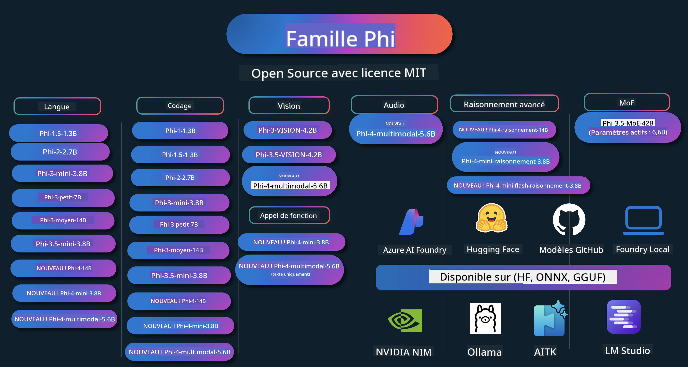

<!--
CO_OP_TRANSLATOR_METADATA:
{
  "original_hash": "c2e4b490f4bd424b095f21e38c6af33b",
  "translation_date": "2026-01-04T06:16:37+00:00",
  "source_file": "README.md",
  "language_code": "fr"
}
-->
# Phi Cookbook: Hands-On Examples with Microsoft's Phi Models

[](https://codespaces.new/microsoft/phicookbook)
[](https://vscode.dev/redirect?url=vscode://ms-vscode-remote.remote-containers/cloneInVolume?url=https://github.com/microsoft/phicookbook)

[](https://GitHub.com/microsoft/phicookbook/graphs/contributors/?WT.mc_id=aiml-137032-kinfeylo)
[](https://GitHub.com/microsoft/phicookbook/issues/?WT.mc_id=aiml-137032-kinfeylo)
[](https://GitHub.com/microsoft/phicookbook/pulls/?WT.mc_id=aiml-137032-kinfeylo)
[](http://makeapullrequest.com?WT.mc_id=aiml-137032-kinfeylo)

[](https://GitHub.com/microsoft/phicookbook/watchers/?WT.mc_id=aiml-137032-kinfeylo)
[](https://GitHub.com/microsoft/phicookbook/network/?WT.mc_id=aiml-137032-kinfeylo)
[](https://GitHub.com/microsoft/phicookbook/stargazers/?WT.mc_id=aiml-137032-kinfeylo)

[](https://discord.com/invite/ByRwuEEgH4)

Phi est une série de modèles d'IA open source développés par Microsoft. 

Phi est actuellement le modèle de langage petit (SLM) le plus puissant et le plus rentable, avec d'excellents résultats de benchmark en multilingue, raisonnement, génération de texte/chat, codage, images, audio et autres scénarios. 

Vous pouvez déployer Phi dans le cloud ou sur des appareils en périphérie, et vous pouvez facilement créer des applications d'IA générative avec une puissance de calcul limitée.

Suivez ces étapes pour commencer à utiliser ces ressources :
1. **Fork the Repository**: Click [](https://GitHub.com/microsoft/phicookbook/network/?WT.mc_id=aiml-137032-kinfeylo)
2. **Cloner le dépôt**:   `git clone https://github.com/microsoft/PhiCookBook.git`
3. [**Rejoindre la communauté Microsoft AI Discord et rencontrer des experts et d'autres développeurs**](https://discord.com/invite/ByRwuEEgH4?WT.mc_id=aiml-137032-kinfeylo)



### 🌐 Prise en charge multilingue

#### Pris en charge via GitHub Action (automatisé et toujours à jour)

<!-- CO-OP TRANSLATOR LANGUAGES TABLE START -->
[Arabe](../ar/README.md) | [Bengali](../bn/README.md) | [Bulgare](../bg/README.md) | [Birmane (Myanmar)](../my/README.md) | [Chinois (simplifié)](../zh/README.md) | [Chinois (traditionnel, Hong Kong)](../hk/README.md) | [Chinois (traditionnel, Macao)](../mo/README.md) | [Chinois (traditionnel, Taïwan)](../tw/README.md) | [Croate](../hr/README.md) | [Tchèque](../cs/README.md) | [Danois](../da/README.md) | [Néerlandais](../nl/README.md) | [Estonien](../et/README.md) | [Finnois](../fi/README.md) | [Français](./README.md) | [Allemand](../de/README.md) | [Grec](../el/README.md) | [Hébreu](../he/README.md) | [Hindi](../hi/README.md) | [Hongrois](../hu/README.md) | [Indonésien](../id/README.md) | [Italien](../it/README.md) | [Japonais](../ja/README.md) | [Kannada](../kn/README.md) | [Coréen](../ko/README.md) | [Lituanien](../lt/README.md) | [Malais](../ms/README.md) | [Malayalam](../ml/README.md) | [Marathi](../mr/README.md) | [Népalais](../ne/README.md) | [Pidgin nigérian](../pcm/README.md) | [Norvégien](../no/README.md) | [Persan (Farsi)](../fa/README.md) | [Polonais](../pl/README.md) | [Portugais (Brésil)](../br/README.md) | [Portugais (Portugal)](../pt/README.md) | [Pendjabi (Gurmukhi)](../pa/README.md) | [Roumain](../ro/README.md) | [Russe](../ru/README.md) | [Serbe (cyrillique)](../sr/README.md) | [Slovaque](../sk/README.md) | [Slovène](../sl/README.md) | [Espagnol](../es/README.md) | [Swahili](../sw/README.md) | [Suédois](../sv/README.md) | [Tagalog (Philippin)](../tl/README.md) | [Tamoul](../ta/README.md) | [Télougou](../te/README.md) | [Thaï](../th/README.md) | [Turc](../tr/README.md) | [Ukrainien](../uk/README.md) | [Ourdou](../ur/README.md) | [Vietnamien](../vi/README.md)

> **Préférez cloner localement ?**

> Ce dépôt inclut plus de 50 traductions qui augmentent de manière significative la taille du téléchargement. Pour cloner sans les traductions, utilisez le sparse checkout :
> ```bash
> git clone --filter=blob:none --sparse https://github.com/microsoft/PhiCookBook.git
> cd PhiCookBook
> git sparse-checkout set --no-cone '/*' '!translations' '!translated_images'
> ```
> Cela vous donne tout ce dont vous avez besoin pour suivre le cours avec un téléchargement beaucoup plus rapide.
<!-- CO-OP TRANSLATOR LANGUAGES TABLE END -->

## Table des matières

- Introduction
  - [Bienvenue dans la famille Phi](./md/01.Introduction/01/01.PhiFamily.md)
  - [Configuration de votre environnement](./md/01.Introduction/01/01.EnvironmentSetup.md)
  - [Comprendre les technologies clés](./md/01.Introduction/01/01.Understandingtech.md)
  - [Sécurité de l'IA pour les modèles Phi](./md/01.Introduction/01/01.AISafety.md)
  - [Support matériel pour Phi](./md/01.Introduction/01/01.Hardwaresupport.md)
  - [Modèles Phi et disponibilité sur les plateformes](./md/01.Introduction/01/01.Edgeandcloud.md)
  - [Utilisation de Guidance-ai et Phi](./md/01.Introduction/01/01.Guidance.md)
  - [Modèles du GitHub Marketplace](https://github.com/marketplace/models)
  - [Catalogue des modèles Azure AI](https://ai.azure.com)

- Inférence de Phi dans différents environnements
    -  [Hugging face](./md/01.Introduction/02/01.HF.md)
    -  [Modèles GitHub](./md/01.Introduction/02/02.GitHubModel.md)
    -  [Catalogue de modèles Azure AI Foundry](./md/01.Introduction/02/03.AzureAIFoundry.md)
    -  [Ollama](./md/01.Introduction/02/04.Ollama.md)
    -  [AI Toolkit VSCode (AITK)](./md/01.Introduction/02/05.AITK.md)
    -  [NVIDIA NIM](./md/01.Introduction/02/06.NVIDIA.md)
    -  [Foundry local](./md/01.Introduction/02/07.FoundryLocal.md)

- Inférence de la famille Phi
    - [Inférence de Phi sur iOS](./md/01.Introduction/03/iOS_Inference.md)
    - [Inférence de Phi sur Android](./md/01.Introduction/03/Android_Inference.md)
    - [Inférence de Phi sur Jetson](./md/01.Introduction/03/Jetson_Inference.md)
    - [Inférence de Phi sur AI PC](./md/01.Introduction/03/AIPC_Inference.md)
    - [Inférence de Phi avec le framework Apple MLX](./md/01.Introduction/03/MLX_Inference.md)
    - [Inférence de Phi sur serveur local](./md/01.Introduction/03/Local_Server_Inference.md)
    - [Inférence de Phi sur serveur distant en utilisant AI Toolkit](./md/01.Introduction/03/Remote_Interence.md)
    - [Inférence de Phi avec Rust](./md/01.Introduction/03/Rust_Inference.md)
    - [Inférence Phi--Vision en local](./md/01.Introduction/03/Vision_Inference.md)
    - [Inférence de Phi avec Kaito AKS, Azure Containers(official support)](./md/01.Introduction/03/Kaito_Inference.md)
-  [Quantification de la famille Phi](./md/01.Introduction/04/QuantifyingPhi.md)
    - [Quantification de Phi-3.5 / 4 avec llama.cpp](./md/01.Introduction/04/UsingLlamacppQuantifyingPhi.md)
    - [Quantification de Phi-3.5 / 4 avec les extensions Generative AI pour onnxruntime](./md/01.Introduction/04/UsingORTGenAIQuantifyingPhi.md)
    - [Quantification de Phi-3.5 / 4 avec Intel OpenVINO](./md/01.Introduction/04/UsingIntelOpenVINOQuantifyingPhi.md)
    - [Quantification de Phi-3.5 / 4 avec le framework Apple MLX](./md/01.Introduction/04/UsingAppleMLXQuantifyingPhi.md)

-  Évaluation Phi
    - [IA responsable](./md/01.Introduction/05/ResponsibleAI.md)
    - [Azure AI Foundry pour l'évaluation](./md/01.Introduction/05/AIFoundry.md)
    - [Utiliser Promptflow pour l'évaluation](./md/01.Introduction/05/Promptflow.md)
 
- RAG avec Azure AI Search
    - [Comment utiliser Phi-4-mini et Phi-4-multimodal(RAG) avec Azure AI Search](https://github.com/microsoft/PhiCookBook/blob/main/code/06.E2E/E2E_Phi-4-RAG-Azure-AI-Search.ipynb)

- Exemples de développement d'applications Phi
  - Applications de texte et de chat
    - Exemples Phi-4 🆕
      - [📓] [Chat avec le modèle Phi-4-mini ONNX](./md/02.Application/01.TextAndChat/Phi4/ChatWithPhi4ONNX/README.md)
      - [Chat avec le modèle ONNX Phi-4 local .NET](../../md/04.HOL/dotnet/src/LabsPhi4-Chat-01OnnxRuntime)
      - [Application console .NET de chat avec Phi-4 ONNX utilisant Semantic Kernel](../../md/04.HOL/dotnet/src/LabsPhi4-Chat-02SK)
    - Exemples Phi-3 / 3.5
      - [Chatbot local dans le navigateur utilisant Phi3, ONNX Runtime Web et WebGPU](https://github.com/microsoft/onnxruntime-inference-examples/tree/main/js/chat)
      - [OpenVino Chat](./md/02.Application/01.TextAndChat/Phi3/E2E_OpenVino_Chat.md)
      - [Multi Model - Interactive Phi-3-mini and OpenAI Whisper](./md/02.Application/01.TextAndChat/Phi3/E2E_Phi-3-mini_with_whisper.md)
      - [MLFlow - Building a wrapper and using Phi-3 with MLFlow](./md//02.Application/01.TextAndChat/Phi3/E2E_Phi-3-MLflow.md)
      - [Model Optimization - How to optimize Phi-3-min model for ONNX Runtime Web with Olive](https://github.com/microsoft/Olive/tree/main/examples/phi3)
      - [WinUI3 App with Phi-3 mini-4k-instruct-onnx](https://github.com/microsoft/Phi3-Chat-WinUI3-Sample/)
      -[WinUI3 Multi Model AI Powered Notes App Sample](https://github.com/microsoft/ai-powered-notes-winui3-sample)
      - [Fine-tune and Integrate custom Phi-3 models with Prompt flow](./md/02.Application/01.TextAndChat/Phi3/E2E_Phi-3-FineTuning_PromptFlow_Integration.md)
      - [Fine-tune and Integrate custom Phi-3 models with Prompt flow in Azure AI Foundry](./md/02.Application/01.TextAndChat/Phi3/E2E_Phi-3-FineTuning_PromptFlow_Integration_AIFoundry.md)
      - [Evaluate the Fine-tuned Phi-3 / Phi-3.5 Model in Azure AI Foundry Focusing on Microsoft's Responsible AI Principles](./md/02.Application/01.TextAndChat/Phi3/E2E_Phi-3-Evaluation_AIFoundry.md)
      - [📓] [Phi-3.5-mini-instruct language prediction sample (Chinese/English)](./md/02.Application/01.TextAndChat/Phi3/phi3-instruct-demo.ipynb)
      - [Phi-3.5-Instruct WebGPU RAG Chatbot](./md/02.Application/01.TextAndChat/Phi3/WebGPUWithPhi35Readme.md)
      - [Using Windows GPU to create Prompt flow solution with Phi-3.5-Instruct ONNX](./md/02.Application/01.TextAndChat/Phi3/UsingPromptFlowWithONNX.md)
      - [Using Microsoft Phi-3.5 tflite to create Android app](./md/02.Application/01.TextAndChat/Phi3/UsingPhi35TFLiteCreateAndroidApp.md)
      - [Q&A .NET Example using local ONNX Phi-3 model using the Microsoft.ML.OnnxRuntime](../../md/04.HOL/dotnet/src/LabsPhi301)
      - [Console chat .NET app with Semantic Kernel and Phi-3](../../md/04.HOL/dotnet/src/LabsPhi302)

  - Azure AI Inference SDK Code Based Samples 
    - Phi-4 Samples 🆕
      - [📓] [Generate project code using Phi-4-multimodal](./md/02.Application/02.Code/Phi4/GenProjectCode/README.md)
    - Phi-3 / 3.5 Samples
      - [Build your own Visual Studio Code GitHub Copilot Chat with Microsoft Phi-3 Family](./md/02.Application/02.Code/Phi3/VSCodeExt/README.md)
      - [Create your own Visual Studio Code Chat Copilot Agent with Phi-3.5 by GitHub Models](/md/02.Application/02.Code/Phi3/CreateVSCodeChatAgentWithGitHubModels.md)

  - Advanced Reasoning Samples
    - Phi-4 Samples 🆕
      - [📓] [Phi-4-mini-reasoning or Phi-4-reasoning Samples](./md/02.Application/03.AdvancedReasoning/Phi4/AdvancedResoningPhi4mini/README.md)
      - [📓] [Fine-tuning Phi-4-mini-reasoning with Microsoft Olive](./md/02.Application/03.AdvancedReasoning/Phi4/AdvancedResoningPhi4mini/olive_ft_phi_4_reasoning_with_medicaldata.ipynb)
      - [📓] [Fine-tuning Phi-4-mini-reasoning with Apple MLX](./md/02.Application/03.AdvancedReasoning/Phi4/AdvancedResoningPhi4mini/mlx_ft_phi_4_reasoning_with_medicaldata.ipynb)
      - [📓] [Phi-4-mini-reasoning with GitHub Models](./md/02.Application/02.Code/Phi4r/github_models_inference.ipynb)
      - [📓] [Phi-4-mini-reasoning with Azure AI Foundry Models](./md/02.Application/02.Code/Phi4r/azure_models_inference.ipynb)
  - Demos
      - [Phi-4-mini demos hosted on Hugging Face Spaces](https://huggingface.co/spaces/microsoft/phi-4-mini?WT.mc_id=aiml-137032-kinfeylo)
      - [Phi-4-multimodal demos hosted on Hugginge Face Spaces](https://huggingface.co/spaces/microsoft/phi-4-multimodal?WT.mc_id=aiml-137032-kinfeylo)
  - Vision Samples
    - Phi-4 Samples 🆕
      - [📓] [Use Phi-4-multimodal to read images and generate code](./md/02.Application/04.Vision/Phi4/CreateFrontend/README.md) 
    - Phi-3 / 3.5 Samples
      -  [📓][Phi-3-vision-Image text to text](./md/02.Application/04.Vision/Phi3/E2E_Phi-3-vision-image-text-to-text-online-endpoint.ipynb)
      - [Phi-3-vision-ONNX](https://onnxruntime.ai/docs/genai/tutorials/phi3-v.html)
      - [📓][Phi-3-vision CLIP Embedding](./md/02.Application/04.Vision/Phi3/E2E_Phi-3-vision-image-text-to-text-online-endpoint.ipynb)
      - [DEMO: Phi-3 Recycling](https://github.com/jennifermarsman/PhiRecycling/)
      - [Phi-3-vision - Visual language assistant - with Phi3-Vision and OpenVINO](https://docs.openvino.ai/nightly/notebooks/phi-3-vision-with-output.html)
      - [Phi-3 Vision Nvidia NIM](./md/02.Application/04.Vision/Phi3/E2E_Nvidia_NIM_Vision.md)
      - [Phi-3 Vision OpenVino](./md/02.Application/04.Vision/Phi3/E2E_OpenVino_Phi3Vision.md)
      - [📓][Phi-3.5 Vision multi-frame or multi-image sample](./md/02.Application/04.Vision/Phi3/phi3-vision-demo.ipynb)
      - [Phi-3 Vision Local ONNX Model using the Microsoft.ML.OnnxRuntime .NET](../../md/04.HOL/dotnet/src/LabsPhi303)
      - [Menu based Phi-3 Vision Local ONNX Model using the Microsoft.ML.OnnxRuntime .NET](../../md/04.HOL/dotnet/src/LabsPhi304)

  - Math Samples
    -  Phi-4-Mini-Flash-Reasoning-Instruct Samples 🆕 [Math Demo with Phi-4-Mini-Flash-Reasoning-Instruct](./md/02.Application/09.Math/MathDemo.ipynb)

  - Audio Samples
    - Phi-4 Samples 🆕
      - [📓] [Extracting audio transcripts using Phi-4-multimodal](./md/02.Application/05.Audio/Phi4/Transciption/README.md)
      - [📓] [Phi-4-multimodal Audio Sample](./md/02.Application/05.Audio/Phi4/Siri/demo.ipynb)
      - [📓] [Phi-4-multimodal Speech Translation Sample](./md/02.Application/05.Audio/Phi4/Translate/demo.ipynb)
      - [.NET console application using Phi-4-multimodal Audio to analyze an audio file and generate transcript](../../md/04.HOL/dotnet/src/LabsPhi4-MultiModal-02Audio)

  - MOE Samples
    - Phi-3 / 3.5 Samples
      - [📓] [Phi-3.5 Mixture of Experts Models (MoEs) Social Media Sample](./md/02.Application/06.MoE/Phi3/phi3_moe_demo.ipynb)
      - [📓] [Building a Retrieval-Augmented Generation (RAG) Pipeline with NVIDIA NIM Phi-3 MOE, Azure AI Search, and LlamaIndex](./md/02.Application/06.MoE/Phi3/azure-ai-search-nvidia-rag.ipynb)
      - 
  - Function Calling Samples
    - Phi-4 Samples 🆕
      -  [📓] [Using Function Calling With Phi-4-mini](./md/02.Application/07.FunctionCalling/Phi4/FunctionCallingBasic/README.md)
      -  [📓] [Using Function Calling to create multi-agents With Phi-4-mini](./md/02.Application/07.FunctionCalling/Phi4/Multiagents/Phi_4_mini_multiagent.ipynb)
      -  [📓] [Using Function Calling with Ollama](./md/02.Application/07.FunctionCalling/Phi4/Ollama/ollama_functioncalling.ipynb)
      -  [📓] [Using Function Calling with ONNX](../../md/02.Application/07.FunctionCalling/Phi4/ONNX/onnx_parallel_functioncalling_ipynb)
  - Multimodal Mixing Samples
    - Phi-4 Samples 🆕
      -  [📓] [Using Phi-4-multimodal as a Technology journalist](./md/02.Application/08.Multimodel/Phi4/TechJournalist/phi_4_mm_audio_text_publish_news.ipynb)
      - [.NET console application using Phi-4-multimodal to analyze images](../../md/04.HOL/dotnet/src/LabsPhi4-MultiModal-01Images)

- Fine-tuning Phi Samples
  - [Fine-tuning Scenarios](./md/03.FineTuning/FineTuning_Scenarios.md)
  - [Fine-tuning vs RAG](./md/03.FineTuning/FineTuning_vs_RAG.md)
  - [Fine-tuning Let Phi-3 become an industry expert](./md/03.FineTuning/LetPhi3gotoIndustriy.md)
  - [Fine-tuning Phi-3 with AI Toolkit for VS Code](./md/03.FineTuning/Finetuning_VSCodeaitoolkit.md)
  - [Fine-tuning Phi-3 with Azure Machine Learning Service](./md/03.FineTuning/Introduce_AzureML.md)
  - [Fine-tuning Phi-3 with Lora](./md/03.FineTuning/FineTuning_Lora.md)
  - [Fine-tuning Phi-3 with QLora](./md/03.FineTuning/FineTuning_Qlora.md)
  - [Fine-tuning Phi-3 with Azure AI Foundry](./md/03.FineTuning/FineTuning_AIFoundry.md)
  - [Fine-tuning Phi-3 with Azure ML CLI/SDK](./md/03.FineTuning/FineTuning_MLSDK.md)
  - [Fine-tuning with Microsoft Olive](./md/03.FineTuning/FineTuning_MicrosoftOlive.md)
  - [Fine-tuning with Microsoft Olive Hands-On Lab](./md/03.FineTuning/olive-lab/readme.md)
  - [Fine-tuning Phi-3-vision with Weights and Bias](./md/03.FineTuning/FineTuning_Phi-3-visionWandB.md)
  - [Fine-tuning Phi-3 with Apple MLX Framework](./md/03.FineTuning/FineTuning_MLX.md)
  - [Fine-tuning Phi-3-vision (official support)](./md/03.FineTuning/FineTuning_Vision.md)
  - [Fine-Tuning Phi-3 with Kaito AKS , Azure Containers(official Support)](./md/03.FineTuning/FineTuning_Kaito.md)
  - [Fine-Tuning Phi-3 and 3.5 Vision](https://github.com/2U1/Phi3-Vision-Finetune)

- Hands on Lab
  - [Exploring cutting-edge models: LLMs, SLMs, local development and more](https://github.com/microsoft/aitour-exploring-cutting-edge-models)
  - [Unlocking NLP Potential: Fine-Tuning with Microsoft Olive](https://github.com/azure/Ignite_FineTuning_workshop)

- Academic Research Papers and Publications
  - [Textbooks Are All You Need II : rapport technique phi-1.5](https://arxiv.org/abs/2309.05463)
  - [Phi-3 Rapport technique : un modèle de langage hautement performant localement sur votre téléphone](https://arxiv.org/abs/2404.14219)
  - [Phi-4 Rapport technique](https://arxiv.org/abs/2412.08905)
  - [Phi-4-Mini Rapport technique : modèles de langage multimodaux compacts mais puissants via mixture-of-LoRAs](https://arxiv.org/abs/2503.01743)
  - [Optimisation des petits modèles de langage pour l'appel de fonctions embarqué](https://arxiv.org/abs/2501.02342)
  - [(WhyPHI) Affinage de PHI-3 pour les questions à choix multiple : méthodologie, résultats et défis](https://arxiv.org/abs/2501.01588)
  - [Phi-4-reasoning Rapport technique](https://www.microsoft.com/en-us/research/wp-content/uploads/2025/04/phi_4_reasoning.pdf)
  - [Phi-4-mini-reasoning Rapport technique](https://huggingface.co/microsoft/Phi-4-mini-reasoning/blob/main/Phi-4-Mini-Reasoning.pdf)

## Using Phi Models

### Phi on Azure AI Foundry

Vous pouvez apprendre à utiliser Microsoft Phi et à construire des solutions de bout en bout (E2E) sur vos différents appareils matériels. Pour découvrir Phi par vous-même, commencez par essayer les modèles et personnaliser Phi pour vos scénarios en utilisant le [Azure AI Foundry Azure AI Model Catalog](https://aka.ms/phi3-azure-ai) vous pouvez en savoir plus dans Démarrage avec [Azure AI Foundry](/md/02.QuickStart/AzureAIFoundry_QuickStart.md)

**Espace de test**
Chaque modèle dispose d'un espace de test dédié pour tester le modèle [Azure AI Playground](https://aka.ms/try-phi3).

### Phi on GitHub Models

Vous pouvez apprendre à utiliser Microsoft Phi et à construire des solutions de bout en bout (E2E) sur vos différents appareils matériels. Pour découvrir Phi par vous-même, commencez par essayer le modèle et personnaliser Phi pour vos scénarios en utilisant le [GitHub Model Catalog](https://github.com/marketplace/models?WT.mc_id=aiml-137032-kinfeylo) vous pouvez en savoir plus dans Démarrage avec [GitHub Model Catalog](/md/02.QuickStart/GitHubModel_QuickStart.md)

**Espace de test**
Chaque modèle dispose d'un [espace de test pour essayer le modèle](/md/02.QuickStart/GitHubModel_QuickStart.md).

### Phi on Hugging Face

Vous pouvez également trouver le modèle sur [Hugging Face](https://huggingface.co/microsoft)

**Espace de test**
 [Espace de test Hugging Chat](https://huggingface.co/chat/models/microsoft/Phi-3-mini-4k-instruct)

 ## 🎒 Autres cours

Notre équipe propose d'autres cours ! Découvrez :

<!-- CO-OP TRANSLATOR OTHER COURSES START -->
### LangChain
[](https://aka.ms/langchain4j-for-beginners)
[](https://aka.ms/langchainjs-for-beginners?WT.mc_id=m365-94501-dwahlin)

---

### Azure / Edge / MCP / Agents
[](https://github.com/microsoft/AZD-for-beginners?WT.mc_id=academic-105485-koreyst)
[](https://github.com/microsoft/edgeai-for-beginners?WT.mc_id=academic-105485-koreyst)
[](https://github.com/microsoft/mcp-for-beginners?WT.mc_id=academic-105485-koreyst)
[](https://github.com/microsoft/ai-agents-for-beginners?WT.mc_id=academic-105485-koreyst)

---
 
### Generative AI Series
[](https://github.com/microsoft/generative-ai-for-beginners?WT.mc_id=academic-105485-koreyst)
[-9333EA?style=for-the-badge&labelColor=E5E7EB&color=9333EA)](https://github.com/microsoft/Generative-AI-for-beginners-dotnet?WT.mc_id=academic-105485-koreyst)
[-C084FC?style=for-the-badge&labelColor=E5E7EB&color=C084FC)](https://github.com/microsoft/generative-ai-for-beginners-java?WT.mc_id=academic-105485-koreyst)
[-E879F9?style=for-the-badge&labelColor=E5E7EB&color=E879F9)](https://github.com/microsoft/generative-ai-with-javascript?WT.mc_id=academic-105485-koreyst)

---
 
### Core Learning
[](https://aka.ms/ml-beginners?WT.mc_id=academic-105485-koreyst)
[](https://aka.ms/datascience-beginners?WT.mc_id=academic-105485-koreyst)
[](https://aka.ms/ai-beginners?WT.mc_id=academic-105485-koreyst)
[](https://github.com/microsoft/Security-101?WT.mc_id=academic-96948-sayoung)
[](https://aka.ms/webdev-beginners?WT.mc_id=academic-105485-koreyst)
[](https://aka.ms/iot-beginners?WT.mc_id=academic-105485-koreyst)
[](https://github.com/microsoft/xr-development-for-beginners?WT.mc_id=academic-105485-koreyst)

---
 
### Copilot Series
[](https://aka.ms/GitHubCopilotAI?WT.mc_id=academic-105485-koreyst)
[](https://github.com/microsoft/mastering-github-copilot-for-dotnet-csharp-developers?WT.mc_id=academic-105485-koreyst)
[](https://github.com/microsoft/CopilotAdventures?WT.mc_id=academic-105485-koreyst)
<!-- CO-OP TRANSLATOR OTHER COURSES END -->

## IA responsable 

Microsoft s'engage à aider ses clients à utiliser nos produits d'IA de manière responsable, à partager nos apprentissages et à établir des partenariats fondés sur la confiance via des outils tels que les notes de transparence et les évaluations d'impact. Beaucoup de ces ressources sont disponibles sur [https://aka.ms/RAI](https://aka.ms/RAI).
L'approche de Microsoft en matière d'IA responsable est fondée sur nos principes d'IA : équité, fiabilité et sécurité, confidentialité et sécurité, inclusion, transparence et responsabilité.

Les modèles à grande échelle de langage naturel, d'image et de parole - comme ceux utilisés dans cet exemple - peuvent potentiellement se comporter de manière injuste, peu fiable ou offensante, ce qui peut causer des préjudices. Veuillez consulter la [note de transparence du service Azure OpenAI](https://learn.microsoft.com/legal/cognitive-services/openai/transparency-note?tabs=text) pour être informé des risques et des limites.

L'approche recommandée pour atténuer ces risques est d'inclure un système de sécurité dans votre architecture capable de détecter et d'empêcher les comportements nuisibles. [Azure AI Content Safety](https://learn.microsoft.com/azure/ai-services/content-safety/overview) fournit une couche de protection indépendante, capable de détecter le contenu nuisible généré par les utilisateurs et par l'IA dans les applications et services. Azure AI Content Safety inclut des API pour le texte et l'image qui vous permettent de détecter les contenus potentiellement nuisibles. Dans Azure AI Foundry, le service Content Safety vous permet de visualiser, explorer et essayer des exemples de code pour détecter les contenus nuisibles à travers différentes modalités. La [documentation de démarrage rapide](https://learn.microsoft.com/azure/ai-services/content-safety/quickstart-text?tabs=visual-studio%2Clinux&pivots=programming-language-rest) suivante vous guide pour effectuer des requêtes vers le service.

Un autre aspect à prendre en compte est la performance globale de l'application. Avec des applications multimodales et multi-modèles, nous entendons par performance que le système fonctionne comme vous et vos utilisateurs l'attendez, y compris en n'engendrant pas de sorties nuisibles. Il est important d'évaluer la performance de votre application globale en utilisant les [évaluateurs Performance and Quality and Risk and Safety](https://learn.microsoft.com/azure/ai-studio/concepts/evaluation-metrics-built-in). Vous avez également la possibilité de créer et d'évaluer avec des [évaluateurs personnalisés](https://learn.microsoft.com/azure/ai-studio/how-to/develop/evaluate-sdk#custom-evaluators).
Vous pouvez évaluer votre application d'IA dans votre environnement de développement en utilisant le [Azure AI Evaluation SDK](https://microsoft.github.io/promptflow/index.html). Que vous disposiez d'un jeu de données de test ou d'une cible, les générations de votre application d'IA générative sont mesurées de manière quantitative à l'aide d'évaluateurs intégrés ou d'évaluateurs personnalisés de votre choix. Pour commencer avec l'azure ai evaluation sdk afin d'évaluer votre système, vous pouvez suivre le [guide de démarrage rapide](https://learn.microsoft.com/azure/ai-studio/how-to/develop/flow-evaluate-sdk). Une fois que vous lancez une exécution d'évaluation, vous pouvez [visualiser les résultats dans Azure AI Foundry](https://learn.microsoft.com/azure/ai-studio/how-to/evaluate-flow-results). 

## Marques déposées

Ce projet peut contenir des marques commerciales ou des logos pour des projets, produits ou services. L'utilisation autorisée des marques ou logos Microsoft est soumise aux [Directives Microsoft sur les marques et à l'image de marque](https://www.microsoft.com/legal/intellectualproperty/trademarks/usage/general) et doit les respecter. L'utilisation des marques ou logos Microsoft dans des versions modifiées de ce projet ne doit pas prêter à confusion ni laisser penser à un parrainage par Microsoft. Toute utilisation de marques ou de logos tiers est soumise aux politiques de ces tiers.

## Obtenir de l'aide

Si vous êtes bloqué ou avez des questions sur la création d'applications d'IA, rejoignez :

[](https://aka.ms/foundry/discord)

Si vous avez des retours produit ou rencontrez des erreurs lors du développement, visitez :

[](https://aka.ms/foundry/forum)

---

<!-- CO-OP TRANSLATOR DISCLAIMER START -->
Avertissement :  
Ce document a été traduit à l'aide du service de traduction par IA [Co-op Translator](https://github.com/Azure/co-op-translator). Bien que nous nous efforcions d'assurer l'exactitude, veuillez noter que les traductions automatisées peuvent contenir des erreurs ou des inexactitudes. Le document original dans sa langue d'origine doit être considéré comme la source faisant foi. Pour les informations critiques, une traduction professionnelle effectuée par un traducteur humain est recommandée. Nous déclinons toute responsabilité en cas de malentendus ou d'interprétations erronées résultant de l'utilisation de cette traduction.
<!-- CO-OP TRANSLATOR DISCLAIMER END -->