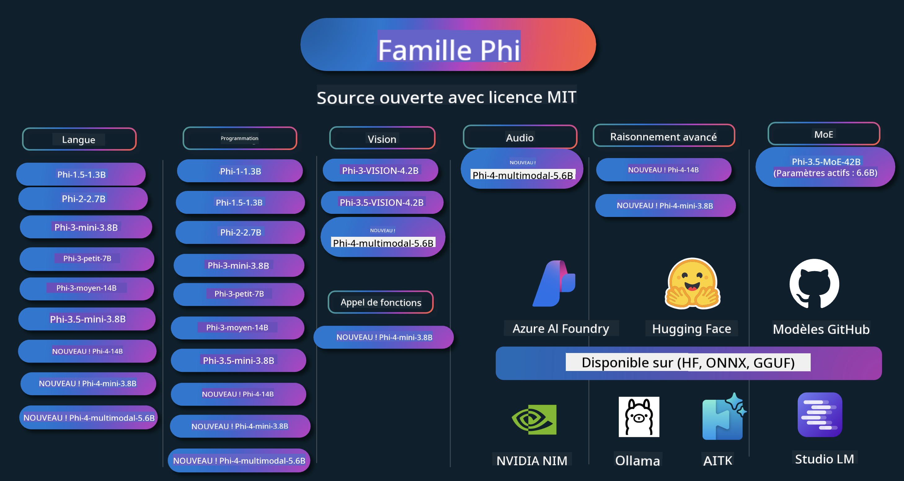

<!--
CO_OP_TRANSLATOR_METADATA:
{
  "original_hash": "10139744c0f1757a5ade1c66749e803f",
  "translation_date": "2025-05-04T13:31:04+00:00",
  "source_file": "README.md",
  "language_code": "fr"
}
-->
# Phi Cookbook : Exemples pratiques avec les modèles Phi de Microsoft

Phi est une série de modèles d’IA open source développés par Microsoft.

Phi est actuellement le modèle de langage petit (SLM) le plus puissant et économique, avec d’excellents résultats dans plusieurs langues, le raisonnement, la génération de texte/chat, le codage, les images, l’audio et d’autres scénarios.

Vous pouvez déployer Phi sur le cloud ou sur des appareils en périphérie, et créer facilement des applications d’IA générative avec une puissance de calcul limitée.

Suivez ces étapes pour commencer à utiliser ces ressources :
1. **Forkez le dépôt** : Cliquez sur 
2. **Clonez le dépôt** : `git clone https://github.com/microsoft/PhiCookBook.git`
3. [**Rejoignez la communauté Microsoft AI Discord et rencontrez des experts et d’autres développeurs**](https://discord.com/invite/ByRwuEEgH4?WT.mc_id=aiml-137032-kinfeylo)

## 🌐 Support multilingue
[Français](./README.md) | [Espagnol](../es/README.md) | [Allemand](../de/README.md) | [Russe](../ru/README.md) | [Arabe](../ar/README.md) | [Persan (Farsi)](../fa/README.md) | [Ourdou](../ur/README.md) | [Chinois (Simplifié)](../zh/README.md) | [Chinois (Traditionnel, Macao)](../mo/README.md) | [Chinois (Traditionnel, Hong Kong)](../hk/README.md) | [Chinois (Traditionnel, Taïwan)](../tw/README.md) | [Japonais](../ja/README.md) | [Coréen](../ko/README.md) | [Hindi](../hi/README.md) [Bengali](../bn/README.md) | [Marathi](../mr/README.md) | [Népalais](../ne/README.md) | [Pendjabi (Gurmukhi)](../pa/README.md) | [Portugais (Portugal)](../pt/README.md) | [Portugais (Brésil)](../br/README.md) | [Italien](../it/README.md) | [Polonais](../pl/README.md) | [Turc](../tr/README.md) | [Grec](../el/README.md) | [Thaï](../th/README.md) | [Suédois](../sv/README.md) | [Danois](../da/README.md) | [Norvégien](../no/README.md) | [Finnois](../fi/README.md) | [Néerlandais](../nl/README.md) | [Hébreu](../he/README.md) | [Vietnamien](../vi/README.md) | [Indonésien](../id/README.md) | [Malais](../ms/README.md) | [Tagalog (Philippin)](../tl/README.md) | [Swahili](../sw/README.md) | [Hongrois](../hu/README.md) | [Tchèque](../cs/README.md) | [Slovaque](../sk/README.md) | [Roumain](../ro/README.md) | [Bulgare](../bg/README.md) | [Serbe (Cyrillique)](../sr/README.md) | [Croate](../hr/README.md) | [Slovène](../sl/README.md)
## Table des matières

- Introduction
  - [Bienvenue dans la famille Phi](./md/01.Introduction/01/01.PhiFamily.md)
  - [Configurer votre environnement](./md/01.Introduction/01/01.EnvironmentSetup.md)
  - [Comprendre les technologies clés](./md/01.Introduction/01/01.Understandingtech.md)
  - [Sécurité IA pour les modèles Phi](./md/01.Introduction/01/01.AISafety.md)
  - [Support matériel Phi](./md/01.Introduction/01/01.Hardwaresupport.md)
  - [Modèles Phi & disponibilité sur les plateformes](./md/01.Introduction/01/01.Edgeandcloud.md)
  - [Utiliser Guidance-ai et Phi](./md/01.Introduction/01/01.Guidance.md)
  - [Modèles GitHub Marketplace](https://github.com/marketplace/models)
  - [Catalogue des modèles Azure AI](https://ai.azure.com)

- Inférence Phi dans différents environnements
    -  [Hugging face](./md/01.Introduction/02/01.HF.md)
    -  [Modèles GitHub](./md/01.Introduction/02/02.GitHubModel.md)
    -  [Catalogue Azure AI Foundry](./md/01.Introduction/02/03.AzureAIFoundry.md)
    -  [Ollama](./md/01.Introduction/02/04.Ollama.md)
    -  [AI Toolkit VSCode (AITK)](./md/01.Introduction/02/05.AITK.md)
    -  [NVIDIA NIM](./md/01.Introduction/02/06.NVIDIA.md)

- Inférence Phi Family
    - [Inférence Phi sur iOS](./md/01.Introduction/03/iOS_Inference.md)
    - [Inférence Phi sur Android](./md/01.Introduction/03/Android_Inference.md)
    - [Inférence Phi sur Jetson](./md/01.Introduction/03/Jetson_Inference.md)
    - [Inférence Phi sur PC AI](./md/01.Introduction/03/AIPC_Inference.md)
    - [Inférence Phi avec le framework Apple MLX](./md/01.Introduction/03/MLX_Inference.md)
    - [Inférence Phi sur serveur local](./md/01.Introduction/03/Local_Server_Inference.md)
    - [Inférence Phi sur serveur distant avec AI Toolkit](./md/01.Introduction/03/Remote_Interence.md)
    - [Inférence Phi avec Rust](./md/01.Introduction/03/Rust_Inference.md)
    - [Inférence Phi--Vision en local](./md/01.Introduction/03/Vision_Inference.md)
    - [Inférence Phi avec Kaito AKS, conteneurs Azure (support officiel)](./md/01.Introduction/03/Kaito_Inference.md)
-  [Quantification de la famille Phi](./md/01.Introduction/04/QuantifyingPhi.md)
    - [Quantification de Phi-3.5 / 4 avec llama.cpp](./md/01.Introduction/04/UsingLlamacppQuantifyingPhi.md)
    - [Quantification de Phi-3.5 / 4 avec les extensions Generative AI pour onnxruntime](./md/01.Introduction/04/UsingORTGenAIQuantifyingPhi.md)
    - [Quantification de Phi-3.5 / 4 avec Intel OpenVINO](./md/01.Introduction/04/UsingIntelOpenVINOQuantifyingPhi.md)
    - [Quantification de Phi-3.5 / 4 avec le framework Apple MLX](./md/01.Introduction/04/UsingAppleMLXQuantifyingPhi.md)

- Évaluation Phi
- [Response AI](./md/01.Introduction/05/ResponsibleAI.md)
    - [Azure AI Foundry pour l’évaluation](./md/01.Introduction/05/AIFoundry.md)
    - [Utiliser Promptflow pour l’évaluation](./md/01.Introduction/05/Promptflow.md)
 
- RAG avec Azure AI Search
    - [Comment utiliser Phi-4-mini et Phi-4-multimodal(RAG) avec Azure AI Search](https://github.com/microsoft/PhiCookBook/blob/main/code/06.E2E/E2E_Phi-4-RAG-Azure-AI-Search.ipynb)

- Exemples de développement d’applications Phi
  - Applications texte & chat
    - Exemples Phi-4 🆕
      - [📓] [Chat avec le modèle Phi-4-mini ONNX](./md/02.Application/01.TextAndChat/Phi4/ChatWithPhi4ONNX/README.md)
      - [Chat avec modèle ONNX local Phi-4 en .NET](../../md/04.HOL/dotnet/src/LabsPhi4-Chat-01OnnxRuntime)
      - [Application console chat .NET avec Phi-4 ONNX utilisant Semantic Kernel](../../md/04.HOL/dotnet/src/LabsPhi4-Chat-02SK)
    - Exemples Phi-3 / 3.5
      - [Chatbot local dans le navigateur avec Phi3, ONNX Runtime Web et WebGPU](https://github.com/microsoft/onnxruntime-inference-examples/tree/main/js/chat)
      - [Chat OpenVino](./md/02.Application/01.TextAndChat/Phi3/E2E_OpenVino_Chat.md)
      - [Multi-modèle - Phi-3-mini interactif et OpenAI Whisper](./md/02.Application/01.TextAndChat/Phi3/E2E_Phi-3-mini_with_whisper.md)
      - [MLFlow - Création d’un wrapper et utilisation de Phi-3 avec MLFlow](./md//02.Application/01.TextAndChat/Phi3/E2E_Phi-3-MLflow.md)
      - [Optimisation de modèle - Comment optimiser le modèle Phi-3-mini pour ONNX Runtime Web avec Olive](https://github.com/microsoft/Olive/tree/main/examples/phi3)
      - [Application WinUI3 avec Phi-3 mini-4k-instruct-onnx](https://github.com/microsoft/Phi3-Chat-WinUI3-Sample/)
      - [Exemple d’application notes multi-modèles alimentée par IA WinUI3](https://github.com/microsoft/ai-powered-notes-winui3-sample)
      - [Affiner et intégrer des modèles Phi-3 personnalisés avec Prompt flow](./md/02.Application/01.TextAndChat/Phi3/E2E_Phi-3-FineTuning_PromptFlow_Integration.md)
      - [Affiner et intégrer des modèles Phi-3 personnalisés avec Prompt flow dans Azure AI Foundry](./md/02.Application/01.TextAndChat/Phi3/E2E_Phi-3-FineTuning_PromptFlow_Integration_AIFoundry.md)
      - [Évaluer le modèle Phi-3 / Phi-3.5 affiné dans Azure AI Foundry en se concentrant sur les principes Responsible AI de Microsoft](./md/02.Application/01.TextAndChat/Phi3/E2E_Phi-3-Evaluation_AIFoundry.md)
      - [📓] [Exemple de prédiction linguistique Phi-3.5-mini-instruct (chinois/anglais)](../../md/02.Application/01.TextAndChat/Phi3/phi3-instruct-demo.ipynb)
      - [Chatbot RAG Phi-3.5-Instruct WebGPU](./md/02.Application/01.TextAndChat/Phi3/WebGPUWithPhi35Readme.md)
      - [Utiliser le GPU Windows pour créer une solution Prompt flow avec Phi-3.5-Instruct ONNX](./md/02.Application/01.TextAndChat/Phi3/UsingPromptFlowWithONNX.md)
      - [Utiliser Microsoft Phi-3.5 tflite pour créer une application Android](./md/02.Application/01.TextAndChat/Phi3/UsingPhi35TFLiteCreateAndroidApp.md)
      - [Exemple Q&R .NET utilisant le modèle ONNX local Phi-3 avec Microsoft.ML.OnnxRuntime](../../md/04.HOL/dotnet/src/LabsPhi301)
      - [Application console chat .NET avec Semantic Kernel et Phi-3](../../md/04.HOL/dotnet/src/LabsPhi302)

  - Exemples basés sur le SDK Azure AI Inference
    - Exemples Phi-4 🆕
      - [📓] [Générer le code projet avec Phi-4-multimodal](./md/02.Application/02.Code/Phi4/GenProjectCode/README.md)
    - Exemples Phi-3 / 3.5
      - [Créez votre propre chat GitHub Copilot pour Visual Studio Code avec Microsoft Phi-3 Family](./md/02.Application/02.Code/Phi3/VSCodeExt/README.md)
      - [Créez votre propre agent chat Copilot pour Visual Studio Code avec Phi-3.5 via les modèles GitHub](/md/02.Application/02.Code/Phi3/CreateVSCodeChatAgentWithGitHubModels.md)

  - Exemples de raisonnement avancé
    - Exemples Phi-4 🆕
      - [📓] [Exemples Phi-4-mini-reasoning ou Phi-4-reasoning](./md/02.Application/03.AdvancedReasoning/Phi4/AdvancedResoningPhi4mini/README.md)
      - [📓] [Affinage de Phi-4-mini-reasoning avec Microsoft Olive](../../md/02.Application/03.AdvancedReasoning/Phi4/AdvancedResoningPhi4mini/olive_ft_phi_4_reasoning_with_medicaldata.ipynb)
      - [📓] [Affinage de Phi-4-mini-reasoning avec Apple MLX](../../md/02.Application/03.AdvancedReasoning/Phi4/AdvancedResoningPhi4mini/mlx_ft_phi_4_reasoning_with_medicaldata.ipynb)
      - [📓] [Phi-4-mini-reasoning avec les modèles GitHub](../../md/02.Application/02.Code/Phi4r/github_models_inference.ipynb)
- [📓] [Phi-4-mini raisonnement avec les modèles Azure AI Foundry](../../md/02.Application/02.Code/Phi4r/azure_models_inference.ipynb)
  - Démonstrations
      - [Démos Phi-4-mini hébergées sur Hugging Face Spaces](https://huggingface.co/spaces/microsoft/phi-4-mini?WT.mc_id=aiml-137032-kinfeylo)
      - [Démos Phi-4-multimodal hébergées sur Hugging Face Spaces](https://huggingface.co/spaces/microsoft/phi-4-multimodal?WT.mc_id=aiml-137032-kinfeylo)
  - Exemples Vision
    - Exemples Phi-4 🆕
      - [📓] [Utiliser Phi-4-multimodal pour lire des images et générer du code](./md/02.Application/04.Vision/Phi4/CreateFrontend/README.md) 
    - Exemples Phi-3 / 3.5
      -  [📓][Phi-3-vision - Texte d’image à texte](../../md/02.Application/04.Vision/Phi3/E2E_Phi-3-vision-image-text-to-text-online-endpoint.ipynb)
      - [Phi-3-vision-ONNX](https://onnxruntime.ai/docs/genai/tutorials/phi3-v.html)
      - [📓][Phi-3-vision CLIP Embedding](../../md/02.Application/04.Vision/Phi3/E2E_Phi-3-vision-image-text-to-text-online-endpoint.ipynb)
      - [DEMO : Phi-3 Recycling](https://github.com/jennifermarsman/PhiRecycling/)
      - [Phi-3-vision - Assistant langage visuel - avec Phi3-Vision et OpenVINO](https://docs.openvino.ai/nightly/notebooks/phi-3-vision-with-output.html)
      - [Phi-3 Vision Nvidia NIM](./md/02.Application/04.Vision/Phi3/E2E_Nvidia_NIM_Vision.md)
      - [Phi-3 Vision OpenVino](./md/02.Application/04.Vision/Phi3/E2E_OpenVino_Phi3Vision.md)
      - [📓][Phi-3.5 Vision exemple multi-images ou multi-frames](../../md/02.Application/04.Vision/Phi3/phi3-vision-demo.ipynb)
      - [Modèle local Phi-3 Vision ONNX utilisant Microsoft.ML.OnnxRuntime .NET](../../md/04.HOL/dotnet/src/LabsPhi303)
      - [Modèle local Phi-3 Vision ONNX avec menu utilisant Microsoft.ML.OnnxRuntime .NET](../../md/04.HOL/dotnet/src/LabsPhi304)

  - Exemples Audio
    - Exemples Phi-4 🆕
      - [📓] [Extraction de transcriptions audio avec Phi-4-multimodal](./md/02.Application/05.Audio/Phi4/Transciption/README.md)
      - [📓] [Exemple audio Phi-4-multimodal](../../md/02.Application/05.Audio/Phi4/Siri/demo.ipynb)
      - [📓] [Exemple de traduction vocale avec Phi-4-multimodal](../../md/02.Application/05.Audio/Phi4/Translate/demo.ipynb)
      - [Application console .NET utilisant Phi-4-multimodal Audio pour analyser un fichier audio et générer une transcription](../../md/04.HOL/dotnet/src/LabsPhi4-MultiModal-02Audio)

  - Exemples MOE
    - Exemples Phi-3 / 3.5
      - [📓] [Modèles Mixture of Experts (MoEs) Phi-3.5 - Exemple réseaux sociaux](../../md/02.Application/06.MoE/Phi3/phi3_moe_demo.ipynb)
      - [📓] [Création d’un pipeline Retrieval-Augmented Generation (RAG) avec NVIDIA NIM Phi-3 MOE, Azure AI Search et LlamaIndex](../../md/02.Application/06.MoE/Phi3/azure-ai-search-nvidia-rag.ipynb)
  - Exemples d’appel de fonction
    - Exemples Phi-4 🆕
      -  [📓] [Utiliser l’appel de fonction avec Phi-4-mini](./md/02.Application/07.FunctionCalling/Phi4/FunctionCallingBasic/README.md)
      -  [📓] [Utiliser l’appel de fonction pour créer des multi-agents avec Phi-4-mini](../../md/02.Application/07.FunctionCalling/Phi4/Multiagents/Phi_4_mini_multiagent.ipynb)
      -  [📓] [Utiliser l’appel de fonction avec Ollama](../../md/02.Application/07.FunctionCalling/Phi4/Ollama/ollama_functioncalling.ipynb)
  - Exemples de mix multimodal
    - Exemples Phi-4 🆕
      -  [📓] [Utiliser Phi-4-multimodal en tant que journaliste technologique](../../md/02.Application/08.Multimodel/Phi4/TechJournalist/phi_4_mm_audio_text_publish_news.ipynb)
      - [Application console .NET utilisant Phi-4-multimodal pour analyser des images](../../md/04.HOL/dotnet/src/LabsPhi4-MultiModal-01Images)

- Exemples de fine-tuning Phi
  - [Scénarios de fine-tuning](./md/03.FineTuning/FineTuning_Scenarios.md)
  - [Fine-tuning vs RAG](./md/03.FineTuning/FineTuning_vs_RAG.md)
  - [Fine-tuning : faire de Phi-3 un expert industriel](./md/03.FineTuning/LetPhi3gotoIndustriy.md)
  - [Fine-tuning Phi-3 avec AI Toolkit pour VS Code](./md/03.FineTuning/Finetuning_VSCodeaitoolkit.md)
  - [Fine-tuning Phi-3 avec Azure Machine Learning Service](./md/03.FineTuning/Introduce_AzureML.md)
- [Affinage de Phi-3 avec Lora](./md/03.FineTuning/FineTuning_Lora.md)
  - [Affinage de Phi-3 avec QLora](./md/03.FineTuning/FineTuning_Qlora.md)
  - [Affinage de Phi-3 avec Azure AI Foundry](./md/03.FineTuning/FineTuning_AIFoundry.md)
  - [Affinage de Phi-3 avec Azure ML CLI/SDK](./md/03.FineTuning/FineTuning_MLSDK.md)
  - [Affinage avec Microsoft Olive](./md/03.FineTuning/FineTuning_MicrosoftOlive.md)
  - [Atelier pratique d’affinage avec Microsoft Olive](./md/03.FineTuning/olive-lab/readme.md)
  - [Affinage de Phi-3-vision avec Weights and Bias](./md/03.FineTuning/FineTuning_Phi-3-visionWandB.md)
  - [Affinage de Phi-3 avec le framework Apple MLX](./md/03.FineTuning/FineTuning_MLX.md)
  - [Affinage de Phi-3-vision (support officiel)](./md/03.FineTuning/FineTuning_Vision.md)
  - [Affinage de Phi-3 avec Kaito AKS, Azure Containers (support officiel)](./md/03.FineTuning/FineTuning_Kaito.md)
  - [Affinage de Phi-3 et 3.5 Vision](https://github.com/2U1/Phi3-Vision-Finetune)

- Atelier pratique
  - [Explorer les modèles de pointe : LLMs, SLMs, développement local et plus](https://github.com/microsoft/aitour-exploring-cutting-edge-models)
  - [Libérer le potentiel du NLP : affinage avec Microsoft Olive](https://github.com/azure/Ignite_FineTuning_workshop)

- Articles de recherche académique et publications
  - [Textbooks Are All You Need II : rapport technique phi-1.5](https://arxiv.org/abs/2309.05463)
  - [Rapport technique Phi-3 : un modèle de langage très performant directement sur votre téléphone](https://arxiv.org/abs/2404.14219)
  - [Rapport technique Phi-4](https://arxiv.org/abs/2412.08905)
  - [Rapport technique Phi-4-Mini : modèles de langage multimodaux compacts mais puissants via Mixture-of-LoRAs](https://arxiv.org/abs/2503.01743)
  - [Optimisation des petits modèles de langage pour les appels de fonction embarqués](https://arxiv.org/abs/2501.02342)
  - [(WhyPHI) Affinage de PHI-3 pour les questions à choix multiples : méthodologie, résultats et défis](https://arxiv.org/abs/2501.01588)
  - [Rapport technique Phi-4-reasoning](https://www.microsoft.com/en-us/research/wp-content/uploads/2025/04/phi_4_reasoning.pdf)
  - [Rapport technique Phi-4-mini-reasoning](https://huggingface.co/microsoft/Phi-4-mini-reasoning/blob/main/Phi-4-Mini-Reasoning.pdf)

## Utilisation des modèles Phi

### Phi sur Azure AI Foundry

Vous pouvez apprendre à utiliser Microsoft Phi et à créer des solutions de bout en bout sur différents appareils matériels. Pour découvrir Phi par vous-même, commencez par tester les modèles et personnaliser Phi selon vos cas d’usage grâce au [Azure AI Foundry Azure AI Model Catalog](https://aka.ms/phi3-azure-ai). Pour en savoir plus, consultez la page de démarrage rapide [Azure AI Foundry](/md/02.QuickStart/AzureAIFoundry_QuickStart.md)

**Playground**  
Chaque modèle dispose d’un espace dédié pour le tester : [Azure AI Playground](https://aka.ms/try-phi3).

### Phi sur GitHub Models

Vous pouvez apprendre à utiliser Microsoft Phi et à créer des solutions de bout en bout sur différents appareils matériels. Pour découvrir Phi par vous-même, commencez par tester le modèle et personnaliser Phi selon vos cas d’usage via le [GitHub Model Catalog](https://github.com/marketplace/models?WT.mc_id=aiml-137032-kinfeylo). Pour en savoir plus, consultez la page de démarrage rapide [GitHub Model Catalog](/md/02.QuickStart/GitHubModel_QuickStart.md)

**Playground**  
Chaque modèle dispose d’un [playground dédié pour le tester](/md/02.QuickStart/GitHubModel_QuickStart.md).

### Phi sur Hugging Face

Vous pouvez également retrouver le modèle sur [Hugging Face](https://huggingface.co/microsoft)

**Playground**  
[Hugging Chat playground](https://huggingface.co/chat/models/microsoft/Phi-3-mini-4k-instruct)

## IA responsable

Microsoft s’engage à aider ses clients à utiliser ses produits d’IA de manière responsable, à partager ses enseignements et à construire des partenariats basés sur la confiance grâce à des outils comme Transparency Notes et Impact Assessments. Beaucoup de ces ressources sont disponibles sur [https://aka.ms/RAI](https://aka.ms/RAI).  
L’approche de Microsoft en matière d’IA responsable repose sur nos principes d’IA : équité, fiabilité et sécurité, confidentialité et sécurité, inclusion, transparence et responsabilité.
Les modèles à grande échelle de traitement du langage naturel, d’image et de parole – comme ceux utilisés dans cet exemple – peuvent potentiellement se comporter de manière injuste, peu fiable ou offensante, causant ainsi des préjudices. Veuillez consulter la [note de transparence du service Azure OpenAI](https://learn.microsoft.com/legal/cognitive-services/openai/transparency-note?tabs=text) pour vous informer des risques et des limites.

La méthode recommandée pour atténuer ces risques consiste à intégrer un système de sécurité dans votre architecture capable de détecter et d’empêcher les comportements nuisibles. [Azure AI Content Safety](https://learn.microsoft.com/azure/ai-services/content-safety/overview) offre une couche de protection indépendante, capable de détecter le contenu nuisible généré par les utilisateurs et par l’IA dans les applications et services. Azure AI Content Safety inclut des API de texte et d’image qui vous permettent de détecter les contenus préjudiciables. Dans Azure AI Foundry, le service Content Safety vous permet de visualiser, d’explorer et d’essayer des exemples de code pour détecter les contenus nuisibles à travers différentes modalités. La [documentation de démarrage rapide](https://learn.microsoft.com/azure/ai-services/content-safety/quickstart-text?tabs=visual-studio%2Clinux&pivots=programming-language-rest) suivante vous guide pour effectuer des requêtes vers le service.

Un autre aspect à considérer est la performance globale de l’application. Avec les applications multi-modales et multi-modèles, la performance signifie que le système fonctionne comme vous et vos utilisateurs l’attendez, y compris en n’engendrant pas de résultats nuisibles. Il est important d’évaluer la performance de votre application globale en utilisant les [évaluateurs de Performance, Qualité, Risque et Sécurité](https://learn.microsoft.com/azure/ai-studio/concepts/evaluation-metrics-built-in). Vous avez également la possibilité de créer et d’évaluer avec des [évaluateurs personnalisés](https://learn.microsoft.com/azure/ai-studio/how-to/develop/evaluate-sdk#custom-evaluators).

Vous pouvez évaluer votre application IA dans votre environnement de développement en utilisant le [Azure AI Evaluation SDK](https://microsoft.github.io/promptflow/index.html). À partir d’un jeu de données de test ou d’un objectif, les générations de votre application d’IA générative sont mesurées quantitativement avec des évaluateurs intégrés ou personnalisés selon votre choix. Pour commencer avec le azure ai evaluation sdk afin d’évaluer votre système, vous pouvez suivre le [guide de démarrage rapide](https://learn.microsoft.com/azure/ai-studio/how-to/develop/flow-evaluate-sdk). Une fois que vous avez lancé une exécution d’évaluation, vous pouvez [visualiser les résultats dans Azure AI Foundry](https://learn.microsoft.com/azure/ai-studio/how-to/evaluate-flow-results).

## Marques déposées

Ce projet peut contenir des marques ou logos de projets, produits ou services. L’utilisation autorisée des marques ou logos Microsoft est soumise aux [Directives sur les marques et la marque de Microsoft](https://www.microsoft.com/legal/intellectualproperty/trademarks/usage/general) et doit les respecter.
L’utilisation des marques ou logos Microsoft dans des versions modifiées de ce projet ne doit pas prêter à confusion ni laisser entendre un parrainage par Microsoft. Toute utilisation de marques ou logos de tiers est soumise aux politiques de ces tiers.

**Avertissement** :  
Ce document a été traduit à l’aide du service de traduction automatique [Co-op Translator](https://github.com/Azure/co-op-translator). Bien que nous nous efforcions d’assurer l’exactitude, veuillez noter que les traductions automatisées peuvent contenir des erreurs ou des inexactitudes. Le document original dans sa langue d’origine doit être considéré comme la source faisant foi. Pour des informations critiques, une traduction professionnelle réalisée par un humain est recommandée. Nous ne sommes pas responsables des malentendus ou des mauvaises interprétations résultant de l’utilisation de cette traduction.