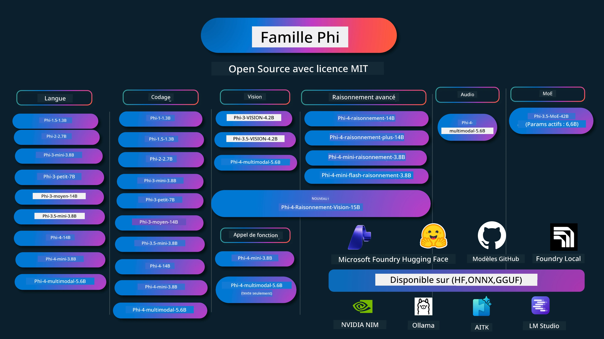

# Phi Cookbook : Exemples pratiques avec les modèles Phi de Microsoft

[](https://codespaces.new/microsoft/phicookbook)
[](https://vscode.dev/redirect?url=vscode://ms-vscode-remote.remote-containers/cloneInVolume?url=https://github.com/microsoft/phicookbook)

[](https://GitHub.com/microsoft/phicookbook/graphs/contributors/?WT.mc_id=aiml-137032-kinfeylo)
[](https://GitHub.com/microsoft/phicookbook/issues/?WT.mc_id=aiml-137032-kinfeylo)
[](https://GitHub.com/microsoft/phicookbook/pulls/?WT.mc_id=aiml-137032-kinfeylo)
[](http://makeapullrequest.com?WT.mc_id=aiml-137032-kinfeylo)

[](https://GitHub.com/microsoft/phicookbook/watchers/?WT.mc_id=aiml-137032-kinfeylo)
[](https://GitHub.com/microsoft/phicookbook/network/?WT.mc_id=aiml-137032-kinfeylo)
[](https://GitHub.com/microsoft/phicookbook/stargazers/?WT.mc_id=aiml-137032-kinfeylo)

[](https://discord.com/invite/ByRwuEEgH4)

Phi est une série de modèles d'IA open source développés par Microsoft.

Phi est actuellement le modèle de langage de petite taille (SLM) le plus puissant et rentable, avec d'excellents benchmarks en multilingue, raisonnement, génération de texte/chat, codage, images, audio et autres scénarios.

Vous pouvez déployer Phi dans le cloud ou sur des appareils en périphérie, et vous pouvez facilement créer des applications d'IA générative avec une puissance de calcul limitée.

Suivez ces étapes pour commencer à utiliser ces ressources :
1. **Forkez le Répertoire** : Cliquez sur [](https://GitHub.com/microsoft/phicookbook/network/?WT.mc_id=aiml-137032-kinfeylo)
2. **Clonez le Répertoire** : `git clone https://github.com/microsoft/PhiCookBook.git`
3. [**Rejoignez la communauté Microsoft AI Discord et rencontrez des experts et d'autres développeurs**](https://discord.com/invite/ByRwuEEgH4?WT.mc_id=aiml-137032-kinfeylo)



### 🌐 Support multilingue

#### Pris en charge via GitHub Action (Automatisé & Toujours à jour)

<!-- CO-OP TRANSLATOR LANGUAGES TABLE START -->
[Arabe](../ar/README.md) | [Bengali](../bn/README.md) | [Bulgare](../bg/README.md) | [Birman (Myanmar)](../my/README.md) | [Chinois (Simplifié)](../zh-CN/README.md) | [Chinois (Traditionnel, Hong Kong)](../zh-HK/README.md) | [Chinois (Traditionnel, Macao)](../zh-MO/README.md) | [Chinois (Traditionnel, Taïwan)](../zh-TW/README.md) | [Croate](../hr/README.md) | [Tchèque](../cs/README.md) | [Danois](../da/README.md) | [Néerlandais](../nl/README.md) | [Estonien](../et/README.md) | [Finnois](../fi/README.md) | [Français](./README.md) | [Allemand](../de/README.md) | [Grec](../el/README.md) | [Hébreu](../he/README.md) | [Hindi](../hi/README.md) | [Hongrois](../hu/README.md) | [Indonésien](../id/README.md) | [Italien](../it/README.md) | [Japonais](../ja/README.md) | [Kannada](../kn/README.md) | [Khmer](../km/README.md) | [Coréen](../ko/README.md) | [Lituanien](../lt/README.md) | [Malais](../ms/README.md) | [Malayalam](../ml/README.md) | [Marathi](../mr/README.md) | [Népalais](../ne/README.md) | [Pidgin nigérian](../pcm/README.md) | [Norvégien](../no/README.md) | [Persan (Farsi)](../fa/README.md) | [Polonais](../pl/README.md) | [Portugais (Brésil)](../pt-BR/README.md) | [Portugais (Portugal)](../pt-PT/README.md) | [Pendjabi (Gurmukhi)](../pa/README.md) | [Roumain](../ro/README.md) | [Russe](../ru/README.md) | [Serbe (Cyrillique)](../sr/README.md) | [Slovaque](../sk/README.md) | [Slovène](../sl/README.md) | [Espagnol](../es/README.md) | [Swahili](../sw/README.md) | [Suédois](../sv/README.md) | [Tagalog (Filipino)](../tl/README.md) | [Tamoul](../ta/README.md) | [Telugu](../te/README.md) | [Thaï](../th/README.md) | [Turc](../tr/README.md) | [Ukrainien](../uk/README.md) | [Ourdou](../ur/README.md) | [Vietnamien](../vi/README.md)

> **Préférez cloner localement ?**
>
> Ce dépôt inclut plus de 50 traductions qui augmentent considérablement la taille du téléchargement. Pour cloner sans traductions, utilisez le sparse checkout :
>
> **Bash / macOS / Linux :**
> ```bash
> git clone --filter=blob:none --sparse https://github.com/microsoft/PhiCookBook.git
> cd PhiCookBook
> git sparse-checkout set --no-cone '/*' '!translations' '!translated_images'
> ```
>
> **CMD (Windows) :**
> ```cmd
> git clone --filter=blob:none --sparse https://github.com/microsoft/PhiCookBook.git
> cd PhiCookBook
> git sparse-checkout set --no-cone "/*" "!translations" "!translated_images"
> ```
>
> Cela vous donne tout ce dont vous avez besoin pour suivre le cours avec un téléchargement beaucoup plus rapide.
<!-- CO-OP TRANSLATOR LANGUAGES TABLE END -->

## Table des matières

- Introduction
  - [Bienvenue dans la famille Phi](./md/01.Introduction/01/01.PhiFamily.md)
  - [Configurer votre environnement](./md/01.Introduction/01/01.EnvironmentSetup.md)
  - [Comprendre les technologies clés](./md/01.Introduction/01/01.Understandingtech.md)
  - [Sécurité IA pour les modèles Phi](./md/01.Introduction/01/01.AISafety.md)
  - [Support matériel Phi](./md/01.Introduction/01/01.Hardwaresupport.md)
  - [Modèles Phi & disponibilité sur les plateformes](./md/01.Introduction/01/01.Edgeandcloud.md)
  - [Utiliser Guidance-ai et Phi](./md/01.Introduction/01/01.Guidance.md)
  - [Modèles GitHub Marketplace](https://github.com/marketplace/models)
  - [Catalogue Azure AI Model](https://ai.azure.com)

- Inférence Phi dans différents environnements
    -  [Hugging face](./md/01.Introduction/02/01.HF.md)
    -  [Modèles GitHub](./md/01.Introduction/02/02.GitHubModel.md)
    -  [Catalogue de modèles Microsoft Foundry](./md/01.Introduction/02/03.AzureAIFoundry.md)
    -  [Ollama](./md/01.Introduction/02/04.Ollama.md)
    -  [AI Toolkit VSCode (AITK)](./md/01.Introduction/02/05.AITK.md)
    -  [NVIDIA NIM](./md/01.Introduction/02/06.NVIDIA.md)
    -  [Foundry Local](./md/01.Introduction/02/07.FoundryLocal.md)

- Famille Inférence Phi
    - [Inférence Phi sur iOS](./md/01.Introduction/03/iOS_Inference.md)
    - [Inférence Phi sur Android](./md/01.Introduction/03/Android_Inference.md)
    - [Inférence Phi sur Jetson](./md/01.Introduction/03/Jetson_Inference.md)
    - [Inférence Phi sur PC AI](./md/01.Introduction/03/AIPC_Inference.md)
    - [Inférence Phi avec Apple MLX Framework](./md/01.Introduction/03/MLX_Inference.md)
    - [Inférence Phi sur serveur local](./md/01.Introduction/03/Local_Server_Inference.md)
    - [Inférence Phi sur serveur distant avec AI Toolkit](./md/01.Introduction/03/Remote_Interence.md)
    - [Inférence Phi avec Rust](./md/01.Introduction/03/Rust_Inference.md)
    - [Inférence Phi -- Vision en local](./md/01.Introduction/03/Vision_Inference.md)
    - [Inférence Phi avec Kaito AKS, conteneurs Azure (support officiel)](./md/01.Introduction/03/Kaito_Inference.md)
-  [Quantification de la famille Phi](./md/01.Introduction/04/QuantifyingPhi.md)
    - [Quantifier Phi-3.5 / 4 avec llama.cpp](./md/01.Introduction/04/UsingLlamacppQuantifyingPhi.md)
    - [Quantifier Phi-3.5 / 4 avec les extensions Generative AI pour onnxruntime](./md/01.Introduction/04/UsingORTGenAIQuantifyingPhi.md)
    - [Quantifier Phi-3.5 / 4 avec Intel OpenVINO](./md/01.Introduction/04/UsingIntelOpenVINOQuantifyingPhi.md)
    - [Quantifier Phi-3.5 / 4 avec Apple MLX Framework](./md/01.Introduction/04/UsingAppleMLXQuantifyingPhi.md)

-  Évaluation Phi
    - [IA responsable](./md/01.Introduction/05/ResponsibleAI.md)
    - [Microsoft Foundry pour l’évaluation](./md/01.Introduction/05/AIFoundry.md)
    - [Utiliser Promptflow pour l’évaluation](./md/01.Introduction/05/Promptflow.md)
 
- RAG avec Azure AI Search
    - [Comment utiliser Phi-4-mini et Phi-4-multimodal (RAG) avec Azure AI Search](https://github.com/microsoft/PhiCookBook/blob/main/code/06.E2E/E2E_Phi-4-RAG-Azure-AI-Search.ipynb)

- Exemples de développement d’applications Phi
  - Applications texte & chat
    - Échantillons Phi-4
      - [📓] [Chat avec le modèle Phi-4-mini ONNX](./md/02.Application/01.TextAndChat/Phi4/ChatWithPhi4ONNX/README.md)
      - [Chat avec modèle local Phi-4 ONNX en .NET](../../md/04.HOL/dotnet/src/LabsPhi4-Chat-01OnnxRuntime)
      - [Application console chat .NET avec Phi-4 ONNX utilisant Semantic Kernel](../../md/04.HOL/dotnet/src/LabsPhi4-Chat-02SK)
    - Échantillons Phi-3 / 3.5
      - [Chatbot local dans le navigateur utilisant Phi3, ONNX Runtime Web et WebGPU](https://github.com/microsoft/onnxruntime-inference-examples/tree/main/js/chat)
      - [OpenVino Chat](./md/02.Application/01.TextAndChat/Phi3/E2E_OpenVino_Chat.md)
      - [Multi Modèle - Phi-3-mini interactif et OpenAI Whisper](./md/02.Application/01.TextAndChat/Phi3/E2E_Phi-3-mini_with_whisper.md)
      - [MLFlow - Création d'un wrapper et utilisation de Phi-3 avec MLFlow](./md//02.Application/01.TextAndChat/Phi3/E2E_Phi-3-MLflow.md)
      - [Optimisation de modèle - Comment optimiser le modèle Phi-3-min pour ONNX Runtime Web avec Olive](https://github.com/microsoft/Olive/tree/main/examples/phi3)
      - [Application WinUI3 avec Phi-3 mini-4k-instruct-onnx](https://github.com/microsoft/Phi3-Chat-WinUI3-Sample/)
      -[Exemple d'application WinUI3 Multi Model AI Powered Notes](https://github.com/microsoft/ai-powered-notes-winui3-sample)
      - [Fine-tuning et intégration de modèles Phi-3 personnalisés avec Prompt flow](./md/02.Application/01.TextAndChat/Phi3/E2E_Phi-3-FineTuning_PromptFlow_Integration.md)
      - [Fine-tuning et intégration de modèles Phi-3 personnalisés avec Prompt flow dans Microsoft Foundry](./md/02.Application/01.TextAndChat/Phi3/E2E_Phi-3-FineTuning_PromptFlow_Integration_AIFoundry.md)
      - [Évaluation du modèle Phi-3 / Phi-3.5 affiné dans Microsoft Foundry en mettant l'accent sur les principes d'IA responsable de Microsoft](./md/02.Application/01.TextAndChat/Phi3/E2E_Phi-3-Evaluation_AIFoundry.md)
      - [📓] [Exemple de prédiction linguistique Phi-3.5-mini-instruct (Chinois/Anglais)](./md/02.Application/01.TextAndChat/Phi3/phi3-instruct-demo.ipynb)
      - [Chatbot Phi-3.5-Instruct WebGPU RAG](./md/02.Application/01.TextAndChat/Phi3/WebGPUWithPhi35Readme.md)
      - [Utilisation du GPU Windows pour créer une solution Prompt flow avec Phi-3.5-Instruct ONNX](./md/02.Application/01.TextAndChat/Phi3/UsingPromptFlowWithONNX.md)
      - [Utilisation de Microsoft Phi-3.5 tflite pour créer une application Android](./md/02.Application/01.TextAndChat/Phi3/UsingPhi35TFLiteCreateAndroidApp.md)
      - [Exemple Q&R .NET utilisant un modèle ONNX Phi-3 local avec Microsoft.ML.OnnxRuntime](../../md/04.HOL/dotnet/src/LabsPhi301)
      - [Application console chat .NET avec Semantic Kernel et Phi-3](../../md/04.HOL/dotnet/src/LabsPhi302)

  - Exemples de code basés sur le SDK Azure AI Inference
    - Exemples Phi-4 
      - [📓] [Générer le code projet en utilisant Phi-4-multimodal](./md/02.Application/02.Code/Phi4/GenProjectCode/README.md)
    - Exemples Phi-3 / 3.5
      - [Construisez votre propre chat GitHub Copilot Visual Studio Code avec la famille Microsoft Phi-3](./md/02.Application/02.Code/Phi3/VSCodeExt/README.md)
      - [Créez votre propre agent Chat Copilot Visual Studio Code avec Phi-3.5 via les modèles GitHub](/md/02.Application/02.Code/Phi3/CreateVSCodeChatAgentWithGitHubModels.md)

  - Exemples de raisonnement avancé
    - Exemples Phi-4 
      - [📓] [Exemples de raisonnement Phi-4-mini ou Phi-4](./md/02.Application/03.AdvancedReasoning/Phi4/AdvancedResoningPhi4mini/README.md)
      - [📓] [Fine-tuning Phi-4-mini-reasoning avec Microsoft Olive](./md/02.Application/03.AdvancedReasoning/Phi4/AdvancedResoningPhi4mini/olive_ft_phi_4_reasoning_with_medicaldata.ipynb)
      - [📓] [Fine-tuning Phi-4-mini-reasoning avec Apple MLX](./md/02.Application/03.AdvancedReasoning/Phi4/AdvancedResoningPhi4mini/mlx_ft_phi_4_reasoning_with_medicaldata.ipynb)
      - [📓] [Phi-4-mini-reasoning avec les modèles GitHub](./md/02.Application/02.Code/Phi4r/github_models_inference.ipynb)
      - [📓] [Phi-4-mini-reasoning avec les modèles Microsoft Foundry](./md/02.Application/02.Code/Phi4r/azure_models_inference.ipynb)
  - Démos
      - [Démos Phi-4-mini hébergées sur Hugging Face Spaces](https://huggingface.co/spaces/microsoft/phi-4-mini?WT.mc_id=aiml-137032-kinfeylo)
      - [Démos Phi-4-multimodal hébergées sur Hugginge Face Spaces](https://huggingface.co/spaces/microsoft/phi-4-multimodal?WT.mc_id=aiml-137032-kinfeylo)
  - Exemples Vision
    - Exemples Phi-4 
      - [📓] [Utilisez Phi-4-multimodal pour lire des images et générer du code](./md/02.Application/04.Vision/Phi4/CreateFrontend/README.md) 
    - Exemples Phi-3 / 3.5
      -  [📓][Phi-3-vision-Image texte à texte](./md/02.Application/04.Vision/Phi3/E2E_Phi-3-vision-image-text-to-text-online-endpoint.ipynb)
      - [Phi-3-vision-ONNX](https://onnxruntime.ai/docs/genai/tutorials/phi3-v.html)
      - [📓][Phi-3-vision CLIP Embedding](./md/02.Application/04.Vision/Phi3/E2E_Phi-3-vision-image-text-to-text-online-endpoint.ipynb)
      - [DÉMO : Recycler Phi-3](https://github.com/jennifermarsman/PhiRecycling/)
      - [Phi-3-vision - Assistant langage visuel - avec Phi3-Vision et OpenVINO](https://docs.openvino.ai/nightly/notebooks/phi-3-vision-with-output.html)
      - [Phi-3 Vision Nvidia NIM](./md/02.Application/04.Vision/Phi3/E2E_Nvidia_NIM_Vision.md)
      - [Phi-3 Vision OpenVino](./md/02.Application/04.Vision/Phi3/E2E_OpenVino_Phi3Vision.md)
      - [📓][Phi-3.5 Vision exemple multi-trame ou multi-image](./md/02.Application/04.Vision/Phi3/phi3-vision-demo.ipynb)
      - [Modèle local Phi-3 Vision ONNX avec Microsoft.ML.OnnxRuntime .NET](../../md/04.HOL/dotnet/src/LabsPhi303)
      - [Modèle local Phi-3 Vision ONNX basé sur menu avec Microsoft.ML.OnnxRuntime .NET](../../md/04.HOL/dotnet/src/LabsPhi304)

  - Exemples Raisonnement-Vision
    - Phi-4-Raisonnement-Vision-15B 
      - [📓] [Utilisation de Phi-4-Raisonnement-Vision-15B pour détecter le passage illégal](./md/02.Application/10.ReasoningVision/Phi_4_reasoning_vision_15b_Jaywalking.ipynb)
      - [📓] [Utilisation de Phi-4-Raisonnement-Vision-15B pour les mathématiques](./md/02.Application/10.ReasoningVision/Phi_4_reasoning_vision_15b_Math.ipynb)
      - [📓] [Utilisation de Phi-4-Raisonnement-Vision-15B pour détecter une interface utilisateur](./md/02.Application/10.ReasoningVision/Phi_4_reasoning_vision_15b_ui.ipynb)

  - Exemples Maths
    -  Exemplaires Phi-4-Mini-Flash-Reasoning-Instruct [Démo mathématique avec Phi-4-Mini-Flash-Reasoning-Instruct](./md/02.Application/09.Math/MathDemo.ipynb)

  - Exemples Audio
    - Exemples Phi-4 
      - [📓] [Extraction des transcriptions audio avec Phi-4-multimodal](./md/02.Application/05.Audio/Phi4/Transciption/README.md)
      - [📓] [Exemple audio Phi-4-multimodal](./md/02.Application/05.Audio/Phi4/Siri/demo.ipynb)
      - [📓] [Exemple de traduction vocale Phi-4-multimodal](./md/02.Application/05.Audio/Phi4/Translate/demo.ipynb)
      - [Application console .NET utilisant Phi-4-multimodal audio pour analyser un fichier audio et générer une transcription](../../md/04.HOL/dotnet/src/LabsPhi4-MultiModal-02Audio)

  - Exemples MOE
    - Exemples Phi-3 / 3.5
      - [📓] [Exemple de modèles mixture of experts (MoEs) Phi-3.5 pour les réseaux sociaux](./md/02.Application/06.MoE/Phi3/phi3_moe_demo.ipynb)
      - [📓] [Construction d'un pipeline Retrieval-Augmented Generation (RAG) avec NVIDIA NIM Phi-3 MOE, Azure AI Search, et LlamaIndex](./md/02.Application/06.MoE/Phi3/azure-ai-search-nvidia-rag.ipynb)
      - 
  - Exemples Function Calling
    - Exemples Phi-4 🆕
      -  [📓] [Utilisation de Function Calling avec Phi-4-mini](./md/02.Application/07.FunctionCalling/Phi4/FunctionCallingBasic/README.md)
      -  [📓] [Utilisation de Function Calling pour créer des multi-agents avec Phi-4-mini](./md/02.Application/07.FunctionCalling/Phi4/Multiagents/Phi_4_mini_multiagent.ipynb)
      -  [📓] [Utilisation de Function Calling avec Ollama](./md/02.Application/07.FunctionCalling/Phi4/Ollama/ollama_functioncalling.ipynb)
      -  [📓] [Utilisation de Function Calling avec ONNX](./md/02.Application/07.FunctionCalling/Phi4/ONNX/onnx_parallel_functioncalling.ipynb)
  - Exemples de mixage multimodal
    - Exemples Phi-4 🆕
      -  [📓] [Utilisation de Phi-4-multimodal en tant que journaliste technologique](./md/02.Application/08.Multimodel/Phi4/TechJournalist/phi_4_mm_audio_text_publish_news.ipynb)
      - [Application console .NET utilisant Phi-4-multimodal pour analyser des images](../../md/04.HOL/dotnet/src/LabsPhi4-MultiModal-01Images)

- Affinage des exemples Phi
  - [Scénarios d'affinage](./md/03.FineTuning/FineTuning_Scenarios.md)
  - [Affinage vs RAG](./md/03.FineTuning/FineTuning_vs_RAG.md)
  - [Affiner pour que Phi-3 devienne un expert industriel](./md/03.FineTuning/LetPhi3gotoIndustriy.md)
  - [Affinage de Phi-3 avec l'AI Toolkit pour VS Code](./md/03.FineTuning/Finetuning_VSCodeaitoolkit.md)
  - [Affinage de Phi-3 avec Azure Machine Learning Service](./md/03.FineTuning/Introduce_AzureML.md)
  - [Affinage de Phi-3 avec Lora](./md/03.FineTuning/FineTuning_Lora.md)
  - [Affinage de Phi-3 avec QLora](./md/03.FineTuning/FineTuning_Qlora.md)
  - [Affinage de Phi-3 avec Microsoft Foundry](./md/03.FineTuning/FineTuning_AIFoundry.md)
  - [Affinage de Phi-3 avec Azure ML CLI/SDK](./md/03.FineTuning/FineTuning_MLSDK.md)
  - [Affinage avec Microsoft Olive](./md/03.FineTuning/FineTuning_MicrosoftOlive.md)
  - [Atelier pratique d'affinage avec Microsoft Olive](./md/03.FineTuning/olive-lab/readme.md)
  - [Affinage Phi-3-vision avec Weights and Bias](./md/03.FineTuning/FineTuning_Phi-3-visionWandB.md)
  - [Affinage Phi-3 avec Apple MLX Framework](./md/03.FineTuning/FineTuning_MLX.md)
  - [Affinage Phi-3-vision (support officiel)](./md/03.FineTuning/FineTuning_Vision.md)
  - [Affinage de Phi-3 avec Kaito AKS, Conteneurs Azure (Support officiel)](./md/03.FineTuning/FineTuning_Kaito.md)
  - [Affinage de Phi-3 et 3.5 Vision](https://github.com/2U1/Phi3-Vision-Finetune)

- Atelier pratique
  - [Explorer les modèles de pointe : LLM, SLM, développement local et plus encore](https://github.com/microsoft/aitour-exploring-cutting-edge-models)
  - [Déverrouiller le potentiel NLP : Affinage avec Microsoft Olive](https://github.com/azure/Ignite_FineTuning_workshop)

- Articles de recherche académique et publications
  - [Les manuels sont tout ce dont vous avez besoin II : rapport technique phi-1.5](https://arxiv.org/abs/2309.05463)
  - [Rapport technique Phi-3 : un modèle de langage hautement performant localement sur votre téléphone](https://arxiv.org/abs/2404.14219)
  - [Rapport technique Phi-4](https://arxiv.org/abs/2412.08905)
  - [Rapport technique Phi-4-Mini : modèles multimodaux compacts mais puissants via mélange de LoRAs](https://arxiv.org/abs/2503.01743)
  - [Optimisation des petits modèles de langage pour l’appel de fonctions embarquées](https://arxiv.org/abs/2501.02342)
  - [(WhyPHI) Affinage de PHI-3 pour les questions à choix multiples : méthodologie, résultats et défis](https://arxiv.org/abs/2501.01588)
  - [Rapport technique Phi-4-raisonnement](https://www.microsoft.com/en-us/research/wp-content/uploads/2025/04/phi_4_reasoning.pdf)
  - [Rapport technique Phi-4-mini-raisonnement](https://huggingface.co/microsoft/Phi-4-mini-reasoning/blob/main/Phi-4-Mini-Reasoning.pdf)

## Utilisation des modèles Phi

### Phi sur Microsoft Foundry

Vous pouvez apprendre à utiliser Microsoft Phi et comment construire des solutions de bout en bout sur vos différents appareils matériels. Pour expérimenter Phi par vous-même, commencez par jouer avec les modèles et personnaliser Phi pour vos scénarios en utilisant le [Microsoft Foundry Azure AI Model Catalog](https://aka.ms/phi3-azure-ai). Vous pouvez en apprendre plus dans la section Démarrage rapide avec [Microsoft Foundry](/md/02.QuickStart/AzureAIFoundry_QuickStart.md).

**Playground**  
Chaque modèle dispose d’un playground dédié pour tester le modèle [Azure AI Playground](https://aka.ms/try-phi3).

### Phi sur GitHub Models

Vous pouvez apprendre à utiliser Microsoft Phi et comment construire des solutions de bout en bout sur vos différents appareils matériels. Pour expérimenter Phi par vous-même, commencez par jouer avec le modèle et personnaliser Phi pour vos scénarios en utilisant le [GitHub Model Catalog](https://github.com/marketplace/models?WT.mc_id=aiml-137032-kinfeylo). Vous pouvez en apprendre plus dans la section Démarrage rapide avec [GitHub Model Catalog](/md/02.QuickStart/GitHubModel_QuickStart.md).

**Playground**  
Chaque modèle dispose d’un [playground dédié pour tester le modèle](/md/02.QuickStart/GitHubModel_QuickStart.md).

### Phi sur Hugging Face

Vous pouvez également trouver le modèle sur [Hugging Face](https://huggingface.co/microsoft).

**Playground**  
[Hugging Chat playground](https://huggingface.co/chat/models/microsoft/Phi-3-mini-4k-instruct)

## 🎒 Autres cours

Notre équipe produit d’autres cours ! Découvrez-les :

<!-- CO-OP TRANSLATOR OTHER COURSES START -->
### LangChain  
[](https://aka.ms/langchain4j-for-beginners)  
[](https://aka.ms/langchainjs-for-beginners?WT.mc_id=m365-94501-dwahlin)  
[](https://github.com/microsoft/langchain-for-beginners?WT.mc_id=m365-94501-dwahlin)  
---

### Azure / Edge / MCP / Agents  
[](https://github.com/microsoft/AZD-for-beginners?WT.mc_id=academic-105485-koreyst)  
[](https://github.com/microsoft/edgeai-for-beginners?WT.mc_id=academic-105485-koreyst)  
[](https://github.com/microsoft/mcp-for-beginners?WT.mc_id=academic-105485-koreyst)  
[](https://github.com/microsoft/ai-agents-for-beginners?WT.mc_id=academic-105485-koreyst)  

---

### Série IA Générative  
[](https://github.com/microsoft/generative-ai-for-beginners?WT.mc_id=academic-105485-koreyst)  
[-9333EA?style=for-the-badge&labelColor=E5E7EB&color=9333EA)](https://github.com/microsoft/Generative-AI-for-beginners-dotnet?WT.mc_id=academic-105485-koreyst)  
[-C084FC?style=for-the-badge&labelColor=E5E7EB&color=C084FC)](https://github.com/microsoft/generative-ai-for-beginners-java?WT.mc_id=academic-105485-koreyst)  
[-E879F9?style=for-the-badge&labelColor=E5E7EB&color=E879F9)](https://github.com/microsoft/generative-ai-with-javascript?WT.mc_id=academic-105485-koreyst)  

---

### Formation de base  
[](https://aka.ms/ml-beginners?WT.mc_id=academic-105485-koreyst)  
[](https://aka.ms/datascience-beginners?WT.mc_id=academic-105485-koreyst)  
[](https://aka.ms/ai-beginners?WT.mc_id=academic-105485-koreyst)  
[](https://github.com/microsoft/Security-101?WT.mc_id=academic-96948-sayoung)  
[](https://aka.ms/webdev-beginners?WT.mc_id=academic-105485-koreyst)  
[](https://aka.ms/iot-beginners?WT.mc_id=academic-105485-koreyst)  
[](https://github.com/microsoft/xr-development-for-beginners?WT.mc_id=academic-105485-koreyst)  

---

### Série Copilot  
[](https://aka.ms/GitHubCopilotAI?WT.mc_id=academic-105485-koreyst)  
[](https://github.com/microsoft/mastering-github-copilot-for-dotnet-csharp-developers?WT.mc_id=academic-105485-koreyst)  
[](https://github.com/microsoft/CopilotAdventures?WT.mc_id=academic-105485-koreyst)  
<!-- CO-OP TRANSLATOR OTHER COURSES END -->

## IA responsable

Microsoft s'engage à aider ses clients à utiliser nos produits d'IA de manière responsable, à partager nos enseignements, et à construire des partenariats basés sur la confiance via des outils tels que les Notes de transparence et les Évaluations d'impact. Nombre de ces ressources sont disponibles sur [https://aka.ms/RAI](https://aka.ms/RAI).  
L'approche de Microsoft en matière d'IA responsable repose sur nos principes d'IA que sont l'équité, la fiabilité et la sécurité, la confidentialité et la sécurité, l'inclusivité, la transparence, et la responsabilité.

Les modèles de grande échelle pour le langage naturel, l’image et la parole – comme ceux utilisés dans cet exemple – peuvent potentiellement adopter des comportements injustes, peu fiables ou offensants, causant ainsi des préjudices. Veuillez consulter la [note de transparence du service Azure OpenAI](https://learn.microsoft.com/legal/cognitive-services/openai/transparency-note?tabs=text) pour être informé des risques et des limitations.
L'approche recommandée pour atténuer ces risques est d'inclure un système de sécurité dans votre architecture capable de détecter et d'empêcher les comportements nuisibles. [Azure AI Content Safety](https://learn.microsoft.com/azure/ai-services/content-safety/overview) fournit une couche de protection indépendante, capable de détecter les contenus nuisibles générés par les utilisateurs et par l'IA dans les applications et les services. Azure AI Content Safety comprend des API de texte et d'image qui vous permettent de détecter du matériel nuisible. Dans Microsoft Foundry, le service Content Safety vous permet de visualiser, d'explorer et d'essayer des exemples de code pour détecter les contenus nuisibles à travers différentes modalités. La [documentation de démarrage rapide](https://learn.microsoft.com/azure/ai-services/content-safety/quickstart-text?tabs=visual-studio%2Clinux&pivots=programming-language-rest) suivante vous guide pour effectuer des requêtes vers le service.

Un autre aspect à prendre en compte est la performance globale de l'application. Avec des applications multi-modales et multi-modèles, nous considérons que la performance signifie que le système fonctionne comme vous et vos utilisateurs l'attendez, y compris en ne générant pas de sorties nuisibles. Il est important d'évaluer la performance de votre application globale en utilisant les [évaluateurs de Performance et Qualité et de Risque et Sécurité](https://learn.microsoft.com/azure/ai-studio/concepts/evaluation-metrics-built-in). Vous avez également la possibilité de créer et d'évaluer avec des [évaluateurs personnalisés](https://learn.microsoft.com/azure/ai-studio/how-to/develop/evaluate-sdk#custom-evaluators).

Vous pouvez évaluer votre application IA dans votre environnement de développement en utilisant le [Azure AI Evaluation SDK](https://microsoft.github.io/promptflow/index.html). Données un ensemble de tests ou un objectif, les générations de votre application d'IA générative sont mesurées quantitativement avec des évaluateurs intégrés ou des évaluateurs personnalisés de votre choix. Pour commencer avec le Azure AI Evaluation SDK afin d'évaluer votre système, vous pouvez suivre le [guide de démarrage rapide](https://learn.microsoft.com/azure/ai-studio/how-to/develop/flow-evaluate-sdk). Une fois que vous avez exécuté une évaluation, vous pouvez [visualiser les résultats dans Microsoft Foundry](https://learn.microsoft.com/azure/ai-studio/how-to/evaluate-flow-results).

## Marques déposées

Ce projet peut contenir des marques déposées ou des logos pour des projets, produits ou services. L'utilisation autorisée des marques ou logos Microsoft est soumise aux [Directives sur les marques déposées et la marque de Microsoft](https://www.microsoft.com/legal/intellectualproperty/trademarks/usage/general) et doit les respecter.  
L'utilisation de marques ou logos Microsoft dans des versions modifiées de ce projet ne doit pas créer de confusion ni laisser entendre un parrainage de Microsoft. Toute utilisation des marques ou logos de tiers est soumise aux politiques de ces tiers.

## Obtenir de l'aide

Si vous êtes bloqué ou si vous avez des questions sur la création d'applications IA, rejoignez :

[](https://aka.ms/foundry/discord)

Si vous avez des retours sur le produit ou des erreurs lors de la création, visitez :

[](https://aka.ms/foundry/forum)

---

<!-- CO-OP TRANSLATOR DISCLAIMER START -->
**Avertissement** :  
Ce document a été traduit à l’aide du service de traduction automatique [Co-op Translator](https://github.com/Azure/co-op-translator). Bien que nous nous efforcions d’assurer l’exactitude, veuillez noter que les traductions automatiques peuvent contenir des erreurs ou des inexactitudes. Le document original dans sa langue d’origine doit être considéré comme la source faisant foi. Pour les informations critiques, une traduction professionnelle humaine est recommandée. Nous déclinons toute responsabilité en cas de malentendus ou de mauvaises interprétations résultant de l’utilisation de cette traduction.
<!-- CO-OP TRANSLATOR DISCLAIMER END -->