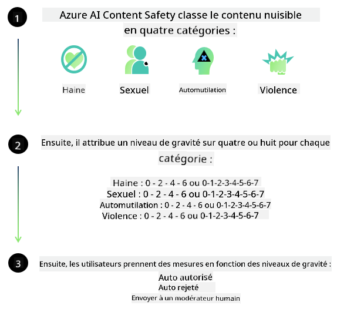
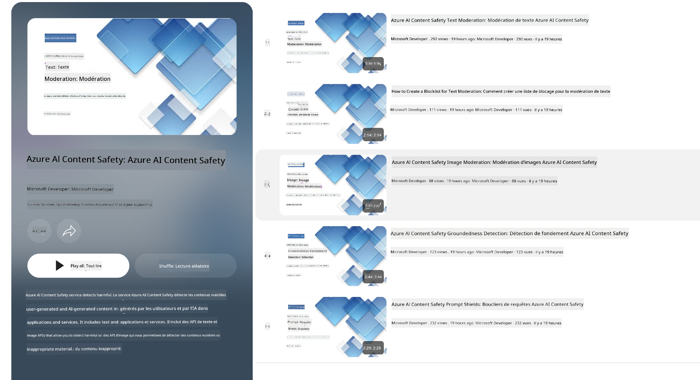

<!--
CO_OP_TRANSLATOR_METADATA:
{
  "original_hash": "839ccc4b3886ef10cfd4e64977f5792d",
  "translation_date": "2026-01-05T08:09:18+00:00",
  "source_file": "md/01.Introduction/01/01.AISafety.md",
  "language_code": "fr"
}
-->
# Sécurité de l’IA pour les modèles Phi  
La famille de modèles Phi a été développée conformément à la [norme Microsoft Responsible AI](https://www.microsoft.com/ai/principles-and-approach#responsible-ai-standard), un ensemble d’exigences à l’échelle de l’entreprise basé sur les six principes suivants : responsabilité, transparence, équité, fiabilité et sécurité, confidentialité et sécurité, et inclusivité qui forment les [principes d’IA responsable de Microsoft](https://www.microsoft.com/ai/responsible-ai).  

Comme pour les modèles Phi précédents, une évaluation de sécurité multifacette et une approche de sécurité post-entraînement ont été adoptées, avec des mesures supplémentaires prises pour tenir compte des capacités multilingues de cette version. Notre approche de la formation et des évaluations de sécurité, y compris les tests dans plusieurs langues et catégories de risques, est décrite dans le [document de sécurité post-entraînement Phi](https://arxiv.org/abs/2407.13833). Bien que les modèles Phi bénéficient de cette approche, les développeurs doivent appliquer les bonnes pratiques d’IA responsable, notamment la cartographie, la mesure et l’atténuation des risques associés à leur cas d’utilisation spécifique ainsi qu’au contexte culturel et linguistique.  

## Bonnes pratiques  

Comme d’autres modèles, la famille de modèles Phi peut potentiellement se comporter de manière injuste, peu fiable ou offensante.  

Certaines des limites comportementales des SLM et LLM dont vous devez être conscients incluent :  

- **Qualité du service :** Les modèles Phi sont principalement entraînés sur du texte en anglais. Les langues autres que l’anglais auront une performance moindre. Les variantes de l’anglais moins représentées dans les données d’entraînement pourraient avoir une performance inférieure à l’anglais américain standard.  
- **Représentation des préjudices et perpétuation des stéréotypes :** Ces modèles peuvent sur- ou sous-représenter certains groupes de personnes, effacer la représentation de certains groupes, ou renforcer des stéréotypes dégradants ou négatifs. Malgré la sécurité post-entraînement, ces limitations peuvent encore être présentes en raison de niveaux variables de représentation des différents groupes ou de la prévalence d’exemples de stéréotypes négatifs dans les données d’entraînement reflétant des patterns réels et des biais sociétaux.  
- **Contenu inapproprié ou offensant :** Ces modèles peuvent produire d’autres types de contenus inappropriés ou offensants, ce qui peut rendre leur déploiement inadapté dans des contextes sensibles sans mesures d’atténuation supplémentaires spécifiques au cas d’usage. Fiabilité de l’information : Les modèles linguistiques peuvent générer du contenu non-sens ou fabriquer du contenu qui peut sembler raisonnable mais est inexact ou obsolète.  
- **Portée limitée pour le code :** La majorité des données d’entraînement de Phi-3 sont basées sur Python et utilisent des packages courants tels que « typing, math, random, collections, datetime, itertools ». Si le modèle génère des scripts Python qui utilisent d’autres packages ou des scripts dans d’autres langages, nous recommandons fortement aux utilisateurs de vérifier manuellement toutes les utilisations d’API.  

Les développeurs doivent appliquer les meilleures pratiques d’IA responsable et sont responsables de s’assurer qu’un cas d’usage spécifique respecte les lois et régulations applicables (ex. confidentialité, commerce, etc.).  

## Considérations d’IA responsable  

Comme d’autres modèles linguistiques, les modèles de la série Phi peuvent potentiellement se comporter de manière injuste, peu fiable ou offensante. Certaines des limites à connaître incluent :  

**Qualité du service :** Les modèles Phi sont principalement entraînés sur du texte en anglais. Les langues autres que l’anglais auront une performance moindre. Les variantes de l’anglais moins représentées dans les données d’entraînement pourraient avoir une performance inférieure à l’anglais américain standard.  

**Représentation des préjudices et perpétuation des stéréotypes :** Ces modèles peuvent sur- ou sous-représenter certains groupes de personnes, effacer la représentation de certains groupes, ou renforcer des stéréotypes dégradants ou négatifs. Malgré la sécurité post-entraînement, ces limitations peuvent encore être présentes en raison de niveaux variables de représentation des différents groupes ou de la prévalence d’exemples de stéréotypes négatifs dans les données d’entraînement reflétant des patterns réels et des biais sociétaux.  

**Contenu inapproprié ou offensant :** Ces modèles peuvent produire d’autres types de contenus inappropriés ou offensants, ce qui peut rendre leur déploiement inadapté dans des contextes sensibles sans mesures d’atténuation supplémentaires spécifiques au cas d’usage. Fiabilité de l’information : Les modèles linguistiques peuvent générer du contenu non-sens ou fabriquer du contenu qui peut sembler raisonnable mais est inexact ou obsolète.  

**Portée limitée pour le code :** La majorité des données d’entraînement de Phi-3 sont basées sur Python et utilisent des packages courants tels que « typing, math, random, collections, datetime, itertools ». Si le modèle génère des scripts Python qui utilisent d’autres packages ou des scripts dans d’autres langages, nous recommandons fortement aux utilisateurs de vérifier manuellement toutes les utilisations d’API.  

Les développeurs doivent appliquer les meilleures pratiques d’IA responsable et sont responsables de s’assurer qu’un cas d’usage spécifique respecte les lois et régulations applicables (ex. confidentialité, commerce, etc.). Les domaines importants à considérer incluent :  

**Allocation :** Les modèles ne sont peut-être pas adaptés aux scénarios pouvant avoir un impact conséquent sur le statut légal ou l’allocation de ressources ou d’opportunités de vie (ex. : logement, emploi, crédit, etc.) sans évaluations supplémentaires et techniques de dé-biaisage.  

**Scénarios à haut risque :** Les développeurs doivent évaluer la pertinence d’utiliser ces modèles dans des scénarios à haut risque où des résultats injustes, peu fiables ou offensants pourraient être extrêmement coûteux ou entraîner des préjudices. Cela inclut la fourniture de conseils dans des domaines sensibles ou experts où la précision et la fiabilité sont critiques (ex. : conseils juridiques ou médicaux). Des mesures de protection supplémentaires doivent être mises en œuvre au niveau de l’application selon le contexte de déploiement.  

**Désinformation :** Les modèles peuvent produire des informations inexactes. Les développeurs doivent suivre les meilleures pratiques de transparence et informer les utilisateurs finaux qu’ils interagissent avec un système d’IA. Au niveau applicatif, ils peuvent construire des mécanismes de retour d’information et des pipelines pour ancrer les réponses dans des informations contextuelles spécifiques au cas d’usage, une technique connue sous le nom de génération augmentée par récupération (RAG).  

**Génération de contenu nuisible :** Les développeurs doivent évaluer les sorties en fonction de leur contexte et utiliser des classificateurs de sécurité disponibles ou des solutions personnalisées adaptées à leur cas d’usage.  

**Mauvais usage :** D’autres formes d’abus comme la fraude, le spam ou la production de logiciels malveillants peuvent être possibles, et les développeurs doivent s’assurer que leurs applications ne violent pas les lois et règlements applicables.  

### Affinage et sécurité du contenu IA  

Après avoir affiné un modèle, nous recommandons fortement de tirer parti des mesures [Azure AI Content Safety](https://learn.microsoft.com/azure/ai-services/content-safety/overview) pour surveiller le contenu généré par les modèles, identifier et bloquer les risques potentiels, menaces et problèmes de qualité.  

  

[Azure AI Content Safety](https://learn.microsoft.com/azure/ai-services/content-safety/overview) prend en charge à la fois le contenu texte et image. Il peut être déployé dans le cloud, dans des conteneurs déconnectés, ainsi que sur des appareils en périphérie/intégrés.  

## Vue d’ensemble d’Azure AI Content Safety  

Azure AI Content Safety n’est pas une solution universelle ; elle peut être personnalisée pour s’aligner sur les politiques spécifiques des entreprises. De plus, ses modèles multilingues lui permettent de comprendre plusieurs langues simultanément.  

  

- **Azure AI Content Safety**  
- **Microsoft Developer**  
- **5 vidéos**  

Le service Azure AI Content Safety détecte le contenu nuisible généré par les utilisateurs et par l’IA dans les applications et services. Il comprend des API texte et image qui permettent de détecter des matériels nuisibles ou inappropriés.  

[AI Content Safety Playlist](https://www.youtube.com/playlist?list=PLlrxD0HtieHjaQ9bJjyp1T7FeCbmVcPkQ)

---

<!-- CO-OP TRANSLATOR DISCLAIMER START -->
**Avis de non-responsabilité** :  
Ce document a été traduit à l’aide du service de traduction automatique [Co-op Translator](https://github.com/Azure/co-op-translator). Bien que nous nous efforçons d’assurer la précision, veuillez noter que les traductions automatisées peuvent contenir des erreurs ou des inexactitudes. Le document original dans sa langue d’origine doit être considéré comme la source faisant foi. Pour toute information critique, une traduction professionnelle réalisée par un humain est recommandée. Nous déclinons toute responsabilité en cas de malentendus ou de mauvaises interprétations résultant de l’utilisation de cette traduction.
<!-- CO-OP TRANSLATOR DISCLAIMER END -->