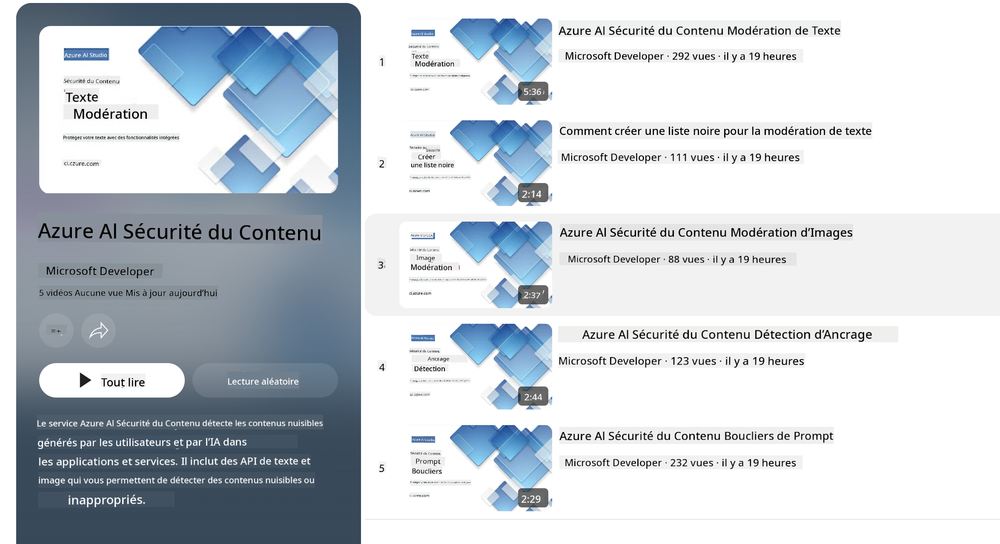

<!--
CO_OP_TRANSLATOR_METADATA:
{
  "original_hash": "c8273672cc57df2be675407a1383aaf0",
  "translation_date": "2025-07-16T17:41:18+00:00",
  "source_file": "md/01.Introduction/01/01.AISafety.md",
  "language_code": "fr"
}
-->
# Sécurité de l’IA pour les modèles Phi  
La famille de modèles Phi a été développée conformément au [Microsoft Responsible AI Standard](https://query.prod.cms.rt.microsoft.com/cms/api/am/binary/RE5cmFl), un ensemble d’exigences à l’échelle de l’entreprise basé sur six principes : responsabilité, transparence, équité, fiabilité et sécurité, confidentialité et sécurité, ainsi qu’inclusivité, qui forment les [principes d’IA responsable de Microsoft](https://www.microsoft.com/ai/responsible-ai).

Comme pour les modèles Phi précédents, une évaluation de sécurité multi-facettes et une approche de post-entraînement en sécurité ont été adoptées, avec des mesures supplémentaires pour prendre en compte les capacités multilingues de cette version. Notre approche de la formation et des évaluations de sécurité, incluant des tests dans plusieurs langues et catégories de risques, est décrite dans le [document sur la sécurité post-entraînement de Phi](https://arxiv.org/abs/2407.13833). Bien que les modèles Phi bénéficient de cette approche, les développeurs doivent appliquer les meilleures pratiques d’IA responsable, notamment en cartographiant, mesurant et atténuant les risques liés à leur cas d’usage spécifique ainsi qu’au contexte culturel et linguistique.

## Bonnes pratiques

Comme d’autres modèles, la famille Phi peut potentiellement adopter des comportements injustes, peu fiables ou offensants.

Parmi les comportements limitants des SLM et LLM dont il faut être conscient, on trouve :

- **Qualité de service :** Les modèles Phi sont principalement entraînés sur des textes en anglais. Les langues autres que l’anglais auront des performances moindres. Les variantes de l’anglais moins représentées dans les données d’entraînement peuvent avoir des performances inférieures à celles de l’anglais américain standard.  
- **Représentation des préjudices et perpétuation des stéréotypes :** Ces modèles peuvent sur- ou sous-représenter certains groupes de personnes, effacer la représentation de certains groupes, ou renforcer des stéréotypes dévalorisants ou négatifs. Malgré le post-entraînement de sécurité, ces limites peuvent persister en raison des niveaux variables de représentation des groupes ou de la prévalence d’exemples de stéréotypes négatifs dans les données d’entraînement, qui reflètent des schémas réels et des biais sociétaux.  
- **Contenu inapproprié ou offensant :** Ces modèles peuvent générer d’autres types de contenus inappropriés ou offensants, ce qui peut rendre leur déploiement inadapté dans des contextes sensibles sans mesures d’atténuation supplémentaires spécifiques au cas d’usage.  
- **Fiabilité de l’information :** Les modèles de langage peuvent produire du contenu incohérent ou inventer des informations qui peuvent sembler plausibles mais sont inexactes ou obsolètes.  
- **Portée limitée pour le code :** La majorité des données d’entraînement de Phi-3 sont basées sur Python et utilisent des packages courants tels que "typing, math, random, collections, datetime, itertools". Si le modèle génère des scripts Python utilisant d’autres packages ou des scripts dans d’autres langages, nous recommandons vivement aux utilisateurs de vérifier manuellement toutes les utilisations d’API.

Les développeurs doivent appliquer les meilleures pratiques d’IA responsable et sont responsables de s’assurer que leur cas d’usage respecte les lois et réglementations en vigueur (ex : confidentialité, commerce, etc.).

## Considérations d’IA responsable

Comme pour d’autres modèles de langage, les modèles de la série Phi peuvent potentiellement adopter des comportements injustes, peu fiables ou offensants. Parmi les comportements limitants à connaître, on trouve :

**Qualité de service :** Les modèles Phi sont principalement entraînés sur des textes en anglais. Les langues autres que l’anglais auront des performances moindres. Les variantes de l’anglais moins représentées dans les données d’entraînement peuvent avoir des performances inférieures à celles de l’anglais américain standard.

**Représentation des préjudices et perpétuation des stéréotypes :** Ces modèles peuvent sur- ou sous-représenter certains groupes de personnes, effacer la représentation de certains groupes, ou renforcer des stéréotypes dévalorisants ou négatifs. Malgré le post-entraînement de sécurité, ces limites peuvent persister en raison des niveaux variables de représentation des groupes ou de la prévalence d’exemples de stéréotypes négatifs dans les données d’entraînement, qui reflètent des schémas réels et des biais sociétaux.

**Contenu inapproprié ou offensant :** Ces modèles peuvent générer d’autres types de contenus inappropriés ou offensants, ce qui peut rendre leur déploiement inadapté dans des contextes sensibles sans mesures d’atténuation supplémentaires spécifiques au cas d’usage.  
Fiabilité de l’information : Les modèles de langage peuvent produire du contenu incohérent ou inventer des informations qui peuvent sembler plausibles mais sont inexactes ou obsolètes.

**Portée limitée pour le code :** La majorité des données d’entraînement de Phi-3 sont basées sur Python et utilisent des packages courants tels que "typing, math, random, collections, datetime, itertools". Si le modèle génère des scripts Python utilisant d’autres packages ou des scripts dans d’autres langages, nous recommandons vivement aux utilisateurs de vérifier manuellement toutes les utilisations d’API.

Les développeurs doivent appliquer les meilleures pratiques d’IA responsable et sont responsables de s’assurer que leur cas d’usage respecte les lois et réglementations en vigueur (ex : confidentialité, commerce, etc.). Les domaines importants à considérer incluent :

**Allocation :** Les modèles peuvent ne pas convenir à des scénarios ayant un impact conséquent sur le statut légal ou l’allocation de ressources ou d’opportunités de vie (ex : logement, emploi, crédit, etc.) sans évaluations supplémentaires et techniques de dé-biaisage complémentaires.

**Scénarios à haut risque :** Les développeurs doivent évaluer l’adéquation des modèles dans des scénarios à haut risque où des résultats injustes, peu fiables ou offensants pourraient avoir des conséquences graves ou causer des dommages. Cela inclut la fourniture de conseils dans des domaines sensibles ou experts où la précision et la fiabilité sont cruciales (ex : conseils juridiques ou médicaux). Des mesures de protection supplémentaires doivent être mises en place au niveau de l’application selon le contexte de déploiement.

**Désinformation :** Les modèles peuvent produire des informations inexactes. Les développeurs doivent suivre les meilleures pratiques de transparence et informer les utilisateurs finaux qu’ils interagissent avec un système d’IA. Au niveau de l’application, les développeurs peuvent mettre en place des mécanismes de retour et des pipelines pour ancrer les réponses dans des informations contextuelles spécifiques au cas d’usage, une technique connue sous le nom de Retrieval Augmented Generation (RAG).

**Génération de contenu nuisible :** Les développeurs doivent évaluer les sorties en fonction de leur contexte et utiliser les classificateurs de sécurité disponibles ou des solutions personnalisées adaptées à leur cas d’usage.

**Mauvaise utilisation :** D’autres formes de mauvaise utilisation, telles que la fraude, le spam ou la production de logiciels malveillants, peuvent être possibles, et les développeurs doivent s’assurer que leurs applications ne violent pas les lois et réglementations applicables.

### Affinage et sécurité du contenu IA

Après avoir affiné un modèle, nous recommandons vivement d’utiliser les mesures de [Azure AI Content Safety](https://learn.microsoft.com/azure/ai-services/content-safety/overview) pour surveiller le contenu généré par les modèles, identifier et bloquer les risques, menaces et problèmes de qualité potentiels.

[Azure AI Content Safety](https://learn.microsoft.com/azure/ai-services/content-safety/overview) prend en charge à la fois le contenu textuel et image. Il peut être déployé dans le cloud, dans des conteneurs déconnectés, ainsi que sur des appareils en périphérie ou embarqués.

## Présentation d’Azure AI Content Safety

Azure AI Content Safety n’est pas une solution universelle ; elle peut être personnalisée pour s’aligner sur les politiques spécifiques des entreprises. De plus, ses modèles multilingues lui permettent de comprendre plusieurs langues simultanément.

- **Azure AI Content Safety**  
- **Microsoft Developer**  
- **5 vidéos**

Le service Azure AI Content Safety détecte les contenus nuisibles générés par les utilisateurs et par l’IA dans les applications et services. Il inclut des API pour le texte et les images qui permettent de détecter les contenus nuisibles ou inappropriés.

[AI Content Safety Playlist](https://www.youtube.com/playlist?list=PLlrxD0HtieHjaQ9bJjyp1T7FeCbmVcPkQ)

**Avertissement** :  
Ce document a été traduit à l’aide du service de traduction automatique [Co-op Translator](https://github.com/Azure/co-op-translator). Bien que nous nous efforcions d’assurer l’exactitude, veuillez noter que les traductions automatiques peuvent contenir des erreurs ou des inexactitudes. Le document original dans sa langue d’origine doit être considéré comme la source faisant foi. Pour les informations critiques, une traduction professionnelle réalisée par un humain est recommandée. Nous déclinons toute responsabilité en cas de malentendus ou de mauvaises interprétations résultant de l’utilisation de cette traduction.