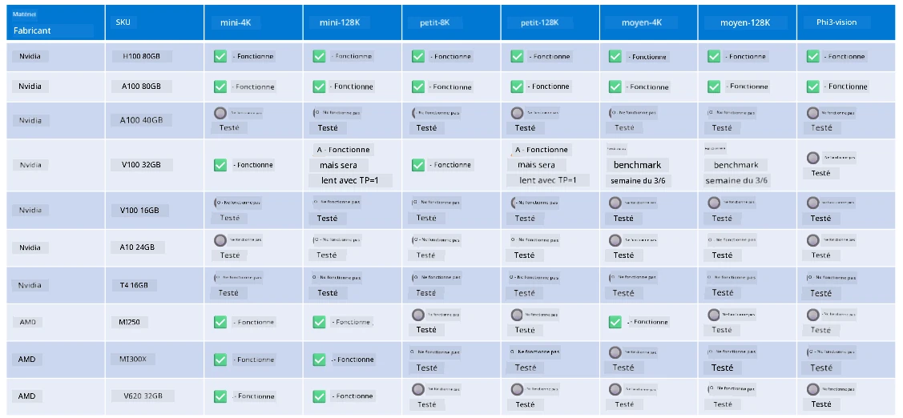

<!--
CO_OP_TRANSLATOR_METADATA:
{
  "original_hash": "8cdc17ce0f10535da30b53d23fe1a795",
  "translation_date": "2025-07-16T18:22:38+00:00",
  "source_file": "md/01.Introduction/01/01.Hardwaresupport.md",
  "language_code": "fr"
}
-->
# Support matériel Phi

Microsoft Phi a été optimisé pour ONNX Runtime et prend en charge Windows DirectML. Il fonctionne bien sur différents types de matériel, y compris les GPU, les CPU, et même les appareils mobiles.

## Matériel de l’appareil  
Plus précisément, le matériel pris en charge comprend :

- GPU SKU : RTX 4090 (DirectML)
- GPU SKU : 1 A100 80GB (CUDA)
- CPU SKU : Standard F64s v2 (64 vCPUs, 128 GiB de mémoire)

## SKU Mobile

- Android - Samsung Galaxy S21
- Apple iPhone 14 ou supérieur avec processeur A16/A17

## Spécifications matérielles Phi

- Configuration minimale requise.
- Windows : GPU compatible DirectX 12 et au moins 4 Go de RAM combinée

CUDA : GPU NVIDIA avec Compute Capability >= 7.02



## Exécution d’onnxruntime sur plusieurs GPU

Les modèles Phi ONNX actuellement disponibles ne prennent en charge qu’un seul GPU. Il est possible de supporter le multi-GPU pour les modèles Phi, mais ORT avec 2 GPU ne garantit pas un débit supérieur par rapport à 2 instances distinctes d’ORT. Veuillez consulter [ONNX Runtime](https://onnxruntime.ai/) pour les dernières mises à jour.

Lors de [Build 2024, l’équipe GenAI ONNX](https://youtu.be/WLW4SE8M9i8?si=EtG04UwDvcjunyfC) a annoncé qu’ils avaient activé le multi-instance plutôt que le multi-GPU pour les modèles Phi.

Actuellement, cela vous permet d’exécuter une instance onnxruntime ou onnxruntime-genai avec la variable d’environnement CUDA_VISIBLE_DEVICES comme suit.

```Python
CUDA_VISIBLE_DEVICES=0 python infer.py
CUDA_VISIBLE_DEVICES=1 python infer.py
```

N’hésitez pas à explorer davantage Phi dans [Azure AI Foundry](https://ai.azure.com)

**Avertissement** :  
Ce document a été traduit à l’aide du service de traduction automatique [Co-op Translator](https://github.com/Azure/co-op-translator). Bien que nous nous efforcions d’assurer l’exactitude, veuillez noter que les traductions automatiques peuvent contenir des erreurs ou des inexactitudes. Le document original dans sa langue d’origine doit être considéré comme la source faisant foi. Pour les informations critiques, une traduction professionnelle réalisée par un humain est recommandée. Nous déclinons toute responsabilité en cas de malentendus ou de mauvaises interprétations résultant de l’utilisation de cette traduction.