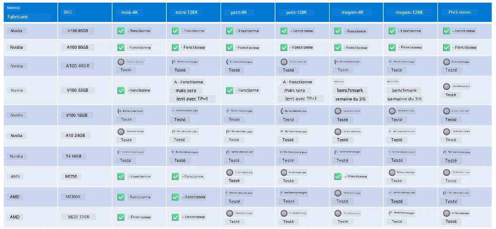

# Support matériel Phi

Microsoft Phi a été optimisé pour ONNX Runtime et prend en charge Windows DirectML. Il fonctionne bien sur différents types de matériel, y compris les GPU, les CPU et même les appareils mobiles.

## Matériel de l'appareil  
Plus précisément, le matériel pris en charge inclut :

- SKU GPU : RTX 4090 (DirectML)
- SKU GPU : 1 A100 80GB (CUDA)
- SKU CPU : Standard F64s v2 (64 vCPU, 128 GiB de mémoire)

## SKU mobile

- Android - Samsung Galaxy S21
- Apple iPhone 14 ou supérieur Processeur A16/A17

## Spécification matérielle Phi

- Configuration minimale requise.
- Windows : GPU compatible DirectX 12 et un minimum de 4 Go de RAM combinée

CUDA : GPU NVIDIA avec une capacité de calcul >= 7.02



## Exécution de onnxruntime sur plusieurs GPU

Les modèles Phi ONNX actuellement disponibles sont uniquement pour 1 GPU. Il est possible de prendre en charge le multi-GPU pour le modèle Phi, mais ORT avec 2 GPU ne garantit pas qu'il offrira un débit supérieur par rapport à 2 instances d'ORT. Veuillez consulter [ONNX Runtime](https://onnxruntime.ai/) pour les dernières mises à jour.

Lors du [Build 2024, l'équipe GenAI ONNX](https://youtu.be/WLW4SE8M9i8?si=EtG04UwDvcjunyfC) a annoncé qu'ils avaient activé le multi-instance au lieu du multi-GPU pour les modèles Phi.

Actuellement, cela vous permet d'exécuter une instance onnnxruntime ou onnxruntime-genai avec la variable d'environnement CUDA_VISIBLE_DEVICES comme ceci.

```Python
CUDA_VISIBLE_DEVICES=0 python infer.py
CUDA_VISIBLE_DEVICES=1 python infer.py
```
  
N'hésitez pas à explorer davantage Phi dans [Microsoft Foundry](https://ai.azure.com)

---

<!-- CO-OP TRANSLATOR DISCLAIMER START -->
**Avertissement** :  
Ce document a été traduit à l’aide du service de traduction automatique [Co-op Translator](https://github.com/Azure/co-op-translator). Bien que nous nous efforcions d’être précis, veuillez noter que les traductions automatiques peuvent contenir des erreurs ou des inexactitudes. Le document original dans sa langue native doit être considéré comme la source faisant autorité. Pour les informations essentielles, il est recommandé de recourir à une traduction humaine professionnelle. Nous déclinons toute responsabilité en cas de malentendus ou d’interprétations erronées résultant de l’utilisation de cette traduction.
<!-- CO-OP TRANSLATOR DISCLAIMER END -->