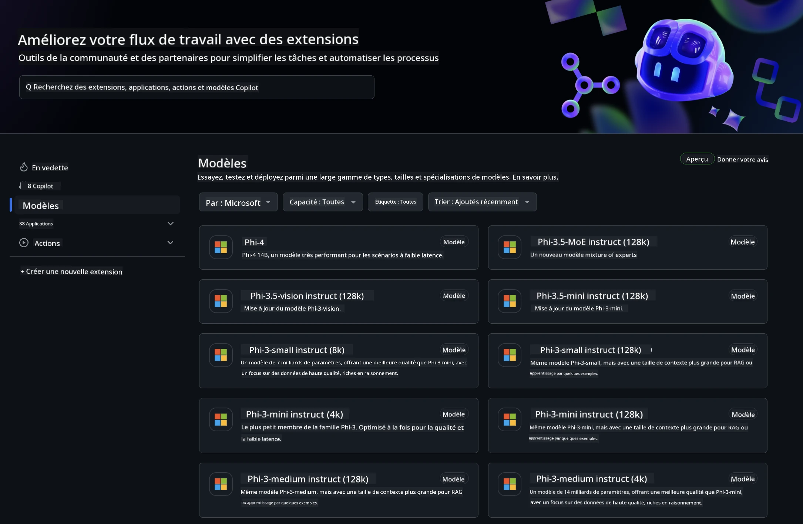
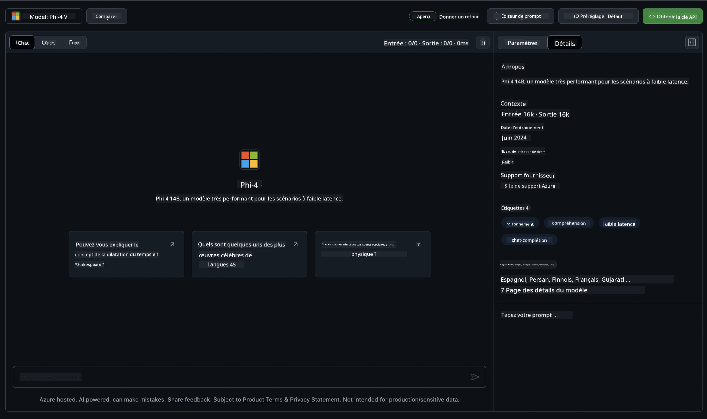
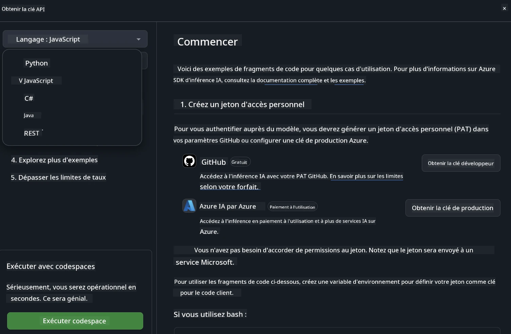
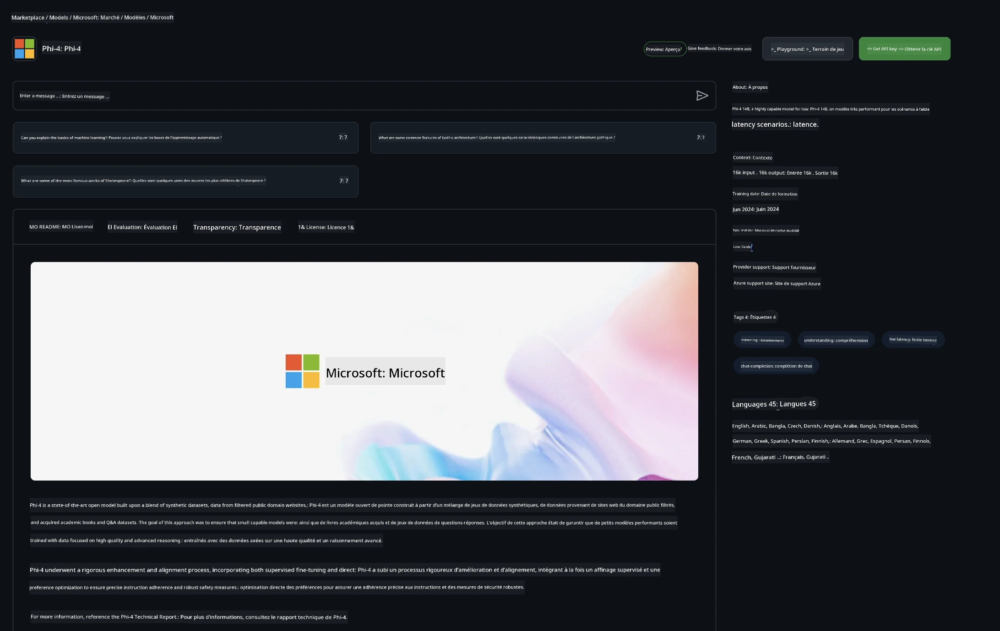

<!--
CO_OP_TRANSLATOR_METADATA:
{
  "original_hash": "fb67a08b9fc911a10ed58081fadef416",
  "translation_date": "2025-07-16T18:56:13+00:00",
  "source_file": "md/01.Introduction/02/02.GitHubModel.md",
  "language_code": "fr"
}
-->
## Famille Phi dans GitHub Models

Bienvenue sur [GitHub Models](https://github.com/marketplace/models) ! Tout est prêt pour que vous puissiez explorer les modèles d’IA hébergés sur Azure AI.



Pour plus d’informations sur les modèles disponibles sur GitHub Models, consultez le [GitHub Model Marketplace](https://github.com/marketplace/models)

## Modèles disponibles

Chaque modèle dispose d’un espace de test dédié et d’exemples de code



### Famille Phi dans le catalogue GitHub Model

- [Phi-4](https://github.com/marketplace/models/azureml/Phi-4)

- [Phi-3.5-MoE instruct (128k)](https://github.com/marketplace/models/azureml/Phi-3-5-MoE-instruct)

- [Phi-3.5-vision instruct (128k)](https://github.com/marketplace/models/azureml/Phi-3-5-vision-instruct)

- [Phi-3.5-mini instruct (128k)](https://github.com/marketplace/models/azureml/Phi-3-5-mini-instruct)

- [Phi-3-Medium-128k-Instruct](https://github.com/marketplace/models/azureml/Phi-3-medium-128k-instruct)

- [Phi-3-medium-4k-instruct](https://github.com/marketplace/models/azureml/Phi-3-medium-4k-instruct)

- [Phi-3-mini-128k-instruct](https://github.com/marketplace/models/azureml/Phi-3-mini-128k-instruct)

- [Phi-3-mini-4k-instruct](https://github.com/marketplace/models/azureml/Phi-3-mini-4k-instruct)

- [Phi-3-small-128k-instruct](https://github.com/marketplace/models/azureml/Phi-3-small-128k-instruct)

- [Phi-3-small-8k-instruct](https://github.com/marketplace/models/azureml/Phi-3-small-8k-instruct)

## Premiers pas

Quelques exemples simples sont prêts à être exécutés. Vous les trouverez dans le répertoire samples. Si vous souhaitez aller directement à votre langage préféré, les exemples sont disponibles dans les langages suivants :

- Python
- JavaScript
- C#
- Java
- cURL

Un environnement Codespaces dédié est également disponible pour exécuter les exemples et les modèles.



## Exemple de code

Voici des extraits de code pour quelques cas d’usage. Pour plus d’informations sur Azure AI Inference SDK, consultez la documentation complète et les exemples.

## Configuration

1. Créez un jeton d’accès personnel  
Vous n’avez pas besoin d’attribuer de permissions au jeton. Notez que le jeton sera envoyé à un service Microsoft.

Pour utiliser les extraits de code ci-dessous, créez une variable d’environnement pour définir votre jeton comme clé pour le code client.

Si vous utilisez bash :  
```
export GITHUB_TOKEN="<your-github-token-goes-here>"
```  
Si vous êtes sous powershell :  

```
$Env:GITHUB_TOKEN="<your-github-token-goes-here>"
```  

Si vous utilisez l’invite de commandes Windows :  

```
set GITHUB_TOKEN=<your-github-token-goes-here>
```  

## Exemple Python

### Installer les dépendances  
Installez Azure AI Inference SDK avec pip (Nécessite : Python >=3.8) :

```
pip install azure-ai-inference
```  
### Exécuter un exemple simple

Cet exemple montre un appel basique à l’API de complétion de chat. Il utilise le point d’accès d’inférence du modèle AI GitHub et votre jeton GitHub. L’appel est synchrone.

```python
import os
from azure.ai.inference import ChatCompletionsClient
from azure.ai.inference.models import SystemMessage, UserMessage
from azure.core.credentials import AzureKeyCredential

endpoint = "https://models.inference.ai.azure.com"
model_name = "Phi-4"
token = os.environ["GITHUB_TOKEN"]

client = ChatCompletionsClient(
    endpoint=endpoint,
    credential=AzureKeyCredential(token),
)

response = client.complete(
    messages=[
        UserMessage(content="I have $20,000 in my savings account, where I receive a 4% profit per year and payments twice a year. Can you please tell me how long it will take for me to become a millionaire? Also, can you please explain the math step by step as if you were explaining it to an uneducated person?"),
    ],
    temperature=0.4,
    top_p=1.0,
    max_tokens=2048,
    model=model_name
)

print(response.choices[0].message.content)
```

### Exécuter une conversation multi-tours

Cet exemple illustre une conversation multi-tours avec l’API de complétion de chat. Lors de l’utilisation du modèle pour une application de chat, vous devez gérer l’historique de la conversation et envoyer les derniers messages au modèle.

```
import os
from azure.ai.inference import ChatCompletionsClient
from azure.ai.inference.models import AssistantMessage, SystemMessage, UserMessage
from azure.core.credentials import AzureKeyCredential

token = os.environ["GITHUB_TOKEN"]
endpoint = "https://models.inference.ai.azure.com"
# Replace Model_Name
model_name = "Phi-4"

client = ChatCompletionsClient(
    endpoint=endpoint,
    credential=AzureKeyCredential(token),
)

messages = [
    SystemMessage(content="You are a helpful assistant."),
    UserMessage(content="What is the capital of France?"),
    AssistantMessage(content="The capital of France is Paris."),
    UserMessage(content="What about Spain?"),
]

response = client.complete(messages=messages, model=model_name)

print(response.choices[0].message.content)
```

### Diffuser la sortie

Pour une meilleure expérience utilisateur, vous souhaiterez diffuser la réponse du modèle afin que le premier token apparaisse rapidement et éviter d’attendre de longues réponses.

```
import os
from azure.ai.inference import ChatCompletionsClient
from azure.ai.inference.models import SystemMessage, UserMessage
from azure.core.credentials import AzureKeyCredential

token = os.environ["GITHUB_TOKEN"]
endpoint = "https://models.inference.ai.azure.com"
# Replace Model_Name
model_name = "Phi-4"

client = ChatCompletionsClient(
    endpoint=endpoint,
    credential=AzureKeyCredential(token),
)

response = client.complete(
    stream=True,
    messages=[
        SystemMessage(content="You are a helpful assistant."),
        UserMessage(content="Give me 5 good reasons why I should exercise every day."),
    ],
    model=model_name,
)

for update in response:
    if update.choices:
        print(update.choices[0].delta.content or "", end="")

client.close()
```

## Utilisation GRATUITE et limites de débit pour GitHub Models



Les [limites de débit pour le playground et l’utilisation gratuite de l’API](https://docs.github.com/en/github-models/prototyping-with-ai-models#rate-limits) sont conçues pour vous permettre d’expérimenter avec les modèles et de prototyper votre application IA. Pour dépasser ces limites et passer à l’échelle, vous devez provisionner des ressources depuis un compte Azure et vous authentifier via celui-ci plutôt qu’avec votre jeton d’accès personnel GitHub. Vous n’avez rien d’autre à modifier dans votre code. Utilisez ce lien pour découvrir comment dépasser les limites du niveau gratuit dans Azure AI.

### Informations importantes

Gardez à l’esprit qu’en interagissant avec un modèle, vous expérimentez avec de l’IA, donc des erreurs de contenu sont possibles.

Cette fonctionnalité est soumise à diverses limites (nombre de requêtes par minute, par jour, tokens par requête, requêtes simultanées) et n’est pas conçue pour des cas d’usage en production.

GitHub Models utilise Azure AI Content Safety. Ces filtres ne peuvent pas être désactivés dans le cadre de l’expérience GitHub Models. Si vous choisissez d’utiliser les modèles via un service payant, veuillez configurer vos filtres de contenu selon vos besoins.

Ce service est soumis aux Conditions de pré-lancement de GitHub.

**Avertissement** :  
Ce document a été traduit à l’aide du service de traduction automatique [Co-op Translator](https://github.com/Azure/co-op-translator). Bien que nous nous efforcions d’assurer l’exactitude, veuillez noter que les traductions automatiques peuvent contenir des erreurs ou des inexactitudes. Le document original dans sa langue d’origine doit être considéré comme la source faisant foi. Pour les informations critiques, une traduction professionnelle réalisée par un humain est recommandée. Nous déclinons toute responsabilité en cas de malentendus ou de mauvaises interprétations résultant de l’utilisation de cette traduction.