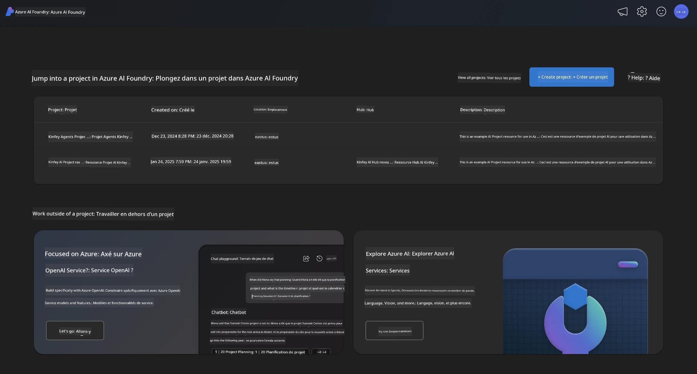
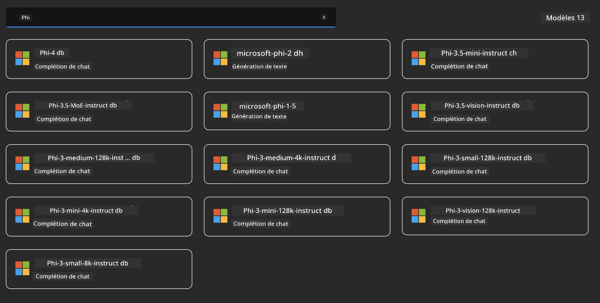
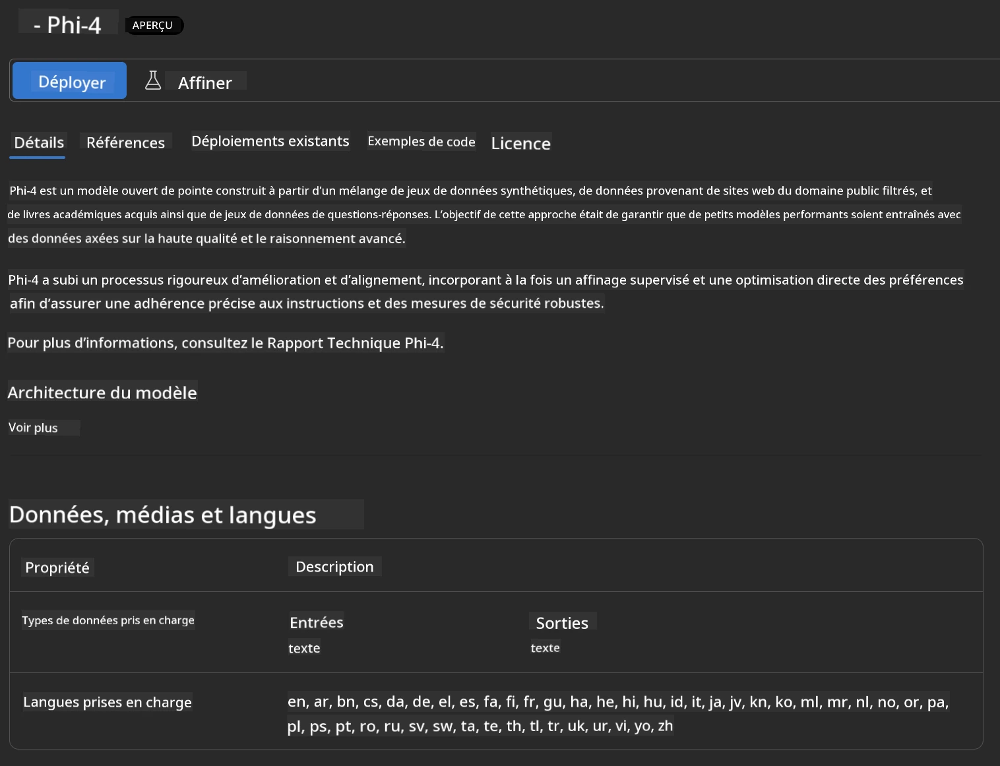
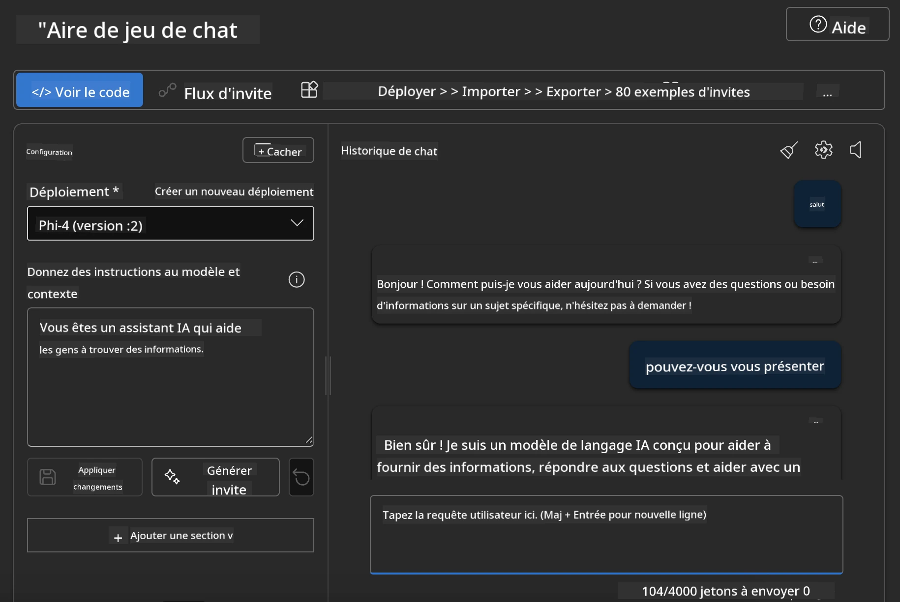

## Famille Phi dans Microsoft Foundry

[Microsoft Foundry](https://ai.azure.com) est une plateforme de confiance qui permet aux développeurs de stimuler l'innovation et de façonner l'avenir avec l'IA de manière sécurisée, fiable et responsable.

[Microsoft Foundry](https://ai.azure.com) est conçue pour les développeurs afin de :

- Construire des applications d'IA générative sur une plateforme de niveau entreprise.
- Explorer, construire, tester et déployer en utilisant des outils d'IA de pointe et des modèles ML, basés sur des pratiques d'IA responsable.
- Collaborer avec une équipe pour le cycle complet de développement des applications.

Avec Microsoft Foundry, vous pouvez explorer une grande variété de modèles, services et fonctionnalités, et commencer à construire des applications d'IA qui répondent au mieux à vos objectifs. La plateforme Microsoft Foundry facilite la montée en charge pour transformer les preuves de concept en applications de production complètes avec aisance. La surveillance continue et le raffinement soutiennent le succès à long terme.



En plus d'utiliser le service Azure AOAI dans Microsoft Foundry, vous pouvez également utiliser des modèles tiers dans le Catalogue de Modèles Microsoft Foundry. C'est un bon choix si vous souhaitez utiliser Microsoft Foundry comme plateforme de solution IA.

Nous pouvons déployer rapidement les modèles de la famille Phi via le Catalogue de Modèles dans Microsoft Foundry

[Modèles Microsoft Phi dans Microsoft Foundry Models](https://ai.azure.com/explore/models/?selectedCollection=phi)



### **Déployer Phi-4 dans Microsoft Foundry**



### **Tester Phi-4 dans Microsoft Foundry Playground**



### **Exécution de code Python pour appeler Microsoft Foundry Phi-4**

```python

import os  
import base64
from openai import AzureOpenAI  
from azure.identity import DefaultAzureCredential, get_bearer_token_provider  
        
endpoint = os.getenv("ENDPOINT_URL", "Your Azure AOAI Service Endpoint")  
deployment = os.getenv("DEPLOYMENT_NAME", "Phi-4")  
      
token_provider = get_bearer_token_provider(  
    DefaultAzureCredential(),  
    "https://cognitiveservices.azure.com/.default"  
)  
  
client = AzureOpenAI(  
    azure_endpoint=endpoint,  
    azure_ad_token_provider=token_provider,  
    api_version="2024-05-01-preview",  
)  
  

chat_prompt = [
    {
        "role": "system",
        "content": "You are an AI assistant that helps people find information."
    },
    {
        "role": "user",
        "content": "can you introduce yourself"
    }
] 
    
# Inclure le résultat vocal si la parole est activée
messages = chat_prompt 

completion = client.chat.completions.create(  
    model=deployment,  
    messages=messages,
    max_tokens=800,  
    temperature=0.7,  
    top_p=0.95,  
    frequency_penalty=0,  
    presence_penalty=0,
    stop=None,  
    stream=False  
)  
  
print(completion.to_json())  

```

---

<!-- CO-OP TRANSLATOR DISCLAIMER START -->
**Clause de non-responsabilité** :  
Ce document a été traduit à l’aide du service de traduction automatique [Co-op Translator](https://github.com/Azure/co-op-translator). Bien que nous nous efforcions d’assurer l’exactitude, veuillez noter que les traductions automatiques peuvent contenir des erreurs ou des inexactitudes. Le document original dans sa langue native doit être considéré comme la source faisant foi. Pour les informations critiques, une traduction professionnelle réalisée par un humain est recommandée. Nous déclinons toute responsabilité en cas de malentendus ou d’interprétations erronées résultant de l’utilisation de cette traduction.
<!-- CO-OP TRANSLATOR DISCLAIMER END -->