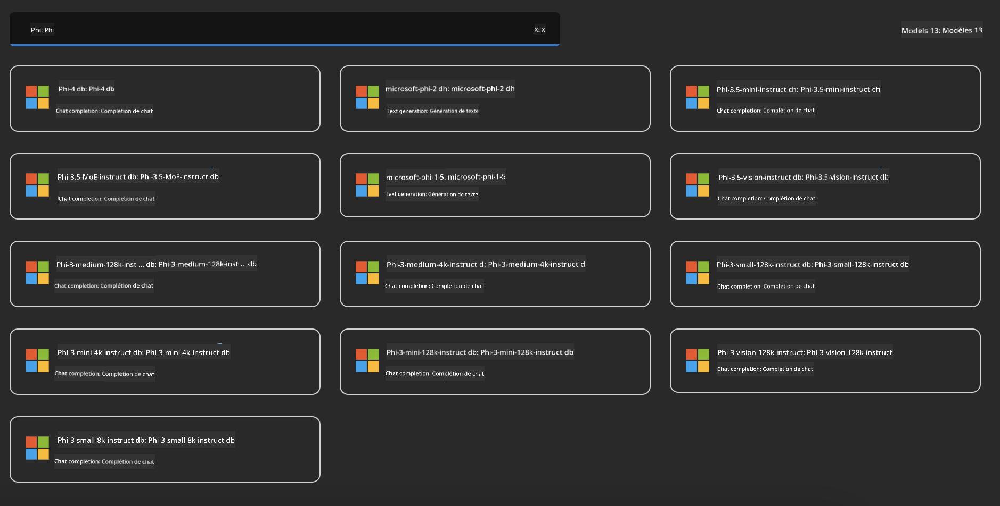
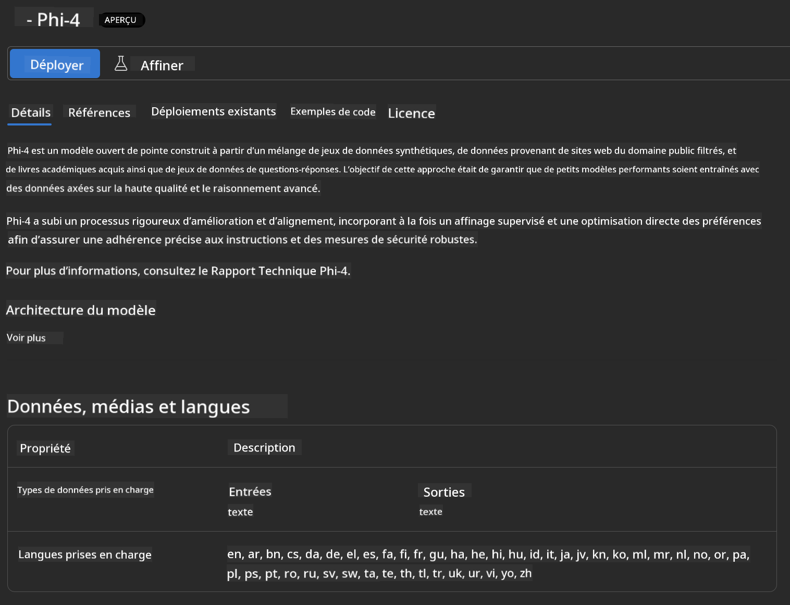
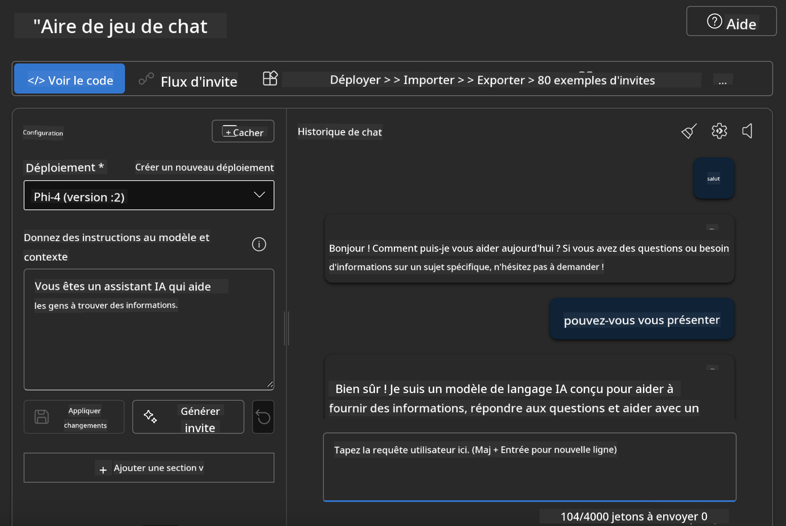

<!--
CO_OP_TRANSLATOR_METADATA:
{
  "original_hash": "3ae21dc5554e888defbe57946ee995ee",
  "translation_date": "2025-07-16T19:06:27+00:00",
  "source_file": "md/01.Introduction/02/03.AzureAIFoundry.md",
  "language_code": "fr"
}
-->
## Famille Phi dans Azure AI Foundry

[Azure AI Foundry](https://ai.azure.com) est une plateforme de confiance qui permet aux développeurs de stimuler l'innovation et de façonner l'avenir avec l'IA de manière sûre, sécurisée et responsable.

[Azure AI Foundry](https://ai.azure.com) est conçue pour les développeurs afin de :

- Créer des applications d'IA générative sur une plateforme de niveau entreprise.
- Explorer, construire, tester et déployer en utilisant des outils d'IA et des modèles ML de pointe, basés sur des pratiques d'IA responsable.
- Collaborer en équipe tout au long du cycle de vie complet du développement d'applications.

Avec Azure AI Foundry, vous pouvez explorer une grande variété de modèles, services et fonctionnalités, et commencer à créer des applications d'IA qui répondent au mieux à vos objectifs. La plateforme Azure AI Foundry facilite la montée en charge pour transformer des preuves de concept en applications de production complètes en toute simplicité. La surveillance continue et l'affinement garantissent un succès durable.


En plus d’utiliser le service Azure AOAI dans Azure AI Foundry, vous pouvez également utiliser des modèles tiers dans le catalogue de modèles Azure AI Foundry. C’est un bon choix si vous souhaitez utiliser Azure AI Foundry comme plateforme de solution IA.

Nous pouvons déployer rapidement les modèles de la famille Phi via le catalogue de modèles dans Azure AI Foundry

[Microsoft Phi Models in Azure AI Foundry Models](https://ai.azure.com/explore/models/?selectedCollection=phi)



### **Déployer Phi-4 dans Azure AI Foundry**



### **Tester Phi-4 dans le Playground Azure AI Foundry**



### **Exécuter du code Python pour appeler Phi-4 dans Azure AI Foundry**

```python

import os  
import base64
from openai import AzureOpenAI  
from azure.identity import DefaultAzureCredential, get_bearer_token_provider  
        
endpoint = os.getenv("ENDPOINT_URL", "Your Azure AOAI Service Endpoint")  
deployment = os.getenv("DEPLOYMENT_NAME", "Phi-4")  
      
token_provider = get_bearer_token_provider(  
    DefaultAzureCredential(),  
    "https://cognitiveservices.azure.com/.default"  
)  
  
client = AzureOpenAI(  
    azure_endpoint=endpoint,  
    azure_ad_token_provider=token_provider,  
    api_version="2024-05-01-preview",  
)  
  

chat_prompt = [
    {
        "role": "system",
        "content": "You are an AI assistant that helps people find information."
    },
    {
        "role": "user",
        "content": "can you introduce yourself"
    }
] 
    
# Include speech result if speech is enabled  
messages = chat_prompt 

completion = client.chat.completions.create(  
    model=deployment,  
    messages=messages,
    max_tokens=800,  
    temperature=0.7,  
    top_p=0.95,  
    frequency_penalty=0,  
    presence_penalty=0,
    stop=None,  
    stream=False  
)  
  
print(completion.to_json())  

```

**Avertissement** :  
Ce document a été traduit à l’aide du service de traduction automatique [Co-op Translator](https://github.com/Azure/co-op-translator). Bien que nous nous efforcions d’assurer l’exactitude, veuillez noter que les traductions automatiques peuvent contenir des erreurs ou des inexactitudes. Le document original dans sa langue d’origine doit être considéré comme la source faisant foi. Pour les informations critiques, une traduction professionnelle réalisée par un humain est recommandée. Nous déclinons toute responsabilité en cas de malentendus ou de mauvaises interprétations résultant de l’utilisation de cette traduction.