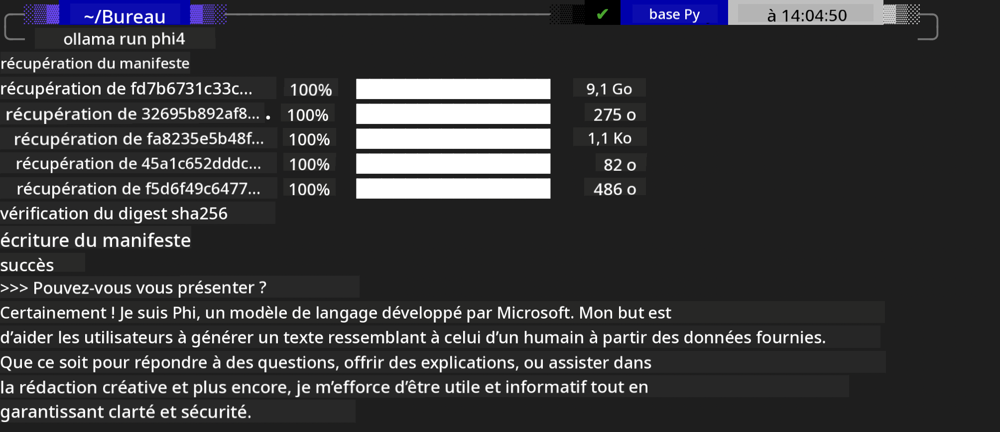
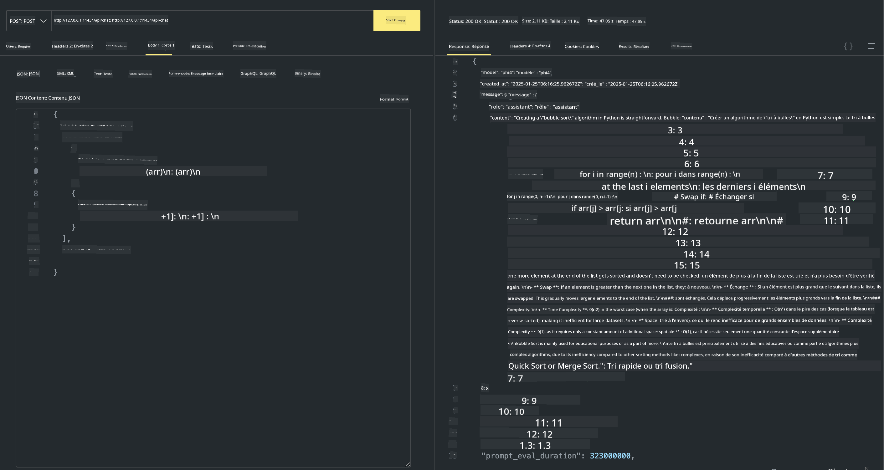

<!--
CO_OP_TRANSLATOR_METADATA:
{
  "original_hash": "0b38834693bb497f96bf53f0d941f9a1",
  "translation_date": "2025-05-07T15:11:49+00:00",
  "source_file": "md/01.Introduction/02/04.Ollama.md",
  "language_code": "fr"
}
-->
## Famille Phi dans Ollama


[Ollama](https://ollama.com) permet à un plus grand nombre de personnes de déployer directement des LLM ou SLM open source via des scripts simples, et peut également créer des API pour faciliter les scénarios d’application locale de type Copilot.

## **1. Installation**

Ollama supporte l’exécution sous Windows, macOS et Linux. Vous pouvez installer Ollama via ce lien ([https://ollama.com/download](https://ollama.com/download)). Une fois l’installation réussie, vous pouvez directement utiliser le script Ollama pour appeler Phi-3 depuis une fenêtre de terminal. Vous pouvez consulter toutes les [bibliothèques disponibles dans Ollama](https://ollama.com/library). Si vous ouvrez ce dépôt dans un Codespace, Ollama sera déjà installé.

```bash

ollama run phi4

```

> [!NOTE]
> Le modèle sera téléchargé lors de la première exécution. Bien sûr, vous pouvez aussi spécifier directement le modèle Phi-4 déjà téléchargé. Nous prenons WSL comme exemple pour exécuter la commande. Une fois le modèle téléchargé avec succès, vous pouvez interagir directement depuis le terminal.



## **2. Appeler l’API phi-4 depuis Ollama**

Si vous souhaitez appeler l’API Phi-4 générée par Ollama, vous pouvez utiliser cette commande dans le terminal pour démarrer le serveur Ollama.

```bash

ollama serve

```

> [!NOTE]
> Sous MacOS ou Linux, vous pouvez rencontrer l’erreur suivante **"Error: listen tcp 127.0.0.1:11434: bind: address already in use"** en lançant la commande. Cette erreur signifie généralement que le serveur est déjà en cours d’exécution, vous pouvez donc l’ignorer, ou bien arrêter puis redémarrer Ollama :

**macOS**

```bash

brew services restart ollama

```

**Linux**

```bash

sudo systemctl stop ollama

```

Ollama supporte deux API : generate et chat. Vous pouvez appeler l’API modèle fournie par Ollama selon vos besoins, en envoyant des requêtes au service local fonctionnant sur le port 11434.

**Chat**

```bash

curl http://127.0.0.1:11434/api/chat -d '{
  "model": "phi3",
  "messages": [
    {
      "role": "system",
      "content": "Your are a python developer."
    },
    {
      "role": "user",
      "content": "Help me generate a bubble algorithm"
    }
  ],
  "stream": false
  
}'

This is the result in Postman



## Additional Resources

Check the list of available models in Ollama in [their library](https://ollama.com/library).

Pull your model from the Ollama server using this command

```bash
ollama pull phi4
```

Run the model using this command

```bash
ollama run phi4
```

***Note:*** Visit this link [https://github.com/ollama/ollama/blob/main/docs/api.md](https://github.com/ollama/ollama/blob/main/docs/api.md) to learn more

## Calling Ollama from Python

You can use `requests` or `urllib3` to make requests to the local server endpoints used above. However, a popular way to use Ollama in Python is via the [openai](https://pypi.org/project/openai/) SDK, since Ollama provides OpenAI-compatible server endpoints as well.

Here is an example for phi3-mini:

```python
import openai

client = openai.OpenAI(
    base_url="http://localhost:11434/v1",
    api_key="nokeyneeded",
)

response = client.chat.completions.create(
    model="phi4",
    temperature=0.7,
    n=1,
    messages=[
        {"role": "system", "content": "You are a helpful assistant."},
        {"role": "user", "content": "Write a haiku about a hungry cat"},
    ],
)

print("Response:")
print(response.choices[0].message.content)
```

## Calling Ollama from JavaScript 

```javascript
// Exemple de résumé d’un fichier avec Phi-4
script({
    model: "ollama:phi4",
    title: "Résumé avec Phi-4",
    system: ["system"],
})

// Exemple de résumé
const file = def("FILE", env.files)
$`Summarize ${file} in a single paragraph.`
```

## Calling Ollama from C#

Create a new C# Console application and add the following NuGet package:

```bash
dotnet add package Microsoft.SemanticKernel --version 1.34.0
```

Then replace this code in the `Program.cs` file

```csharp
using Microsoft.SemanticKernel;
using Microsoft.SemanticKernel.ChatCompletion;

// ajout du service de chat completion en utilisant le serveur local Ollama
#pragma warning disable SKEXP0001, SKEXP0003, SKEXP0010, SKEXP0011, SKEXP0050, SKEXP0052
builder.AddOpenAIChatCompletion(
    modelId: "phi4",
    endpoint: new Uri("http://localhost:11434/"),
    apiKey: "non required");

// appel d’un prompt simple au service de chat
string prompt = "Write a joke about kittens";
var response = await kernel.InvokePromptAsync(prompt);
Console.WriteLine(response.GetValue<string>());
```

Run the app with the command:

```bash
dotnet run

**Avertissement** :  
Ce document a été traduit à l’aide du service de traduction automatique [Co-op Translator](https://github.com/Azure/co-op-translator). Bien que nous nous efforcions d’assurer l’exactitude, veuillez noter que les traductions automatiques peuvent contenir des erreurs ou des inexactitudes. Le document original dans sa langue d’origine doit être considéré comme la source faisant foi. Pour les informations critiques, une traduction professionnelle réalisée par un humain est recommandée. Nous ne saurions être tenus responsables de tout malentendu ou mauvaise interprétation résultant de l’utilisation de cette traduction.