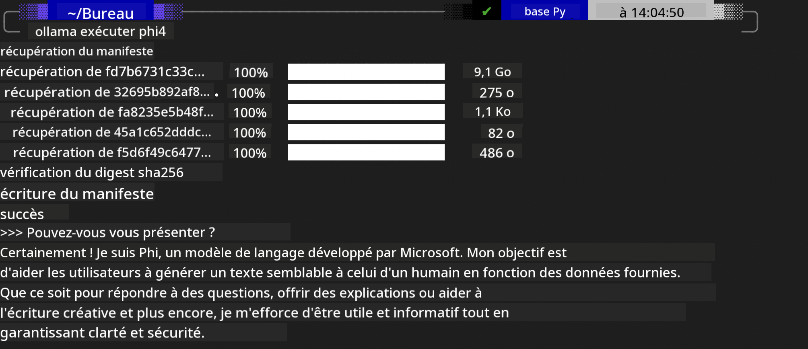
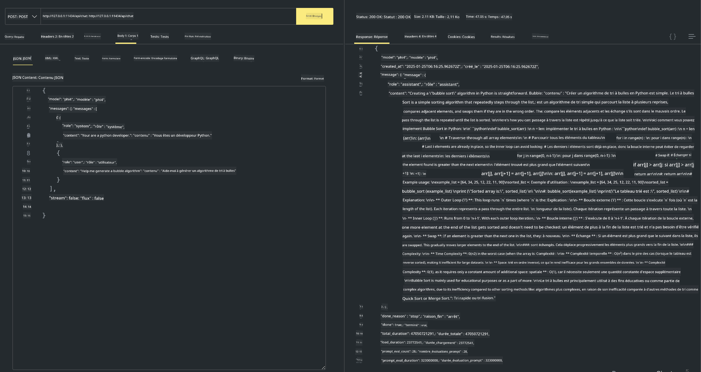

<!--
CO_OP_TRANSLATOR_METADATA:
{
  "original_hash": "2aa35f3c8b437fd5dc9995d53909d495",
  "translation_date": "2025-12-21T09:42:07+00:00",
  "source_file": "md/01.Introduction/02/04.Ollama.md",
  "language_code": "fr"
}
-->
## Famille Phi dans Ollama


[Ollama](https://ollama.com) permet à davantage de personnes de déployer directement des LLM ou SLM open source via de simples scripts, et peut aussi construire des API pour aider des scénarios d'application Copilot locaux.

## **1. Installation**

Ollama prend en charge Windows, macOS et Linux. Vous pouvez installer Ollama via ce lien ([https://ollama.com/download](https://ollama.com/download)). Après une installation réussie, vous pouvez utiliser directement le script Ollama pour appeler Phi-3 depuis une fenêtre de terminal. Vous pouvez voir toutes les [bibliothèques disponibles dans Ollama](https://ollama.com/library). Si vous ouvrez ce dépôt dans un Codespace, Ollama y sera déjà installé.

```bash

ollama run phi4

```

> [!NOTE]
> Le modèle sera d'abord téléchargé la première fois que vous l'exécuterez. Bien sûr, vous pouvez aussi spécifier directement le modèle Phi-4 déjà téléchargé. Nous prenons WSL comme exemple pour exécuter la commande. Une fois le modèle téléchargé avec succès, vous pouvez interagir directement dans le terminal.



## **2. Appeler l'API phi-4 depuis Ollama**

Si vous voulez appeler l'API Phi-4 générée par Ollama, vous pouvez utiliser cette commande dans le terminal pour démarrer le serveur Ollama.

```bash

ollama serve

```

> [!NOTE]
> Si vous exécutez MacOS ou Linux, veuillez noter que vous pouvez rencontrer l'erreur suivante **"Error: listen tcp 127.0.0.1:11434: bind: address already in use"**. Vous pouvez obtenir cette erreur lors de l'exécution de la commande. Vous pouvez soit ignorer cette erreur, car elle indique généralement que le serveur est déjà en cours d'exécution, soit arrêter puis redémarrer Ollama :

**macOS**

```bash

brew services restart ollama

```

**Linux**

```bash

sudo systemctl stop ollama

```

Ollama prend en charge deux API : generate et chat. Vous pouvez appeler l'API du modèle fournie par Ollama selon vos besoins, en envoyant des requêtes au service local s'exécutant sur le port 11434.

**Chat**

```bash

curl http://127.0.0.1:11434/api/chat -d '{
  "model": "phi3",
  "messages": [
    {
      "role": "system",
      "content": "Your are a python developer."
    },
    {
      "role": "user",
      "content": "Help me generate a bubble algorithm"
    }
  ],
  "stream": false
  
}'
```

Voici le résultat dans Postman



## Ressources supplémentaires

Vérifiez la liste des modèles disponibles dans Ollama dans [leur bibliothèque](https://ollama.com/library).

Récupérez votre modèle depuis le serveur Ollama en utilisant cette commande

```bash
ollama pull phi4
```

Exécutez le modèle en utilisant cette commande

```bash
ollama run phi4
```

***Note:*** Visitez ce lien [https://github.com/ollama/ollama/blob/main/docs/api.md](https://github.com/ollama/ollama/blob/main/docs/api.md) pour en savoir plus

## Appeler Ollama depuis Python

Vous pouvez utiliser `requests` ou `urllib3` pour effectuer des requêtes vers les points de terminaison du serveur local utilisés ci-dessus. Cependant, une manière populaire d'utiliser Ollama en Python est via le SDK [openai](https://pypi.org/project/openai/), puisque Ollama fournit également des points de terminaison compatibles OpenAI.

Voici un exemple pour phi3-mini :

```python
import openai

client = openai.OpenAI(
    base_url="http://localhost:11434/v1",
    api_key="nokeyneeded",
)

response = client.chat.completions.create(
    model="phi4",
    temperature=0.7,
    n=1,
    messages=[
        {"role": "system", "content": "You are a helpful assistant."},
        {"role": "user", "content": "Write a haiku about a hungry cat"},
    ],
)

print("Response:")
print(response.choices[0].message.content)
```

## Appeler Ollama depuis JavaScript 

```javascript
// Exemple de résumé d'un fichier avec Phi-4
script({
    model: "ollama:phi4",
    title: "Summarize with Phi-4",
    system: ["system"],
})

// Exemple de résumé
const file = def("FILE", env.files)
$`Summarize ${file} in a single paragraph.`
```

## Appeler Ollama depuis C#

Créez une nouvelle application Console C# et ajoutez le package NuGet suivant :

```bash
dotnet add package Microsoft.SemanticKernel --version 1.34.0
```

Remplacez ensuite ce code dans le fichier `Program.cs`

```csharp
using Microsoft.SemanticKernel;
using Microsoft.SemanticKernel.ChatCompletion;

// add chat completion service using the local ollama server endpoint
#pragma warning disable SKEXP0001, SKEXP0003, SKEXP0010, SKEXP0011, SKEXP0050, SKEXP0052
builder.AddOpenAIChatCompletion(
    modelId: "phi4",
    endpoint: new Uri("http://localhost:11434/"),
    apiKey: "non required");

// invoke a simple prompt to the chat service
string prompt = "Write a joke about kittens";
var response = await kernel.InvokePromptAsync(prompt);
Console.WriteLine(response.GetValue<string>());
```

Exécutez l'application avec la commande :

```bash
dotnet run
```

---

<!-- CO-OP TRANSLATOR DISCLAIMER START -->
**Clause de non-responsabilité** :
Ce document a été traduit à l'aide du service de traduction automatique [Co-op Translator](https://github.com/Azure/co-op-translator). Bien que nous nous efforcions d'assurer l'exactitude, veuillez noter que les traductions automatiques peuvent contenir des erreurs ou des inexactitudes. Le document original dans sa langue d'origine doit être considéré comme la source faisant foi. Pour les informations critiques, il est recommandé de recourir à une traduction professionnelle réalisée par un traducteur humain. Nous n'assumons aucune responsabilité pour les malentendus ou les mauvaises interprétations résultant de l'utilisation de cette traduction.
<!-- CO-OP TRANSLATOR DISCLAIMER END -->