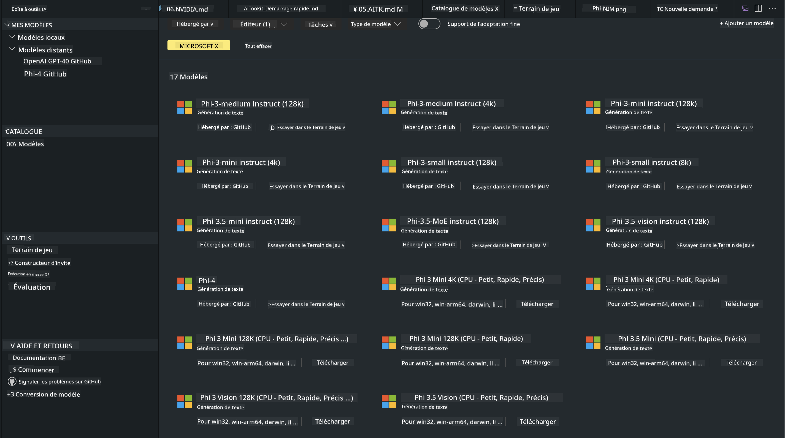
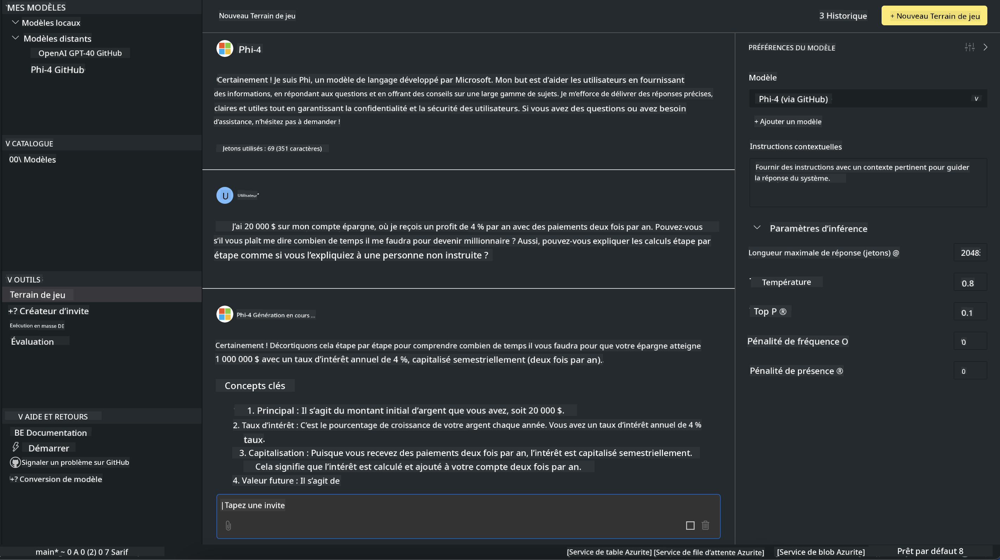

<!--
CO_OP_TRANSLATOR_METADATA:
{
  "original_hash": "4951d458c0b60c02cd1e751b40903877",
  "translation_date": "2025-05-07T15:04:44+00:00",
  "source_file": "md/01.Introduction/02/05.AITK.md",
  "language_code": "fr"
}
-->
# Phi Family dans AITK

[AI Toolkit for VS Code](https://marketplace.visualstudio.com/items?itemName=ms-windows-ai-studio.windows-ai-studio) facilite le développement d’applications d’IA générative en regroupant des outils et modèles de pointe issus du catalogue Azure AI Foundry ainsi que d’autres catalogues comme Hugging Face. Vous pourrez parcourir le catalogue de modèles IA alimenté par GitHub Models et Azure AI Foundry Model Catalogs, les télécharger localement ou à distance, les affiner, les tester et les utiliser dans votre application.

La préversion de AI Toolkit s’exécute localement. L’inférence ou l’affinage local dépend du modèle choisi, vous pourriez avoir besoin d’un GPU tel qu’un NVIDIA CUDA GPU. Vous pouvez également exécuter directement les GitHub Models avec AITK.

## Premiers pas

[En savoir plus sur l’installation du sous-système Windows pour Linux](https://learn.microsoft.com/windows/wsl/install?WT.mc_id=aiml-137032-kinfeylo)

et [changer la distribution par défaut](https://learn.microsoft.com/windows/wsl/install#change-the-default-linux-distribution-installed).

[Répertoire GitHub AI Toolkit](https://github.com/microsoft/vscode-ai-toolkit/)

- Windows, Linux, macOS
  
- Pour l’affinage sur Windows et Linux, un GPU Nvidia est nécessaire. De plus, **Windows** requiert le sous-système Linux avec une distribution Ubuntu 18.4 ou supérieure. [En savoir plus sur l’installation du sous-système Windows pour Linux](https://learn.microsoft.com/windows/wsl/install) et [changer la distribution par défaut](https://learn.microsoft.com/windows/wsl/install#change-the-default-linux-distribution-installed).

### Installer AI Toolkit

AI Toolkit est distribué en tant qu’[extension Visual Studio Code](https://code.visualstudio.com/docs/setup/additional-components#_vs-code-extensions), vous devez donc d’abord installer [VS Code](https://code.visualstudio.com/docs/setup/windows?WT.mc_id=aiml-137032-kinfeylo) puis télécharger AI Toolkit depuis le [VS Marketplace](https://marketplace.visualstudio.com/items?itemName=ms-windows-ai-studio.windows-ai-studio).  
[L’AI Toolkit est disponible sur le Visual Studio Marketplace](https://marketplace.visualstudio.com/items?itemName=ms-windows-ai-studio.windows-ai-studio) et peut être installé comme n’importe quelle autre extension VS Code.

Si vous n’êtes pas familier avec l’installation des extensions VS Code, suivez ces étapes :

### Connexion

1. Dans la barre d’activités de VS Code, sélectionnez **Extensions**  
1. Dans la barre de recherche des extensions, tapez "AI Toolkit"  
1. Sélectionnez "AI Toolkit for Visual Studio code"  
1. Cliquez sur **Installer**

Vous êtes maintenant prêt à utiliser l’extension !

Une invite vous demandera de vous connecter à GitHub, cliquez sur "Allow" pour continuer. Vous serez redirigé vers la page de connexion GitHub.

Veuillez vous connecter et suivre les étapes. Une fois la connexion réussie, vous serez redirigé vers VS Code.

Après l’installation, l’icône AI Toolkit apparaîtra dans votre barre d’activités.

Explorons les actions disponibles !

### Actions disponibles

La barre latérale principale de AI Toolkit est organisée en  

- **Models**  
- **Resources**  
- **Playground**  
- **Fine-tuning**  
- **Evaluation**

Ces options sont accessibles dans la section Resources. Pour commencer, sélectionnez **Model Catalog**.

### Télécharger un modèle depuis le catalogue

Au lancement de AI Toolkit depuis la barre latérale de VS Code, vous pouvez choisir parmi les options suivantes :



- Trouver un modèle supporté dans **Model Catalog** et le télécharger localement  
- Tester l’inférence du modèle dans le **Model Playground**  
- Affiner un modèle localement ou à distance dans **Model Fine-tuning**  
- Déployer des modèles affinés dans le cloud via la palette de commandes d’AI Toolkit  
- Évaluer des modèles

> [!NOTE]
>
> **GPU vs CPU**
>
> Vous remarquerez que les fiches des modèles indiquent la taille du modèle, la plateforme et le type d’accélérateur (CPU, GPU). Pour des performances optimales sur **des appareils Windows équipés d’au moins un GPU**, choisissez des versions de modèles ciblant uniquement Windows.
>
> Cela garantit un modèle optimisé pour l’accélérateur DirectML.
>
> Les noms des modèles suivent le format
>
> - `{model_name}-{accelerator}-{quantization}-{format}`.
>
>Pour vérifier si votre appareil Windows possède un GPU, ouvrez le **Gestionnaire des tâches** puis sélectionnez l’onglet **Performances**. Si vous avez un ou plusieurs GPU, ils apparaîtront sous des noms tels que "GPU 0" ou "GPU 1".

### Exécuter le modèle dans le playground

Une fois tous les paramètres définis, cliquez sur **Generate Project**.

Lorsque votre modèle est téléchargé, sélectionnez **Load in Playground** sur la fiche du modèle dans le catalogue :

- Lance le téléchargement du modèle  
- Installe toutes les dépendances et prérequis  
- Crée un espace de travail VS Code



### Utiliser l’API REST dans votre application

AI Toolkit inclut un serveur web local REST API **sur le port 5272** qui utilise le [format de chat completions OpenAI](https://platform.openai.com/docs/api-reference/chat/create).

Cela vous permet de tester votre application localement sans dépendre d’un service cloud de modèle IA. Par exemple, le fichier JSON suivant montre comment configurer le corps de la requête :

```json
{
    "model": "Phi-4",
    "messages": [
        {
            "role": "user",
            "content": "what is the golden ratio?"
        }
    ],
    "temperature": 0.7,
    "top_p": 1,
    "top_k": 10,
    "max_tokens": 100,
    "stream": true
}
```

Vous pouvez tester l’API REST avec (par exemple) [Postman](https://www.postman.com/) ou l’utilitaire CURL (Client URL) :

```bash
curl -vX POST http://127.0.0.1:5272/v1/chat/completions -H 'Content-Type: application/json' -d @body.json
```

### Utilisation de la bibliothèque cliente OpenAI pour Python

```python
from openai import OpenAI

client = OpenAI(
    base_url="http://127.0.0.1:5272/v1/", 
    api_key="x" # required for the API but not used
)

chat_completion = client.chat.completions.create(
    messages=[
        {
            "role": "user",
            "content": "what is the golden ratio?",
        }
    ],
    model="Phi-4",
)

print(chat_completion.choices[0].message.content)
```

### Utilisation de la bibliothèque cliente Azure OpenAI pour .NET

Ajoutez la [bibliothèque cliente Azure OpenAI pour .NET](https://www.nuget.org/packages/Azure.AI.OpenAI/) à votre projet via NuGet :

```bash
dotnet add {project_name} package Azure.AI.OpenAI --version 1.0.0-beta.17
```

Ajoutez un fichier C# nommé **OverridePolicy.cs** à votre projet et collez-y ce code :

```csharp
// OverridePolicy.cs
using Azure.Core.Pipeline;
using Azure.Core;

internal partial class OverrideRequestUriPolicy(Uri overrideUri)
    : HttpPipelineSynchronousPolicy
{
    private readonly Uri _overrideUri = overrideUri;

    public override void OnSendingRequest(HttpMessage message)
    {
        message.Request.Uri.Reset(_overrideUri);
    }
}
```

Ensuite, collez le code suivant dans votre fichier **Program.cs** :

```csharp
// Program.cs
using Azure.AI.OpenAI;

Uri localhostUri = new("http://localhost:5272/v1/chat/completions");

OpenAIClientOptions clientOptions = new();
clientOptions.AddPolicy(
    new OverrideRequestUriPolicy(localhostUri),
    Azure.Core.HttpPipelinePosition.BeforeTransport);
OpenAIClient client = new(openAIApiKey: "unused", clientOptions);

ChatCompletionsOptions options = new()
{
    DeploymentName = "Phi-4",
    Messages =
    {
        new ChatRequestSystemMessage("You are a helpful assistant. Be brief and succinct."),
        new ChatRequestUserMessage("What is the golden ratio?"),
    }
};

StreamingResponse<StreamingChatCompletionsUpdate> streamingChatResponse
    = await client.GetChatCompletionsStreamingAsync(options);

await foreach (StreamingChatCompletionsUpdate chatChunk in streamingChatResponse)
{
    Console.Write(chatChunk.ContentUpdate);
}
```


## Affinage avec AI Toolkit

- Commencez par la découverte de modèles et le playground.  
- Affinage et inférence de modèles en utilisant des ressources locales.  
- Affinage et inférence à distance via les ressources Azure.

[Affinage avec AI Toolkit](../../03.FineTuning/Finetuning_VSCodeaitoolkit.md)

## Ressources Q&R AI Toolkit

Consultez notre [page Q&R](https://github.com/microsoft/vscode-ai-toolkit/blob/main/archive/QA.md) pour les problèmes courants et leurs solutions.

**Avertissement** :  
Ce document a été traduit à l’aide du service de traduction automatique [Co-op Translator](https://github.com/Azure/co-op-translator). Bien que nous nous efforcions d’assurer l’exactitude, veuillez noter que les traductions automatiques peuvent contenir des erreurs ou des inexactitudes. Le document original dans sa langue d’origine doit être considéré comme la source faisant foi. Pour les informations critiques, il est recommandé de recourir à une traduction professionnelle réalisée par un humain. Nous déclinons toute responsabilité en cas de malentendus ou de mauvaises interprétations résultant de l’utilisation de cette traduction.