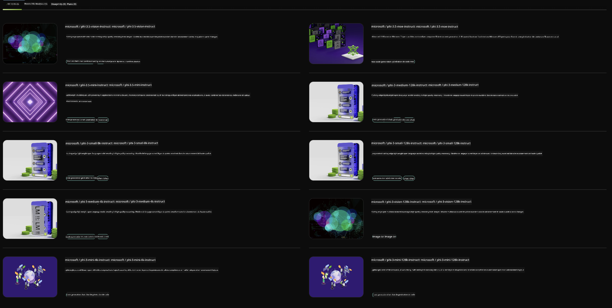

<!--
CO_OP_TRANSLATOR_METADATA:
{
  "original_hash": "7b08e277df2a9307f861ae54bc30c772",
  "translation_date": "2025-07-16T19:32:25+00:00",
  "source_file": "md/01.Introduction/02/06.NVIDIA.md",
  "language_code": "fr"
}
-->
## Famille Phi dans NVIDIA NIM

NVIDIA NIM est un ensemble de microservices faciles à utiliser, conçus pour accélérer le déploiement de modèles d’IA générative dans le cloud, les centres de données et les stations de travail. Les NIM sont classés par famille de modèles et par modèle individuel. Par exemple, NVIDIA NIM pour les grands modèles de langage (LLM) apporte la puissance des LLM de pointe aux applications d’entreprise, offrant des capacités inégalées de traitement et de compréhension du langage naturel.

NIM facilite pour les équipes IT et DevOps l’auto-hébergement de grands modèles de langage (LLM) dans leurs propres environnements gérés, tout en fournissant aux développeurs des API standards de l’industrie qui leur permettent de créer des copilotes, chatbots et assistants IA puissants capables de transformer leur activité. En tirant parti de l’accélération GPU de pointe de NVIDIA et d’un déploiement évolutif, NIM offre la voie la plus rapide vers l’inférence avec des performances inégalées.

Vous pouvez utiliser NVIDIA NIM pour inférer les modèles de la famille Phi



### **Exemples - Phi-3-Vision dans NVIDIA NIM**

Imaginez que vous avez une image (`demo.png`) et que vous souhaitez générer un code Python qui traite cette image et enregistre une nouvelle version (`phi-3-vision.jpg`).

Le code ci-dessus automatise ce processus en :

1. Configurant l’environnement et les paramètres nécessaires.  
2. Créant une invite qui demande au modèle de générer le code Python requis.  
3. Envoyant l’invite au modèle et récupérant le code généré.  
4. Extrait et exécute le code généré.  
5. Affichant les images originale et traitée.

Cette approche exploite la puissance de l’IA pour automatiser les tâches de traitement d’image, rendant leur réalisation plus simple et plus rapide.

[Solution de code exemple](../../../../../code/06.E2E/E2E_Nvidia_NIM_Phi3_Vision.ipynb)

Décomposons ce que fait le code étape par étape :

1. **Installer le package requis** :  
    ```python
    !pip install langchain_nvidia_ai_endpoints -U
    ```  
    Cette commande installe le package `langchain_nvidia_ai_endpoints`, en s’assurant qu’il est à jour.

2. **Importer les modules nécessaires** :  
    ```python
    from langchain_nvidia_ai_endpoints import ChatNVIDIA
    import getpass
    import os
    import base64
    ```  
    Ces imports chargent les modules nécessaires pour interagir avec les endpoints NVIDIA AI, gérer les mots de passe de manière sécurisée, interagir avec le système d’exploitation, et encoder/décoder des données en base64.

3. **Configurer la clé API** :  
    ```python
    if not os.getenv("NVIDIA_API_KEY"):
        os.environ["NVIDIA_API_KEY"] = getpass.getpass("Enter your NVIDIA API key: ")
    ```  
    Ce code vérifie si la variable d’environnement `NVIDIA_API_KEY` est définie. Sinon, il invite l’utilisateur à saisir sa clé API de façon sécurisée.

4. **Définir le modèle et le chemin de l’image** :  
    ```python
    model = 'microsoft/phi-3-vision-128k-instruct'
    chat = ChatNVIDIA(model=model)
    img_path = './imgs/demo.png'
    ```  
    Cela définit le modèle à utiliser, crée une instance de `ChatNVIDIA` avec ce modèle, et définit le chemin vers le fichier image.

5. **Créer l’invite textuelle** :  
    ```python
    text = "Please create Python code for image, and use plt to save the new picture under imgs/ and name it phi-3-vision.jpg."
    ```  
    Cette étape définit une invite textuelle demandant au modèle de générer un code Python pour traiter une image.

6. **Encoder l’image en base64** :  
    ```python
    with open(img_path, "rb") as f:
        image_b64 = base64.b64encode(f.read()).decode()
    image = f''
    ```  
    Ce code lit le fichier image, l’encode en base64, et crée une balise HTML image avec les données encodées.

7. **Combiner le texte et l’image dans l’invite** :  
    ```python
    prompt = f"{text} {image}"
    ```  
    Cela combine l’invite textuelle et la balise image HTML en une seule chaîne.

8. **Générer le code avec ChatNVIDIA** :  
    ```python
    code = ""
    for chunk in chat.stream(prompt):
        print(chunk.content, end="")
        code += chunk.content
    ```  
    Ce code envoie l’invite au modèle `ChatNVIDIA` et récupère le code généré par morceaux, affichant et ajoutant chaque morceau à la variable `code`.

9. **Extraire le code Python du contenu généré** :  
    ```python
    begin = code.index('```python') + 9  
    code = code[begin:]  
    end = code.index('```')
    code = code[:end]
    ```  
    Cette étape extrait le code Python réel du contenu généré en supprimant la mise en forme markdown.

10. **Exécuter le code généré** :  
    ```python
    import subprocess
    result = subprocess.run(["python", "-c", code], capture_output=True)
    ```  
    Ce code exécute le code Python extrait en tant que sous-processus et capture sa sortie.

11. **Afficher les images** :  
    ```python
    from IPython.display import Image, display
    display(Image(filename='./imgs/phi-3-vision.jpg'))
    display(Image(filename='./imgs/demo.png'))
    ```  
    Ces lignes affichent les images à l’aide du module `IPython.display`.

**Avertissement** :  
Ce document a été traduit à l’aide du service de traduction automatique [Co-op Translator](https://github.com/Azure/co-op-translator). Bien que nous nous efforcions d’assurer l’exactitude, veuillez noter que les traductions automatiques peuvent contenir des erreurs ou des inexactitudes. Le document original dans sa langue d’origine doit être considéré comme la source faisant foi. Pour les informations critiques, une traduction professionnelle réalisée par un humain est recommandée. Nous déclinons toute responsabilité en cas de malentendus ou de mauvaises interprétations résultant de l’utilisation de cette traduction.