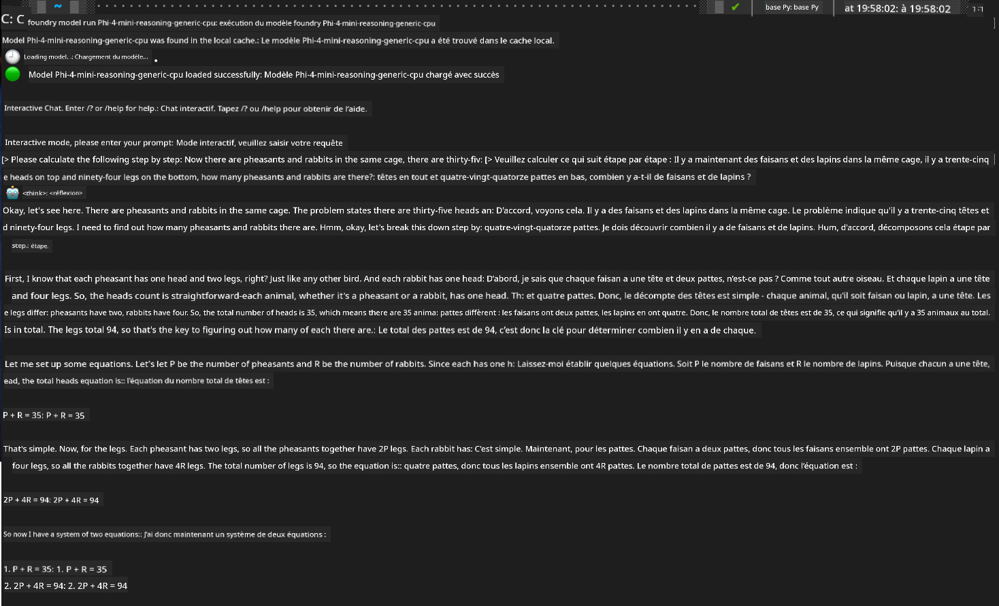

<!--
CO_OP_TRANSLATOR_METADATA:
{
  "original_hash": "52973a5680a65a810aa80b7036afd31f",
  "translation_date": "2025-06-27T13:32:54+00:00",
  "source_file": "md/01.Introduction/02/07.FoundryLocal.md",
  "language_code": "fr"
}
-->
## Prise en main des modèles Phi-Family avec Foundry Local

### Introduction à Foundry Local

Foundry Local est une solution puissante d'inférence IA sur appareil, qui apporte des capacités IA de niveau entreprise directement sur votre matériel local. Ce tutoriel vous guidera dans la configuration et l’utilisation des modèles Phi-Family avec Foundry Local, vous offrant un contrôle total sur vos charges de travail IA tout en garantissant la confidentialité et en réduisant les coûts.

Foundry Local offre des avantages en termes de performance, confidentialité, personnalisation et coûts en exécutant les modèles IA localement sur votre appareil. Il s’intègre parfaitement à vos flux de travail et applications existants via une interface CLI intuitive, un SDK et une API REST.


### Pourquoi choisir Foundry Local ?

Comprendre les avantages de Foundry Local vous aidera à prendre des décisions éclairées concernant votre stratégie de déploiement IA :

- **Inférence sur appareil :** Exécutez les modèles localement sur votre propre matériel, réduisant ainsi vos coûts tout en gardant toutes vos données sur votre appareil.

- **Personnalisation des modèles :** Choisissez parmi des modèles prédéfinis ou utilisez les vôtres pour répondre à des besoins et cas d’usage spécifiques.

- **Efficacité économique :** Éliminez les coûts récurrents des services cloud en utilisant votre matériel existant, rendant l’IA plus accessible.

- **Intégration fluide :** Connectez-vous à vos applications via un SDK, des points d’API ou la CLI, avec une montée en charge facile vers Azure AI Foundry selon vos besoins.

> **Note de démarrage :** Ce tutoriel se concentre sur l’utilisation de Foundry Local via les interfaces CLI et SDK. Vous apprendrez les deux méthodes pour choisir celle qui convient le mieux à votre cas d’usage.

## Partie 1 : Configuration de la CLI Foundry Local

### Étape 1 : Installation

La CLI Foundry Local est votre passerelle pour gérer et exécuter les modèles IA localement. Commençons par l’installer sur votre système.

**Plateformes supportées :** Windows et macOS

Pour des instructions d’installation détaillées, veuillez consulter la [documentation officielle Foundry Local](https://github.com/microsoft/Foundry-Local/blob/main/README.md).

### Étape 2 : Exploration des modèles disponibles

Une fois la CLI Foundry Local installée, vous pouvez découvrir quels modèles sont disponibles pour votre cas d’usage. Cette commande vous montrera tous les modèles supportés :


```bash
foundry model list
```

### Étape 3 : Comprendre les modèles Phi Family

La Phi Family propose une gamme de modèles optimisés pour différents cas d’usage et configurations matérielles. Voici les modèles Phi disponibles dans Foundry Local :

**Modèles Phi disponibles :** 

- **phi-3.5-mini** - Modèle compact pour tâches basiques
- **phi-3-mini-128k** - Version à contexte étendu pour conversations plus longues
- **phi-3-mini-4k** - Modèle à contexte standard pour usage général
- **phi-4** - Modèle avancé aux capacités améliorées
- **phi-4-mini** - Version allégée de Phi-4
- **phi-4-mini-reasoning** - Spécialisé pour des tâches de raisonnement complexes

> **Compatibilité matérielle :** Chaque modèle peut être configuré pour différentes accélérations matérielles (CPU, GPU) selon les capacités de votre système.

### Étape 4 : Exécuter votre premier modèle Phi

Passons à un exemple concret. Nous allons lancer le modèle `phi-4-mini-reasoning`, qui excelle dans la résolution de problèmes complexes étape par étape.


**Commande pour exécuter le modèle :**

```bash
foundry model run Phi-4-mini-reasoning-generic-cpu
```

> **Première utilisation :** Lors de la première exécution d’un modèle, Foundry Local le téléchargera automatiquement sur votre appareil local. Le temps de téléchargement dépend de la vitesse de votre réseau, merci de patienter pendant la configuration initiale.

### Étape 5 : Tester le modèle avec un problème réel

Testons maintenant notre modèle avec un problème logique classique pour observer son raisonnement étape par étape :

**Problème d’exemple :**

```txt
Please calculate the following step by step: Now there are pheasants and rabbits in the same cage, there are thirty-five heads on top and ninety-four legs on the bottom, how many pheasants and rabbits are there?
```

**Comportement attendu :** Le modèle devrait décomposer ce problème en étapes logiques, en utilisant le fait que les faisans ont 2 pattes et les lapins 4 pattes pour résoudre le système d’équations.

**Résultats :**



## Partie 2 : Créer des applications avec le SDK Foundry Local

### Pourquoi utiliser le SDK ?

Alors que la CLI est parfaite pour les tests et les interactions rapides, le SDK vous permet d’intégrer Foundry Local dans vos applications de manière programmatique. Cela ouvre des possibilités pour :

- Construire des applications personnalisées alimentées par l’IA
- Créer des flux de travail automatisés
- Intégrer les capacités IA dans des systèmes existants
- Développer des chatbots et outils interactifs

### Langages de programmation supportés

Foundry Local offre un support SDK pour plusieurs langages de programmation afin de s’adapter à vos préférences de développement :

**📦 SDK disponibles :**

- **C# (.NET) :** [Documentation & exemples SDK](https://github.com/microsoft/Foundry-Local/tree/main/sdk/cs)
- **Python :** [Documentation & exemples SDK](https://github.com/microsoft/Foundry-Local/tree/main/sdk/python)
- **JavaScript :** [Documentation & exemples SDK](https://github.com/microsoft/Foundry-Local/tree/main/sdk/js)
- **Rust :** [Documentation & exemples SDK](https://github.com/microsoft/Foundry-Local/tree/main/sdk/rust)

### Prochaines étapes

1. **Choisissez votre SDK préféré** selon votre environnement de développement  
2. **Suivez la documentation spécifique au SDK** pour des guides d’implémentation détaillés  
3. **Commencez par des exemples simples** avant de créer des applications complexes  
4. **Explorez le code d’exemple** fourni dans chaque dépôt SDK  

## Conclusion

Vous avez maintenant appris à :  
- ✅ Installer et configurer la CLI Foundry Local  
- ✅ Découvrir et exécuter les modèles Phi Family  
- ✅ Tester les modèles avec des problèmes concrets  
- ✅ Comprendre les options SDK pour le développement d’applications  

Foundry Local offre une base puissante pour intégrer directement les capacités IA dans votre environnement local, vous donnant le contrôle sur la performance, la confidentialité et les coûts tout en conservant la flexibilité de monter en charge vers des solutions cloud si besoin.

**Avertissement** :  
Ce document a été traduit à l’aide du service de traduction automatique [Co-op Translator](https://github.com/Azure/co-op-translator). Bien que nous nous efforcions d’assurer l’exactitude, veuillez noter que les traductions automatiques peuvent contenir des erreurs ou des inexactitudes. Le document original dans sa langue d’origine doit être considéré comme la source faisant autorité. Pour les informations critiques, il est recommandé de recourir à une traduction professionnelle réalisée par un humain. Nous déclinons toute responsabilité en cas de malentendus ou de mauvaises interprétations résultant de l’utilisation de cette traduction.