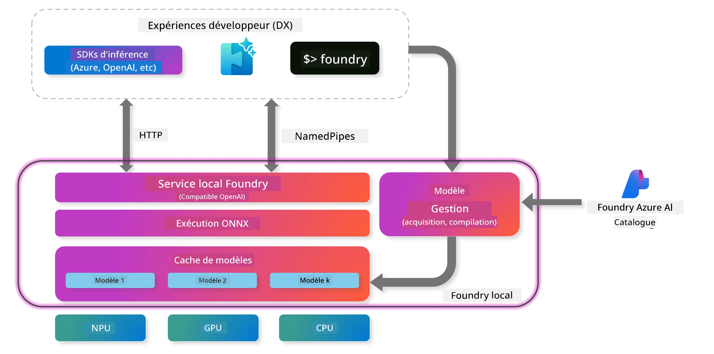
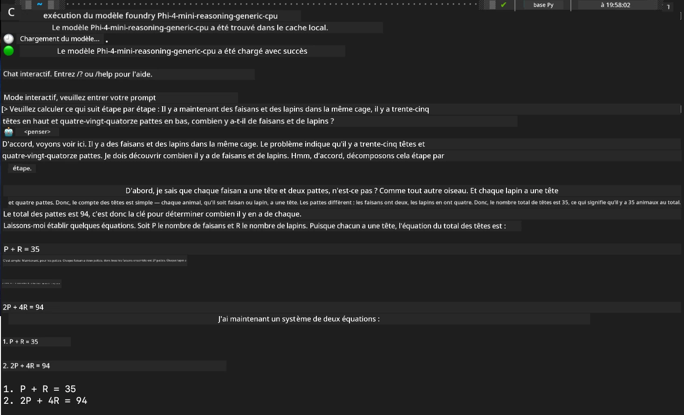

## Premiers pas avec les modèles Phi-Family dans Foundry Local

### Introduction à Foundry Local

Foundry Local est une solution puissante d'inférence IA sur appareil qui apporte des capacités d'IA de qualité entreprise directement sur votre matériel local. Ce tutoriel vous guidera à travers la configuration et l'utilisation des modèles Phi-Family avec Foundry Local, vous offrant un contrôle total sur vos charges de travail IA tout en maintenant la confidentialité et en réduisant les coûts.

Foundry Local offre des avantages en termes de performances, de confidentialité, de personnalisation et de coût en exécutant les modèles IA localement sur votre appareil. Il s'intègre parfaitement à vos flux de travail et applications existants via une CLI intuitive, un SDK, et une API REST.




### Pourquoi choisir Foundry Local ?

Comprendre les avantages de Foundry Local vous aidera à prendre des décisions éclairées concernant votre stratégie de déploiement IA :

- **Inférence sur appareil :** Exécutez les modèles localement sur votre propre matériel, réduisant vos coûts tout en gardant toutes vos données sur votre appareil.

- **Personnalisation des modèles :** Choisissez parmi des modèles prédéfinis ou utilisez les vôtres pour répondre à des exigences et cas d'utilisation spécifiques.

- **Efficacité des coûts :** Éliminez les coûts récurrents des services cloud en utilisant votre matériel existant, rendant l'IA plus accessible.

- **Intégration transparente :** Connectez-vous à vos applications via un SDK, des points de terminaison API, ou la CLI, avec une mise à l'échelle facile vers Microsoft Foundry à mesure que vos besoins augmentent.

> **Note de démarrage :** Ce tutoriel se concentre sur l'utilisation de Foundry Local via les interfaces CLI et SDK. Vous apprendrez les deux approches pour vous aider à choisir la meilleure méthode pour votre cas d'usage.

## Partie 1 : Configuration de la CLI Foundry Local

### Étape 1 : Installation

La CLI Foundry Local est votre porte d'entrée pour gérer et exécuter des modèles IA localement. Commençons par l'installer sur votre système.

**Plateformes supportées :** Windows et macOS

Pour des instructions d'installation détaillées, veuillez consulter la [documentation officielle de Foundry Local](https://github.com/microsoft/Foundry-Local/blob/main/README.md).

### Étape 2 : Exploration des modèles disponibles

Une fois la CLI Foundry Local installée, vous pouvez découvrir quels modèles sont disponibles pour votre cas d'utilisation. Cette commande vous montrera tous les modèles supportés :


```bash
foundry model list
```

### Étape 3 : Comprendre les modèles Phi Family

La famille Phi propose une gamme de modèles optimisés pour différents cas d'utilisation et configurations matérielles. Voici les modèles Phi disponibles dans Foundry Local :

**Modèles Phi disponibles :**

- **phi-3.5-mini** - Modèle compact pour tâches basiques
- **phi-3-mini-128k** - Version avec contexte étendu pour conversations plus longues
- **phi-3-mini-4k** - Modèle standard pour une utilisation générale
- **phi-4** - Modèle avancé avec capacités améliorées
- **phi-4-mini** - Version légère de Phi-4
- **phi-4-mini-reasoning** - Spécialisé pour tâches de raisonnement complexe

> **Compatibilité matérielle :** Chaque modèle peut être configuré pour différentes accélérations matérielles (CPU, GPU) selon les capacités de votre système.

### Étape 4 : Exécuter votre premier modèle Phi

Commençons par un exemple pratique. Nous allons exécuter le modèle `phi-4-mini-reasoning`, qui excelle à résoudre des problèmes complexes étape par étape.


**Commande pour exécuter le modèle :**

```bash
foundry model run Phi-4-mini-reasoning-generic-cpu
```

> **Première configuration :** Lors de la première exécution d'un modèle, Foundry Local le téléchargera automatiquement sur votre appareil local. Le temps de téléchargement varie selon la vitesse de votre réseau, veuillez donc patienter pendant la configuration initiale.

### Étape 5 : Tester le modèle avec un problème réel

Testons maintenant notre modèle avec un problème logique classique afin d’observer ses capacités de raisonnement étape par étape :

**Problème exemple :**

```txt
Please calculate the following step by step: Now there are pheasants and rabbits in the same cage, there are thirty-five heads on top and ninety-four legs on the bottom, how many pheasants and rabbits are there?
```

**Comportement attendu :** Le modèle doit décomposer ce problème en étapes logiques, en utilisant le fait que les faisans ont 2 pattes et les lapins en ont 4 pour résoudre le système d'équations.

**Résultats :**



## Partie 2 : Construire des applications avec le SDK Foundry Local

### Pourquoi utiliser le SDK ?

Alors que la CLI est parfaite pour tester et pour des interactions rapides, le SDK vous permet d'intégrer Foundry Local dans vos applications de manière programmatique. Cela ouvre des possibilités pour :

- Construire des applications personnalisées propulsées par IA
- Créer des flux de travail automatisés
- Intégrer des capacités IA dans des systèmes existants
- Développer des chatbots et outils interactifs

### Langages de programmation supportés

Foundry Local propose un support SDK pour plusieurs langages de programmation afin de correspondre à vos préférences de développement :

**📦 SDK disponibles :**

- **C# (.NET) :** [Documentation & exemples SDK](https://github.com/microsoft/Foundry-Local/tree/main/sdk/cs)
- **Python :** [Documentation & exemples SDK](https://github.com/microsoft/Foundry-Local/tree/main/sdk/python)
- **JavaScript :** [Documentation & exemples SDK](https://github.com/microsoft/Foundry-Local/tree/main/sdk/js)
- **Rust :** [Documentation & exemples SDK](https://github.com/microsoft/Foundry-Local/tree/main/sdk/rust)

### Étapes suivantes

1. **Choisissez votre SDK préféré** selon votre environnement de développement
2. **Suivez la documentation spécifique au SDK** pour des guides d’implémentation détaillés
3. **Commencez par des exemples simples** avant de développer des applications complexes
4. **Explorez le code d’exemple** fourni dans chaque dépôt SDK

## Conclusion

Vous avez désormais appris à :
- ✅ Installer et configurer la CLI Foundry Local
- ✅ Découvrir et exécuter les modèles Phi Family
- ✅ Tester les modèles avec des problèmes réels
- ✅ Comprendre les options SDK pour le développement d’applications

Foundry Local offre une base puissante pour apporter des capacités IA directement dans votre environnement local, vous donnant le contrôle sur les performances, la confidentialité et les coûts tout en conservant la flexibilité d’évoluer vers des solutions cloud lorsque nécessaire.

---

<!-- CO-OP TRANSLATOR DISCLAIMER START -->
**Avis de non-responsabilité** :  
Ce document a été traduit à l’aide du service de traduction automatique [Co-op Translator](https://github.com/Azure/co-op-translator). Bien que nous nous efforcions d’assurer l’exactitude, veuillez noter que les traductions automatiques peuvent contenir des erreurs ou des inexactitudes. Le document original dans sa langue native doit être considéré comme la source faisant foi. Pour les informations critiques, une traduction professionnelle réalisée par un humain est recommandée. Nous déclinons toute responsabilité en cas de malentendus ou d’interprétations erronées résultant de l’utilisation de cette traduction.
<!-- CO-OP TRANSLATOR DISCLAIMER END -->