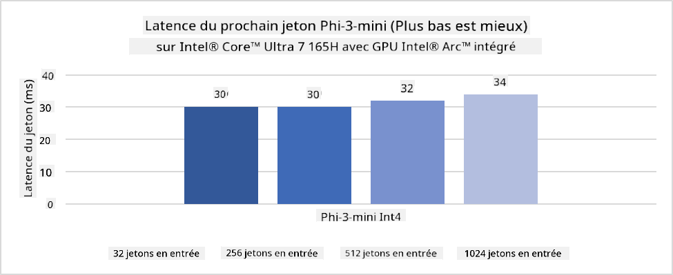
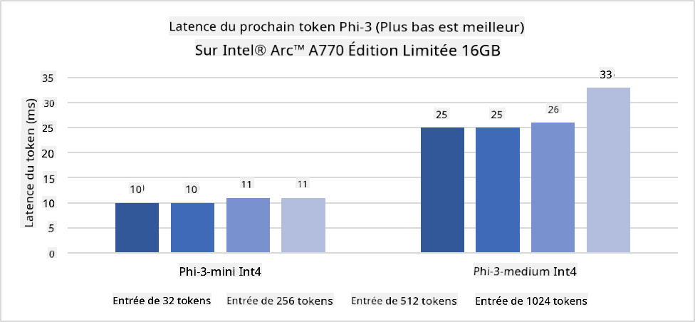
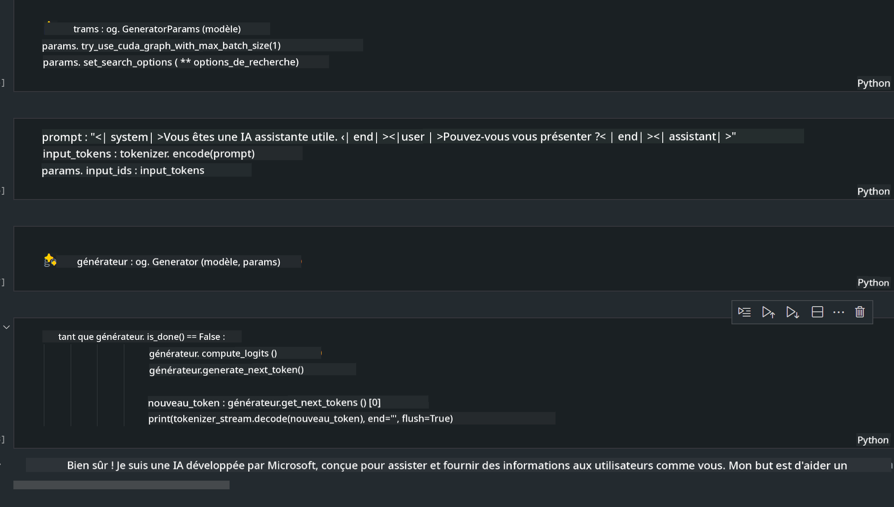
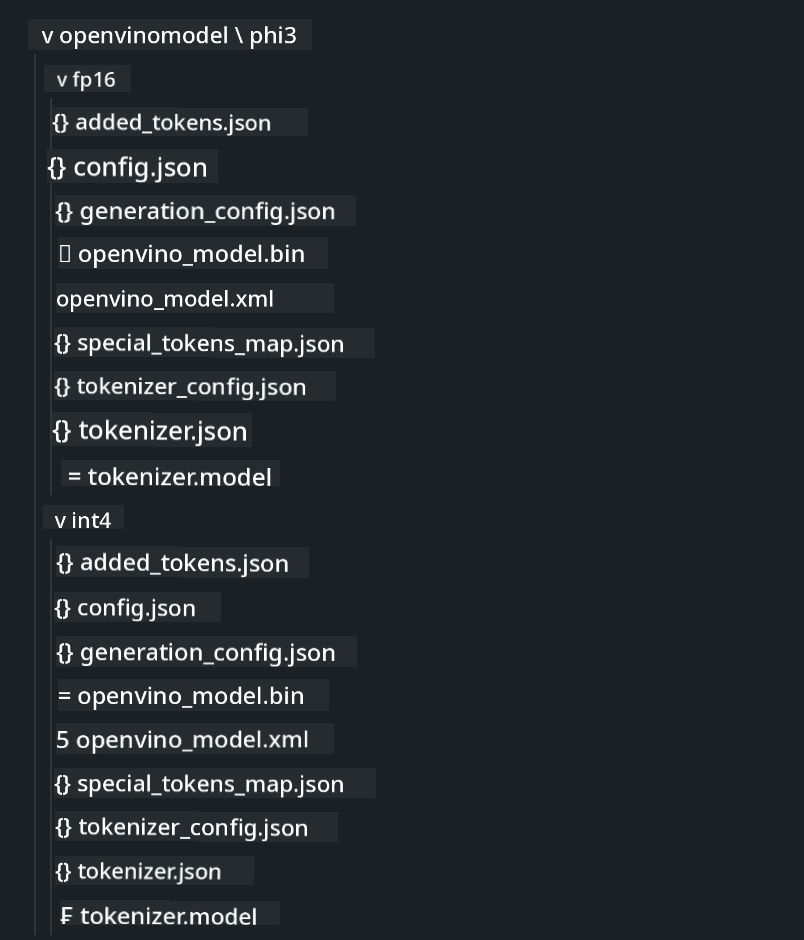
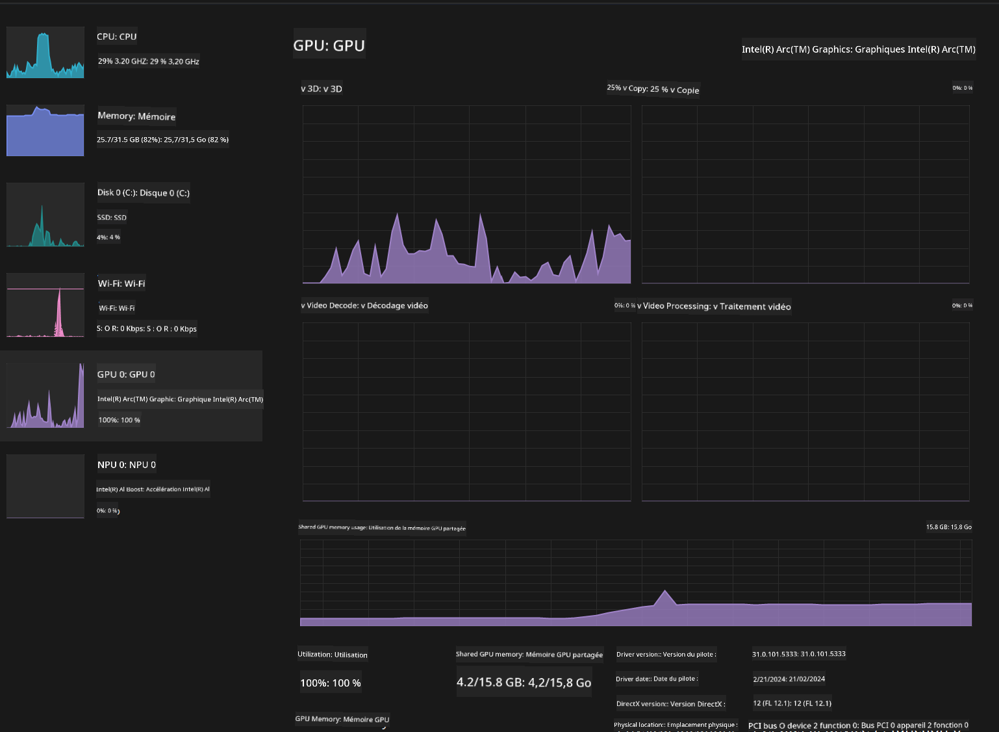

<!--
CO_OP_TRANSLATOR_METADATA:
{
  "original_hash": "e08ce816e23ad813244a09ca34ebb8ac",
  "translation_date": "2025-05-07T14:34:44+00:00",
  "source_file": "md/01.Introduction/03/AIPC_Inference.md",
  "language_code": "fr"
}
-->
# **Inférence Phi-3 sur AI PC**

Avec les progrès de l'IA générative et l'amélioration des capacités matérielles des appareils edge, un nombre croissant de modèles d'IA générative peuvent désormais être intégrés aux appareils Bring Your Own Device (BYOD) des utilisateurs. Les AI PC font partie de ces modèles. À partir de 2024, Intel, AMD et Qualcomm ont collaboré avec les fabricants de PC pour introduire des AI PC facilitant le déploiement de modèles d'IA générative localisés via des modifications matérielles. Dans cette discussion, nous nous concentrerons sur les AI PC Intel et explorerons comment déployer Phi-3 sur un AI PC Intel.

### Qu'est-ce qu'un NPU

Un NPU (Neural Processing Unit) est un processeur dédié ou une unité de traitement intégrée dans un SoC plus grand, spécialement conçu pour accélérer les opérations de réseaux neuronaux et les tâches d'IA. Contrairement aux CPU et GPU généralistes, les NPU sont optimisés pour un calcul parallèle axé sur les données, ce qui les rend très efficaces pour traiter d'importantes quantités de données multimédia comme les vidéos et images, ainsi que pour le traitement des données des réseaux neuronaux. Ils sont particulièrement performants pour gérer des tâches liées à l'IA, telles que la reconnaissance vocale, le floutage de l’arrière-plan lors d’appels vidéo, ou les processus d’édition photo/vidéo comme la détection d’objets.

## NPU vs GPU

Bien que de nombreuses charges de travail d’IA et d’apprentissage automatique s’exécutent sur GPU, il existe une distinction importante entre GPU et NPU.  
Les GPU sont réputés pour leurs capacités de calcul parallèle, mais tous les GPU ne sont pas également efficaces au-delà du traitement graphique. Les NPU, en revanche, sont conçus spécifiquement pour les calculs complexes impliqués dans les opérations des réseaux neuronaux, ce qui les rend particulièrement performants pour les tâches d’IA.

En résumé, les NPU sont les experts en mathématiques qui boostent les calculs d’IA, jouant un rôle clé dans l’ère émergente des AI PC !

***Cet exemple est basé sur le dernier processeur Intel Core Ultra d’Intel***

## **1. Utiliser le NPU pour exécuter le modèle Phi-3**

Le dispositif Intel® NPU est un accélérateur d’inférence IA intégré aux CPU clients Intel, à partir de la génération Intel® Core™ Ultra (anciennement connue sous le nom Meteor Lake). Il permet une exécution économe en énergie des tâches liées aux réseaux neuronaux artificiels.





**Intel NPU Acceleration Library**

La bibliothèque Intel NPU Acceleration Library [https://github.com/intel/intel-npu-acceleration-library](https://github.com/intel/intel-npu-acceleration-library) est une bibliothèque Python conçue pour améliorer l’efficacité de vos applications en exploitant la puissance de l’Intel Neural Processing Unit (NPU) pour effectuer des calculs à haute vitesse sur le matériel compatible.

Exemple de Phi-3-mini sur AI PC équipé de processeurs Intel® Core™ Ultra.


Installer la bibliothèque Python avec pip

```bash

   pip install intel-npu-acceleration-library

```

***Note*** Le projet est encore en développement, mais le modèle de référence est déjà très complet.

### **Exécution de Phi-3 avec Intel NPU Acceleration Library**

Avec l’accélération Intel NPU, cette bibliothèque n’affecte pas le processus d’encodage traditionnel. Il suffit d’utiliser cette bibliothèque pour quantifier le modèle Phi-3 original, par exemple en FP16, INT8, INT4, comme suit :

```python
from transformers import AutoTokenizer, pipeline,TextStreamer
from intel_npu_acceleration_library import NPUModelForCausalLM, int4
from intel_npu_acceleration_library.compiler import CompilerConfig
import warnings

model_id = "microsoft/Phi-3-mini-4k-instruct"

compiler_conf = CompilerConfig(dtype=int4)
model = NPUModelForCausalLM.from_pretrained(
    model_id, use_cache=True, config=compiler_conf, attn_implementation="sdpa"
).eval()

tokenizer = AutoTokenizer.from_pretrained(model_id)

text_streamer = TextStreamer(tokenizer, skip_prompt=True)
```

Une fois la quantification réussie, poursuivre l’exécution pour appeler le NPU afin de faire tourner le modèle Phi-3.

```python
generation_args = {
   "max_new_tokens": 1024,
   "return_full_text": False,
   "temperature": 0.3,
   "do_sample": False,
   "streamer": text_streamer,
}

pipe = pipeline(
   "text-generation",
   model=model,
   tokenizer=tokenizer,
)

query = "<|system|>You are a helpful AI assistant.<|end|><|user|>Can you introduce yourself?<|end|><|assistant|>"

with warnings.catch_warnings():
    warnings.simplefilter("ignore")
    pipe(query, **generation_args)
```

Lors de l’exécution du code, on peut visualiser l’état d’activité du NPU via le Gestionnaire des tâches.


***Exemples*** : [AIPC_NPU_DEMO.ipynb](../../../../../code/03.Inference/AIPC/AIPC_NPU_DEMO.ipynb)

## **2. Utiliser DirectML + ONNX Runtime pour exécuter le modèle Phi-3**

### **Qu’est-ce que DirectML**

[DirectML](https://github.com/microsoft/DirectML) est une bibliothèque DirectX 12 accélérée matériellement, haute performance, pour le machine learning. DirectML offre une accélération GPU pour les tâches courantes de machine learning sur une large gamme de matériels et pilotes compatibles, incluant tous les GPU compatibles DirectX 12 des fabricants tels qu’AMD, Intel, NVIDIA et Qualcomm.

Utilisé seul, l’API DirectML est une bibliothèque DirectX 12 bas niveau, adaptée aux applications nécessitant haute performance et faible latence, comme les frameworks, jeux, et autres applications en temps réel. L’interopérabilité transparente de DirectML avec Direct3D 12, ainsi que sa faible surcharge et sa conformité sur différents matériels, rendent DirectML idéal pour accélérer le machine learning lorsque performance élevée, fiabilité et prévisibilité des résultats sur différents matériels sont essentielles.

***Note*** : La dernière version de DirectML supporte déjà le NPU (https://devblogs.microsoft.com/directx/introducing-neural-processor-unit-npu-support-in-directml-developer-preview/)

### DirectML et CUDA en termes de capacités et performances :

**DirectML** est une bibliothèque de machine learning développée par Microsoft. Elle est conçue pour accélérer les charges de travail de machine learning sur les appareils Windows, y compris desktops, laptops et appareils edge.  
- Basé sur DX12 : DirectML repose sur DirectX 12 (DX12), offrant un large support matériel sur les GPU, incluant NVIDIA et AMD.  
- Support plus large : Grâce à DX12, DirectML fonctionne avec tout GPU compatible DX12, même les GPU intégrés.  
- Traitement d’images : DirectML traite les images et autres données via des réseaux neuronaux, adapté à la reconnaissance d’images, détection d’objets, etc.  
- Facilité d’installation : La configuration de DirectML est simple et ne nécessite pas de SDK ou bibliothèques spécifiques des fabricants GPU.  
- Performances : Dans certains cas, DirectML offre de bonnes performances, pouvant être plus rapide que CUDA pour certaines charges.  
- Limitations : Cependant, DirectML peut être plus lent dans certains cas, notamment avec des lots importants en float16.

**CUDA** est la plateforme de calcul parallèle et modèle de programmation de NVIDIA. Elle permet aux développeurs d’exploiter la puissance des GPU NVIDIA pour des calculs généraux, y compris le machine learning et les simulations scientifiques.  
- Spécifique à NVIDIA : CUDA est étroitement intégré aux GPU NVIDIA et conçu spécifiquement pour eux.  
- Hautement optimisé : Il offre d’excellentes performances pour les tâches accélérées GPU, surtout avec les GPU NVIDIA.  
- Largement utilisé : De nombreux frameworks et bibliothèques de machine learning (TensorFlow, PyTorch, etc.) supportent CUDA.  
- Personnalisation : Les développeurs peuvent ajuster les paramètres CUDA pour des tâches spécifiques, optimisant ainsi les performances.  
- Limitations : Cependant, la dépendance à du matériel NVIDIA limite la compatibilité avec d’autres GPU.

### Choisir entre DirectML et CUDA

Le choix entre DirectML et CUDA dépend de votre cas d’usage, de la disponibilité du matériel et de vos préférences.  
Si vous recherchez une compatibilité plus large et une installation facile, DirectML peut être un bon choix. En revanche, si vous disposez de GPU NVIDIA et avez besoin de performances très optimisées, CUDA reste une option solide. En résumé, DirectML et CUDA ont chacun leurs forces et faiblesses, pensez à vos besoins et au matériel disponible pour faire votre choix.

### **IA générative avec ONNX Runtime**

À l’ère de l’IA, la portabilité des modèles IA est essentielle. ONNX Runtime permet de déployer facilement des modèles entraînés sur différents appareils. Les développeurs n’ont pas à se soucier du framework d’inférence et utilisent une API unifiée pour réaliser l’inférence. Dans l’ère de l’IA générative, ONNX Runtime effectue également une optimisation du code (https://onnxruntime.ai/docs/genai/). Grâce à ONNX Runtime optimisé, le modèle IA génératif quantifié peut être inféré sur différents terminaux. Avec Generative AI et ONNX Runtime, vous pouvez accéder à l’API d’inférence IA via Python, C#, C/C++. Bien sûr, le déploiement sur iPhone peut tirer parti de l’API Generative AI avec ONNX Runtime en C++.

[Code d’exemple](https://github.com/Azure-Samples/Phi-3MiniSamples/tree/main/onnx)

***Compiler la bibliothèque generative AI avec ONNX Runtime***

```bash

winget install --id=Kitware.CMake  -e

git clone https://github.com/microsoft/onnxruntime.git

cd .\onnxruntime\

./build.bat --build_shared_lib --skip_tests --parallel --use_dml --config Release

cd ../

git clone https://github.com/microsoft/onnxruntime-genai.git

cd .\onnxruntime-genai\

mkdir ort

cd ort

mkdir include

mkdir lib

copy ..\onnxruntime\include\onnxruntime\core\providers\dml\dml_provider_factory.h ort\include

copy ..\onnxruntime\include\onnxruntime\core\session\onnxruntime_c_api.h ort\include

copy ..\onnxruntime\build\Windows\Release\Release\*.dll ort\lib

copy ..\onnxruntime\build\Windows\Release\Release\onnxruntime.lib ort\lib

python build.py --use_dml


```

**Installer la bibliothèque**

```bash

pip install .\onnxruntime_genai_directml-0.3.0.dev0-cp310-cp310-win_amd64.whl

```

Voici le résultat d’exécution



***Exemples*** : [AIPC_DirectML_DEMO.ipynb](../../../../../code/03.Inference/AIPC/AIPC_DirectML_DEMO.ipynb)

## **3. Utiliser Intel OpenVino pour exécuter le modèle Phi-3**

### **Qu’est-ce que OpenVINO**

[OpenVINO](https://github.com/openvinotoolkit/openvino) est une boîte à outils open-source pour optimiser et déployer des modèles de deep learning. Elle offre une performance accrue pour les modèles de vision, audio et langage issus de frameworks populaires comme TensorFlow, PyTorch, etc. Commencez avec OpenVINO. OpenVINO peut également être utilisé en combinaison avec CPU et GPU pour exécuter le modèle Phi-3.

***Note*** : Actuellement, OpenVINO ne supporte pas le NPU.

### **Installer la bibliothèque OpenVINO**

```bash

 pip install git+https://github.com/huggingface/optimum-intel.git

 pip install git+https://github.com/openvinotoolkit/nncf.git

 pip install openvino-nightly

```

### **Exécuter Phi-3 avec OpenVINO**

Comme pour le NPU, OpenVINO exécute les modèles d’IA générative en utilisant des modèles quantifiés. Il faut d’abord quantifier le modèle Phi-3, puis réaliser la quantification via la ligne de commande avec optimum-cli.

**INT4**

```bash

optimum-cli export openvino --model "microsoft/Phi-3-mini-4k-instruct" --task text-generation-with-past --weight-format int4 --group-size 128 --ratio 0.6  --sym  --trust-remote-code ./openvinomodel/phi3/int4

```

**FP16**

```bash

optimum-cli export openvino --model "microsoft/Phi-3-mini-4k-instruct" --task text-generation-with-past --weight-format fp16 --trust-remote-code ./openvinomodel/phi3/fp16

```

Le format converti ressemble à ceci



Charger les chemins du modèle (model_dir), les configurations associées (ov_config = {"PERFORMANCE_HINT": "LATENCY", "NUM_STREAMS": "1", "CACHE_DIR": ""}), ainsi que les dispositifs accélérés matériellement (GPU.0) via OVModelForCausalLM

```python

ov_model = OVModelForCausalLM.from_pretrained(
     model_dir,
     device='GPU.0',
     ov_config=ov_config,
     config=AutoConfig.from_pretrained(model_dir, trust_remote_code=True),
     trust_remote_code=True,
)

```

Lors de l’exécution du code, on peut visualiser l’état d’activité du GPU via le Gestionnaire des tâches



***Exemples*** : [AIPC_OpenVino_Demo.ipynb](../../../../../code/03.Inference/AIPC/AIPC_OpenVino_Demo.ipynb)

### ***Note*** : Les trois méthodes ci-dessus ont chacune leurs avantages, mais il est recommandé d’utiliser l’accélération NPU pour l’inférence sur AI PC.

**Avertissement** :  
Ce document a été traduit à l’aide du service de traduction automatique [Co-op Translator](https://github.com/Azure/co-op-translator). Bien que nous nous efforçons d’assurer l’exactitude, veuillez noter que les traductions automatiques peuvent contenir des erreurs ou des inexactitudes. Le document original dans sa langue native doit être considéré comme la source faisant foi. Pour les informations critiques, une traduction professionnelle réalisée par un humain est recommandée. Nous déclinons toute responsabilité en cas de malentendus ou de mauvaises interprétations résultant de l’utilisation de cette traduction.