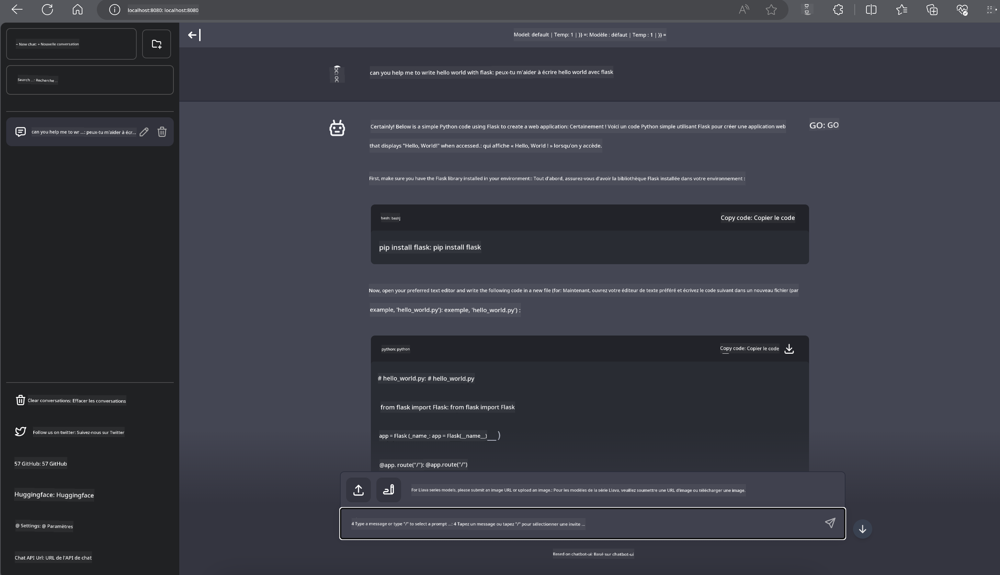

<!--
CO_OP_TRANSLATOR_METADATA:
{
  "original_hash": "be4101a30d98e95a71d42c276e8bcd37",
  "translation_date": "2025-05-07T14:27:51+00:00",
  "source_file": "md/01.Introduction/03/Jetson_Inference.md",
  "language_code": "fr"
}
-->
# **Inférence Phi-3 sur Nvidia Jetson**

Nvidia Jetson est une série de cartes informatiques embarquées de Nvidia. Les modèles Jetson TK1, TX1 et TX2 intègrent tous un processeur Tegra (ou SoC) de Nvidia avec une unité centrale de traitement (CPU) basée sur l’architecture ARM. Jetson est un système à faible consommation d’énergie conçu pour accélérer les applications d’apprentissage automatique. Nvidia Jetson est utilisé par des développeurs professionnels pour créer des produits d’IA innovants dans tous les secteurs, ainsi que par des étudiants et passionnés pour un apprentissage pratique de l’IA et la réalisation de projets impressionnants. SLM est déployé sur des dispositifs en périphérie comme Jetson, ce qui permet une meilleure mise en œuvre des scénarios industriels d’applications d’IA générative.

## Déploiement sur NVIDIA Jetson :
Les développeurs travaillant sur la robotique autonome et les dispositifs embarqués peuvent tirer parti de Phi-3 Mini. Sa taille relativement compacte en fait une solution idéale pour un déploiement en périphérie. Les paramètres ont été soigneusement ajustés pendant l’entraînement, garantissant une grande précision des réponses.

### Optimisation TensorRT-LLM :
La bibliothèque [TensorRT-LLM de NVIDIA](https://github.com/NVIDIA/TensorRT-LLM?WT.mc_id=aiml-138114-kinfeylo) optimise l’inférence des grands modèles de langage. Elle prend en charge la longue fenêtre contextuelle de Phi-3 Mini, améliorant à la fois le débit et la latence. Les optimisations incluent des techniques comme LongRoPE, FP8 et le batching en vol.

### Disponibilité et déploiement :
Les développeurs peuvent explorer Phi-3 Mini avec une fenêtre contextuelle de 128K sur [NVIDIA AI](https://www.nvidia.com/en-us/ai-data-science/generative-ai/). Il est distribué sous forme de NVIDIA NIM, un microservice avec une API standard pouvant être déployé partout. De plus, les [implémentations TensorRT-LLM sur GitHub](https://github.com/NVIDIA/TensorRT-LLM) sont disponibles.

## **1. Préparation**

a. Jetson Orin NX / Jetson NX

b. JetPack 5.1.2+

c. Cuda 11.8

d. Python 3.8+

## **2. Exécution de Phi-3 sur Jetson**

Nous pouvons choisir [Ollama](https://ollama.com) ou [LlamaEdge](https://llamaedge.com)

Si vous souhaitez utiliser gguf à la fois dans le cloud et sur des dispositifs en périphérie, LlamaEdge peut être vu comme WasmEdge (WasmEdge est un runtime WebAssembly léger, performant et évolutif, adapté aux applications cloud natives, edge et décentralisées. Il supporte les applications serverless, fonctions embarquées, microservices, contrats intelligents et dispositifs IoT). Vous pouvez déployer le modèle quantifié gguf sur des dispositifs en périphérie et dans le cloud via LlamaEdge.


Voici les étapes d’utilisation

1. Installer et télécharger les bibliothèques et fichiers associés

```bash

curl -sSf https://raw.githubusercontent.com/WasmEdge/WasmEdge/master/utils/install.sh | bash -s -- --plugin wasi_nn-ggml

curl -LO https://github.com/LlamaEdge/LlamaEdge/releases/latest/download/llama-api-server.wasm

curl -LO https://github.com/LlamaEdge/chatbot-ui/releases/latest/download/chatbot-ui.tar.gz

tar xzf chatbot-ui.tar.gz

```

**Note** : llama-api-server.wasm et chatbot-ui doivent se trouver dans le même répertoire

2. Exécuter les scripts dans le terminal

```bash

wasmedge --dir .:. --nn-preload default:GGML:AUTO:{Your gguf path} llama-api-server.wasm -p phi-3-chat

```

Voici le résultat de l’exécution



***Exemple de code*** [Exemple de Notebook Phi-3 mini WASM](https://github.com/Azure-Samples/Phi-3MiniSamples/tree/main/wasm)

En résumé, Phi-3 Mini représente un bond en avant dans la modélisation du langage, combinant efficacité, prise en compte du contexte et savoir-faire d’optimisation de NVIDIA. Que vous développiez des robots ou des applications en périphérie, Phi-3 Mini est un outil puissant à connaître.

**Avertissement** :  
Ce document a été traduit à l’aide du service de traduction automatique [Co-op Translator](https://github.com/Azure/co-op-translator). Bien que nous nous efforçons d’assurer l’exactitude, veuillez noter que les traductions automatiques peuvent contenir des erreurs ou des inexactitudes. Le document original dans sa langue d’origine doit être considéré comme la source faisant foi. Pour des informations critiques, une traduction professionnelle réalisée par un humain est recommandée. Nous déclinons toute responsabilité en cas de malentendus ou de mauvaises interprétations résultant de l’utilisation de cette traduction.