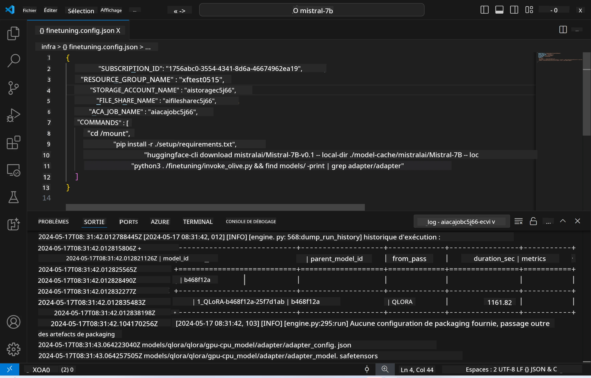
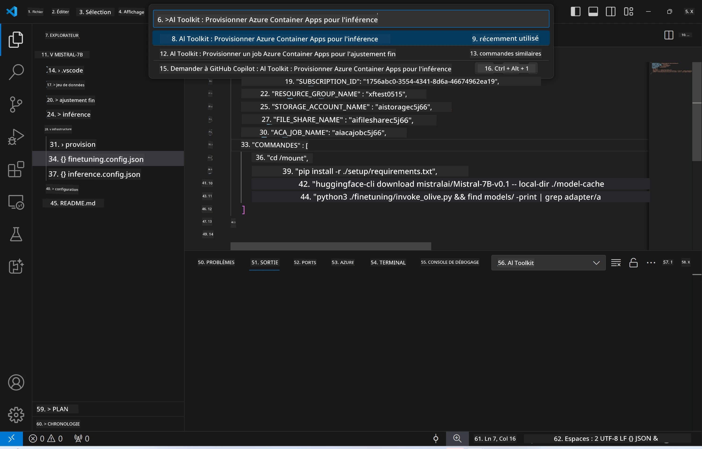
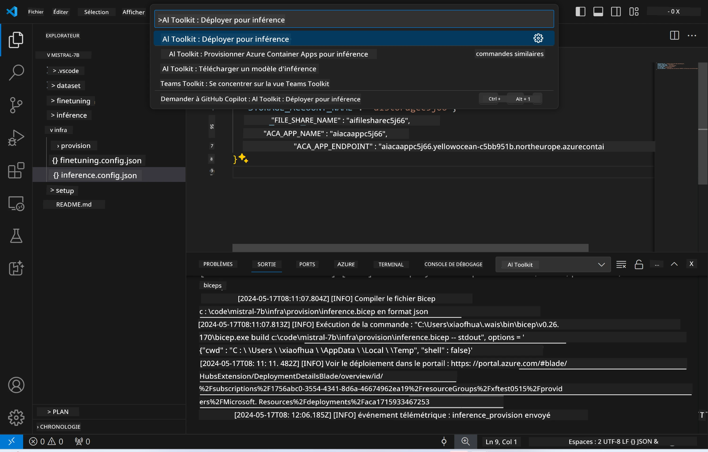

<!--
CO_OP_TRANSLATOR_METADATA:
{
  "original_hash": "a54cd3d65b6963e4e8ce21e143c3ab04",
  "translation_date": "2025-07-16T21:14:23+00:00",
  "source_file": "md/01.Introduction/03/Remote_Interence.md",
  "language_code": "fr"
}
-->
# Inférence à distance avec le modèle affiné

Après que les adaptateurs ont été entraînés dans l’environnement distant, utilisez une simple application Gradio pour interagir avec le modèle.



### Provisionner les ressources Azure  
Vous devez configurer les ressources Azure pour l’inférence à distance en exécutant la commande `AI Toolkit: Provision Azure Container Apps for inference` depuis la palette de commandes. Lors de cette configuration, il vous sera demandé de sélectionner votre abonnement Azure et votre groupe de ressources.  

   
Par défaut, l’abonnement et le groupe de ressources pour l’inférence doivent correspondre à ceux utilisés pour l’affinage. L’inférence utilisera le même environnement Azure Container App et accédera au modèle ainsi qu’à l’adaptateur de modèle stockés dans Azure Files, qui ont été générés lors de l’étape d’affinage.

## Utilisation de AI Toolkit

### Déploiement pour l’inférence  
Si vous souhaitez modifier le code d’inférence ou recharger le modèle d’inférence, exécutez la commande `AI Toolkit: Deploy for inference`. Cela synchronisera votre code le plus récent avec ACA et redémarrera la réplique.



Une fois le déploiement terminé avec succès, le modèle est prêt à être évalué via ce point de terminaison.

### Accès à l’API d’inférence

Vous pouvez accéder à l’API d’inférence en cliquant sur le bouton "*Go to Inference Endpoint*" affiché dans la notification VSCode. Sinon, le point de terminaison de l’API web se trouve sous `ACA_APP_ENDPOINT` dans `./infra/inference.config.json` ainsi que dans le panneau de sortie.


> **Note :** Le point de terminaison d’inférence peut nécessiter quelques minutes avant d’être pleinement opérationnel.

## Composants d’inférence inclus dans le modèle

| Dossier | Contenu |
| ------ |--------- |
| `infra` | Contient toutes les configurations nécessaires pour les opérations à distance. |
| `infra/provision/inference.parameters.json` | Contient les paramètres pour les templates bicep, utilisés pour provisionner les ressources Azure pour l’inférence. |
| `infra/provision/inference.bicep` | Contient les templates pour provisionner les ressources Azure pour l’inférence. |
| `infra/inference.config.json` | Fichier de configuration, généré par la commande `AI Toolkit: Provision Azure Container Apps for inference`. Il sert d’entrée pour d’autres commandes à distance. |

### Utilisation de AI Toolkit pour configurer le provisionnement des ressources Azure  
Configurez le [AI Toolkit](https://marketplace.visualstudio.com/items?itemName=ms-windows-ai-studio.windows-ai-studio)

Exécutez la commande `Provision Azure Container Apps for inference`.

Vous pouvez trouver les paramètres de configuration dans le fichier `./infra/provision/inference.parameters.json`. Voici les détails :  
| Paramètre | Description |
| --------- |------------ |
| `defaultCommands` | Commandes pour lancer une API web. |
| `maximumInstanceCount` | Définit la capacité maximale d’instances GPU. |
| `location` | Emplacement où les ressources Azure sont provisionnées. La valeur par défaut correspond à celle du groupe de ressources choisi. |
| `storageAccountName`, `fileShareName`, `acaEnvironmentName`, `acaEnvironmentStorageName`, `acaAppName`, `acaLogAnalyticsName` | Ces paramètres servent à nommer les ressources Azure à provisionner. Par défaut, ils correspondent aux noms des ressources utilisées pour l’affinage. Vous pouvez saisir un nouveau nom de ressource non utilisé pour créer vos propres ressources personnalisées, ou indiquer le nom d’une ressource Azure existante si vous préférez l’utiliser. Pour plus de détails, consultez la section [Utilisation des ressources Azure existantes](../../../../../md/01.Introduction/03). |

### Utilisation des ressources Azure existantes

Par défaut, le provisionnement pour l’inférence utilise le même environnement Azure Container App, compte de stockage, partage de fichiers Azure et Azure Log Analytics que ceux utilisés pour l’affinage. Une Azure Container App distincte est créée uniquement pour l’API d’inférence.

Si vous avez personnalisé les ressources Azure lors de l’étape d’affinage ou souhaitez utiliser vos propres ressources Azure existantes pour l’inférence, spécifiez leurs noms dans le fichier `./infra/inference.parameters.json`. Ensuite, exécutez la commande `AI Toolkit: Provision Azure Container Apps for inference` depuis la palette de commandes. Cela mettra à jour les ressources spécifiées et créera celles qui manquent.

Par exemple, si vous disposez déjà d’un environnement Azure container, votre fichier `./infra/finetuning.parameters.json` devrait ressembler à ceci :

```json
{
    "$schema": "https://schema.management.azure.com/schemas/2019-04-01/deploymentParameters.json#",
    "contentVersion": "1.0.0.0",
    "parameters": {
      ...
      "acaEnvironmentName": {
        "value": "<your-aca-env-name>"
      },
      "acaEnvironmentStorageName": {
        "value": null
      },
      ...
    }
  }
```

### Provisionnement manuel  
Si vous préférez configurer manuellement les ressources Azure, vous pouvez utiliser les fichiers bicep fournis dans les dossiers `./infra/provision`. Si vous avez déjà configuré toutes les ressources Azure sans utiliser la palette de commandes AI Toolkit, vous pouvez simplement saisir les noms des ressources dans le fichier `inference.config.json`.

Par exemple :

```json
{
  "SUBSCRIPTION_ID": "<your-subscription-id>",
  "RESOURCE_GROUP_NAME": "<your-resource-group-name>",
  "STORAGE_ACCOUNT_NAME": "<your-storage-account-name>",
  "FILE_SHARE_NAME": "<your-file-share-name>",
  "ACA_APP_NAME": "<your-aca-name>",
  "ACA_APP_ENDPOINT": "<your-aca-endpoint>"
}
```

**Avertissement** :  
Ce document a été traduit à l’aide du service de traduction automatique [Co-op Translator](https://github.com/Azure/co-op-translator). Bien que nous nous efforcions d’assurer l’exactitude, veuillez noter que les traductions automatiques peuvent contenir des erreurs ou des inexactitudes. Le document original dans sa langue d’origine doit être considéré comme la source faisant foi. Pour les informations critiques, une traduction professionnelle réalisée par un humain est recommandée. Nous déclinons toute responsabilité en cas de malentendus ou de mauvaises interprétations résultant de l’utilisation de cette traduction.