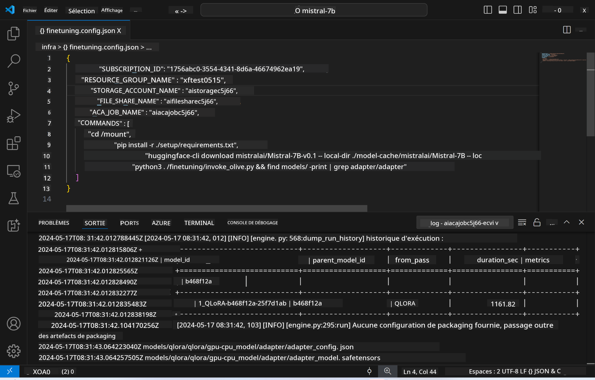
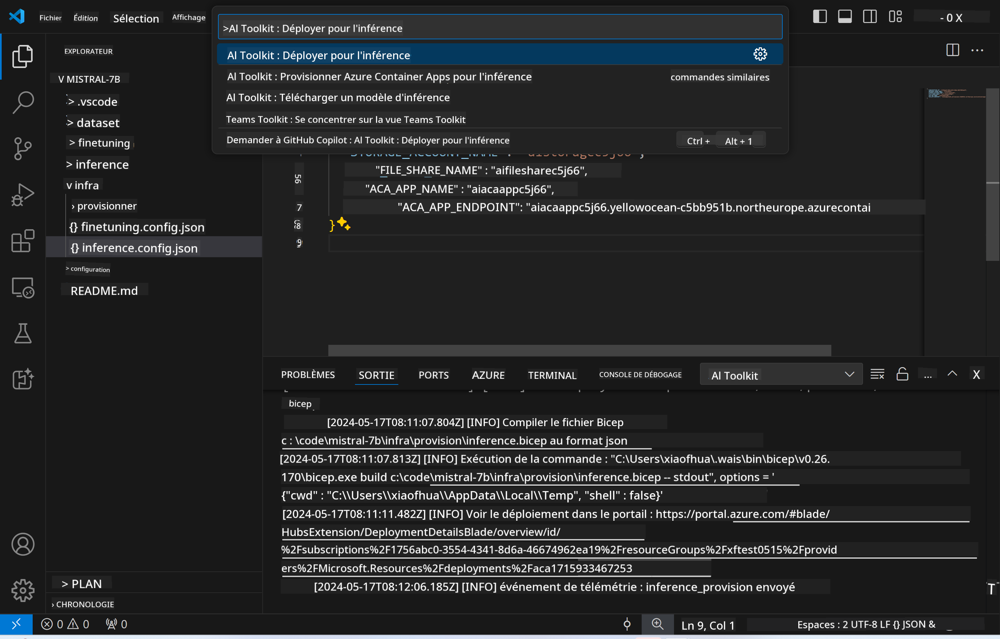

<!--
CO_OP_TRANSLATOR_METADATA:
{
  "original_hash": "a54cd3d65b6963e4e8ce21e143c3ab04",
  "translation_date": "2025-05-07T14:32:14+00:00",
  "source_file": "md/01.Introduction/03/Remote_Interence.md",
  "language_code": "fr"
}
-->
# Inférence à distance avec le modèle affiné

Après avoir entraîné les adaptateurs dans l’environnement distant, utilisez une application Gradio simple pour interagir avec le modèle.



### Provisionner les ressources Azure  
Vous devez configurer les ressources Azure pour l’inférence à distance en exécutant la commande `AI Toolkit: Provision Azure Container Apps for inference` depuis la palette de commandes. Pendant cette configuration, il vous sera demandé de sélectionner votre abonnement Azure et votre groupe de ressources.  

   
Par défaut, l’abonnement et le groupe de ressources pour l’inférence doivent correspondre à ceux utilisés pour l’affinage. L’inférence utilisera le même environnement Azure Container App et accédera au modèle ainsi qu’à l’adaptateur de modèle stockés dans Azure Files, générés lors de l’étape d’affinage.

## Utilisation de AI Toolkit

### Déploiement pour l’inférence  
Si vous souhaitez modifier le code d’inférence ou recharger le modèle d’inférence, exécutez la commande `AI Toolkit: Deploy for inference`. Cela synchronisera votre code le plus récent avec ACA et redémarrera la réplique.



Après le déploiement réussi, le modèle est prêt à être évalué via ce point de terminaison.

### Accéder à l’API d’inférence

Vous pouvez accéder à l’API d’inférence en cliquant sur le bouton "*Go to Inference Endpoint*" affiché dans la notification VSCode. Sinon, le point de terminaison web API se trouve sous `ACA_APP_ENDPOINT` dans `./infra/inference.config.json` ainsi que dans le panneau de sortie.


> **Note :** Le point de terminaison d’inférence peut nécessiter quelques minutes avant d’être pleinement opérationnel.

## Composants d’inférence inclus dans le modèle

| Dossier | Contenu |
| ------ |--------- |
| `infra` | Contient toutes les configurations nécessaires pour les opérations à distance. |
| `infra/provision/inference.parameters.json` | Contient les paramètres pour les templates bicep, utilisés pour provisionner les ressources Azure pour l’inférence. |
| `infra/provision/inference.bicep` | Contient les templates pour provisionner les ressources Azure pour l’inférence. |
| `infra/inference.config.json` | Le fichier de configuration, généré par la commande `AI Toolkit: Provision Azure Container Apps for inference`. Il sert d’entrée pour d’autres palettes de commandes à distance. |

### Utilisation de AI Toolkit pour configurer le provisionnement des ressources Azure  
Configurez le [AI Toolkit](https://marketplace.visualstudio.com/items?itemName=ms-windows-ai-studio.windows-ai-studio)

Provisionnez les Azure Container Apps pour l’inférence` command.

You can find configuration parameters in `./infra/provision/inference.parameters.json` file. Here are the details:
| Parameter | Description |
| --------- |------------ |
| `defaultCommands` | This is the commands to initiate a web API. |
| `maximumInstanceCount` | This parameter sets the maximum capacity of GPU instances. |
| `location` | This is the location where Azure resources are provisioned. The default value is the same as the chosen resource group's location. |
| `storageAccountName`, `fileShareName` `acaEnvironmentName`, `acaEnvironmentStorageName`, `acaAppName`,  `acaLogAnalyticsName` | These parameters are used to name the Azure resources for provision. By default, they will be same to the fine-tuning resource name. You can input a new, unused resource name to create your own custom-named resources, or you can input the name of an already existing Azure resource if you'd prefer to use that. For details, refer to the section [Using existing Azure Resources](../../../../../md/01.Introduction/03). |

### Using Existing Azure Resources

By default, the inference provision use the same Azure Container App Environment, Storage Account, Azure File Share, and Azure Log Analytics that were used for fine-tuning. A separate Azure Container App is created solely for the inference API. 

If you have customized the Azure resources during the fine-tuning step or want to use your own existing Azure resources for inference, specify their names in the `./infra/inference.parameters.json`. Ensuite, lancez la commande `AI Toolkit: Provision Azure Container Apps for inference` depuis la palette de commandes. Cela met à jour les ressources spécifiées et crée celles qui manquent.

Par exemple, si vous disposez déjà d’un environnement Azure container, votre fichier `./infra/finetuning.parameters.json` devrait ressembler à ceci :

```json
{
    "$schema": "https://schema.management.azure.com/schemas/2019-04-01/deploymentParameters.json#",
    "contentVersion": "1.0.0.0",
    "parameters": {
      ...
      "acaEnvironmentName": {
        "value": "<your-aca-env-name>"
      },
      "acaEnvironmentStorageName": {
        "value": null
      },
      ...
    }
  }
```

### Provisionnement manuel  
Si vous préférez configurer manuellement les ressources Azure, vous pouvez utiliser les fichiers bicep fournis dans le dossier `./infra/provision` folders. If you have already set up and configured all the Azure resources without using the AI Toolkit command palette, you can simply enter the resource names in the `inference.config.json`.

Par exemple :

```json
{
  "SUBSCRIPTION_ID": "<your-subscription-id>",
  "RESOURCE_GROUP_NAME": "<your-resource-group-name>",
  "STORAGE_ACCOUNT_NAME": "<your-storage-account-name>",
  "FILE_SHARE_NAME": "<your-file-share-name>",
  "ACA_APP_NAME": "<your-aca-name>",
  "ACA_APP_ENDPOINT": "<your-aca-endpoint>"
}
```

**Avertissement** :  
Ce document a été traduit à l’aide du service de traduction automatique [Co-op Translator](https://github.com/Azure/co-op-translator). Bien que nous nous efforcions d’assurer l’exactitude, veuillez noter que les traductions automatiques peuvent contenir des erreurs ou des inexactitudes. Le document original dans sa langue d’origine doit être considéré comme la source faisant foi. Pour des informations critiques, une traduction professionnelle humaine est recommandée. Nous ne sommes pas responsables des malentendus ou des interprétations erronées résultant de l’utilisation de cette traduction.