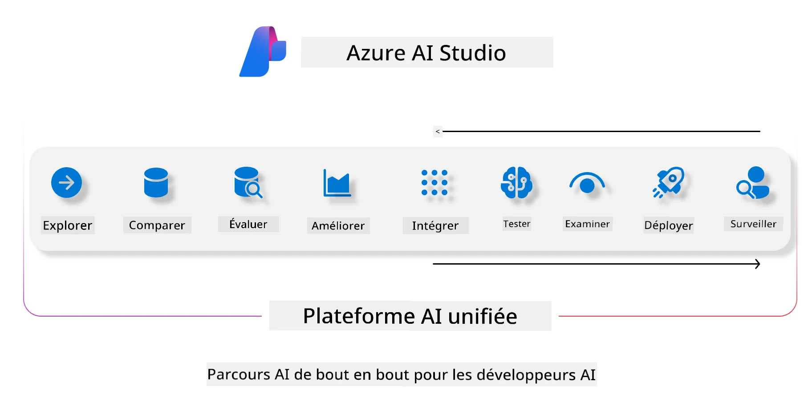
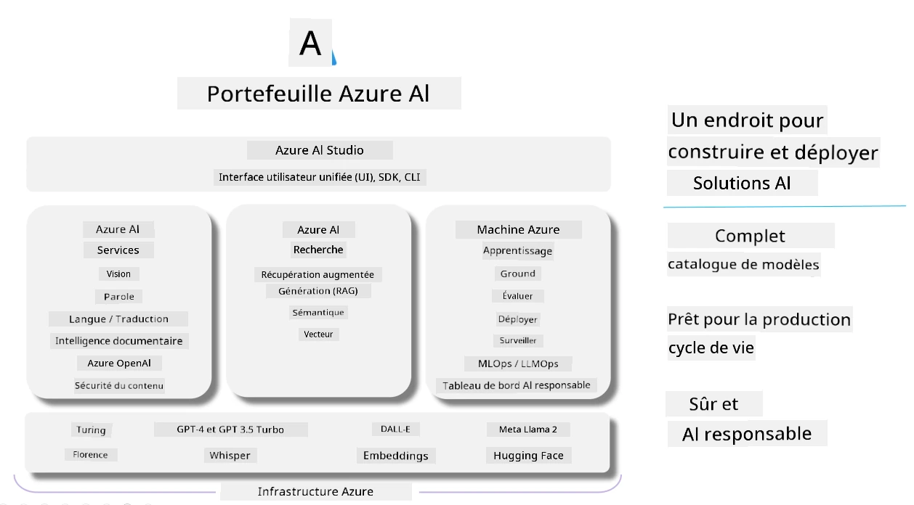

# **Utilisation de Microsoft Foundry pour l’évaluation**

Comment évaluer votre application d’IA générative en utilisant [Microsoft Foundry](https://ai.azure.com?WT.mc_id=aiml-138114-kinfeylo). Que vous évaluiez des conversations à un seul échange ou multi-échanges, Microsoft Foundry fournit des outils pour évaluer la performance et la sécurité du modèle.

## Comment évaluer des applications d’IA générative avec Microsoft Foundry
Pour des instructions détaillées, consultez la [documentation de Microsoft Foundry](https://learn.microsoft.com/azure/ai-studio/how-to/evaluate-generative-ai-app?WT.mc_id=aiml-138114-kinfeylo)

Voici les étapes pour commencer :

## Évaluer les modèles d’IA générative dans Microsoft Foundry

**Prérequis**

- Un jeu de données de test au format CSV ou JSON.
- Un modèle d’IA générative déployé (tel que Phi-3, GPT 3.5, GPT 4, ou les modèles Davinci).
- Un runtime avec une instance de calcul pour exécuter l’évaluation.

## Métriques d’évaluation intégrées

Microsoft Foundry vous permet d’évaluer à la fois des conversations à un seul échange et des conversations complexes à multiples échanges.
Pour les scénarios de Retrieval Augmented Generation (RAG), où le modèle s’appuie sur des données spécifiques, vous pouvez évaluer la performance en utilisant des métriques d’évaluation intégrées.
De plus, vous pouvez évaluer des scénarios généraux de questions-réponses à un seul échange (non-RAG).

## Création d’une exécution d’évaluation

Depuis l’interface Microsoft Foundry, allez soit sur la page Évaluer, soit sur la page Prompt Flow.
Suivez l’assistant de création d’évaluation pour configurer une exécution d’évaluation. Fournissez un nom optionnel pour votre évaluation.
Sélectionnez le scénario qui correspond aux objectifs de votre application.
Choisissez une ou plusieurs métriques d’évaluation pour juger la sortie du modèle.

## Flux d’évaluation personnalisé (optionnel)

Pour plus de flexibilité, vous pouvez créer un flux d’évaluation personnalisé. Personnalisez le processus d’évaluation selon vos besoins spécifiques.

## Visualisation des résultats

Après avoir lancé l’évaluation, consignez, visualisez et analysez les métriques détaillées dans Microsoft Foundry. Obtenez des informations sur les capacités et les limites de votre application.

**Note** Microsoft Foundry est actuellement en aperçu public, utilisez-le donc pour des expérimentations et du développement. Pour des charges de travail en production, considérez d’autres options. Explorez la [documentation officielle d’AI Foundry](https://learn.microsoft.com/azure/ai-studio/?WT.mc_id=aiml-138114-kinfeylo) pour plus de détails et des instructions étape par étape.

---

<!-- CO-OP TRANSLATOR DISCLAIMER START -->
**Clause de non-responsabilité** :  
Ce document a été traduit à l’aide du service de traduction automatique [Co-op Translator](https://github.com/Azure/co-op-translator). Bien que nous nous efforcions d’assurer l’exactitude, veuillez noter que les traductions automatisées peuvent contenir des erreurs ou des inexactitudes. Le document original dans sa langue native doit être considéré comme la source faisant foi. Pour les informations critiques, il est recommandé de faire appel à une traduction professionnelle réalisée par un humain. Nous déclinons toute responsabilité en cas de malentendus ou d’interprétations erronées résultant de l’utilisation de cette traduction.
<!-- CO-OP TRANSLATOR DISCLAIMER END -->