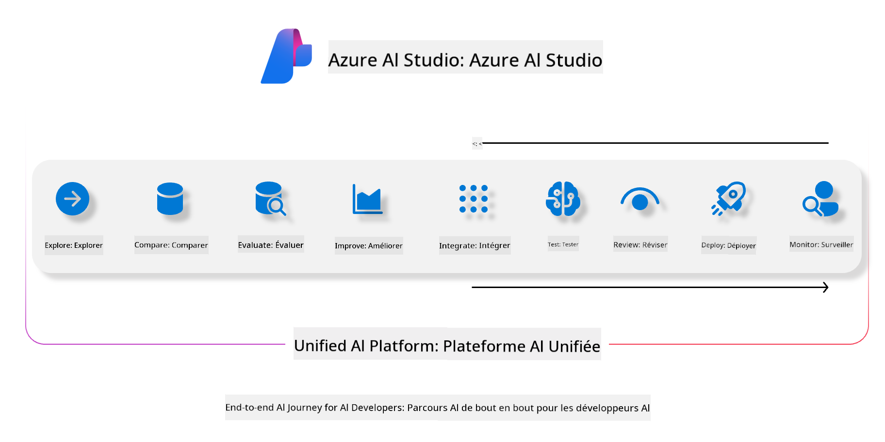
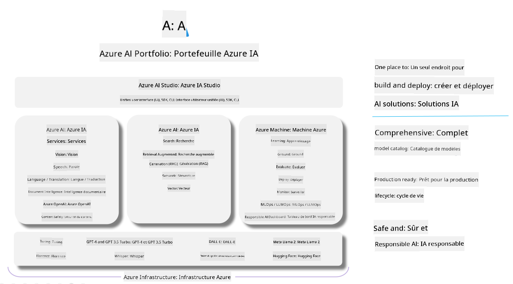

<!--
CO_OP_TRANSLATOR_METADATA:
{
  "original_hash": "7b4235159486df4000e16b7b46ddfec3",
  "translation_date": "2025-05-07T14:42:37+00:00",
  "source_file": "md/01.Introduction/05/AIFoundry.md",
  "language_code": "fr"
}
-->
# **Utiliser Azure AI Foundry pour l'évaluation**

Comment évaluer votre application d'IA générative avec [Azure AI Foundry](https://ai.azure.com?WT.mc_id=aiml-138114-kinfeylo). Que vous évaluiez des conversations à tour unique ou à tours multiples, Azure AI Foundry offre des outils pour mesurer la performance et la sécurité des modèles.

## Comment évaluer des applications d'IA générative avec Azure AI Foundry  
Pour des instructions plus détaillées, consultez la [documentation Azure AI Foundry](https://learn.microsoft.com/azure/ai-studio/how-to/evaluate-generative-ai-app?WT.mc_id=aiml-138114-kinfeylo)

Voici les étapes pour commencer :

## Évaluer des modèles d'IA générative dans Azure AI Foundry

**Prérequis**

- Un jeu de données de test au format CSV ou JSON.  
- Un modèle d'IA générative déployé (comme Phi-3, GPT 3.5, GPT 4 ou les modèles Davinci).  
- Un environnement d'exécution avec une instance de calcul pour lancer l’évaluation.

## Métriques d’évaluation intégrées

Azure AI Foundry vous permet d’évaluer aussi bien des conversations à tour unique que des échanges complexes à tours multiples.  
Pour les scénarios Retrieval Augmented Generation (RAG), où le modèle s’appuie sur des données spécifiques, vous pouvez mesurer la performance grâce aux métriques d’évaluation intégrées.  
Vous pouvez également évaluer des scénarios généraux de questions-réponses à tour unique (non-RAG).

## Créer une exécution d’évaluation

Depuis l’interface Azure AI Foundry, accédez à la page Evaluate ou à la page Prompt Flow.  
Suivez l’assistant de création d’évaluation pour configurer une exécution. Vous pouvez donner un nom optionnel à votre évaluation.  
Sélectionnez le scénario qui correspond aux objectifs de votre application.  
Choisissez une ou plusieurs métriques d’évaluation pour analyser les résultats du modèle.

## Flux d’évaluation personnalisé (optionnel)

Pour plus de flexibilité, vous pouvez créer un flux d’évaluation personnalisé. Adaptez le processus d’évaluation selon vos besoins spécifiques.

## Consultation des résultats

Après avoir lancé l’évaluation, consultez, visualisez et analysez les métriques détaillées dans Azure AI Foundry. Obtenez des informations précieuses sur les capacités et les limites de votre application.

**Note** Azure AI Foundry est actuellement en aperçu public, utilisez-le principalement pour l’expérimentation et le développement. Pour des charges de travail en production, envisagez d’autres solutions. Consultez la [documentation officielle AI Foundry](https://learn.microsoft.com/azure/ai-studio/?WT.mc_id=aiml-138114-kinfeylo) pour plus de détails et des instructions pas à pas.

**Avertissement** :  
Ce document a été traduit à l’aide du service de traduction automatique [Co-op Translator](https://github.com/Azure/co-op-translator). Bien que nous nous efforçons d’assurer l’exactitude, veuillez noter que les traductions automatiques peuvent contenir des erreurs ou des inexactitudes. Le document original dans sa langue d’origine doit être considéré comme la source faisant foi. Pour les informations critiques, une traduction professionnelle réalisée par un humain est recommandée. Nous ne sommes pas responsables des malentendus ou des mauvaises interprétations résultant de l’utilisation de cette traduction.